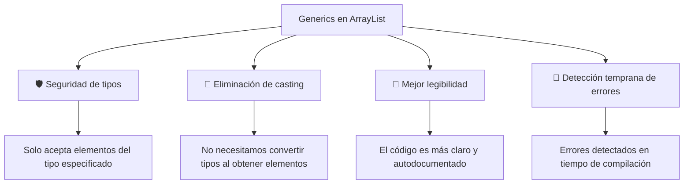
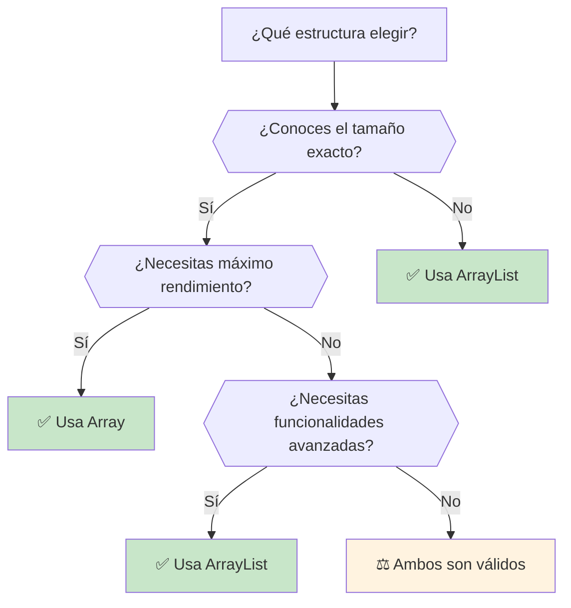

# UT8.1 ArrayList

## 📋 Índice de contenidos

1. [Introducción](#1-introducci%C3%B3n)
2. [La clase ArrayList](#2-la-clase-arraylist)
3. [Interfaz de ArrayList](#3-interfaz-de-arraylist)
4. [Clase genérica y constructores](#4-clase-gen%C3%A9rica-y-constructores)
5. [Ejemplos básicos con ArrayList](#5-ejemplos-b%C3%A1sicos-con-arraylist)
6. [Formas de crear ArrayList](#6-formas-de-crear-arraylist)
7. [Comparativa Array vs ArrayList](#7-comparativa-array-vs-arraylist)
8. [Trabajar con tipos de datos primitivos](#8-trabajar-con-tipos-de-datos-primitivos)
9. [Operaciones comunes con ArrayList](#9-operaciones-comunes-con-arraylist)
10. [Errores comunes y preguntas frecuentes](#10-errores-comunes-y-preguntas-frecuentes)
11. [Práctica 1: Números únicos](#11-pr%C3%A1ctica-1-n%C3%BAmeros-%C3%BAnicos)
12. [Métodos de utilidad](#12-m%C3%A9todos-de-utilidad)
13. [Clase Collections](#13-clase-collections)

## 1. Introducción

Hasta ahora, siempre que hemos querido almacenar una lista de datos u objetos del mismo tipo hemos utilizado **arrays**. Los arrays nos han permitido organizar y gestionar colecciones de elementos de manera estructurada:

```java
int[] numeros = new int[3];
Intervalo[] intervalos = new Intervalo[10];
```

Sin embargo, los arrays presentan una **limitación fundamental**: una vez creados, **su tamaño es fijo** y no puede modificarse durante la ejecución del programa.

> [!WARNING]
> **Problema principal de los arrays:** Una vez declarado el tamaño de un array, este no puede cambiar. Si necesitamos más espacio, debemos crear un nuevo array y copiar todos los elementos.

Esta limitación puede ser problemática cuando:

- **No conocemos de antemano** cuántos elementos necesitaremos almacenar
- **El número de elementos varía** durante la ejecución del programa
- **Necesitamos añadir o eliminar** elementos frecuentemente
- **Queremos utilizar funcionalidades avanzadas** como búsqueda, ordenación, etc.

## 2. La clase ArrayList

Para solucionar las limitaciones de los arrays, Java proporciona en su API la clase **ArrayList**, que forma parte del paquete `java.util`.

### 2.1 ¿Qué es ArrayList?

**ArrayList** es una **implementación de array redimensionable** que puede almacenar un número prácticamente ilimitado de objetos de la misma clase. A diferencia de los arrays tradicionales, ArrayList puede crecer y decrecer dinámicamente según nuestras necesidades.

### 2.2 Características principales

- **📈 Tamaño dinámico**: Se redimensiona automáticamente cuando es necesario
- **🎯 Tipo seguro**: Utiliza genéricos para garantizar que todos los elementos sean del mismo tipo
- **🛠️ Rica funcionalidad**: Proporciona muchos métodos útiles para manipular los elementos
- **🔍 Fácil de usar**: Interfaz intuitiva y bien documentada
- **⚡ Eficiente**: Optimizada para operaciones comunes como acceso por índice

### 2.3 Ventajas sobre arrays tradicionales

| Aspecto | Array tradicional | ArrayList |
| :-- | :-- | :-- |
| **Tamaño** | Fijo | Dinámico |
| **Funcionalidad** | Básica | Extensa |
| **Facilidad de uso** | Limitada | Alta |
| **Seguridad de tipos** | Limitada | Completa (con genéricos) |
| **Rendimiento** | Excelente | Muy bueno |

## 3. Interfaz de ArrayList

La clase ArrayList proporciona una amplia gama de métodos para manipular los elementos almacenados. A continuación, se presentan los principales constructores y métodos disponibles:

### 3.1 Constructores

| Constructor | Descripción |
| :-- | :-- |
| `ArrayList()` | Crea un ArrayList vacío con capacidad inicial predeterminada (10 elementos) |
| `ArrayList(int initialCapacity)` | Crea un ArrayList vacío con la capacidad inicial especificada |
| `ArrayList(Collection<? extends E> c)` | Crea un ArrayList con los elementos de la colección especificada |

> [!TIP]
>
> **Optimización de rendimiento:** Si conoces aproximadamente cuántos elementos vas a almacenar, es recomendable especificar la capacidad inicial para evitar redimensionamientos innecesarios. Aunque la capacidad inicial **no es un máximo** (el ArrayList se amplía dinámicamente si es necesario), establecerla correctamente evita el coste computacional de crear estructuras más grandes y volcar todos los elementos a la nueva estructura.

```java
// Capacidad por defecto (10)
ArrayList<String> lista1 = new ArrayList<>();

// Capacidad inicial específica para mejor rendimiento
ArrayList<String> lista2 = new ArrayList<>(1000); // Para 1000 elementos aprox.

// Crear a partir de otra colección
ArrayList<String> lista3 = new ArrayList<>(Arrays.asList("a", "b", "c"));
```

### 3.2 Métodos de manipulación de elementos

| Método | Descripción | Ejemplo de uso |
| :-- | :-- | :-- |
| `add(E elemento)` | Añade un elemento al final de la lista | `lista.add("Java")` |
| `add(int index, E elemento)` | Inserta un elemento en la posición especificada | `lista.add(0, "Primer elemento")` |
| `addAll(Collection<? extends E> c)` | Añade todos los elementos de la colección especificada | `lista.addAll(otraLista)` |
| `addAll(int index, Collection<? extends E> c)` | Inserta todos los elementos de la colección en la posición especificada | `lista.addAll(2, otraLista)` |
| `set(int index, E elemento)` | Reemplaza el elemento en la posición indicada | `lista.set(1, "Nuevo valor")` |
| `remove(Object objeto)` | Elimina la primera ocurrencia del objeto especificado | `lista.remove("Java")` |
| `remove(int index)` | Elimina el elemento en la posición indicada | `lista.remove(0)` |
| `removeAll(Collection<?> c)` | Elimina todos los elementos que están en la colección especificada | `lista.removeAll(elementosAEliminar)` |
| `retainAll(Collection<?> c)` | Conserva solo los elementos que están en la colección especificada | `lista.retainAll(elementosAConservar)` |
| `clear()` | Elimina todos los elementos de la lista | `lista.clear()` |

### 3.3 Métodos de consulta

| Método | Descripción | Ejemplo de uso |
| :-- | :-- | :-- |
| `get(int index)` | Obtiene el elemento en la posición especificada | `String elemento = lista.get(2)` |
| `size()` | Retorna el número de elementos en la lista | `int tamaño = lista.size()` |
| `isEmpty()` | Retorna `true` si la lista está vacía | `boolean vacia = lista.isEmpty()` |
| `contains(Object objeto)` | Retorna `true` si el objeto está en la lista | `boolean existe = lista.contains("Java")` |
| `containsAll(Collection<?> c)` | Retorna `true` si la lista contiene todos los elementos de la colección | `boolean contieneTodos = lista.containsAll(elementos)` |

### 3.4 Métodos de búsqueda

| Método | Descripción | Ejemplo de uso |
| :-- | :-- | :-- |
| `indexOf(Object objeto)` | Retorna el índice de la primera ocurrencia del objeto | `int posicion = lista.indexOf("Java")` |
| `lastIndexOf(Object objeto)` | Retorna el índice de la última ocurrencia del objeto | `int ultimaPosicion = lista.lastIndexOf("Java")` |

### 3.5 Métodos de conversión

| Método | Descripción | Ejemplo de uso |
| :-- | :-- | :-- |
| `toArray()` | Convierte la lista a un array de Object | `Object[] array = lista.toArray()` |
| `subList(int fromIndex, int toIndex)` | Retorna una vista de una porción de la lista | `List<String> sublista = lista.subList(1, 4)` |

### 3.6 Métodos de utilidad adicionales

| Método | Descripción | Ejemplo de uso |
| :-- | :-- | :-- |
| `clone()` | Crea una copia superficial de la lista | `ArrayList<String> copia = (ArrayList<String>) lista.clone()` |
| `ensureCapacity(int minCapacity)` | Asegura que la lista puede contener al menos el número especificado de elementos | `lista.ensureCapacity(100)` |
| `trimToSize()` | Ajusta la capacidad al tamaño actual de la lista | `lista.trimToSize()` |

> [!TIP]
> **Consejo importante:** Los métodos `indexOf()` y `lastIndexOf()` retornan `-1` si el elemento no se encuentra en la lista. Siempre verifica este valor antes de usar el índice retornado.

> [!NOTE]
> **Método `subList()`:** Retorna una vista de la lista original, no una copia independiente. Los cambios en la sublista se reflejan en la lista original y viceversa.

## 4. Clase genérica y constructores

### 4.1 ¿Qué significa que ArrayList sea una clase genérica?

ArrayList es conocida como una **clase genérica** porque utiliza **parámetros de tipo genérico** (representados con `<E>`). El tipo genérico `E` será reemplazado por un tipo concreto cuando creemos una instancia de ArrayList. Todos estos conceptos los veremos más en detalle en el próximo apartado del tema.

```java
// E se reemplaza por String
ArrayList<String> ciudades = new ArrayList<String>();

// E se reemplaza por Integer  
ArrayList<Integer> numeros = new ArrayList<Integer>();

// E se reemplaza por una clase personalizada
ArrayList<Estudiante> estudiantes = new ArrayList<Estudiante>();
```

### 4.2 Sintaxis de declaración

**Sintaxis completa (antes de Java 7):**

```java
ArrayList<String> lista = new ArrayList<String>();
```

**Sintaxis simplificada (Java 7 y posteriores):**

```java
ArrayList<String> lista = new ArrayList<>();
```

> [!NOTE]
> **Diamond operator (`<>`):** A partir de JDK 7, podemos omitir el tipo genérico en el constructor utilizando el operador diamante `<>`. El compilador inferirá automáticamente el tipo correcto.

### 4.3 Ventajas de los genéricos



**Ejemplo comparativo:**

```java
// Sin genéricos (desaconsejado)
ArrayList lista = new ArrayList();
lista.add("Texto");
lista.add(123); // ¡Problema! Mezcla tipos diferentes
String texto = (String) lista.get(0); // Casting necesario

// Con genéricos (recomendado)
ArrayList<String> lista = new ArrayList<>();
lista.add("Texto");
// lista.add(123); // Error de compilación - ¡Detectado temprano!
String texto = lista.get(0); // Sin casting necesario
```

## 5. Ejemplos básicos con ArrayList

### 5.1 Ejemplo completo: Gestión de ciudades

Veamos un ejemplo práctico que demuestra las operaciones básicas con ArrayList:

```java
import java.util.ArrayList;

public class EjemploArrayList {
    public static void main(String[] args) {
        // Crear un ArrayList para almacenar ciudades
        ArrayList<String> ciudades = new ArrayList<>();
        
        // Añadir elementos
        ciudades.add("Madrid");
        ciudades.add("Barcelona");
        ciudades.add("Valencia");
        ciudades.add("Sevilla");
        
        // Mostrar información básica
        System.out.println("Número de ciudades: " + ciudades.size());
        System.out.println("¿Está Madrid en la lista? " + ciudades.contains("Madrid"));
        System.out.println("¿La lista está vacía? " + ciudades.isEmpty());
        
        // Mostrar todas las ciudades
        System.out.println("\nLista de ciudades:");
        for (int i = 0; i < ciudades.size(); i++) {
            System.out.println((i + 1) + ". " + ciudades.get(i));
        }
        
        // Insertar una ciudad en una posición específica
        ciudades.add(2, "Bilbao");
        System.out.println("\nDespués de insertar Bilbao en posición 2:");
        System.out.println(ciudades);
        
        // Buscar la posición de una ciudad
        int posicionValencia = ciudades.indexOf("Valencia");
        System.out.println("Valencia está en la posición: " + posicionValencia);
        
        // Reemplazar una ciudad
        ciudades.set(0, "Granada");
        System.out.println("\nDespués de reemplazar Madrid por Granada:");
        System.out.println(ciudades);
        
        // EJEMPLO 1: Aprovechar el boolean de remove(Object o)
        System.out.println("\n=== EJEMPLO 1: Valor de retorno boolean ===");
        boolean eliminadoBarcelona = ciudades.remove("Barcelona");
        if (eliminadoBarcelona) {
            System.out.println("✅ Barcelona se eliminó correctamente");
            System.out.println("Lista actualizada: " + ciudades);
        } else {
            System.out.println("❌ Barcelona no se encontró en la lista");
        }
        
        // Intentar eliminar una ciudad que no existe
        boolean eliminadoToledo = ciudades.remove("Toledo");
        if (eliminadoToledo) {
            System.out.println("✅ Toledo se eliminó correctamente");
        } else {
            System.out.println("❌ Toledo no se encontró en la lista (como era esperado)");
        }
        
        // EJEMPLO 2: Aprovechar el objeto devuelto por remove(int index)
        System.out.println("\n=== EJEMPLO 2: Objeto eliminado por índice ===");
        System.out.println("Lista antes de eliminar: " + ciudades);
        
        String ciudadEliminada = ciudades.remove(1);
        System.out.println("🗑️ Ciudad eliminada de la posición 1: " + ciudadEliminada);
        System.out.println("📋 Registro de eliminación: Se ha quitado '" + ciudadEliminada + "' de la lista");
        System.out.println("Lista después de eliminar: " + ciudades);
        
        // Usar la ciudad eliminada para algún procesamiento adicional
        if (ciudadEliminada.length() > 6) {
            System.out.println("📊 La ciudad eliminada '" + ciudadEliminada + "' tenía un nombre largo (" 
                             + ciudadEliminada.length() + " caracteres)");
        }
        
        // Mostrar tamaño final
        System.out.println("\nNúmero final de ciudades: " + ciudades.size());
    }
}
```

**Salida esperada:**

```text
Número de ciudades: 4
¿Está Madrid en la lista? true
¿La lista está vacía? false

Lista de ciudades:
1. Madrid
2. Barcelona
3. Valencia
4. Sevilla

Después de insertar Bilbao en posición 2:
[Madrid, Barcelona, Bilbao, Valencia, Sevilla]

Valencia está en la posición: 3

Después de reemplazar Madrid por Granada:
[Granada, Barcelona, Bilbao, Valencia, Sevilla]

=== EJEMPLO 1: Valor de retorno boolean ===
✅ Barcelona se eliminó correctamente
Lista actualizada: [Granada, Bilbao, Valencia, Sevilla]
❌ Toledo no se encontró en la lista (como era esperado)

=== EJEMPLO 2: Objeto eliminado por índice ===
Lista antes de eliminar: [Granada, Bilbao, Valencia, Sevilla]
🗑️ Ciudad eliminada de la posición 1: Bilbao
📋 Registro de eliminación: Se ha quitado 'Bilbao' de la lista
Lista después de eliminar: [Granada, Valencia, Sevilla]
📊 La ciudad eliminada 'Bilbao' tenía un nombre largo (6 caracteres)

Número final de ciudades: 3
```

### 5.2 Recorrido de ArrayList

Existen varias formas de recorrer un ArrayList:

**1. Bucle for tradicional:**

```java
for (int i = 0; i < ciudades.size(); i++) {
    String ciudad = ciudades.get(i);
    System.out.println("Posición " + i + ": " + ciudad);
}
```

**2. Bucle for-each (recomendado para solo lectura):**

```java
for (String ciudad : ciudades) {
    System.out.println("Ciudad: " + ciudad);
}
```

**3. Usando índices con while:**

```java
int i = 0;
while (i < ciudades.size()) {
    System.out.println(ciudades.get(i));
    i++;
}
```

*Otras formas que veremos más adelante:*

**4. Usando un iterador (Iterator).**

**5. Mediante el método `foreach()`.**

## 6. Formas de crear ArrayList

Existen múltiples maneras de crear e inicializar un ArrayList. Cada método tiene sus ventajas y desventajas que es importante conocer:

### 6.1 Ejemplo completo de creación de ArrayList

```java
import java.util.ArrayList;
import java.util.Arrays;
import java.util.Collections;
import java.util.List;

public class CreacionesArrayList {
    
    public static void main(String[] args) {
        CreacionesArrayList programa = new CreacionesArrayList();
        programa.demostrarFormasCreacion();
    }
    
    public void demostrarFormasCreacion() {
        System.out.println("=== FORMAS DE CREAR ARRAYLIST ===\n");
        
        // 1. CREACIÓN ESTÁNDAR - Añadiendo elementos uno a uno
        List<String> lista1 = new ArrayList<>();
        lista1.add("primer");
        lista1.add("segundo");
        lista1.add("tercer");
        System.out.println("Lista1 (creación estándar): " + lista1);
        
        // 2. USANDO Arrays.asList() - ¡PELIGRO!
        System.out.println("\n--- Arrays.asList() - Vista vinculada al array ---");
        String[] arrayStrings = {"primer", "segundo", "tercer"};
        List<String> lista2 = Arrays.asList(arrayStrings); // ¡PELIGRO!
        System.out.println("Lista2 antes del cambio: " + lista2);
        
        // Modificamos el array original
        arrayStrings[1] = "quinto";
        System.out.println("Lista2 después del cambio en array: " + lista2);
        // ¡La lista se modifica porque está vinculada al array!
        
        // 3. USANDO Arrays.asList() CORRECTAMENTE - Copia independiente
        System.out.println("\n--- Arrays.asList() con copia independiente ---");
        String[] arrayStrings2 = {"primer", "segundo", "tercer"};
        List<String> lista3 = new ArrayList<>(Arrays.asList(arrayStrings2)); // ¡OK!
        System.out.println("Lista3 antes del cambio: " + lista3);
        
        // Modificamos el array original
        arrayStrings2[1] = "quinto";
        System.out.println("Lista3 después del cambio en array: " + lista3);
        // La lista NO se modifica porque es una copia independiente
        
        // 4. USANDO List.of() - Lista inmutable
        System.out.println("\n--- List.of() - Lista inmutable ---");
        List<String> lista4 = List.of("primer", "segundo", "tercer");
        System.out.println("Lista4: " + lista4);
        try {
            // lista4.remove("segundo");  // ¡Error! UnsupportedOperationException
            // lista4.add("cuarto");      // ¡Error! UnsupportedOperationException
            System.out.println("List.of() crea una lista INMUTABLE");
        } catch (UnsupportedOperationException e) {
            System.out.println("Error: " + e.getMessage());
        }
        
        // 5. USANDO List.of() CON COPIA MUTABLE
        System.out.println("\n--- List.of() con copia mutable ---");
        List<String> lista5 = new ArrayList<>(List.of("primer", "segundo", "tercer"));
        lista5.remove("segundo");
        lista5.add("cuarto"); // Como es una copia, es mutable
        System.out.println("Lista5 (copia mutable): " + lista5);
        
        // 6. USANDO Collections.unmodifiableList() - Vista inmutable
        System.out.println("\n--- Collections.unmodifiableList() - Vista inmutable ---");
        List<String> lista6 = Collections.unmodifiableList(lista1);
        System.out.println("Lista6 inicial: " + lista6);
        
        try {
            // lista6.add("quinto");    // ¡Error! UnsupportedOperationException
            // lista6.remove("segundo"); // ¡Error! UnsupportedOperationException
            System.out.println("Collections.unmodifiableList() crea una VISTA inmutable");
        } catch (UnsupportedOperationException e) {
            System.out.println("Error: " + e.getMessage());
        }
        
        // ¡PERO! Si modificamos la lista original, la vista también cambia
        lista1.set(0, "sexto");
        System.out.println("Lista6 después de modificar lista1: " + lista6);
        // ¡La vista refleja los cambios de la lista original!
        
        // 7. RESUMEN COMPARATIVO
        mostrarResumenComparativo();
    }
    
    public void mostrarResumenComparativo() {
        System.out.println("\n=== RESUMEN COMPARATIVO ===");
        
        System.out.println("┌─────────────────────────────────┬─────────────┬──────────────┬─────────────┐");
        System.out.println("│ Método                          │ Mutable     │ Independiente│ Rendimiento │");
        System.out.println("├─────────────────────────────────┼─────────────┼──────────────┼─────────────┤");
        System.out.println("│ new ArrayList<>()               │ ✅ Sí       │ ✅ Sí        │ ⭐⭐⭐      │");
        System.out.println("│ Arrays.asList()                 │ ⚠️ Limitada  │ ❌ No        │ ⭐⭐⭐⭐    │");
        System.out.println("│ new ArrayList<>(Arrays.asList())│ ✅ Sí       │ ✅ Sí        │ ⭐⭐⭐      │");
        System.out.println("│ List.of()                       │ ❌ No       │ ✅ Sí        │ ⭐⭐⭐⭐⭐  │");
        System.out.println("│ new ArrayList<>(List.of())      │ ✅ Sí       │ ✅ Sí        │ ⭐⭐⭐      │");
        System.out.println("│ Collections.unmodifiableList()  │ ❌ No       │ ❌ No        │ ⭐⭐⭐⭐    │");
        System.out.println("└─────────────────────────────────┴─────────────┴──────────────┴─────────────┘");
        
        System.out.println("\n🔥 RECOMENDACIONES:");
        System.out.println("• Para listas que cambiarán: new ArrayList<>()");
        System.out.println("• Para listas inicializadas que cambiarán: new ArrayList<>(Arrays.asList(...))");
        System.out.println("• Para listas constantes: List.of(...)");
        System.out.println("• Para proteger listas existentes: Collections.unmodifiableList(...)");
    }
}
```

### 6.2 Análisis detallado de cada método

#### 🟢 `new ArrayList<>()` - Método estándar

- **✅ Ventajas**: Totalmente mutable, independiente, control completo
- **⚠️ Desventajas**: Requiere añadir elementos uno a uno
- **Uso recomendado**: Cuando construyes la lista dinámicamente

#### 🔴 `Arrays.asList()` - Vista vinculada al array original

- **✅ Ventajas**: Rápido, sintaxis concisa
- **❌ Desventajas**: Vista vinculada al array original, tamaño fijo
- **⚠️ Peligros**: Los cambios en el array afectan a la lista
- **Uso recomendado**: Solo para listas temporales que no cambiarán

#### 🟢 `new ArrayList<>(Arrays.asList())` - Copia segura

- **✅ Ventajas**: Independiente del array original, totalmente mutable
- **⚠️ Desventajas**: Dos pasos de creación (menos eficiente)
- **Uso recomendado**: Inicialización rápida con independencia garantizada

#### 🟡 `List.of()` - Inmutabilidad garantizada

- **✅ Ventajas**: Inmutable, muy eficiente, sintaxis limpia
- **❌ Desventajas**: No se puede modificar después de la creación
- **Uso recomendado**: Para constantes y configuraciones fijas

#### 🟢 `new ArrayList<>(List.of())` - Lo mejor de ambos mundos

- **✅ Ventajas**: Inicialización rápida + mutabilidad completa
- **⚠️ Desventajas**: Dos pasos de creación
- **Uso recomendado**: Inicialización con valores que después cambiarán

#### 🔵 `Collections.unmodifiableList()` - Vista protegida

- **✅ Ventajas**: Protege contra modificaciones accidentales
- **⚠️ Desventajas**: Vista, no copia (cambios en original se reflejan)
- **Uso recomendado**: Para exponer listas internas de forma segura

> [!IMPORTANT]
> **Diferencia clave entre vista y copia:**
>
> - **Vista**: Misma referencia, cambios se reflejan mutuamente
> - **Copia**: Nueva instancia independiente, cambios no se afectan

## 7. Comparativa Array vs ArrayList

Para comprender mejor las ventajas de ArrayList, veamos una comparación detallada con los arrays tradicionales:

### 7.1 Tabla comparativa

| Operación | Array | ArrayList |
| :-- | :-- | :-- |
| **Creación** | `String[] arr = new String[5];` | `ArrayList<String> list = new ArrayList<>();` |
| **Acceso a elementos** | `arr[index]` | `list.get(index)` |
| **Modificar elementos** | `arr[index] = "valor";` | `list.set(index, "valor");` |
| **Obtener tamaño** | `arr.length` | `list.size()` |
| **Añadir elemento** | ❌ No directo | `list.add("valor");` |
| **Insertar elemento** | ❌ Manual | `list.add(index, "valor");` |
| **Eliminar elemento** | ❌ Manual | `list.remove(index);` o `list.remove(objeto);` |
| **Eliminar todos** | ❌ Manual | `list.clear();` |
| **Buscar elemento** | ❌ Manual | `list.contains(objeto)`, `list.indexOf(objeto)` |

### 7.2 Ventajas y desventajas

**🟢 Ventajas de ArrayList:**

- Tamaño dinámico que se ajusta automáticamente
- Rica API con muchos métodos útiles
- Mejor legibilidad del código
- Manejo automático de memoria
- Funcionalidades avanzadas integradas

**🔴 Desventajas de ArrayList:**

- Ligeramente menos eficiente que arrays para acceso directo
- Solo puede almacenar objetos (no tipos primitivos directamente)
- Consume más memoria que arrays equivalentes

**🟢 Ventajas de Arrays:**

- Máximo rendimiento para acceso por índice
- Menor consumo de memoria
- Puede almacenar tipos primitivos directamente
- Sintaxis más simple para acceso

**🔴 Desventajas de Arrays:**

- Tamaño fijo inmutable
- Funcionalidad limitada
- Operaciones avanzadas requieren implementación manual


### 7.3 ¿Cuándo usar cada uno?



## 8. Trabajar con tipos de datos primitivos

### 8.1 El problema con tipos primitivos

ArrayList **no puede almacenar directamente tipos de datos primitivos** como `int`, `double`, `boolean`, etc. Esto se debe a que ArrayList solo trabaja con objetos, y los tipos primitivos no son objetos en Java.

```java
// ❌ Esto NO compila
ArrayList<int> numeros = new ArrayList<>(); // Error de compilación
```

### 8.2 Solución: Clases wrapper (envolventes)

Para solucionar este problema, Java proporciona **clases wrapper** que encapsulan los tipos primitivos como objetos:

| Tipo Primitivo | Clase Wrapper |
| :-- | :-- |
| `int` | `Integer` |
| `double` | `Double` |
| `boolean` | `Boolean` |
| `char` | `Character` |
| `float` | `Float` |
| `long` | `Long` |
| `short` | `Short` |
| `byte` | `Byte` |

### 8.3 Ejemplos con tipos wrapper

```java
import java.util.ArrayList;

public class ArrayListTiposPrimitivos {
    public static void main(String[] args) {
        // ArrayList para números enteros
        ArrayList<Integer> numeros = new ArrayList<>();
        numeros.add(10);
        numeros.add(20);
        numeros.add(30);
        
        // ArrayList para números decimales
        ArrayList<Double> decimales = new ArrayList<>();
        decimales.add(3.14);
        decimales.add(2.71);
        decimales.add(1.41);
        
        // ArrayList para valores booleanos
        ArrayList<Boolean> estados = new ArrayList<>();
        estados.add(true);
        estados.add(false);
        estados.add(true);
        
        // ArrayList para caracteres
        ArrayList<Character> letras = new ArrayList<>();
        letras.add('A');
        letras.add('B');
        letras.add('C');
        
        // Mostrar los contenidos
        System.out.println("Números: " + numeros);
        System.out.println("Decimales: " + decimales);
        System.out.println("Estados: " + estados);
        System.out.println("Letras: " + letras);
    }
}
```

### 8.4 Boxing y Unboxing

Java proporciona mecanismos para convertir entre tipos primitivos y sus clases wrapper correspondientes. Estos mecanismos pueden ser **manuales** o **automáticos**.

<details>
<summary>
Si no recuerdas como funcionaban estos mecanismos, revisa este contenido.</summary>

#### 🔄 Boxing (conversión manual)

**Boxing** es la conversión **explícita** de un tipo primitivo a su clase wrapper correspondiente:

```java
// Boxing manual usando valueOf() (recomendado)
int primitivo = 42;
Integer wrapper = Integer.valueOf(primitivo);

// Boxing manual usando constructor (deprecado desde Java 9)
Integer wrapperDeprecado = new Integer(primitivo);

// Boxing manual con otros tipos
double decimal = 3.14;
Double wrapperDouble = Double.valueOf(decimal);

boolean bool = true;
Boolean wrapperBoolean = Boolean.valueOf(bool);
```

#### ↩️ Unboxing (conversión manual)

**Unboxing** es la conversión **explícita** de una clase wrapper a su tipo primitivo correspondiente:

```java
// Unboxing manual usando métodos como intValue()
Integer wrapper = Integer.valueOf(42);
int primitivo = wrapper.intValue();

// Unboxing manual con otros tipos
Double wrapperDouble = Double.valueOf(3.14);
double decimal = wrapperDouble.doubleValue();

Boolean wrapperBoolean = Boolean.valueOf(true);
boolean bool = wrapperBoolean.booleanValue();
```

#### ⚡ Autoboxing (conversión automática)

**Autoboxing** es la conversión **automática** que realiza el compilador de tipo primitivo a wrapper:

```java
// El compilador convierte automáticamente int a Integer
Integer numero = 42;  // Equivale a: Integer.valueOf(42)

// En operaciones con colecciones
ArrayList<Integer> lista = new ArrayList<>();
lista.add(10);        // Autoboxing: int → Integer

// En asignaciones
Double decimal = 3.14; // Autoboxing: double → Double
```

#### ⚡ Autounboxing (conversión automática)

**Autounboxing** es la conversión **automática** que realiza el compilador de wrapper a tipo primitivo:

```java
// El compilador convierte automáticamente Integer a int
Integer wrapper = 42;
int primitivo = wrapper;  // Equivale a: wrapper.intValue()

// En operaciones aritméticas
Integer a = 10;
Integer b = 20;
int suma = a + b;         // Autounboxing automático para la operación

// Al obtener valores de colecciones
ArrayList<Integer> lista = new ArrayList<>();
lista.add(100);
int valor = lista.get(0); // Autounboxing: Integer → int
```

#### 📊 Ejemplo completo comparativo

```java
public class ConversionesWrapper {
    public static void main(String[] args) {
        System.out.println("=== CONVERSIONES WRAPPER ===");
        
        // 1. BOXING MANUAL
        int entero = 50;
        Integer wrapperManual = Integer.valueOf(entero);
        System.out.println("Boxing manual: " + entero + " → " + wrapperManual);
        
        // 2. UNBOXING MANUAL  
        Integer wrapper = Integer.valueOf(75);
        int primitivoManual = wrapper.intValue();
        System.out.println("Unboxing manual: " + wrapper + " → " + primitivoManual);
        
        // 3. AUTOBOXING
        Integer autoWrapper = 25; // Automático
        System.out.println("Autoboxing: 25 → " + autoWrapper);
        
        // 4. AUTOUNBOXING
        Integer wrapperAuto = Integer.valueOf(85);
        int autoprimitivo = wrapperAuto; // Automático
        System.out.println("Autounboxing: " + wrapperAuto + " → " + autoprimitivo);
        
        // COMBINACIÓN EN OPERACIONES
        Integer x = 10;    // Autoboxing
        Integer y = 15;    // Autoboxing
        int resultado = x + y; // Autounboxing + operación + resultado primitivo
        System.out.println("Operación mixta: " + x + " + " + y + " = " + resultado);
    }
}
```

#### ⚠️ Consideraciones importantes

> [!IMPORTANT]
> **Cuidado con valores null:** Las clases wrapper pueden contener `null`, pero los tipos primitivos no. Si intentas hacer unboxing de un valor `null`, obtendrás una `NullPointerException`.

```java
Integer wrapperNull = null;
// int primitivo = wrapperNull; // ❌ NullPointerException en runtime
```

> [!WARNING]
> **Rendimiento:** Las conversiones automáticas son cómodas pero pueden impactar el rendimiento si se usan excesivamente en bucles o cálculos intensivos. El compilador crea objetos wrapper en cada autoboxing.

> [!TIP]
> **Cache de objetos:** Java mantiene un cache de objetos Integer para valores entre -128 y 127, por lo que múltiples referencias al mismo valor en este rango apuntarán al mismo objeto:

```java
Integer a = 100;
Integer b = 100;
System.out.println(a == b); // true (mismo objeto en cache)

Integer c = 200;
Integer d = 200;
System.out.println(c == d); // false (objetos diferentes)
```

#### 🔍 Identificación en código

```java
// Boxing manual
Integer manual = Integer.valueOf(10);

// Unboxing manual  
int valor = manual.intValue();

// Autoboxing (asignación directa)
Integer auto = 20;

// Autounboxing (uso directo)
int suma = auto + 5;
```

</details>
-

Este sistema de conversiones hace que Java sea más flexible al trabajar con tipos primitivos y objetos, permitiendo un código más limpio mientras mantiene la compatibilidad entre ambos mundos.

## 9. Operaciones comunes con ArrayList

Veamos cómo realizar las operaciones más sencillas que necesitarás en tus programas:

<details>
<summary>Ver ejemplos sencillos</summary>

### 9.1 Crear un ArrayList que almacene números decimales

```java
ArrayList<Double> numeros = new ArrayList<>();
```


### 9.2 Añadir un objeto String a una lista

```java
ArrayList<String> palabras = new ArrayList<>();
palabras.add("Hola mundo");
```


### 9.3 Insertar un objeto al principio de la lista

```java
ArrayList<String> lista = new ArrayList<>();
lista.add("Segundo");
lista.add("Tercero");
lista.add(0, "Primero"); // Inserta en la posición 0
```


### 9.4 Obtener el número de objetos en una lista

```java
ArrayList<Integer> enteros = new ArrayList<>();
enteros.add(1);
enteros.add(2);
int cantidad = enteros.size(); // cantidad = 2
```


### 9.5 Eliminar un elemento específico

```java
ArrayList<Double> numeros = new ArrayList<>();
numeros.add(3.14);
numeros.add(4.0);
numeros.add(2.71);

// Eliminar por valor
numeros.remove(4.0); // Elimina el objeto Double con valor 4.0

// También podemos usar:
numeros.remove(Double.valueOf(4.0)); // Más explícito
```


### 9.6 Eliminar el último elemento

```java
ArrayList<String> lista = new ArrayList<>();
lista.add("Primero");
lista.add("Segundo");
lista.add("Último");

// Eliminar el último elemento
if (!lista.isEmpty()) {
    lista.remove(lista.size() - 1);
}
```


### 9.7 Comprobar si un elemento está en la lista

```java
ArrayList<String> frutas = new ArrayList<>();
frutas.add("Manzana");
frutas.add("Pera");
frutas.add("Naranja");

boolean tieneManzana = frutas.contains("Manzana"); // true
boolean tienePlátano = frutas.contains("Plátano"); // false
```


### 9.8 Obtener un elemento específico

```java
ArrayList<Integer> numeros = new ArrayList<>();
numeros.add(10);
numeros.add(20);
numeros.add(30);

Integer segundoElemento = numeros.get(1); // Retorna 20
```


### 9.9 Comprobar si un elemento aparece solo una vez

```java
ArrayList<String> palabras = new ArrayList<>();
palabras.add("casa");
palabras.add("coche");
palabras.add("casa");

String palabra = "casa";
int primeraAparicion = palabras.indexOf(palabra);
int ultimaAparicion = palabras.lastIndexOf(palabra);

boolean esUnico = (primeraAparicion == ultimaAparicion && primeraAparicion != -1);
System.out.println("¿'" + palabra + "' es único? " + esUnico); // false
```

</details>

## 10. Errores comunes y preguntas frecuentes

### 10.1 Error: Usar tipos primitivos con genéricos

**❌ Código incorrecto:**

```java
ArrayList<int> numeros = new ArrayList<int>(); // Error de compilación
```

**✅ Código correcto:**

```java
ArrayList<Integer> numeros = new ArrayList<>();
```

**Explicación:** Los genéricos en Java solo pueden trabajar con tipos de referencia (objetos), no con tipos primitivos.

### 10.2 Error: Mezclar tipos en una lista

**❌ Código incorrecto:**

```java
ArrayList<String> lista = new ArrayList<>();
lista.add("Texto");
lista.add(123); // Error de compilación
```

**Explicación:** Una vez declarado el tipo genérico, todos los elementos deben ser de ese tipo.

### 10.3 Error: Acceso fuera de límites

**❌ Código problemático:**

```java
ArrayList<String> lista = new ArrayList<>();
lista.add("Elemento");
String elemento = lista.get(5); // IndexOutOfBoundsException
```

**✅ Código seguro:**

```java
ArrayList<String> lista = new ArrayList<>();
lista.add("Elemento");

if (lista.size() > 5) {
    String elemento = lista.get(5);
} else {
    System.out.println("La lista no tiene suficientes elementos");
}
```

### 10.4 Pregunta frecuente: ¿Qué pasa con `remove()` en listas de números?

Considera el siguiente código:

```java
ArrayList<Integer> lista = new ArrayList<>();
lista.add(1);
lista.add(2);
lista.add(3);
lista.remove(1);
System.out.println(lista); // ¿Qué imprime?
```

> [!CAUTION]
> **Respuesta:** Imprime `[1][3]`, no `[2][3]` como podrías esperar.
>
> **Explicación:** `remove(1)` elimina el elemento en la **posición 1**, no el elemento con **valor 1**. Para eliminar por valor, usa `remove(Integer.valueOf(1))`.

### 10.5 Pregunta: ¿Por qué no se puede hacer esto?

```java
ArrayList<Integer> lista = new ArrayList<>();
lista.add(1);
// ¿Esto es posible?
// ArrayList<int> lista2 = lista; // NO
```

**Respuesta:** No es posible porque `ArrayList<Integer>` y `ArrayList<int>` son tipos diferentes. Además, `ArrayList<int>` ni siquiera es válido en Java.

### 10.6 Error: Modificación de listas durante iteración

Este es uno de los errores más peligrosos y frecuentes al trabajar con ArrayList y otras estructuras dinámicas. El problema surge cuando intentamos **modificar una lista mientras la estamos recorriendo**.

Supongamos que un ArrayList llamado `list` contiene los valores `{"Dallas", "Dallas", "Houston", "Dallas"}`. Queremos eliminar todas las ocurrencias de "Dallas".

**❌ Código problemático:**

```java
ArrayList<String> list = new ArrayList<>();
list.add("Dallas");
list.add("Dallas"); 
list.add("Houston");
list.add("Dallas");

System.out.println("Lista original: " + list);

// Intento INCORRECTO de eliminar todas las ocurrencias de "Dallas"
for (int i = 0; i < list.size(); i++) {
    if (list.get(i).equals("Dallas")) {
        list.remove(i);
    }
}

System.out.println("Lista después del bucle: " + list);
```

**Resultado inesperado:**

```text
Lista original: [Dallas, Dallas, Houston, Dallas]
Lista después del bucle: [Dallas, Houston]
```

> [!CAUTION]
> **¿Por qué no elimina todas las ocurrencias?** Cuando eliminamos un elemento en la posición `i`, todos los elementos posteriores se desplazan una posición hacia la izquierda, pero el índice `i` sigue incrementándose, causando que **se salte el siguiente elemento**.
> 
> **Tampoco funcionaría si hacemos** `for (int i = 0; i < list.size(); i++) list.remove("Dallas");`

#### Soluciones correctas

**✅ Solución 1: Iterar hacia atrás.**

```java
ArrayList<String> list = new ArrayList<>();
list.add("Dallas");
list.add("Dallas"); 
list.add("Houston");
list.add("Dallas");

System.out.println("Lista original: " + list);

// Iterar desde el final hacia el principio
for (int i = list.size() - 1; i >= 0; i--) {
    if (list.get(i).equals("Dallas")) {
        list.remove(i);
    }
}

System.out.println("Lista después del bucle: " + list);
```

**✅ Solución 2: While con contains().**

```java
ArrayList<String> list = new ArrayList<>();
list.add("Dallas");
list.add("Dallas"); 
list.add("Houston");
list.add("Dallas");

System.out.println("Lista original: " + list);

// Eliminar mientras exista el elemento
while (list.contains("Dallas")) {
    list.remove("Dallas");
}

System.out.println("Lista después del bucle: " + list);
```

**✅ Solución 3: Iterator.** 

*Entenderás mejor este código cuando veamos la interfaz `Iterator` en el apartado sobre `Collection`.*

```java
import java.util.Iterator;

ArrayList<String> list = new ArrayList<>();
list.add("Dallas");
list.add("Dallas"); 
list.add("Houston");
list.add("Dallas");

System.out.println("Lista original: " + list);

Iterator<String> iterator = list.iterator();
while (iterator.hasNext()) {
    String elemento = iterator.next();
    if (elemento.equals("Dallas")) {
        iterator.remove(); // Elimina de forma segura
    }
}

System.out.println("Lista después del bucle: " + list);
```

**✅ Solución 4: removeIf() (Java 8+).** 

*Entenderás mejor este código cuando veamos las expresiones lambda, en el tema de programación funcional.*

```java
ArrayList<String> list = new ArrayList<>();
list.add("Dallas");
list.add("Dallas"); 
list.add("Houston");
list.add("Dallas");

System.out.println("Lista original: " + list);

// Eliminar todos los elementos que cumplan la condición
list.removeIf(elemento -> elemento.equals("Dallas"));

System.out.println("Lista después del bucle: " + list);
```


#### Comparación de soluciones

| Método | Ventajas | Desventajas | Rendimiento |
| :-- | :-- | :-- | :-- |
| **Iterar hacia atrás** | Simple, control total sobre índices | Menos intuitivo | O(n²) |
| **While + contains()** | Muy legible, fácil de entender | Menos eficiente para muchos elementos | O(n²) |
| **Iterator** | Seguro, estándar de la industria | Sintaxis más verbosa | O(n) |
| **removeIf()** | Muy conciso, funcional | Requiere Java 8+, menos control | O(n) |

#### Casos especiales y consideraciones

> [!IMPORTANT]
> **ConcurrentModificationException:** Si usas for-each mientras modificas la lista, obtendrás esta excepción:

```java
// ❌ NUNCA hagas esto
for (String item : list) {
    if (item.equals("Dallas")) {
        list.remove(item); // ConcurrentModificationException
    }
}
```

> [!TIP]
> **Recomendación general:**
>
> - Para casos simples de forma eficiente: usa `removeIf()` (Java 8+)
> - Para lógica compleja: usa `Iterator`
> - Para máximo control: itera hacia atrás
> - Para mayor legibilidad sin importar la eficiencia: `while + contains()`

## 11. Práctica 1: Números únicos

**Enunciado:** Haciendo uso de ArrayList, crea un programa que pida 10 números enteros, los guarde, y muestre por pantalla únicamente aquellos que no estén repetidos.

<details>
<summary>💻 Ver solución</summary>

```java
import java.util.ArrayList;
import java.util.Scanner;

public class NumerosUnicos {
    public static void main(String[] args) {
        NumerosUnicos programa = new NumerosUnicos();
        programa.inicio();
    }
    
    public void inicio() {
        Scanner scanner = new Scanner(System.in);
        ArrayList<Integer> numeros = new ArrayList<>();
        
        // Pedir 10 números al usuario
        System.out.println("Introduce 10 números enteros:");
        for (int i = 0; i < 10; i++) {
            System.out.print("Número " + (i + 1) + ": ");
            
            // Validar que sea un entero
            while (!scanner.hasNextInt()) {
                System.out.println("Error: Debes introducir un número entero.");
                System.out.print("Número " + (i + 1) + ": ");
                scanner.nextLine(); // Limpiar entrada inválida
            }
            
            int numero = scanner.nextInt();
            scanner.nextLine(); // Limpiar buffer
            numeros.add(numero);
        }
        
        // Mostrar todos los números introducidos
        System.out.println("\nNúmeros introducidos: " + numeros);
        
        // Encontrar y mostrar números únicos usando indexOf y lastIndexOf
        ArrayList<Integer> numerosUnicos = new ArrayList<>();
        
        for (Integer numero : numeros) {
            // ✨ Técnica simplificada: si indexOf == lastIndexOf, es único
            if (numeros.indexOf(numero) == numeros.lastIndexOf(numero)) {
                numerosUnicos.add(numero);
            }
        }
        
        if (numerosUnicos.isEmpty()) {
            System.out.println("No hay números únicos (todos están repetidos).");
        } else {
            System.out.println("Números que no están repetidos: " + numerosUnicos);
        }
        
        // Mostrar estadísticas adicionales
        mostrarEstadisticas(numeros);
        
        scanner.close();
    }
    
    private void mostrarEstadisticas(ArrayList<Integer> numeros) {
        System.out.println("\n=== ESTADÍSTICAS ===");
        System.out.println("Total de números: " + numeros.size());
        
        // Contar números únicos y repetidos usando la técnica simplificada
        int unicos = 0;
        int repetidos = 0;
        
        ArrayList<Integer> yaContados = new ArrayList<>();
        
        for (Integer numero : numeros) {
            if (!yaContados.contains(numero)) {
                // Si indexOf == lastIndexOf, aparece solo una vez
                if (numeros.indexOf(numero) == numeros.lastIndexOf(numero)) {
                    unicos++;
                } else {
                    repetidos++;
                }
                yaContados.add(numero);
            }
        }
        
        System.out.println("Números únicos: " + unicos);
        System.out.println("Números repetidos: " + repetidos);
    }
}
```

**Ejemplo de ejecución:**

```text
Introduce 10 números enteros:
Número 1: 5
Número 2: 3
Número 3: 8
Número 4: 3
Número 5: 9
Número 6: 5
Número 7: 1
Número 8: 8
Número 9: 2
Número 10: 7

Números introducidos: [5, 3, 8, 3, 9, 5, 1, 8, 2, 7]
Números que no están repetidos: [9, 1, 2, 7]

=== ESTADÍSTICAS ===
Total de números: 10
Números únicos: 4
Números repetidos: 3
```

**Explicación del algoritmo:**

1. **Entrada de datos:** Pedimos 10 números con validación de entrada
2. **Búsqueda de únicos:** Para cada número, comparamos si `indexOf()` == `lastIndexOf()`
   - Si son iguales, significa que el número aparece solo una vez
   - Si son diferentes, significa que aparece más de una vez
3. **Filtrado:** Solo conservamos números que aparecen exactamente una vez
4. **Salida:** Mostramos los números únicos y estadísticas adicionales

</details>

## 12. Métodos de utilidad

### 12.1 Conversión de Array a ArrayList

Para transformar un array en ArrayList sin necesidad de recorrer elemento por elemento, podemos usar el método `Arrays.asList()`:

```java
import java.util.ArrayList;
import java.util.Arrays;

// Array original
String[] arrayColores = {"rojo", "verde", "azul"};

// Conversión a ArrayList
ArrayList<String> listaColores = new ArrayList<>(Arrays.asList(arrayColores));

System.out.println("Lista creada: " + listaColores);

// También se puede hacer directamente con elementos
ArrayList<String> listaDirecta = new ArrayList<>(
    Arrays.asList("amarillo", "naranja", "violeta")
);
```

> [!WARNING]
> **Importante:** `Arrays.asList()` retorna una lista de **tamaño fijo**. Si necesitas una lista completamente mutable, debes crear un nuevo ArrayList como se muestra arriba.

### 12.2 Conversión de ArrayList a Array

Para convertir un ArrayList de vuelta a un array:

```java
import java.util.ArrayList;

ArrayList<String> listaFrutas = new ArrayList<>();
listaFrutas.add("manzana");
listaFrutas.add("pera");
listaFrutas.add("naranja");

// Conversión a array
String[] arrayFrutas = new String[listaFrutas.size()];
arrayFrutas = listaFrutas.toArray(arrayFrutas);

// O más simple (Java 11+):
String[] arrayFrutas2 = listaFrutas.toArray(new String[0]);

System.out.println("Array: " + Arrays.toString(arrayFrutas));
```

## 13. Clase Collections

Java proporciona la clase **Collections** con métodos estáticos que sirven de apoyo a ArrayList y otras estructuras de datos. Esta clase es extremadamente útil para realizar operaciones comunes de manera eficiente.

### 13.1 Métodos principales de Collections

| Método | Descripción | Ejemplo |
| :-- | :-- | :-- |
| `sort(List<T> list)` | Ordena la lista en orden natural | `Collections.sort(numeros)` |
| `reverse(List<?> list)` | Invierte el orden de los elementos | `Collections.reverse(lista)` |
| `shuffle(List<?> list)` | Baraja los elementos aleatoriamente | `Collections.shuffle(cartas)` |
| `max(Collection<T> coll)` | Retorna el elemento máximo | `Collections.max(numeros)` |
| `min(Collection<T> coll)` | Retorna el elemento mínimo | `Collections.min(numeros)` |
| `frequency(Collection<?> c, Object o)` | Cuenta ocurrencias de un elemento | `Collections.frequency(lista, "Java")` |
| `fill(List<T> list, T obj)` | Llena la lista con el objeto especificado | `Collections.fill(lista, 0)` |

### 13.2 Ejemplo completo con Collections

```java
import java.util.ArrayList;
import java.util.Arrays;
import java.util.Collections;

public class EjemploCollections {
    public static void main(String[] args) {
        EjemploCollections programa = new EjemploCollections();
        programa.inicio();
    }
    
    public void inicio() {
        // Crear lista de números
        Integer[] arrayNumeros = {3, 5, 95, 4, 15, 34, 3, 6, 5};
        ArrayList<Integer> numeros = new ArrayList<>(Arrays.asList(arrayNumeros));
        
        System.out.println("=== OPERACIONES CON COLLECTIONS ===");
        System.out.println("Lista original: " + numeros);
        
        // 1. Ordenar
        Collections.sort(numeros);
        System.out.println("Lista ordenada: " + numeros);
        
        // 2. Encontrar máximo y mínimo
        Integer maximo = Collections.max(numeros);
        Integer minimo = Collections.min(numeros);
        System.out.println("Máximo: " + maximo + ", Mínimo: " + minimo);
        
        // 3. Contar frecuencias
        int frecuencia3 = Collections.frequency(numeros, 3);
        int frecuencia5 = Collections.frequency(numeros, 5);
        System.out.println("El 3 aparece " + frecuencia3 + " veces");
        System.out.println("El 5 aparece " + frecuencia5 + " veces");
        
        // 4. Invertir orden
        Collections.reverse(numeros);
        System.out.println("Lista invertida: " + numeros);
        
        // 5. Barajar elementos
        Collections.shuffle(numeros);
        System.out.println("Lista barajada: " + numeros);
        
        // 6. Llenar con un valor
        ArrayList<String> listaVacia = new ArrayList<>();
        for (int i = 0; i < 5; i++) {
            listaVacia.add(""); // Añadir elementos vacíos
        }
        Collections.fill(listaVacia, "Java");
        System.out.println("Lista llenada: " + listaVacia);
        
        // 7. Ejemplo con Strings
        ejemploConStrings();
    }
    
    public void ejemploConStrings() {
        System.out.println("\n=== EJEMPLO CON STRINGS ===");
        
        ArrayList<String> lenguajes = new ArrayList<>();
        lenguajes.add("Java");
        lenguajes.add("Python");
        lenguajes.add("JavaScript");
        lenguajes.add("C++");
        lenguajes.add("Ruby");
        
        System.out.println("Lista original: " + lenguajes);
        
        // Ordenar alfabéticamente
        Collections.sort(lenguajes);
        System.out.println("Ordenada alfabéticamente: " + lenguajes);
        
        // Encontrar el lexicográficamente mayor y menor
        String mayor = Collections.max(lenguajes);
        String menor = Collections.min(lenguajes);
        System.out.println("Mayor lexicográficamente: " + mayor);
        System.out.println("Menor lexicográficamente: " + menor);
        
        // Barajar y mostrar
        Collections.shuffle(lenguajes);
        System.out.println("Lista barajada: " + lenguajes);
    }
}
```

**Salida esperada:**

```text
=== OPERACIONES CON COLLECTIONS ===
Lista original: [3, 5, 95, 4, 15, 34, 3, 6, 5]
Lista ordenada: [3, 3, 4, 5, 5, 6, 15, 34, 95]
Máximo: 95, Mínimo: 3
El 3 aparece 2 veces
El 5 aparece 2 veces
Lista invertida: [95, 34, 15, 6, 5, 5, 4, 3, 3]
Lista barajada: [5, 3, 95, 4, 6, 34, 3, 15, 5]
Lista llenada: [Java, Java, Java, Java, Java]

=== EJEMPLO CON STRINGS ===
Lista original: [Java, Python, JavaScript, C++, Ruby]
Ordenada alfabéticamente: [C++, Java, JavaScript, Python, Ruby]
Mayor lexicográficamente: Ruby
Menor lexicográficamente: C++
Lista barajada: [Python, C++, Ruby, Java, JavaScript]
```

### 13.3 Consideraciones importantes

> [!TIP]
> **Documentación oficial:** Para conocer todos los métodos disponibles en la clase Collections, consulta la documentación oficial: [https://docs.oracle.com/en/java/javase/21/docs/api/java.base/java/util/Collections.html](https://docs.oracle.com/en/java/javase/21/docs/api/java.base/java/util/Collections.html)
---
> [!NOTE]
> **Rendimiento:** Los métodos de Collections están optimizados y utilizan algoritmos eficientes. Por ejemplo, `Collections.sort()` utiliza un algoritmo de ordenación adaptativo que es muy eficiente tanto para listas pequeñas como grandes.
---
> [!WARNING]
> **Mutabilidad:** Algunos métodos de Collections modifican la lista original (como `sort()`, `reverse()`, `shuffle()`), mientras que otros como `max()` y `min()` solo consultan sin modificar.

**🎯 Conclusiones del tema UT8.1:**

Has aprendido sobre **ArrayList**, una estructura de datos fundamental en Java que supera las limitaciones de los arrays tradicionales. Los puntos clave incluyen:

- **Tamaño dinámico** que se ajusta automáticamente
- **Funcionalidad rica** con muchos métodos útiles
- **Seguridad de tipos** mediante genéricos
- **Facilidad de uso** para operaciones comunes
- **Integración con utilidades** como la clase Collections
- **Múltiples formas de creación** con diferentes características
- **Optimización de rendimiento** mediante capacidad inicial

<div style="text-align: center"><em>📚 Fin del apartado UT8.1 - ArrayList<em></div>