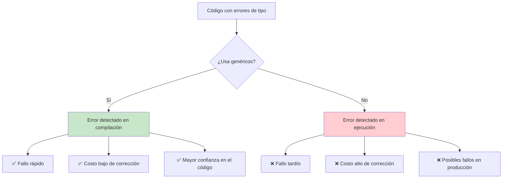
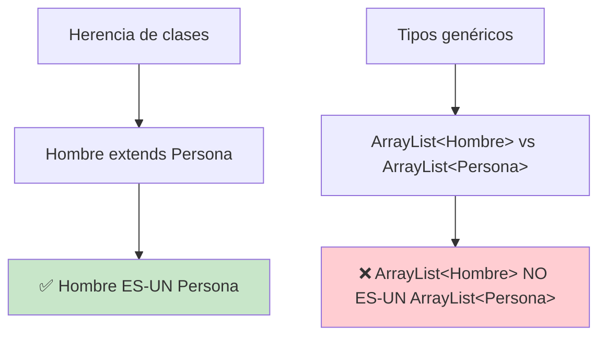
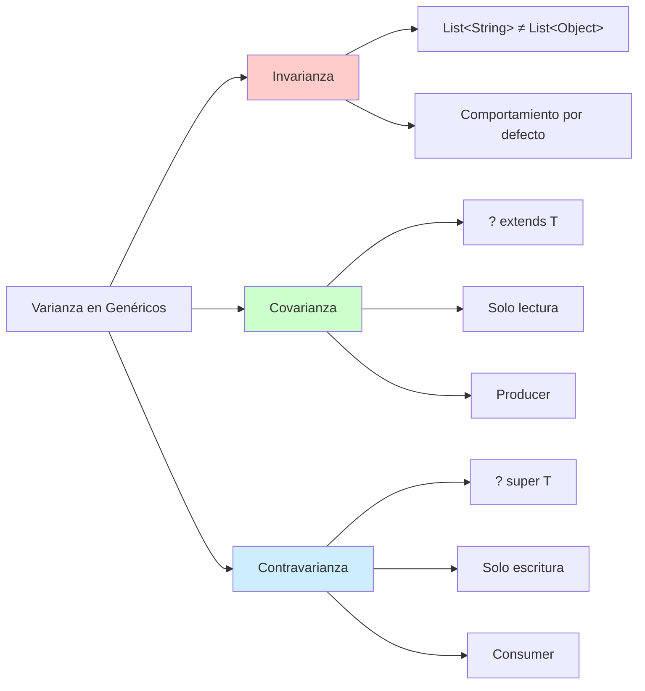
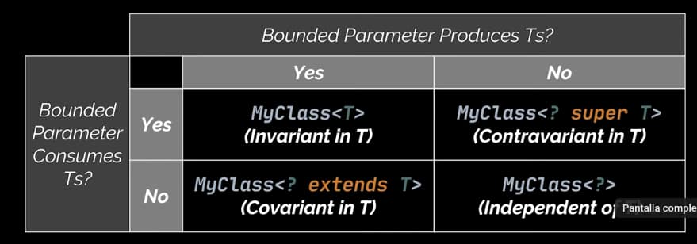
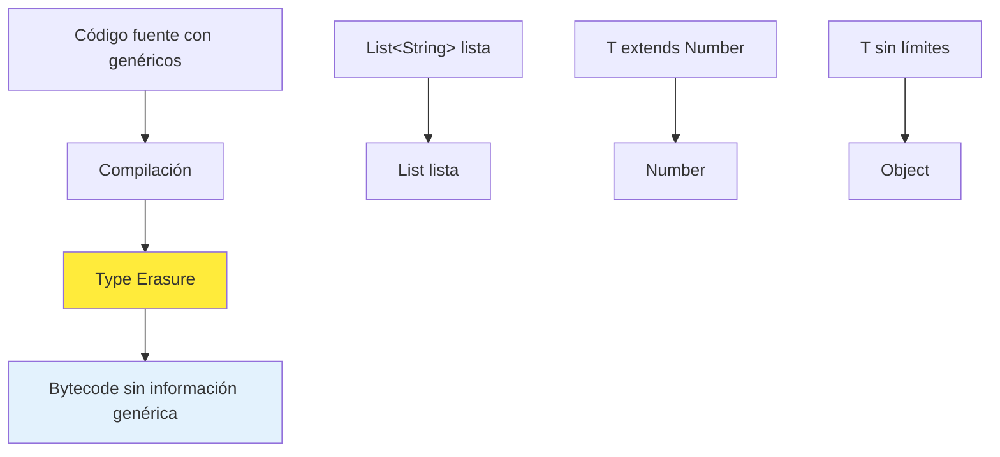

# UT8.2 Clases Genéricas

## 📋 Índice de contenidos

1. [Introducción a las clases genéricas](#1-introducci%C3%B3n-a-las-clases-gen%C3%A9ricas)
    1. [¿Qué son los genéricos?](#11-qu%C3%A9-son-los-gen%C3%A9ricos)
    2. [Ventajas sobre el uso de Object](#12-ventajas-sobre-el-uso-de-object)
2. [Motivaciones y beneficios](#2-motivaciones-y-beneficios)
    1. [Recordando la interfaz Comparable](#21-recordando-la-interfaz-comparable)
    2. [Beneficios principales](#22-beneficios-principales)
3. [Conceptos fundamentales de genéricos](#3-conceptos-fundamentales-de-gen%C3%A9ricos)
    1. [Parámetros de tipo genérico](#31-par%C3%A1metros-de-tipo-gen%C3%A9rico)
    2. [Convenciones de nomenclatura](#32-convenciones-de-nomenclatura)
    3. [Sintaxis de declaración](#33-sintaxis-de-declaraci%C3%B3n)
    4. [Instanciación de clases genéricas](#34-instanciaci%C3%B3n-de-clases-gen%C3%A9ricas)
4. [Filtrado de errores en tiempo de compilación](#4-filtrado-de-errores-en-tiempo-de-compilaci%C3%B3n)
    1. [Detección temprana de errores](#41-detecci%C3%B3n-temprana-de-errores)
    2. [Ventajas del filtrado temprano](#42-ventajas-del-filtrado-temprano)
5. [Definición de clases genéricas](#5-definici%C3%B3n-de-clases-gen%C3%A9ricas)
    1. [Problema sin genéricos](#51-problema-sin-gen%C3%A9ricos)
    2. [Solución con genéricos](#52-soluci%C3%B3n-con-gen%C3%A9ricos)
    3. [Uso de la clase genérica](#53-uso-de-la-clase-gen%C3%A9rica)
6. [Métodos genéricos](#6-m%C3%A9todos-gen%C3%A9ricos)
    1. [Sintaxis de métodos genéricos](#61-sintaxis-de-m%C3%A9todos-gen%C3%A9ricos)
    2. [Ejemplos de métodos genéricos](#62-ejemplos-de-m%C3%A9todos-gen%C3%A9ricos)
    3. [Uso de métodos genéricos](#63-uso-de-m%C3%A9todos-gen%C3%A9ricos)
    4. [Inferencia de tipos](#64-inferencia-de-tipos)
7. [Tipos genéricos limitados](#7-tipos-gen%C3%A9ricos-limitados)
    1. [Concepto de bounded types](#71-concepto-de-bounded-types)
    2. [Equivalencia con Object](#72-equivalencia-con-object)
    3. [Ventajas de los tipos limitados](#73-ventajas-de-los-tipos-limitados)
8. [Wildcards y varianza](#8-wildcards-y-varianza)
    1. [El problema de la herencia con genéricos](#81-el-problema-de-la-herencia-con-gen%C3%A9ricos)
    2. [Wildcards](#82-wildcards)
    3. [Tipos de varianza](#83-tipos-de-varianza)
    4. [Principio PECS](#84-principio-pecs)
    5. [Ejemplos prácticos con wildcards](#85-ejemplos-pr%C3%A1cticos-con-wildcards)
9. [Type Erasure - Borrado de tipos](#9-type-erasure---borrado-de-tipos)
    1. [¿Qué es Type Erasure?](#91-qu%C3%A9-es-type-erasure)
    2. [Ejemplos de Type Erasure](#92-ejemplos-de-type-erasure)
10. [Reification vs Type Erasure](#10-reification-vs-type-erasure)
    1. [Concepto de Reification](#101-concepto-de-reification)
    2. [Comparación con otros lenguajes](#102-comparaci%C3%B3n-con-otros-lenguajes)
    3. [Implicaciones prácticas](#103-implicaciones-pr%C3%A1cticas)
11. [Restricciones de los tipos genéricos](#11-restricciones-de-los-tipos-gen%C3%A9ricos)
    1. [No se puede instanciar tipos genéricos](#111-no-se-puede-instanciar-tipos-gen%C3%A9ricos)
    2. [No se pueden crear arrays de tipos genéricos](#112-no-se-pueden-crear-arrays-de-tipos-gen%C3%A9ricos)
    3. [Restricciones con excepciones](#113-restricciones-con-excepciones)
    4. [Restricciones con métodos estáticos](#114-restricciones-con-m%C3%A9todos-est%C3%A1ticos)
    5. [Otras restricciones importantes](#115-otras-restricciones-importantes)

## 1. Introducción a las clases genéricas

Ya conoces una clase genérica como es `ArrayList` y la interfaz genérica `Comparable`. Estas estructuras te han demostrado la potencia y flexibilidad que proporcionan los **tipos genéricos** en Java.

Las **clases genéricas** permiten parametrizar tipos de datos, lo que nos abre la posibilidad de definir una interfaz, una clase o un método con tipos genéricos que el compilador puede sustituir por tipos concretos durante la compilación.

### 1.1 ¿Qué son los genéricos?

Los **genéricos** son una característica del lenguaje Java que permite escribir código que puede trabajar con diferentes tipos de datos de manera **type-safe** (segura en cuanto a tipos). Introducidos en Java 5, los genéricos proporcionan:

- **🛡️ Seguridad de tipos en tiempo de compilación**
- **📚 Código más legible y autodocumentado**
- **🔄 Reutilización de código sin perder type-safety**
- **❌ Eliminación de casting explícito**

> [!IMPORTANT]
> Los tipos genéricos son una manera de reutilizar código, permitiendo que los tipos de datos sean variables. Esto nos permite crear clases, interfaces y métodos que pueden operar con objetos de diferentes tipos, siempre que estos objetos sean compatibles con los parámetros de tipos.

### 1.2 Ventajas sobre el uso de Object

Antes de los genéricos, para crear estructuras de datos reutilizables se utilizaba la clase `Object`:

```java
// ❌ Enfoque pre-genéricos (problemático)
public class ContenedorObject {
    private Object elemento;
    
    public void set(Object elemento) {
        this.elemento = elemento;
    }
    
    public Object get() {
        return elemento; // Requiere casting
    }
}

// Uso problemático
ContenedorObject contenedor = new ContenedorObject();
contenedor.set("Hola");
String texto = (String) contenedor.get(); // Casting manual
contenedor.set(123); // ¡Puede causar problemas!
```

```java
// ✅ Enfoque con genéricos (recomendado)
public class Contenedor<T> {
    private T elemento;
    
    public void set(T elemento) {
        this.elemento = elemento;
    }
    
    public T get() {
        return elemento; // Sin casting necesario
    }
}

// Uso seguro
Contenedor<String> contenedor = new Contenedor<>();
contenedor.set("Hola");
String texto = contenedor.get(); // Sin casting
// contenedor.set(123); // Error de compilación!
```

## 2. Motivaciones y beneficios

### 2.1 Recordando la interfaz Comparable

Recordemos la interfaz `Comparable` vista en unidades anteriores:

```java
public interface Comparable<T> {
    public int compareTo(T o);
}
```

Esta interfaz es un ejemplo perfecto de cómo los genéricos mejoran la API. Las clases que implementan esta interfaz están obligadas a implementar el método `compareTo` que determina la comparación entre dos elementos del mismo tipo.

### 2.2 Beneficios principales

#### 🛡️ Type Safety (Seguridad de tipos)

Los genéricos detectan errores de tipo en **tiempo de compilación** en lugar de tiempo de ejecución:

```java
List<String> listaTextos = new ArrayList<>();
listaTextos.add("Hola");
listaTextos.add("Mundo");
// listaTextos.add(123); // Error de compilación, no de ejecución
```

#### 📝 Eliminación de casting

No es necesario hacer conversiones explícitas de tipos:

```java
// Sin genéricos
List lista = new ArrayList();
lista.add("Hola");
String texto = (String) lista.get(0); // Casting necesario

// Con genéricos
List<String> lista = new ArrayList<>();
lista.add("Hola");
String texto = lista.get(0); // Sin casting
```

#### 🔄 Reutilización de código

Una sola implementación puede trabajar con múltiples tipos:

```java
// Una sola clase genérica para todos los tipos
Pila<Integer> pilaEnteros = new Pila<>();
Pila<String> pilaTextos = new Pila<>();
Pila<Persona> pilaPersonas = new Pila<>();
```

#### 📖 Legibilidad mejorada

El código es más expresivo y autodocumentado:

```java
// ¿Qué contiene esta lista?
List lista = new ArrayList();

// Queda claro que contiene estudiantes
List<Estudiante> estudiantes = new ArrayList<>();
```

## 3. Conceptos fundamentales de genéricos

### 3.1 Parámetros de tipo genérico

`<T>` representa el **tipo de dato genérico**, que puede ser sustituido por un tipo de dato concreto cuando se instancia la clase. A este reemplazo lo denominamos **"instanciación genérica"**.

### 3.2 Convenciones de nomenclatura

> [!IMPORTANT]
> Por convención, los nombres de los parámetros de tipo son **letras simples y mayúsculas**.

Los nombres de parámetros de tipo más utilizados son:

| Letra | Significado | Uso típico |
| :-- | :-- | :-- |
| **E** | Element | Java Collections Framework |
| **K** | Key | Claves en mapas |
| **V** | Value | Valores en mapas |
| **N** | Number | Tipos numéricos |
| **T** | Type | Tipo genérico general |
| **S, U, V** | 2º, 3º, 4º tipos | Múltiples parámetros |

> [!WARNING]
> Cuando trabajemos con programación funcional será habitual llamar a los parámetros de tipo por orden alfabético, es decir: `A`, `B`, `C`...

### 3.3 Sintaxis de declaración

```java
// Clase con un parámetro de tipo
public class MiClase<T> {
    private T elemento;
    
    public T getElemento() {
        return elemento;
    }
    
    public void setElemento(T elemento) {
        this.elemento = elemento;
    }
}

// Clase con múltiples parámetros de tipo
public class Pareja<T, U> {
    private T primero;
    private U segundo;
    
    public Pareja(T primero, U segundo) {
        this.primero = primero;
        this.segundo = segundo;
    }
    
    public T getPrimero() { return primero; }
    public U getSegundo() { return segundo; }
}
```

### 3.4 Instanciación de clases genéricas

```java
// Sintaxis completa (antes de Java 7)
MiClase<String> contenedorString = new MiClase<String>();

// Diamond operator (Java 7+)
MiClase<String> contenedorString = new MiClase<>();

// Múltiples parámetros
Pareja<String, Integer> par = new Pareja<>("Juan", 25);
```

## 4. Filtrado de errores en tiempo de compilación

Gracias a las clases genéricas podemos filtrar errores cuando se intente hacer uso de un elemento que no sea del tipo definido, detectándolos en **tiempo de compilación** en lugar de tiempo de ejecución.

### 4.1 Detección temprana de errores

```java
// Error detectado en tiempo de compilación
ArrayList<String> lista = new ArrayList<>();
lista.add("Texto válido");
// lista.add(123); // ❌ Error de compilación

// Sin genéricos - Error en tiempo de ejecución
ArrayList lista = new ArrayList();
lista.add("Texto");
lista.add(123); // ✅ Compila pero es problemático
String texto = (String) lista.get(1); // ❌ ClassCastException en ejecución
```

### 4.2 Ventajas del filtrado temprano



## 5. Definición de clases genéricas

### 5.1 Problema sin genéricos

Supongamos la siguiente clase Pila sin genéricos:

```java
public class Pila {
    private ArrayList lista;

    public Pila() {
        lista = new ArrayList();
    }

    public int getTamano() {
        return lista.size();
    }

    private int ultimoIndice() {
        return getTamano() - 1;
    }

    public Object cima() {
        return lista.get(ultimoIndice());
    }

    public void apilar(Object objeto) {
        lista.add(objeto);
    }

    public Object desapilar() {
        Object objeto = this.cima();
        lista.remove(objeto);
        return objeto;
    }
}
```

**¿Problemas identificados?**

- ❌ No controla que todos los elementos sean del mismo tipo
- ❌ Requiere casting al obtener elementos
- ❌ Errores detectados solo en tiempo de ejecución
- ❌ Viola el principio de homogeneidad de colecciones

### 5.2 Solución con genéricos

```java
public class PilaGenerica<E> {
    private ArrayList<E> lista;

    public PilaGenerica() {
        lista = new ArrayList<>();
    }

    public int getTamano() {
        return lista.size();
    }

    private int ultimoIndice() {
        return getTamano() - 1;
    }

    public E cima() {
        return lista.get(ultimoIndice());
    }

    public void apilar(E objeto) {
        lista.add(objeto);
    }

    public E desapilar() {
        E objeto = this.cima();
        lista.remove(objeto);
        return objeto;
    }
    
    public boolean estaVacia() {
        return lista.isEmpty();
    }
    
    @Override
    public String toString() {
        return "Pila: " + lista.toString();
    }
}
```

### 5.3 Uso de la clase genérica

```java
public class UsoPilaGenerica {
    public static void main(String[] args) {
        // Pila de enteros
        PilaGenerica<Integer> pilaEnteros = new PilaGenerica<>();
        pilaEnteros.apilar(1);
        pilaEnteros.apilar(2);
        pilaEnteros.apilar(3);
        
        System.out.println("Pila de enteros: " + pilaEnteros);
        System.out.println("Cima: " + pilaEnteros.cima());
        System.out.println("Desapilado: " + pilaEnteros.desapilar());
        
        // Pila de strings
        PilaGenerica<String> pilaStrings = new PilaGenerica<>();
        pilaStrings.apilar("Primero");
        pilaStrings.apilar("Segundo");
        pilaStrings.apilar("Tercero");
        
        System.out.println("Pila de strings: " + pilaStrings);
        
        // Type safety garantizada
        // pilaStrings.apilar(123); // Error de compilación
    }
}
```

## 6. Métodos genéricos

También es posible utilizar tipos genéricos en la definición de **métodos estáticos y de instancia**, no solo en clases completas.

### 6.1 Sintaxis de métodos genéricos

```java
[modificadores] <tipoGenérico> tipoRetorno nombreMétodo(parámetros)
```

### 6.2 Ejemplos de métodos genéricos

```java
public class UtilGenerico {
    
    // Método genérico estático para imprimir
    public static <T> void imprimir(T elemento) {
        System.out.println("Elemento: " + elemento);
    }
    
    // Método genérico para intercambiar elementos en array
    public static <T> void intercambiar(T[] array, int i, int j) {
        T temp = array[i];
        array[i] = array[j];
        array[j] = temp;
    }
}
```

```java
public class Caja<T>{
    private T contenido;

    public Caja(T contenido){
        this.contenido = contenido;
    }

    // Método genérico que usa un genérico independiente del de la clase
    public <U> imprimirConPrefijo(U prefijo){
        System.out.print(prefijo);
        System.out.println(contenido);
    }
}
```

### 6.3 Uso de métodos genéricos

```java
public class EjemploMetodosGenericos {
    public static void main(String[] args) {
        // Uso del método imprimir
        UtilGenerico.imprimir("Hola mundo");
        UtilGenerico.imprimir(42);
        UtilGenerico.imprimir(3.14);
        
        // Uso del método intercambiar
        String[] nombres = {"Ana", "Juan", "Pedro"};
        System.out.println("Antes: " + Arrays.toString(nombres));
        UtilGenerico.intercambiar(nombres, 0, 2);
        System.out.println("Después: " + Arrays.toString(nombres));

        //Uso del método imprimirConPrefijo
        Caja<Double> mates = new Caja(7.75);
        mates.imprimirConPrefijo("Nota de mates: ");
        mates.imprimirConPrefijo(0);
    }
}
```

### 6.4 Inferencia de tipos

Java puede inferir automáticamente los tipos genéricos en muchos casos:

```java
// Inferencia automática
UtilGenerico.imprimir("Texto");    // T inferido como String
UtilGenerico.imprimir(123);        // T inferido como Integer

// Especificación explícita (opcional)
UtilGenerico.<String>imprimir("Texto");
UtilGenerico.<Integer>imprimir(123);
```

## 7. Tipos genéricos limitados

Un tipo genérico también puede ser especificado como un **subtipo de otro tipo**. Esto se hace utilizando la palabra reservada `extends`.

### 7.1 Concepto de bounded types

Los **tipos genéricos limitados** (bounded type parameters) permiten restringir los tipos que pueden ser utilizados como argumentos de tipo:

```java
// T debe ser Number o una subclase de Number
public class CalculadoraNumerica<T extends Number> {
    private T numero;
    
    public CalculadoraNumerica(T numero) {
        this.numero = numero;
    }
    
    public double obtenerValorDoble() {
        return numero.doubleValue(); // Método disponible porque T extends Number
    }
    
    public T obtenerNumero() {
        return numero;
    }
}
```

### 7.2 Equivalencia con Object

> [!NOTE]
> `<E>` es equivalente a `<E extends Object>`, ya que todas las clases en Java heredan implícitamente de Object.

### 7.3 Ventajas de los tipos limitados

Con tipos limitados podemos utilizar métodos específicos de la clase límite:

```java
public class EjemploTiposLimitados {
    
    // Solo acepta tipos que implementen Comparable
    public static <T extends Comparable<T>> boolean esIgual(T obj1, T obj2) {
        return obj1.compareTo(obj2) == 0; // Método disponible porque T extends Comparable
    }
    
    // Solo acepta subclases de GeometricObject
    public static <E extends GeometricObject> boolean mismaArea(E objeto1, E objeto2) {
        return objeto1.getArea() == objeto2.getArea(); // getArea() disponible
    }
    
    // Múltiples límites con &
    public static <T extends Number & Comparable<T>> T maximo(T a, T b) {
        return a.compareTo(b) > 0 ? a : b;
    }
}
```

> [!IMPORTANT]
> Limitar los tipos genéricos nos permite **GANAR IDENTIDAD**. En la clase que definimos genérica con `T` solo tenemos acceso a métodos de `Object` mientras que si la clase genérica usa un tipo limitado como `T extends Number` dispondrá de los métodos de `Number`.

## 8. Wildcards y varianza

### 8.1 El problema de la herencia con genéricos

Ya sabemos que en el código tradicional con herencia se produce una **pérdida de identidad** cuando invocamos métodos polimórficos, pero el programa **funciona correctamente** gracias al polimorfismo. Sin embargo, cuando intentamos aplicar esta misma lógica a los tipos genéricos, nos encontramos con un problema fundamental.

#### 8.1.1 Herencia tradicional vs. Genéricos

**✅ Con herencia tradicional (funciona):**

```java
class Persona {
    protected String nombre;
    
    public Persona(String nombre) {
        this.nombre = nombre;
    }
    
    public void tenerHijo() {
        System.out.println(nombre + " tiene un hijo");
    }
    
    @Override
    public String toString() {
        return nombre;
    }
}

class Hombre extends Persona {
    public Hombre(String nombre) {
        super(nombre);
    }
    
    public void trabajar() {
        System.out.println(nombre + " está trabajando");
    }
}

public class HerenciaTradicional {
    // Método que acepta Persona o cualquier subclase
    public static void procesarPersona(Persona persona) {
        persona.tenerHijo(); // Polimorfismo funciona perfectamente
    }
    
    public static void main(String[] args) {
        Hombre juan = new Hombre("Juan");
        
        // ✅ Esto funciona: Hombre ES-UN Persona
        procesarPersona(juan); 
        
        System.out.println("El polimorfismo funciona correctamente");
    }
}
```

**❌ Con genéricos (no funciona):**

```java
import java.util.ArrayList;

public class ProblemaGenericos {
    // Método que debería aceptar ArrayList<Persona> o subtipos
    public static void procesarPersonas(ArrayList<Persona> personas) {
        for (Persona p : personas) {
            p.tenerHijo();
        }
    }
    
    public static void main(String[] args) {
        ArrayList<Hombre> hombres = new ArrayList<>();
        hombres.add(new Hombre("Juan"));
        hombres.add(new Hombre("Pedro"));
        
        // ❌ Error de compilación
        // procesarPersonas(hombres); 
        // ArrayList<Hombre> NO es subclase de ArrayList<Persona>
        
        System.out.println("Este código no compila");
    }
}
```

#### 8.1.2 ¿Por qué Java se comporta así?

La razón principal es la **invarianza de los tipos genéricos**. Aunque `Hombre` sea una subclase de `Persona`, `ArrayList<Hombre>` **NO** es una subclase de `ArrayList<Persona>`.



#### 8.1.3 ¿Por qué es necesaria esta restricción?

Consideremos qué pasaría si Java permitiera esta conversión:

```java
// Si esto fuera posible (pero NO lo es)
ArrayList<Hombre> hombres = new ArrayList<>();
ArrayList<Persona> personas = hombres; // Hipotéticamente permitido

// Problema: ahora podríamos añadir cualquier Persona
personas.add(new Mujer("María")); // ¡Añadimos una Mujer a una lista de Hombres!

// Cuando recuperamos de la lista original...
Hombre primerHombre = hombres.get(1); // ¡ClassCastException!
```

> [!IMPORTANT]
> **Principio de seguridad de tipos:** Java prohíbe esta conversión para **garantizar la seguridad de tipos** en tiempo de compilación y evitar errores en tiempo de ejecución. Más adelante veremos la diferencia entre *invarianza, covarianza y contravarianza*.

#### 8.1.4 Consecuencias del problema

Este comportamiento genera **limitaciones prácticas** importantes:

**1. Métodos inflexibles:**

```java
// Este método solo acepta exactamente ArrayList<Persona>
public static void procesarPersonas(ArrayList<Persona> personas) {
    // ...
}

// No podemos pasar ArrayList<Hombre>, ArrayList<Mujer>, etc.
```

**2. Duplicación de código:**

```java
// Tendríamos que crear métodos separados para cada tipo
public static void procesarHombres(ArrayList<Hombre> hombres) { /* ... */ }
public static void procesarMujeres(ArrayList<Mujer> mujeres) { /* ... */ }
public static void procesarPersonas(ArrayList<Persona> personas) { /* ... */ }
```

**3. Pérdida de escalabilidad:**

```java
// No podemos hacer esto:
ArrayList<Estudiante> estudiantes = new ArrayList<>();
ArrayList<Trabajador> trabajadores = new ArrayList<>();

// procesarPersonas(estudiantes); // ❌ Error
// procesarPersonas(trabajadores); // ❌ Error
```

> [!NOTE]
> **Solución:** Para resolver este problema, Java introdujo los **tipos wildcard (comodines)** que veremos en el siguiente apartado. Estos nos permiten crear métodos más flexibles que pueden trabajar con tipos genéricos relacionados por herencia.

### 8.2 Wildcards

#### 8.2.1 ¿Qué son los wildcards?

Los **wildcards** (comodines) son una característica fundamental de los tipos genéricos en Java que permite crear código más flexible y reutilizable. Utilizan el símbolo `?` para representar un tipo desconocido, solucionando las limitaciones de la invarianza de los tipos genéricos. [*Aquí se enlaza un post sobre el uso de wildcards*](https://www.arquitecturajava.com/java-generics-uso-de-wildcard/).

> [!IMPORTANT]
> Los wildcards son especialmente útiles cuando queremos crear métodos que puedan trabajar con colecciones de diferentes tipos relacionados por herencia.

#### 8.2.2 Tipos de wildcards

| Wildcard | Descripción | Uso típico | Lectura | Escritura |
| :-- | :-- | :-- | :-- | :-- |
| `?` | Wildcard sin límites | Cualquier tipo | ⚠️ Solo Object | ❌ No permitida |
| `? extends T` | Upper bounded wildcard | T o cualquier subtipo | ✅ Como T | ❌ No permitida |
| `? super T` | Lower bounded wildcard | T o cualquier supertipo | ⚠️ Solo Object | ✅ Como T |

#### 8.2.3 Unbounded Wildcards (`?`)

El wildcard sin límites acepta cualquier tipo, pero impone fuertes restricciones sobre lo que se puede hacer con los elementos.

```java
public class UnboundedWildcardExample {
    // Método que puede imprimir cualquier lista
    public static void imprimirLista(List<?> lista) {
        for (Object elemento : lista) {
            System.out.println(elemento); // Solo podemos tratarlo como Object
        }
        // lista.add("nuevo"); // ❌ ERROR: No podemos añadir elementos
    }
    
    public static void main(String[] args) {
        List<String> strings = Arrays.asList("Hola", "Mundo");
        List<Integer> numbers = Arrays.asList(1, 2, 3);
        List<Double> decimales = Arrays.asList(3.14, 2.71);
        
        imprimirLista(strings);   // ✅ Funciona
        imprimirLista(numbers);   // ✅ Funciona
        imprimirLista(decimales); // ✅ Funciona
    }
}
```

#### 8.2.4 Upper Bounded Wildcards (`? extends T`)

Permite **leer** elementos de la colección como instancias de T o sus supertipos, pero **no permite añadir** elementos (excepto `null`).

```java
public class UpperBoundedExample {
    // Ejemplo con jerarquía de clases
    static class Animal {
        protected String nombre;
        public Animal(String nombre) { this.nombre = nombre; }
        public void hacerSonido() { System.out.println(nombre + " hace un sonido"); }
        @Override
        public String toString() { return nombre; }
    }
    
    static class Perro extends Animal {
        public Perro(String nombre) { super(nombre); }
        @Override
        public void hacerSonido() { System.out.println(nombre + " ladra: ¡Guau!"); }
    }
    
    static class Gato extends Animal {
        public Gato(String nombre) { super(nombre); }
        @Override
        public void hacerSonido() { System.out.println(nombre + " maúlla: ¡Miau!"); }
    }
    
    // Método que acepta listas de Animal o cualquier subtipo
    public static void hacerSonidoAnimales(List<? extends Animal> animales) {
        for (Animal animal : animales) {
            animal.hacerSonido(); // ✅ Podemos leer como Animal
        }
        // animales.add(new Perro("Rex")); // ❌ ERROR: No podemos añadir
    }
    
    public static void main(String[] args) {
        List<Perro> perros = Arrays.asList(
            new Perro("Rex"), 
            new Perro("Bobby")
        );
        
        List<Gato> gatos = Arrays.asList(
            new Gato("Whiskers"), 
            new Gato("Mittens")
        );
        
        List<Animal> animales = Arrays.asList(
            new Animal("Genérico"),
            new Perro("Max"),
            new Gato("Luna")
        );
        
        // Todas estas llamadas funcionan
        hacerSonidoAnimales(perros);   // ✅ List<Perro> es ? extends Animal
        hacerSonidoAnimales(gatos);    // ✅ List<Gato> es ? extends Animal  
        hacerSonidoAnimales(animales); // ✅ List<Animal> es ? extends Animal
        
    }
}
```

#### 8.2.5 Lower Bounded Wildcards (`? super T`)

Permite **escribir** elementos de tipo T en la colección, pero al **leer** solo garantiza que obtendremos Objects.

```java
public class LowerBoundedExample {
    // Método que puede añadir elementos a una colección
    public static void añadirPerros(List<? super Perro> lista) {
        lista.add(new Perro("Rex"));     // ✅ Podemos añadir Perros
        lista.add(new Perro("Bobby"));   // ✅ Podemos añadir Perros
        
        // Object obj = lista.get(0);    // ⚠️ Solo podemos leer como Object
        // Perro perro = lista.get(0);   // ❌ ERROR: No garantizado
    }
    
    // Método genérico de copia utilizando ambos tipos de wildcard
    public static <T> void copiarElementos(
            List<? extends T> origen,     // Producer: solo lectura
            List<? super T> destino       // Consumer: solo escritura
    ) {
        for (T elemento : origen) {
            destino.add(elemento);
        }
    }
    
    public static void main(String[] args) {
        List<Animal> animales = new ArrayList<>();
        List<Object> objetos = new ArrayList<>();
        
        // Ambas listas pueden recibir Perros
        añadirPerros(animales); // ✅ List<Animal> es ? super Perro
        añadirPerros(objetos);  // ✅ List<Object> es ? super Perro
        
        System.out.println("Animales: " + animales);
        System.out.println("Objetos: " + objetos);
        
        // Ejemplo de copia
        List<String> origen = Arrays.asList("Java", "Python", "JavaScript");
        List<Object> destino = new ArrayList<>();
        
        copiarElementos(origen, destino);
        System.out.println("Lista copiada: " + destino);
    }
}
```

### 8.3 Tipos de varianza

> [!IMPORTANT]
> **Conceptos de varianza:** La varianza es una propiedad que tienen los tipos genéricos que nos permite definir si un tipo genérico es invariante, covariante o contravariante. Es decir, si un tipo genérico puede ser sustituido por otro tipo genérico de la misma familia.



#### 8.3.1 Invarianza (por defecto)

La invarianza nos indica que un tipo no se puede utilizar en un contexto donde se espera otro tipo. Cuando utilizamos tipos genéricos por defecto ese tipo es invariante.

```java
List<String> strings = new ArrayList<>();
List<Object> objects = strings; // ❌ Error de compilación
```

#### 8.3.2 Covarianza (? extends T)

La covarianza es la capacidad de un tipo de ser usado en un contexto donde se espera un tipo más general, o dicho de otra manera, que los únicos elementos aceptados son aquellos que son de tipo T o cualquier subtipo de T.

Permite **leer** elementos pero no **añadir**:

```java
public static void procesarPersonas(List<? extends Persona> personas) {
    for (Persona p : personas) {
        p.tenerHijo(); // ✅ Lectura permitida
    }
    // personas.add(new Persona("Nuevo")); // ❌ Escritura no permitida
}

// Ahora funciona
ArrayList<Hombre> hombres = new ArrayList<>();
procesarPersonas(hombres); // ✅ Funciona
```

#### 8.3.3 Contravarianza (? super T)

La contravarianza es la capacidad de un tipo de ser usado en un contexto donde se espera un tipo más específico. Es decir, que los únicos elementos aceptados son los que son de tipo A o cualquier supertipo de A.

Permite **añadir** elementos pero limita la **lectura**:

```java
public static void añadirPersonas(List<? super Hombre> lista) {
    lista.add(new Persona("Juana")); // ✅ Escritura permitida
    lista.add(new Hombre("Pedro")); // ✅ Escritura permitida
    
    // Object obj = lista.get(0); // ✅ Solo como Object
    // Hombre h = lista.get(0); // ❌ No garantizado
}

List<Persona> personas = new ArrayList<>();
añadirPersonas(personas); // ✅ Funciona
```

### 8.4 Principio PECS



> [!TIP]
>
> **PECS: Producer Extends, Consumer Super**
>
> - Si la colección **produce** elementos (solo lectura): usa `? extends T`
> - Si la colección **consume** elementos (solo escritura): usa `? super T`
> - Si necesitas ambas operaciones: usa el tipo específico sin wildcards

<details>
<summary>Aquí puedes ver un ejemplo más completo</summary>

```java
public class PECSExample {
    // PRODUCER: la fuente produce elementos que queremos leer
    public static double sumarNumeros(List<? extends Number> numeros) {
        double suma = 0.0;
        for (Number num : numeros) {  // Solo leemos, no escribimos
            suma += num.doubleValue();
        }
        return suma;
    }
    
    // CONSUMER: el destino consume elementos que queremos escribir
    public static void llenarConCeros(List<? super Integer> lista, int cantidad) {
        for (int i = 0; i < cantidad; i++) {
            lista.add(0);  // Solo escribimos, no leemos
        }
    }
    
    // Método que usa ambos conceptos
    public static <T> void transferir(
            List<? extends T> fuente,    // PRODUCER
            List<? super T> destino      // CONSUMER
    ) {
        for (T elemento : fuente) {
            destino.add(elemento);
        }
    }
    
    public static void main(String[] args) {
        // Producer example
        List<Integer> enteros = Arrays.asList(1, 2, 3, 4, 5);
        List<Double> decimales = Arrays.asList(1.5, 2.5, 3.5);
        
        System.out.println("Suma enteros: " + sumarNumeros(enteros));
        System.out.println("Suma decimales: " + sumarNumeros(decimales));
        
        // Consumer example
        List<Number> numeros = new ArrayList<>();
        List<Object> objetos = new ArrayList<>();
        
        llenarConCeros(numeros, 3);
        llenarConCeros(objetos, 2);
        
        System.out.println("Números: " + numeros);
        System.out.println("Objetos: " + objetos);
        
        // Transfer example
        List<String> origen = Arrays.asList("A", "B", "C");
        List<Object> destino = new ArrayList<>();
        
        transferir(origen, destino);
        System.out.println("Transferencia: " + destino);
    }
}
```

</details>

### 8.5 Ejemplos prácticos con wildcards

Vamos a analizar diferentes situaciones con wildcards para entender cuándo funcionan y cuándo no. Considera las siguientes clases:

```java
class Fruta {
    protected String nombre;
    public Fruta(String nombre) { this.nombre = nombre; }
    @Override
    public String toString() { return nombre; }
}

class Manzana extends Fruta {
    public Manzana() { super("Manzana"); }
}

class Naranja extends Fruta {
    public Naranja() { super("Naranja"); }
}
```

#### 🤔 Ejercicio 1: ¿Funcionan estas instrucciones?

```java
public class EjemploWildcards {
    public static void procesarFrutas(List<Fruta> frutas) {
        System.out.println("Procesando frutas:");
        for (Fruta f : frutas) {
            System.out.println("- " + f);
        }
    }
    
    public static void main(String[] args) {
        List<Manzana> manzanas = Arrays.asList(new Manzana(), new Manzana());
        List<Naranja> naranjas = Arrays.asList(new Naranja(), new Naranja());
        List<Fruta> frutas = Arrays.asList(new Fruta("Genérica"), new Manzana());
        
        /*
        procesarFrutas(manzanas); // ¿Funciona?
        procesarFrutas(naranjas); // ¿Funciona?
        procesarFrutas(frutas);   // ¿Funciona?
        */
    }
}
```

<details>
<summary>📋 Ver respuesta del Ejercicio 1</summary>

**❌ Las dos primeras NO funcionan, ✅ la tercera SÍ funciona.**

**Explicación:**

- `procesarFrutas(manzanas);` → **ERROR**: `List<Manzana>` NO es `List<Fruta>`
- `procesarFrutas(naranjas);` → **ERROR**: `List<Naranja>` NO es `List<Fruta>`  
- `procesarFrutas(frutas);` → **OK**: `List<Fruta>` es exactamente `List<Fruta>`

**Solución:** Usar `? extends Fruta` para permitir subtipos:

```java
public static void procesarFrutas(List<? extends Fruta> frutas) {
    System.out.println("Procesando frutas:");
    for (Fruta f : frutas) {
        System.out.println("- " + f);
    }
}
```

Ahora **todas las llamadas funcionan** porque `? extends Fruta` acepta `Fruta` y cualquier subtipo.

</details>

#### 🤔 Ejercicio 2: ¿Qué operaciones son válidas?

```java
public static void gestionarCesta(List<? extends Fruta> cesta) {
    System.out.println("Gestión de cesta:");
    
    /*
    cesta.add(new Manzana());        // ¿Funciona?
    cesta.add(new Naranja());        // ¿Funciona?
    cesta.add(new Fruta("Nueva"));   // ¿Funciona?
    
    Fruta primera = cesta.get(0);    // ¿Funciona?
    Object obj = cesta.get(0);       // ¿Funciona?
    */
}
```

<details>
<summary>📋 Ver respuesta del Ejercicio 2</summary>

**❌ Todas las operaciones `add()` FALLAN, ✅ las operaciones `get()` funcionan**

**Explicación:**

- ❌ `cesta.add(new Manzana());` → **ERROR**: No sabemos el tipo exacto de la cesta
- ❌ `cesta.add(new Naranja());` → **ERROR**: Podría ser una `List<Manzana>`
- ❌ `cesta.add(new Fruta("Nueva"));` → **ERROR**: Misma razón
- ✅ `Fruta primera = cesta.get(0);` → **OK**: Sabemos que es al menos `Fruta`
- ✅ `Object obj = cesta.get(0);` → **OK**: Todo hereda de `Object`

> **Regla clave:** `? extends T` permite **LEER** como T, pero **NO ESCRIBIR**.

</details>

#### 🤔 Ejercicio 3: ¿Y con `? super`?

```java
public static void llenarCesta(List<? super Manzana> cesta) {
    System.out.println("Llenando cesta:");
    
    /*
    cesta.add(new Manzana());        // ¿Funciona?
    cesta.add(new Naranja());        // ¿Funciona?
    cesta.add(new Fruta("Nueva"));   // ¿Funciona?
    
    Manzana m = cesta.get(0);        // ¿Funciona?
    Fruta f = cesta.get(0);          // ¿Funciona?
    Object obj = cesta.get(0);       // ¿Funciona?
    */
}
```

<details>
<summary>📋 Ver respuesta del Ejercicio 3</summary>

**✅ Solo `add(new Manzana())` funciona, ❌ otros `add()` fallan, ✅ solo `get()` como `Object` funciona**

**Explicación:**

- ✅ `cesta.add(new Manzana());` → **OK**: Sabemos que acepta al menos `Manzana`
- ❌ `cesta.add(new Naranja());` → **ERROR**: `Naranja` no es `Manzana` ni supertipo
- ❌ `cesta.add(new Fruta("Nueva"));` → **ERROR**: `Fruta` no garantiza aceptar `Manzana`
- ❌ `Manzana m = cesta.get(0);` → **ERROR**: Podría devolver `Fruta` o `Object`
- ❌ `Fruta f = cesta.get(0);` → **ERROR**: Podría ser `List<Object>`
- ✅ `Object obj = cesta.get(0);` → **OK**: Todo es `Object`

> **Regla clave:** `? super T` permite **ESCRIBIR** T, pero solo **LEER** como `Object`.

</details>

#### 🤔 Ejercicio 4: El método de copia

Considera este método genérico de copia:

```java
public static <T> void copiar(List<T> origen, List<T> destino) {
    for (T elemento : origen) {
        destino.add(elemento);
    }
}

public static void main(String[] args) {
    List<Fruta> frutas = new ArrayList<>();
    List<Manzana> manzanas = Arrays.asList(new Manzana(), new Manzana());
    List<Naranja> naranjas = Arrays.asList(new Naranja(), new Naranja());
    
    /*
    copiar(manzanas, frutas);  // ¿Funciona?
    copiar(frutas, manzanas);  // ¿Funciona?
    copiar(naranjas, frutas);  // ¿Funciona?
    */
}
```

<details>
<summary>📋 Ver respuesta del Ejercicio 4</summary>

**❌ NINGUNA funciona con la implementación actual.**

**Explicación:**

- ❌ `copiar(manzanas, frutas);` → **ERROR**: `T` sería `Manzana`, pero `frutas` es `List<Fruta>`
- ❌ `copiar(frutas, manzanas);` → **ERROR**: `T` sería `Fruta`, pero `manzanas` es `List<Manzana>`
- ❌ `copiar(naranjas, frutas);` → **ERROR**: `T` sería `Naranja`, pero `frutas` es `List<Fruta>`

**Solución con wildcards:**

```java
public static <T> void copiar(List<? extends T> origen, List<? super T> destino) {
    for (T elemento : origen) {
        destino.add(elemento);
    }
}
```

Ahora SÍ funcionan:

- ✅ `copiar(manzanas, frutas);` → OK: leemos `Manzana`, escribimos en lista que acepta `Manzana`
- ❌ `copiar(frutas, manzanas);` → **SIGUE FALLANDO**: no podemos escribir `Fruta` en `List<Manzana>`
- ✅ `copiar(naranjas, frutas);` → OK: leemos `Naranja`, escribimos en lista que acepta `Naranja`

> [!WARNING]
> Ahora podemos copiar la cesta de naranjas dentro de una cesta de frutas (lógico), pero **NO** podemos copiar una cesta de frutas dentro de una cesta de naranjas (también lógico, porque podría haber manzanas).

</details>

## 9. Type Erasure - Borrado de tipos

### 9.1 ¿Qué es Type Erasure?

Los tipos genéricos son admitidos por el compilador sin problemas, pero al compilar, **no es posible mantener la información del tipo genérico**. El compilador realiza una **conversión interna** a `Object` o al límite superior especificado.

Este proceso se conoce como **Type Erasure** (borrado de tipos) y garantiza la compatibilidad con versiones anteriores de Java.



### 9.2 Ejemplos de Type Erasure

#### Ejemplo 1: Genérico sin límites

```java
// Código original
public static <E> void print(E[] list) {
    for (int i = 0; i < list.length; i++)
        System.out.print(list[i] + " ");
    System.out.println();
}

// Después de Type Erasure
public static void print(Object[] list) {
    for (int i = 0; i < list.length; i++)
        System.out.print(list[i] + " ");
    System.out.println();
}
```

#### Ejemplo 2: Genérico con límites

```java
// Código original
public static <E extends GeometricObject> boolean equalArea(
        E object1, E object2) {
    return object1.getArea() == object2.getArea();
}

// Después de Type Erasure
public static boolean equalArea(
        GeometricObject object1, GeometricObject object2) {
    return object1.getArea() == object2.getArea();
}
```

#### Ejemplo 3: Clases genéricas

```java
// Código original
public class Contenedor<T> {
    private T elemento;
    
    public void set(T elemento) {
        this.elemento = elemento;
    }
    
    public T get() {
        return elemento;
    }
}

// Después de Type Erasure
public class Contenedor {
    private Object elemento;
    
    public void set(Object elemento) {
        this.elemento = elemento;
    }
    
    public Object get() {
        return elemento;
    }
}
```

## 10. Reification vs Type Erasure

### 10.1 Concepto de Reification

**Reification** es el proceso por el cual la información de tipos genéricos se **mantiene en tiempo de ejecución**. A diferencia de Java, algunos lenguajes implementan reification, lo que significa que los tipos genéricos están disponibles durante la ejecución del programa.

> [!IMPORTANT]
> **Java NO implementa reification** para los genéricos. En su lugar, utiliza Type Erasure por razones de compatibilidad hacia atrás y simplicidad de implementación.

### 10.2 Comparación con otros lenguajes
### 10.2 Comparación con otros lenguajes

Diferentes lenguajes de programación han adoptado estrategias distintas para manejar los tipos genéricos, cada una con sus propias ventajas y limitaciones:

**Java (Type Erasure)**

Java utiliza **type erasure** para mantener la compatibilidad hacia atrás con código anterior a Java 5. Durante la compilación, toda la información de tipos genéricos se elimina y se sustituye por `Object` o por el límite superior especificado. Esto significa que en tiempo de ejecución, `List` y `List` son indistinguibles - ambos son simplemente `List`. Esta decisión permite que código escrito antes de Java 5 funcione sin modificaciones, pero impone limitaciones significativas como la imposibilidad de crear arrays genéricos o instanciar tipos genéricos.

**C# (Reification)**

C# optó por preservar completamente la información de tipos genéricos en tiempo de ejecución. Esto se conoce como **reification**. En C#, `List` y `List` son tipos completamente diferentes en runtime, lo que permite operaciones que Java no puede realizar: crear arrays genéricos, instanciar tipos genéricos directamente, y usar reflexión completa sobre tipos genéricos. Esta aproximación ofrece máxima flexibilidad pero requiere soporte específico del runtime .NET.

**Scala (Enfoque híbrido)**

Scala, ejecutándose sobre la JVM, heredó inicialmente las limitaciones de type erasure de Java. Sin embargo, introdujo **type manifests** y posteriormente **type tags** como mecanismo para preservar información de tipos cuando es necesario. Esto permite un enfoque híbrido donde normalmente se comporta como Java (type erasure), pero puede acceder a información de tipos en situaciones específicas mediante manifests explícitos. Es más flexible que Java puro pero requiere sintaxis adicional.

**TypeScript (Solo tiempo de compilación)**

TypeScript adopta un enfoque completamente diferente: los genéricos existen únicamente durante la compilación para proporcionar verificación de tipos y mejor experiencia de desarrollo. Una vez compilado a JavaScript, toda la información de tipos desaparece completamente, ya que JavaScript es dinámicamente tipado. Esto ofrece excelente experiencia de desarrollo sin overhead en runtime, pero significa que no hay verificaciones de tipos en tiempo de ejecución.

#### 🎯 Ventajas y desventajas de cada enfoque

**Java (Type Erasure):**

- ✅ Compatibilidad total con código pre-genéricos
- ✅ Simplicidad de implementación en JVM
- ❌ Limitaciones significativas en runtime
- ❌ Necesidad de workarounds complejos

**C# (Reification):**

- ✅ Máxima flexibilidad y potencia
- ✅ Código más intuitivo y natural
- ❌ Mayor complejidad en el runtime
- ❌ Posible overhead de memoria

**Scala (Híbrido):**

- ✅ Flexibilidad cuando se necesita
- ✅ Compatibilidad con ecosistema Java
- ❌ Sintaxis compleja para casos avanzados
- ❌ Curva de aprendizaje elevada

**TypeScript (Solo compilación):**

- ✅ Excelente experiencia de desarrollo
- ✅ Compatibilidad total con JavaScript
- ❌ Sin verificaciones en runtime
- ❌ Posibles errores no detectados en producción

### 10.3 Implicaciones prácticas

**Ventajas que tendría la reification:**

- **Creación de instancias**: Poder crear objetos del tipo genérico
- **Arrays genéricos**: Crear arrays de tipos genéricos sin warnings
- **Reflexión completa**: Acceder a información del tipo en runtime
- **Mejor depuración**: Información de tipos disponible en debugging

**Por qué Java eligió Type Erasure:**

- **Compatibilidad**: Código Java 1.4 sigue funcionando sin cambios
- **Simplicidad de JVM**: No requiere cambios en la máquina virtual
- **Tamaño de bytecode**: No aumenta significativamente el tamaño
- **Performance**: Sin overhead adicional en runtime

## 11. Restricciones de los tipos genéricos

Debido al Type Erasure, existen ciertas **restricciones** en el uso de tipos genéricos que debemos conocer:

### 11.1 No se puede instanciar tipos genéricos

```java
public class RestriccionesGenericos<E> {
    
    // ❌ Error de compilación
    public void metodoIncorrecto() {
        // E objeto = new E(); // No permitido
    }
    
    // ✅ Alternativa usando reflexión
    private Class<E> tipo;
    
    public RestriccionesGenericos(Class<E> tipo) {
        this.tipo = tipo;
    }
    
    public E crearInstancia() throws Exception {
        return tipo.getDeclaredConstructor().newInstance();
    }
}
```

### 11.2 No se pueden crear arrays de tipos genéricos

```java
public class ArraysGenericos<E> {
    
    // ❌ Error de compilación
    public void arrayIncorrecto() {
        // E[] array = new E[10]; // No permitido
    }
    
    // ✅ Alternativas válidas
    public E[] crearArray(int tamaño) {
        // Opción 1: Crear array de Object y hacer cast
        @SuppressWarnings("unchecked")
        E[] array = (E[]) new Object[tamaño];
        return array;
    }
    
    // Opción 2: Usar ArrayList en lugar de array
    private ArrayList<E> lista = new ArrayList<>();
}
```

### 11.3 Restricciones con excepciones

```java
// ❌ No se puede usar tipo genérico como excepción
// public class MiExcepcion<T> extends Exception { } // Error

// ❌ No se puede capturar excepción genérica
public class ManejoExcepciones<E extends Exception> {
    public void metodo() {
        try {
            // algún código
        } 
        // catch (E e) { } // Error de compilación
        catch (Exception e) { // ✅ Alternativa
            // manejar excepción
        }
    }
}
```

### 11.4 Restricciones con métodos estáticos

```java
public class EjemploEstaticos<T> {
    private T instancia;
    
    // ❌ No se puede usar T en contexto estático
    // public static T obtenerDefault() { return null; } // Error
    
    // ✅ Los métodos estáticos pueden ser genéricos por sí mismos
    public static <U> U obtenerDefault(Class<U> clase) {
        try {
            return clase.getDeclaredConstructor().newInstance();
        } catch (Exception e) {
            return null;
        }
    }
}
```

### 11.5 Otras restricciones importantes

```java
public class OtrasRestricciones<T> {
    
    // ❌ No se puede hacer instanceof con tipo genérico
    public boolean esInstancia(Object obj) {
        // return obj instanceof T; // Error
        return obj != null; // Alternativa básica
    }
    
    // ❌ No se puede usar en expresiones new con wildcards
    public void restriccionWildcard() {
        // List<? extends Number> lista = new ArrayList<? extends Number>(); // Error
        List<? extends Number> lista = new ArrayList<Double>(); // ✅ Correcto
    }
    
    // ❌ Limitaciones en sobrecarga
    // public void metodo(List<String> lista) { }
    // public void metodo(List<Integer> lista) { } // Error: same erasure
    
    // ✅ Alternativa con diferentes nombres
    public void metodoStrings(List<String> lista) { }
    public void metodoEnteros(List<Integer> lista) { }
}
```

> [!TIP]
> **Recuerda:** Los genéricos son una herramienta poderosa que mejora la seguridad de tipos, la legibilidad del código y el rendimiento. Úsalos correctamente para crear código más robusto y mantenible.
---
> [!NOTE]
> Para un repaso de los conceptos más importantes, recomiendo la visualización de esta charla del  Dr. Venkat Subramaniam <https://youtu.be/cRPz405LWgE?si=ptdfgtnFkQGNPDLo>

<center><em>📚 Fin del apartado UT8.2 - Clases genéricas</em></center>
