# UT8.3 Colecciones

## 📋 Índice de contenidos

1. [Diferencia entre Ordered y Sorted](#1-diferencia-entre-ordered-y-sorted)
2. [Introducción a las colecciones](#2-introducci%C3%B3n-a-las-colecciones)
3. [Java Collections Framework](#3-java-collections-framework)
    1. [Estructura del framework](#31-estructura-del-framework)
    2. [Tipos de contenedores](#32-tipos-de-contenedores)
    3. [Interfaces principales](#33-interfaces-principales)
4. [Interfaz Iterable e Iterator](#4-interfaz-iterable-e-iterator)
    1. [Concepto de iterador](#41-concepto-de-iterador)
    2. [Uso del Iterator](#42-uso-del-iterator)
    3. [Ejemplo práctico](#43-ejemplo-pr%C3%A1ctico)
5. [List](#5-list)
    1. [Características de List](#51-caracter%C3%ADsticas-de-list)
    2. [Métodos específicos de List](#52-m%C3%A9todos-espec%C3%ADficos-de-list)
    3. [Clase LinkedList](#53-clase-linkedlist)
    4. [ArrayList vs LinkedList](#54-arraylist-vs-linkedlist)
    5. [Práctica 1: Comparación de rendimiento](#55-pr%C3%A1ctica-1-comparaci%C3%B3n-de-rendimiento)
6. [Estructura Stack (Pila)](#6-estructura-stack-pila)
    1. [Concepto LIFO](#61-concepto-lifo)
    2. [Métodos principales](#62-m%C3%A9todos-principales)
    3. [Ejemplo práctico](#63-ejemplo-pr%C3%A1ctico)
7. [Interfaz Queue (Cola)](#7-interfaz-queue-cola)
    1. [Concepto FIFO](#71-concepto-fifo)
    2. [Implementación con LinkedList](#72-implementaci%C3%B3n-con-linkedlist)
    3. [Métodos de Queue](#73-m%C3%A9todos-de-queue)
    4. [Ejemplo práctico](#74-ejemplo-pr%C3%A1ctico)
8. [PriorityQueue (Cola de prioridad)](#8-priorityqueue-cola-de-prioridad)
    1. [Concepto y funcionamiento](#81-concepto-y-funcionamiento)
    2. [Orden natural vs Comparator](#82-orden-natural-vs-comparator)
9. [Set (Conjunto)](#9-set-conjunto)
    1. [Características de Set](#91-caracter%C3%ADsticas-de-set)
    2. [HashSet](#92-hashset)
    3. [LinkedHashSet](#93-linkedhashset)
    4. [TreeSet](#94-treeset)
    5. [Comparación de implementaciones](#95-comparaci%C3%B3n-de-implementaciones)
    6. [Práctica 2: Experimentación con Sets](#96-pr%C3%A1ctica-2-experimentaci%C3%B3n-con-sets)
10. [Map (Mapas)](#10-map-mapas)
    1. [Concepto de clave-valor](#101-concepto-de-clave-valor)
    2. [Interfaz Map y Entry](#102-interfaz-map-y-entry)
    3. [HashMap](#103-hashmap)
    4. [LinkedHashMap](#104-linkedhashmap)
    5. [TreeMap](#105-treemap)
    6. [Práctica 3: Gestión de estudiantes](#106-pr%C3%A1ctica-3-gesti%C3%B3n-de-estudiantes)
11. [Buenas prácticas y recomendaciones](#11-buenas-pr%C3%A1cticas-y-recomendaciones)

## 1. Diferencia entre Ordered y Sorted

Antes de comenzar con el estudio de las colecciones, es fundamental comprender la diferencia entre dos conceptos que a menudo se confunden: **Ordered** (ordenado) y **Sorted** (clasificado).

> [!IMPORTANT]
> Esta distinción es clave para entender el comportamiento de diferentes tipos de colecciones en Java.

### 1.1 Colección Ordered (Ordenada)

Una **colección ordenada** te permite **acceder a los elementos usando un índice** y **respeta el orden en el que agregaste tus elementos**.

**Características:**

- 📍 **Orden de inserción**: El primer elemento es el primero que se agregó
- 🔢 **Acceso por índice**: Puedes obtener elementos por su posición
- 🔄 **Orden predecible**: El orden de iteración es consistente con el orden de inserción

```java
List<String> listaOrdenada = new ArrayList<>();
listaOrdenada.add("Agua");   // Posición 0
listaOrdenada.add("Sal");   // Posición 1  
listaOrdenada.add("Azucar");   // Posición 2

// Al recorrer: "Agua", "Sal", "Azucar" (orden de inserción)
```

### 1.2 Colección Sorted (Clasificada)

Una **colección clasificada** te permite **comparar tus elementos** y **te da el elemento más pequeño primero hasta el más grande**.

**Características:**

- 🔤 **Orden lógico**: Los elementos se ordenan según un criterio de comparación
- ⚡ **Orden dinámico**: Si agregas un elemento, puede cambiar el orden de iteración
- 📊 **Comparación**: Los elementos deben ser comparables o usar un Comparator

```java
Set<String> conjuntoClasificado = new TreeSet<>();
conjuntoClasificado.add("Agua");
conjuntoClasificado.add("Sal");  
conjuntoClasificado.add("Azucar");

// Al recorrer: "Agua", "Azucar", "Sal" (orden alfabético)
```

### 1.3 Comparación visual

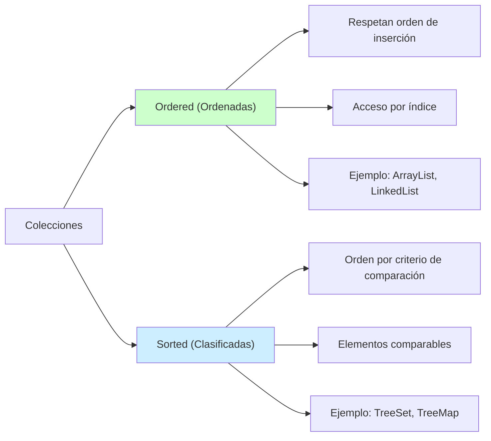

## 2. Introducción a las colecciones

Una **colección** es una estructura de datos organizada de manera que no solo almacena información, sino que también proporciona operaciones para acceder y manipularla.

En programación orientada a objetos, a estas estructuras de datos las conocemos como **contenedores de objetos**. Concretamente en Java se denominan **colecciones** (Collection).

### 2.1 Propiedades

Las colecciones nos permiten:

- **📦 Almacenar múltiples objetos**: Grupos de elementos relacionados
- **🔍 Acceder y manipular datos**: Mediante métodos específicos
- **🔄 Realizar operaciones comunes**: Búsqueda, inserción, eliminación, ordenación
- **📈 Escalabilidad**: Manejar desde pocos elementos hasta millones

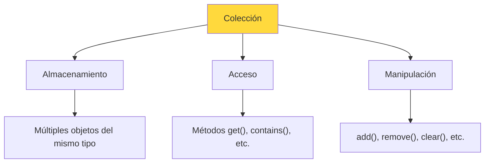

### 2.2 Ventajas sobre arrays

| Aspecto | Arrays | Colecciones |
| :-- | :-- | :-- |
| **Tamaño** | Fijo | Dinámico |
| **Funcionalidad** | Básica | Rica API con muchos métodos |
| **Tipos de datos** | Primitivos y objetos | Solo objetos |
| **Flexibilidad** | Limitada | Alta |
| **Facilidad de uso** | Requiere más código manual | Métodos incorporados |

### 2.3 Casos de uso comunes

**🏢 Aplicaciones empresariales:**

- Listas de empleados, clientes, productos
- Colas de tareas pendientes
- Conjuntos de categorías

**🎮 Desarrollo de videojuegos:**

- Inventarios de objetos
- Listas de puntuaciones
- Conjuntos de habilidades

**📊 Análisis de datos:**

- Conjuntos de mediciones
- Mapas de frecuencias
- Listas de resultados ordenados

etc...

## 3. Java Collections Framework

### 3.1 Estructura del framework

El **Java Collections Framework** es un conjunto unificado de interfaces y clases que proporcionan una arquitectura para representar y manipular colecciones.

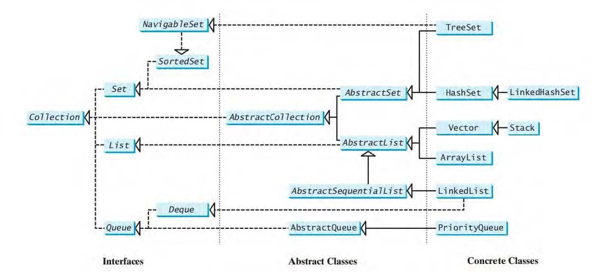

### 3.2 Tipos de contenedores

Java Collections Framework trabaja con **dos tipos principales** de contenedores:

#### 📦 Collection

**Almacena una colección de elementos individuales:**

- Cada elemento es un objeto independiente
- Ejemplos: listas de nombres, conjuntos de números, colas de tareas

#### 🗝️ Map

**Almacena una colección de parejas clave/valor:**

- Cada entrada tiene una clave única y un valor asociado
- Ejemplos: diccionarios, directorios telefónicos, configuraciones

### 3.3 Interfaces principales

#### Collection (Interfaz raíz)

Define las operaciones básicas comunes a todas las colecciones:

- `add(E e)`, `remove(Object o)`, `clear()`
- `size()`, `isEmpty()`, `contains(Object o)`
- `iterator()`, `toArray()`

#### Especializaciones principales

| Interfaz | Propósito | Permite duplicados | Ordenada | Ejemplos |
| :-- | :-- | :-- | :-- | :-- |
| **List** | Secuencia ordenada | ✅ Sí | ✅ Por inserción | ArrayList, LinkedList |
| **Set** | Elementos únicos | ❌ No | Depende implementación | HashSet, TreeSet |
| **Queue** | Cola FIFO/LIFO | ✅ Sí | ✅ Por inserción | LinkedList, PriorityQueue |

#### Cambios añadidos a partir del JDK 21

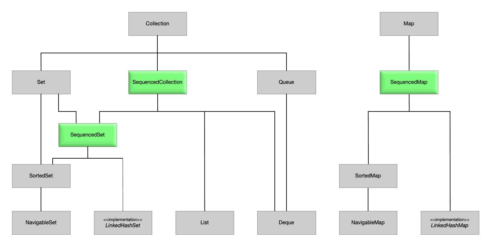

> [!NOTE]
> Todas las interfaces y clases del Java Collections Framework están en el paquete `java.util`.

## 4. Interfaz Iterable e Iterator

### 4.1 Concepto de iterador

Todas las colecciones implementan la interfaz **`Iterable<T>`**, que obliga a proporcionar un **iterador**, es decir, una estructura que permite recorrer los elementos de la colección de forma secuencial.

```java
public interface Iterable<T> {
    Iterator<T> iterator();
}
```

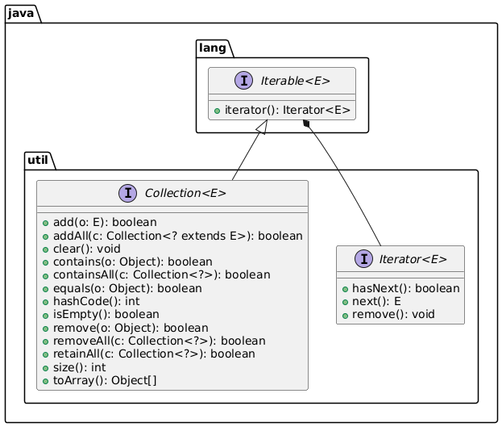

> [!IMPORTANT]
>
> Cualquier otro tipo de dato que quiera ser iterable (por ejemplo para recorrer su contenido con un for-each) debe implementar esta interfaz.

### 4.2 Uso del Iterator

El **Iterator** proporciona una forma **uniforme y segura** de recorrer cualquier colección:

**Métodos principales del Iterator:**

| Método | Descripción | Uso |
| :-- | :-- | :-- |
| `hasNext()` | ¿Hay más elementos? | `boolean hasMore = iterator.hasNext()` |
| `next()` | Obtiene el siguiente elemento | `T element = iterator.next()` |
| `remove()` | Elimina el elemento actual | `iterator.remove()` |

### 4.3 Ejemplo práctico

```java
import java.util.*;

public class EjemploIterator {
    public static void main(String[] args) {
        // Crear una lista con números
        List<Integer> numeros = List.of(1, 2, 4, 5, 1);
        
        System.out.println("=== RECORRIDO CON ITERATOR ===");
        System.out.println("Lista original: " + numeros);
        
        // Usar Iterator para recorrer
        Iterator<Integer> iterator = numeros.iterator();
        System.out.print("Elementos: ");
        while (iterator.hasNext()) {
            Integer numero = iterator.next();
            System.out.print(numero + " ");
        }
        System.out.println();
        
        // Crear lista mutable para demostrar remove()
        List<Integer> numerosMutable = new ArrayList<>(List.of(1, 2, 4, 5, 1));
        System.out.println("\nLista antes de filtrar: " + numerosMutable);
        
        // Eliminar todos los elementos iguales a 1
        Iterator<Integer> iteratorMutable = numerosMutable.iterator();
        while (iteratorMutable.hasNext()) {
            Integer numero = iteratorMutable.next();
            if (numero.equals(1)) {
                iteratorMutable.remove(); // Eliminación segura
            }
        }
        
        System.out.println("Lista después de filtrar: " + numerosMutable);
        
        // Comparar con for-each (más simple para solo lectura)
        System.out.println("\n=== RECORRIDO CON FOR-EACH ===");
        for (Integer numero : numerosMutable) {
            System.out.print(numero + " ");
        }
        System.out.println();
        // Recuerda que la estructura for-each funcionará para recorrer 
        // cualquier estructura que implemente "Iterable<T>"
    }
}
```

> [!WARNING]
> **¡Nunca modifiques una colección directamente mientras la recorres con Iterator!** Usa `iterator.remove()` para eliminaciones seguras.

**Ventajas del Iterator:**

- **🔒 Seguridad**: Evita `ConcurrentModificationException`
- **🔄 Uniformidad**: Funciona igual con todas las colecciones
- **🎯 Control**: Permite eliminaciones seguras durante el recorrido

## 5. List

### 5.1 Características de List

**List** es una interfaz que representa una **secuencia ordenada** de elementos donde:

- **📍 Mantiene el orden de inserción**: Los elementos conservan la posición en la que fueron añadidos
- **🔢 Acceso por índice**: Puedes acceder a elementos mediante su posición (0, 1, 2...)
- **✅ Permite duplicados**: El mismo elemento puede aparecer múltiples veces
- **📏 Tamaño dinámico**: Puede crecer y decrecer según necesidades

> [!IMPORTANT]
> List es una **interfaz**, no una clase. No puedes hacer `new List()`, sino que debes usar sus implementaciones como `ArrayList` o `LinkedList`.

### 5.2 Métodos específicos de List

Además de los métodos heredados de `Collection`, `List` añade métodos específicos para trabajar con índices:

| Método | Descripción | Ejemplo |
| :-- | :-- | :-- |
| `add(int index, E element)` | Inserta elemento en posición específica | `lista.add(2, "nuevo")` |
| `get(int index)` | Obtiene elemento por índice | `String elem = lista.get(1)` |
| `set(int index, E element)` | Reemplaza elemento en posición | `lista.set(0, "modificado")` |
| `remove(int index)` | Elimina elemento por posición | `lista.remove(2)` |
| `indexOf(Object o)` | Primera posición del elemento | `int pos = lista.indexOf("buscar")` |
| `lastIndexOf(Object o)` | Última posición del elemento | `int pos = lista.lastIndexOf("buscar")` |
| `subList(int from, int to)` | Sublista entre posiciones | `List<String> sub = lista.subList(1, 4)` |
| `listIterator()` | Iterator bidireccional | `ListIterator<String> it = lista.listIterator()` |

### 5.3 Clase LinkedList

**LinkedList** es una implementación de `List` basada en una **lista doblemente enlazada**:

**Métodos específicos de LinkedList:**

| Método | Descripción | Uso típico |
| :-- | :-- | :-- |
| `addFirst(E e)` | Añade al principio | Implementar pila o cola |
| `addLast(E e)` | Añade al final | Cola FIFO |
| `getFirst()` | Obtiene el primer elemento | Consultar cabeza |
| `getLast()` | Obtiene el último elemento | Consultar cola |
| `removeFirst()` | Elimina y devuelve el primero | Desencolar |
| `removeLast()` | Elimina y devuelve el último | Desapilar |

### 5.4 ArrayList vs LinkedList

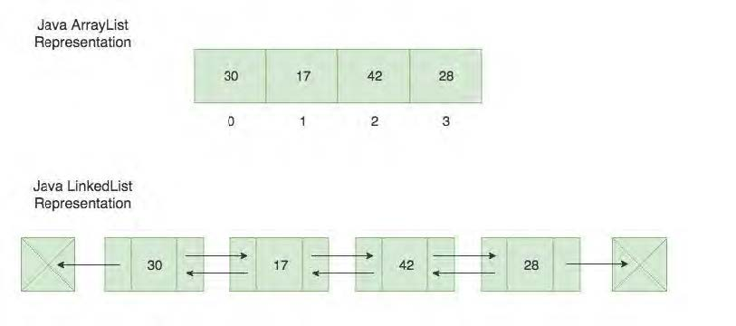

| Aspecto | ArrayList | LinkedList |
| :-- | :-- | :-- |
| **Estructura interna** | Array dinámico | Lista doblemente enlazada |
| **Acceso por índice** | O(1) - Muy rápido | O(n) - Lento |
| **Inserción al final** | O(1) amortizado | O(1) - Rápido |
| **Inserción al principio** | O(n) - Lento | O(1) - Muy rápido |
| **Inserción en medio** | O(n) - Lento | O(n) - Lento |
| **Uso de memoria** | Menos memoria | Más memoria (punteros) |
| **Mejor para** | Acceso frecuente por índice | Inserciones/eliminaciones frecuentes |

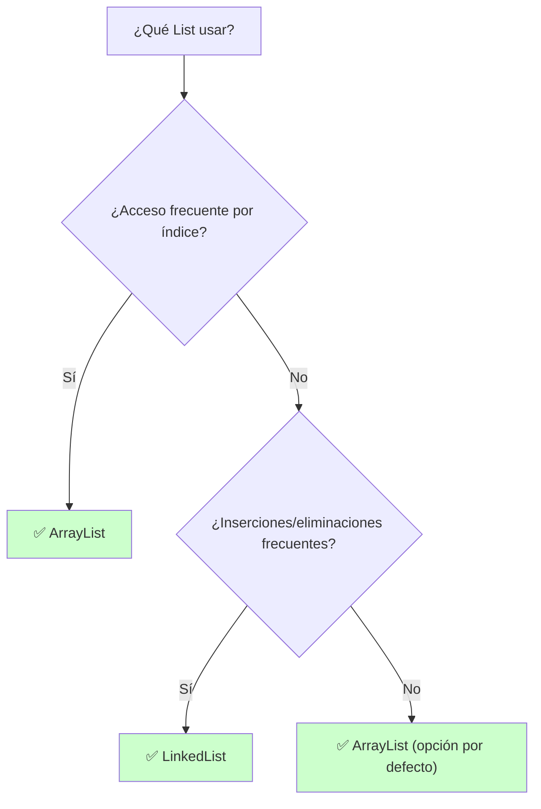

### 5.5 Práctica 1: Comparación de rendimiento

**Objetivo:** Comparar el rendimiento de ArrayList y LinkedList en diferentes operaciones.

<details>
<summary>💻 Ver solución</summary>

```java
import java.util.*;

public class ComparacionRendimientoListas {
    private static final int ELEMENTOS = 100000;
    
    public static void main(String[] args) {
        ComparacionRendimientoListas programa = new ComparacionRendimientoListas();
        programa.inicio();
    }
    
    public void inicio() {
        System.out.println("=== COMPARACIÓN DE RENDIMIENTO: ArrayList vs LinkedList ===");
        System.out.println("Número de elementos: " + ELEMENTOS);
        
        // Test 1: Inserción al final
        compararInsercionAlFinal();
        
        // Test 2: Inserción al principio  
        compararInsercionAlPrincipio();
        
        // Test 3: Acceso por índice
        compararAccesoPorIndice();
        
        // Test 4: Búsqueda de elemento
        compararBusqueda();
    }
    
    private void compararInsercionAlFinal() {
        System.out.println("\n--- Test 1: Inserción al final ---");
        
        // ArrayList
        long inicio = System.currentTimeMillis();
        List<Integer> arrayList = new ArrayList<>();
        for (int i = 0; i < ELEMENTOS; i++) {
            arrayList.add(i);
        }
        long tiempoArrayList = System.currentTimeMillis() - inicio;
        
        // LinkedList
        inicio = System.currentTimeMillis();
        List<Integer> linkedList = new LinkedList<>();
        for (int i = 0; i < ELEMENTOS; i++) {
            linkedList.add(i);
        }
        long tiempoLinkedList = System.currentTimeMillis() - inicio;
        
        System.out.println("ArrayList: " + tiempoArrayList + " ms");
        System.out.println("LinkedList: " + tiempoLinkedList + " ms");
        System.out.println("Ganador: " + (tiempoArrayList < tiempoLinkedList ? "ArrayList" : "LinkedList"));
    }
    
    private void compararInsercionAlPrincipio() {
        System.out.println("\n--- Test 2: Inserción al principio ---");
        
        // ArrayList (más lento por desplazamiento)
        long inicio = System.currentTimeMillis();
        List<Integer> arrayList = new ArrayList<>();
        for (int i = 0; i < ELEMENTOS / 10; i++) { // Menos elementos para que no tarde mucho
            arrayList.add(0, i);
        }
        long tiempoArrayList = System.currentTimeMillis() - inicio;
        
        // LinkedList (más rápido)
        inicio = System.currentTimeMillis();
        List<Integer> linkedList = new LinkedList<>();
        for (int i = 0; i < ELEMENTOS / 10; i++) {
            linkedList.add(0, i);
        }
        long tiempoLinkedList = System.currentTimeMillis() - inicio;
        
        System.out.println("ArrayList: " + tiempoArrayList + " ms");
        System.out.println("LinkedList: " + tiempoLinkedList + " ms");
        System.out.println("Ganador: " + (tiempoArrayList < tiempoLinkedList ? "ArrayList" : "LinkedList"));
    }
    
    private void compararAccesoPorIndice() {
        System.out.println("\n--- Test 3: Acceso por índice ---");
        
        // Preparar listas
        List<Integer> arrayList = new ArrayList<>();
        List<Integer> linkedList = new LinkedList<>();
        
        for (int i = 0; i < ELEMENTOS; i++) {
            arrayList.add(i);
            linkedList.add(i);
        }
        
        // ArrayList - acceso aleatorio
        long inicio = System.currentTimeMillis();
        Random random = new Random(42); // Semilla fija para reproducibilidad
        for (int i = 0; i < 10000; i++) {
            int indice = random.nextInt(ELEMENTOS);
            arrayList.get(indice);
        }
        long tiempoArrayList = System.currentTimeMillis() - inicio;
        
        // LinkedList - acceso aleatorio
        inicio = System.currentTimeMillis();
        random = new Random(42); // Misma semilla
        for (int i = 0; i < 10000; i++) {
            int indice = random.nextInt(ELEMENTOS);
            linkedList.get(indice);
        }
        long tiempoLinkedList = System.currentTimeMillis() - inicio;
        
        System.out.println("ArrayList: " + tiempoArrayList + " ms");
        System.out.println("LinkedList: " + tiempoLinkedList + " ms");
        System.out.println("Ganador: " + (tiempoArrayList < tiempoLinkedList ? "ArrayList" : "LinkedList"));
    }
    
    private void compararBusqueda() {
        System.out.println("\n--- Test 4: Búsqueda de elemento ---");
        
        // Preparar listas
        List<Integer> arrayList = new ArrayList<>();
        List<Integer> linkedList = new LinkedList<>();
        
        for (int i = 0; i < ELEMENTOS; i++) {
            arrayList.add(i);
            linkedList.add(i);
        }
        
        // ArrayList - búsqueda
        long inicio = System.currentTimeMillis();
        for (int i = 0; i < 1000; i++) {
            arrayList.contains(ELEMENTOS - 1); // Buscar el último elemento
        }
        long tiempoArrayList = System.currentTimeMillis() - inicio;
        
        // LinkedList - búsqueda
        inicio = System.currentTimeMillis();
        for (int i = 0; i < 1000; i++) {
            linkedList.contains(ELEMENTOS - 1);
        }
        long tiempoLinkedList = System.currentTimeMillis() - inicio;
        
        System.out.println("ArrayList: " + tiempoArrayList + " ms");
        System.out.println("LinkedList: " + tiempoLinkedList + " ms");
        System.out.println("Ganador: " + (tiempoArrayList < tiempoLinkedList ? "ArrayList" : "LinkedList"));
        
        System.out.println("\n=== CONCLUSIÓN ===");
        System.out.println("- ArrayList: Mejor para acceso por índice y uso general");
        System.out.println("- LinkedList: Mejor para inserciones/eliminaciones frecuentes al principio");
    }
}
```

</details>

## 6. Estructura Stack (Pila)

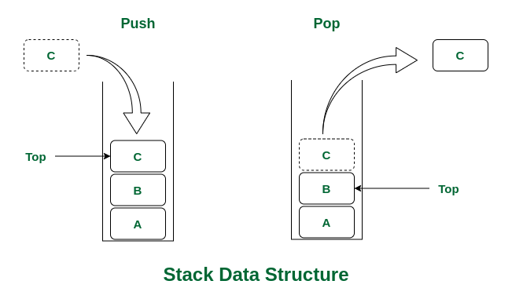

### 6.1 Concepto LIFO

**Stack** es una clase que implementa una estructura de datos **LIFO** (Last In, First Out - Último en entrar, Primero en salir), similar a una pila de platos.

### 6.2 Métodos principales

| Método | Descripción | Equivalente en List |
| :-- | :-- | :-- |
| `push(E item)` | Coloca elemento en la cima | `add(item)` |
| `pop()` | Elimina y devuelve elemento de la cima | `remove(size()-1)` |
| `peek()` | Consulta elemento de la cima sin eliminarlo | `get(size()-1)` |
| `empty()` | ¿Está vacía la pila? | `isEmpty()` |
| `search(Object o)` | Posición del elemento desde la cima | - |

> [!NOTE]
> Stack hereda de la clase `Vector`, que a su vez hereda de `List`. Por tanto, Stack tiene todos los métodos de List, aunque no es recomendable usarlos para mantener la semántica de pila.

### 6.3 Ejemplo práctico

```java
import java.util.Stack;

public class EjemploStack {
    public static void main(String[] args) {
        EjemploStack programa = new EjemploStack();
        programa.inicio();
    }
    
    public void inicio() {
        Stack<String> pila = new Stack<>();
        
        System.out.println("=== OPERACIONES CON STACK ===");
        
        // Apilar elementos
        System.out.println("\nApilando elementos:");
        pila.push("Primer elemento");
        System.out.println("Apilado: " + pila.peek() + " | Pila: " + pila);
        
        pila.push("Segundo elemento");
        System.out.println("Apilado: " + pila.peek() + " | Pila: " + pila);
        
        pila.push("Tercer elemento");
        System.out.println("Apilado: " + pila.peek() + " | Pila: " + pila);
        
        // Consultar cima
        System.out.println("\nElemento en la cima (peek): " + pila.peek());
        System.out.println("Pila después de peek: " + pila);
        
        // Desapilar elementos
        System.out.println("\nDesapilando elementos:");
        while (!pila.empty()) {
            String elemento = pila.pop();
            System.out.println("Desapilado: " + elemento + " | Pila restante: " + pila);
        }
        
        // Ejemplo práctico: Verificar paréntesis balanceados
        System.out.println("\n=== VERIFICAR PARÉNTESIS BALANCEADOS ===");
        String[] expresiones = {"(a+b)", "((a+b)", "(a+b))", "((a+b)+(c+d))", ")"};
        
        for (String expresion : expresiones) {
            boolean balanceado = verificarParentesis(expresion);
            System.out.println(expresion + " → " + (balanceado ? "✅ Balanceado" : "❌ No balanceado"));
        }
    }
    
    public boolean verificarParentesis(String expresion) {
        Stack<Character> pila = new Stack<>();
        
        for (char caracter : expresion.toCharArray()) {
            if (caracter == '(') {
                pila.push(caracter);
            } else if (caracter == ')') {
                if (pila.empty()) {
                    return false; // Paréntesis de cierre sin apertura
                }
                pila.pop();
            }
        }
        
        return pila.empty(); // Debe quedar vacía si está balanceado
    }
}
```

**Casos de uso típicos de Stack:**

- **🔍 Parseo de expresiones**: Verificar paréntesis, llaves, corchetes balanceados
- **↩️ Funcionalidad "Deshacer"**: Guardar estados previos de una aplicación
- **🧮 Evaluación de expresiones**: Notación polaca inversa
- **🔄 Recursión simulada**: Convertir algoritmos recursivos en iterativos

## 7. Interfaz Queue (Cola)

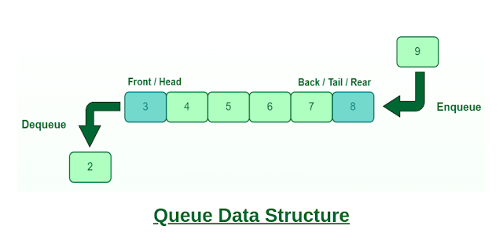

### 7.1 Concepto FIFO

**Queue** es una interfaz que representa una estructura de datos **FIFO** (First In, First Out - Primero en entrar, Primero en salir), como una cola de personas.

### 7.2 Implementación con LinkedList

Java no tiene una clase `Queue` instanciable directamente. En su lugar, **LinkedList** implementa la interfaz Queue, por lo que podemos usarla como una cola:

```java
Queue<String> cola = new LinkedList<>();
```

### 7.3 Métodos de Queue

### Métodos que lanzan excepción

| Método      | Descripción     | Excepción si falla |
| ----------- | --------------- | ------------------ |
| `add(e)`    | Añade elemento  | Si no puede añadi  |
| `remove()`  | Elimina cabeza  | Si está vacía      |
| `element()` | Consulta cabeza | Si está vacía      |

---

### Métodos que no lanzan excepción

| Método     | Descripción     | Valor especial si falla |
| ---------- | --------------- | ----------------------- |
| `offer(e)` | Añade elemento  | `false` si no puede     |
| `poll()`   | Elimina cabeza  | `null` si está vacía    |
| `peek()`   | Consulta cabeza | `null` si está vacía    |


> [!TIP]
> **Recomendación:** Usa `offer()`, `poll()` y `peek()` en lugar de `add()`, `remove()` y `element()` para evitar excepciones.

### 7.4 Ejemplo práctico

```java
import java.util.*;

public class EjemploQueue {
    public static void main(String[] args) {
        EjemploQueue programa = new EjemploQueue();
        programa.inicio();
    }
    
    public void inicio() {
        Queue<String> cola = new LinkedList<>();
        
        System.out.println("=== OPERACIONES CON QUEUE ===");
        
        // Encolar elementos (FIFO)
        System.out.println("\nEncolando elementos:");
        cola.offer("Primer cliente");
        System.out.println("Encolado: " + cola.peek() + " | Cola: " + cola);
        
        cola.offer("Segundo cliente");
        System.out.println("Encolado: Segundo cliente | Cola: " + cola);
        
        cola.offer("Tercer cliente");
        System.out.println("Encolado: Tercer cliente | Cola: " + cola);
        
        cola.offer("Cuarto cliente");
        System.out.println("Encolado: Cuarto cliente | Cola: " + cola);
        
        // Consultar siguiente sin eliminar
        System.out.println("\nSiguiente en la cola (peek): " + cola.peek());
        System.out.println("Cola después de peek: " + cola);
        
        // Desencolar elementos
        System.out.println("\nDesencolando elementos:");
        while (!cola.isEmpty()) {
            String cliente = cola.poll();
            System.out.println("Atendido: " + cliente + " | Cola restante: " + cola);
        }
        
        // Demostrar comportamiento seguro con cola vacía
        System.out.println("\n=== OPERACIONES EN COLA VACÍA ===");
        System.out.println("poll() en cola vacía: " + cola.poll()); // null
        System.out.println("peek() en cola vacía: " + cola.peek()); // null
        
        // Ejemplo práctico: Sistema de atención al cliente
        System.out.println("\n=== SIMULADOR DE ATENCIÓN AL CLIENTE ===");
        simularAtencionAlCliente();
    }
    
    public void simularAtencionAlCliente() {
        Queue<String> colaAtencion = new LinkedList<>();
        String[] clientes = {"Ana García", "Carlos López", "María Rodríguez", "Juan Martín", "Laura Sánchez"};
        
        // Los clientes llegan
        System.out.println("📋 Clientes llegando:");
        for (String cliente : clientes) {
            colaAtencion.offer(cliente);
            System.out.println("   " + cliente + " entra en la cola. Posición en cola: " + colaAtencion.size());
        }
        
        System.out.println("\n🏢 Estado de la cola: " + colaAtencion);
        System.out.println("👥 Total de clientes esperando: " + colaAtencion.size());
        
        // Atender clientes
        System.out.println("\n🎯 Comenzando atención:");
        int numeroVentanilla = 1;
        while (!colaAtencion.isEmpty()) {
            String clienteAtendido = colaAtencion.poll();
            System.out.printf("   Ventanilla %d: Atendiendo a %s (quedan %d en cola)%n", 
                            numeroVentanilla++, clienteAtendido, colaAtencion.size());
            
            // Simular tiempo de atención
            try {
                Thread.sleep(500); // Pausa de medio segundo
            } catch (InterruptedException e) {
                Thread.currentThread().interrupt();
            }
        }
        
        System.out.println("\n✅ Todos los clientes han sido atendidos.");
    }
}
```

**Casos de uso típicos de Queue:**

- **🏢 Sistemas de atención**: Colas de espera, turnos
- **🖥️ Procesamiento de tareas**: Cola de trabajos en impresoras, servidores
- **🎮 Algoritmos de grafos**: Búsqueda en anchura (BFS)
- **📊 Simulaciones**: Modelar sistemas de espera y atención

## 8. PriorityQueue (Cola de prioridad)

### 8.1 Concepto y funcionamiento

**PriorityQueue** es una cola donde los elementos se procesan según su **prioridad** en lugar del orden de llegada. Los elementos con mayor prioridad salen primero.

### 8.2 Orden natural vs Comparator

**Orden natural (elementos Comparable):**

```java
PriorityQueue<Integer> colaPrioridad = new PriorityQueue<>();
colaPrioridad.offer(10);
colaPrioridad.offer(5);
colaPrioridad.offer(20);
colaPrioridad.offer(1);

// Salida: 1, 5, 10, 20 (menor a mayor)
```

**Orden personalizado (con Comparator):**

```java
// Prioridad inversa (mayor a menor)
PriorityQueue<Integer> colaInversa = new PriorityQueue<>(Collections.reverseOrder());
```

```java
//Comparador personalizado
import java.util.Comparator;
import java.util.PriorityQueue;

public class ComparadorPorLongitud implements Comparator<String> {
    @Override
    public int compare(String s1, String s2) {
        return Integer.compare(s1.length(), s2.length());
    }
}

public class EjemploPriorityQueue {
    public static void main(String[] args) {
        Comparator<String> comparador = new ComparadorPorLongitud();
        PriorityQueue<String> colaPorLongitud = new PriorityQueue<>(comparador);

        colaPorLongitud.add("zanahoria");
        colaPorLongitud.add("kiwi");
        colaPorLongitud.add("manzana");

        while (!colaPorLongitud.isEmpty()) {
            System.out.println(colaPorLongitud.poll());
        }
    }
}
```

> [!IMPORTANT]
> **PriorityQueue NO mantiene todos los elementos ordenados internamente**. Solo garantiza que el elemento de mayor prioridad esté en la cabeza. Para recorrer todos los elementos ordenados, debes usar `poll()` repetidamente.

## 9. Set (Conjunto)

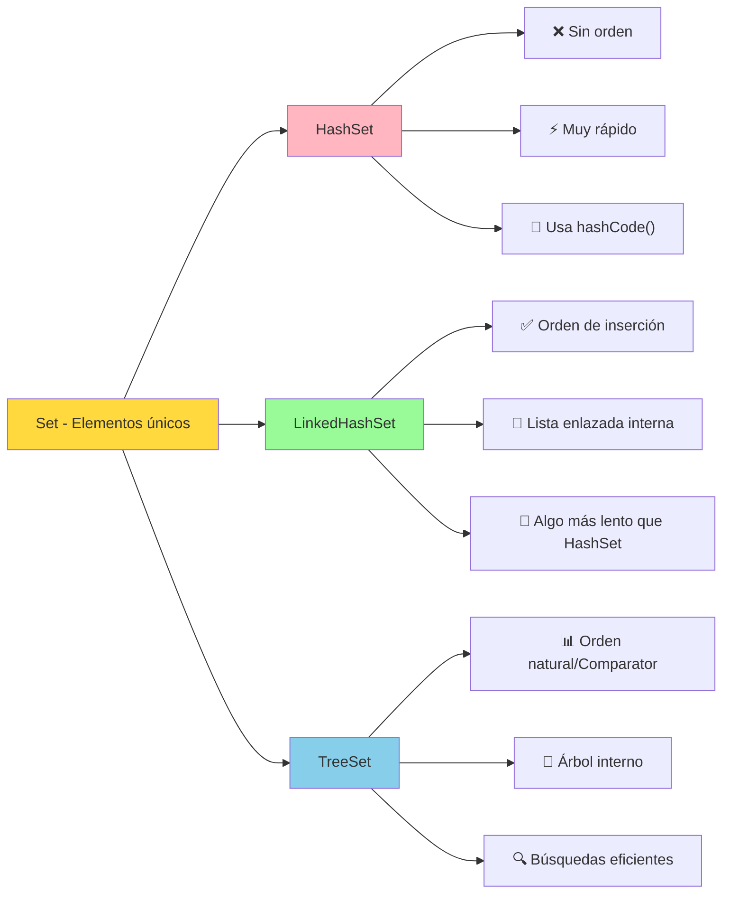

### 9.1 Características de Set

**Set** es una interfaz que representa una **colección de elementos únicos** - no permite duplicados.

**Características principales:**

- **🚫 Sin duplicados**: No puede contener dos elementos `e1` y `e2` tales que `e1.equals(e2)` sea `true`
- **📊 Implementa Collection**: Hereda todos los métodos básicos
- **🔍 Verificación automática**: Al añadir elementos, verifica automáticamente la unicidad

> [!CAUTION]
> **MUY IMPORTANTE:** Java no siempre sabe si dos elementos son iguales. El criterio lo define el programador mediante el método `equals()`

**Métodos más importantes:**

| Método                            | Descripción                                                    |
| --------------------------------- | -------------------------------------------------------------- |
| `add(E e)`                        | Añade un elemento al conjunto                                  |
| `remove(Object o)`                | Elimina el elemento especificado                               |
| `contains(Object o)`              | Devuelve `true` si el conjunto contiene el elemento            |
| `isEmpty()`                       | Devuelve `true` si el conjunto está vacío                      |
| `size()`                          | Devuelve el número de elementos                                |
| `clear()`                         | Elimina todos los elementos del conjunto                       |
| `iterator()`                      | Devuelve un iterador para recorrer el conjunto                 |
| `toArray()`                       | Devuelve un array con los elementos del conjunto               |
| `addAll(Collection<? extends E>)` | Añade todos los elementos de otra colección al conjunto        |
| `retainAll(Collection<?>)`        | Mantiene solo los elementos presentes en la colección dada     |
| `removeAll(Collection<?>)`        | Elimina todos los elementos presentes en la colección dada     |
| `containsAll(Collection<?>)`      | Comprueba si contiene todos los elementos de la colección dada |

### 9.2 HashSet

**HashSet** utiliza una **tabla hash** para almacenar elementos, ofreciendo operaciones muy rápidas:

**Características:**

- **⚡ Operaciones O(1)**: add, remove, contains en promedio
- **❌ Sin orden garantizado**: Los elementos no mantienen ningún orden específico
- **🔑 Basado en hashCode()**: Usa `hashCode()` y `equals()` para determinar unicidad

```java
import java.util.*;

public class EjemploHashSet {
    public static void main(String[] args) {
        Set<String> ciudades = new HashSet<>();
        
        // Añadir elementos
        ciudades.add("Madrid");
        ciudades.add("Barcelona");
        ciudades.add("Valencia");
        ciudades.add("Madrid"); // Duplicado - no se añade
        
        System.out.println("HashSet: " + ciudades); // Orden impredecible
        System.out.println("Tamaño: " + ciudades.size()); // 3, no 4
        
        // Verificar existencia
        System.out.println("¿Contiene Madrid? " + ciudades.contains("Madrid"));
    }
}
```

> [!NOTE]
>
> Cuando se añade un elemento a un `HashSet`, primero se invoca su método `hashCode()` para determinar en qué "casilla" de la tabla hash debería colocarse.
>
> Si el `hashCode` no coincide con el de ningún elemento ya presente, el `HashSet` asume que el nuevo objeto es diferente y no necesita comprobar nada más. Solo si el `hashCode` coincide con el de otro elemento (lo que se conoce como colisión), entonces se invoca `equals()` para verificar si realmente son iguales.
>
> Por eso, `hashCode()` se ejecuta antes que `equals()`, y un `hashCode` distinto ya es suficiente para que el objeto se considere único en la colección.

### 9.3 LinkedHashSet

**LinkedHashSet** combina la rapidez de HashSet con el mantenimiento del **orden de inserción**:

```java
import java.util.*;

public class EjemploLinkedHashSet {
    public static void main(String[] args) {
        Set<String> ciudades = new LinkedHashSet<>();
        
        ciudades.add("Madrid");
        ciudades.add("Barcelona");
        ciudades.add("Valencia");
        ciudades.add("Madrid"); // Duplicado - no se añade
        
        System.out.println("LinkedHashSet: " + ciudades); 
        // Salida: [Madrid, Barcelona, Valencia] - orden de inserción mantenido
    }
}
```

### 9.4 TreeSet

**TreeSet** mantiene los elementos **ordenados automáticamente** (sorted) usando orden natural o un Comparator:

```java
import java.util.*;

public class EjemploTreeSet {
    public static void main(String[] args) {
        Set<String> ciudades = new TreeSet<>();
        
        ciudades.add("Madrid");
        ciudades.add("Barcelona");
        ciudades.add("Valencia");
        ciudades.add("Alicante");
        
        System.out.println("TreeSet: " + ciudades);
        // Salida: [Alicante, Barcelona, Madrid, Valencia] - orden alfabético
        
        // Métodos específicos de TreeSet
        TreeSet<String> treeSet = (TreeSet<String>) ciudades;
        System.out.println("Primera ciudad: " + treeSet.first());
        System.out.println("Última ciudad: " + treeSet.last());
        System.out.println("Ciudades antes de 'Madrid': " + treeSet.headSet("Madrid"));
        System.out.println("Ciudades desde 'Madrid': " + treeSet.tailSet("Madrid"));
    }
}
```

**Métodos más importantes:**

| Método específico      | Descripción                                                                 |
| ---------------------- | --------------------------------------------------------------------------- |
| `first()`              | Devuelve el menor elemento                                                  |
| `last()`               | Devuelve el mayor elemento                                                  |
| `ceiling(E e)`         | Devuelve el menor elemento ≥ `e`, o `null` si no existe                     |
| `floor(E e)`           | Devuelve el mayor elemento ≤ `e`, o `null` si no existe                     |
| `higher(E e)`          | Devuelve el menor elemento estrictamente mayor que `e`                      |
| `lower(E e)`           | Devuelve el mayor elemento estrictamente menor que `e`                      |
| `subSet(E from, E to)` | Devuelve una vista del conjunto entre `from` (inclusive) y `to` (exclusive) |
| `headSet(E to)`        | Devuelve una vista de los elementos menores que `to`                        |
| `tailSet(E from)`      | Devuelve una vista de los elementos mayores o iguales a `from`              |
| `comparator()`         | Devuelve el comparador usado o `null` si usa orden natural                  |

### 9.5 Comparación de implementaciones

| Característica                      | **HashSet**               | **LinkedHashSet**         | **TreeSet**                            |
| ----------------------------------- | ------------------------- | ------------------------- | -------------------------------------- |
| **Orden (ordered)**                 | ❌ No mantiene orden       | ✅ Orden de inserción      | ✅ Orden interno consistente            |
| **Clasificación (sorted)**          | ❌ No clasifica            | ❌ No clasifica            | ✅ Ordenado por Comparable o Comparator |
| **Rendimiento add/remove/contains** | O(1)                      | O(1)                      | O(log n)                               |
| **Memoria**                         | 🟢 Baja                   | 🟡 Media                  | 🔴 Alta                                |
| **Requisitos de elementos**         | `hashCode()` y `equals()` | `hashCode()` y `equals()` | `Comparable` o `Comparator`            |
| **Mejor para**                      | Máximo rendimiento        | Orden predecible          | Datos clasificados automáticamente        |

### 9.6 Práctica 2: Experimentación con Sets

**Objetivo:** Experimentar con diferentes tipos de Set para comprender sus comportamientos.

<details>
<summary>💻 Ver solución</summary>

```java
import java.util.*;

public class ExperimentacionSets {
    public static void main(String[] args) {
        ExperimentacionSets programa = new ExperimentacionSets();
        programa.inicio();
    }
    
    public void inicio() {
        System.out.println("=== EXPERIMENTACIÓN CON SETS ===");
        
        // Datos de prueba
        String[] lenguajes = {"Java", "Python", "C++", "JavaScript", "Python", "Java", "Go", "Rust"};
        
        System.out.println("Datos originales: " + Arrays.toString(lenguajes));
        System.out.println("(Nota: Hay duplicados)");
        
        // Test con HashSet
        testHashSet(lenguajes);
        
        // Test con LinkedHashSet
        testLinkedHashSet(lenguajes);
        
        // Test con TreeSet
        testTreeSet(lenguajes);
        
        // Comparación de rendimiento
        compararRendimiento();
        
        // Operaciones de conjuntos
        operacionesConjuntos();
    }
    
    private void testHashSet(String[] datos) {
        System.out.println("\n--- HASHSET ---");
        Set<String> hashSet = new HashSet<>();
        
        for (String lenguaje : datos) {
            boolean añadido = hashSet.add(lenguaje);
            System.out.println("Añadiendo '" + lenguaje + "': " + 
                             (añadido ? "✅ Nuevo" : "❌ Duplicado"));
        }
        
        System.out.println("HashSet final: " + hashSet);
        System.out.println("Tamaño: " + hashSet.size());
        System.out.println("Orden: Impredecible");
    }
    
    private void testLinkedHashSet(String[] datos) {
        System.out.println("\n--- LINKEDHASHSET ---");
        Set<String> linkedHashSet = new LinkedHashSet<>();
        
        for (String lenguaje : datos) {
            linkedHashSet.add(lenguaje);
        }
        
        System.out.println("LinkedHashSet: " + linkedHashSet);
        System.out.println("Tamaño: " + linkedHashSet.size());
        System.out.println("Orden: Inserción (sin duplicados)");
    }
    
    private void testTreeSet(String[] datos) {
        System.out.println("\n--- TREESET ---");
        Set<String> treeSet = new TreeSet<>();
        
        for (String lenguaje : datos) {
            treeSet.add(lenguaje);
        }
        
        System.out.println("TreeSet: " + treeSet);
        System.out.println("Tamaño: " + treeSet.size());
        System.out.println("Orden: Alfabético");
        
        // Métodos específicos de TreeSet
        TreeSet<String> ts = (TreeSet<String>) treeSet;
        System.out.println("Primer elemento: " + ts.first());
        System.out.println("Último elemento: " + ts.last());
        System.out.println("Elementos menores que 'Java': " + ts.headSet("Java"));
        System.out.println("Elementos desde 'Java': " + ts.tailSet("Java"));
    }
    
    private void compararRendimiento() {
        System.out.println("\n=== COMPARACIÓN DE RENDIMIENTO ===");
        int elementos = 100000;
        
        // HashSet
        long inicio = System.currentTimeMillis();
        Set<Integer> hashSet = new HashSet<>();
        for (int i = 0; i < elementos; i++) {
            hashSet.add(i);
        }
        long tiempoHashSet = System.currentTimeMillis() - inicio;
        
        // LinkedHashSet
        inicio = System.currentTimeMillis();
        Set<Integer> linkedHashSet = new LinkedHashSet<>();
        for (int i = 0; i < elementos; i++) {
            linkedHashSet.add(i);
        }
        long tiempoLinkedHashSet = System.currentTimeMillis() - inicio;
        
        // TreeSet
        inicio = System.currentTimeMillis();
        Set<Integer> treeSet = new TreeSet<>();
        for (int i = 0; i < elementos; i++) {
            treeSet.add(i);
        }
        long tiempoTreeSet = System.currentTimeMillis() - inicio;
        
        System.out.println("Tiempo de inserción de " + elementos + " elementos:");
        System.out.println("  HashSet: " + tiempoHashSet + " ms");
        System.out.println("  LinkedHashSet: " + tiempoLinkedHashSet + " ms");
        System.out.println("  TreeSet: " + tiempoTreeSet + " ms");
    }
    
    private void operacionesConjuntos() {
        System.out.println("\n=== OPERACIONES DE CONJUNTOS ===");
        
        Set<String> grupoA = new HashSet<>(Arrays.asList("Ana", "Juan", "María", "Carlos"));
        Set<String> grupoB = new HashSet<>(Arrays.asList("María", "Luis", "Ana", "Elena"));
        
        System.out.println("Grupo A: " + grupoA);
        System.out.println("Grupo B: " + grupoB);
        
        // Unión
        Set<String> union = new HashSet<>(grupoA);
        union.addAll(grupoB);
        System.out.println("Unión (A ∪ B): " + union);
        
        // Intersección
        Set<String> interseccion = new HashSet<>(grupoA);
        interseccion.retainAll(grupoB);
        System.out.println("Intersección (A ∩ B): " + interseccion);
        
        // Diferencia
        Set<String> diferencia = new HashSet<>(grupoA);
        diferencia.removeAll(grupoB);
        System.out.println("Diferencia (A - B): " + diferencia);
        
        // Diferencia simétrica
        Set<String> diferenciaSimetrica = new HashSet<>(union);
        diferenciaSimetrica.removeAll(interseccion);
        System.out.println("Diferencia simétrica (A Δ B): " + diferenciaSimetrica);
    }
}
```

</details>

## 10. Map (Mapas)

### 10.1 Concepto de clave-valor

**Map** es una interfaz que representa una **colección de pares clave-valor**, técnicamente, un **conjunto de entradas (Map.Entry)**, donde cada clave es única y está asociada con un valor.

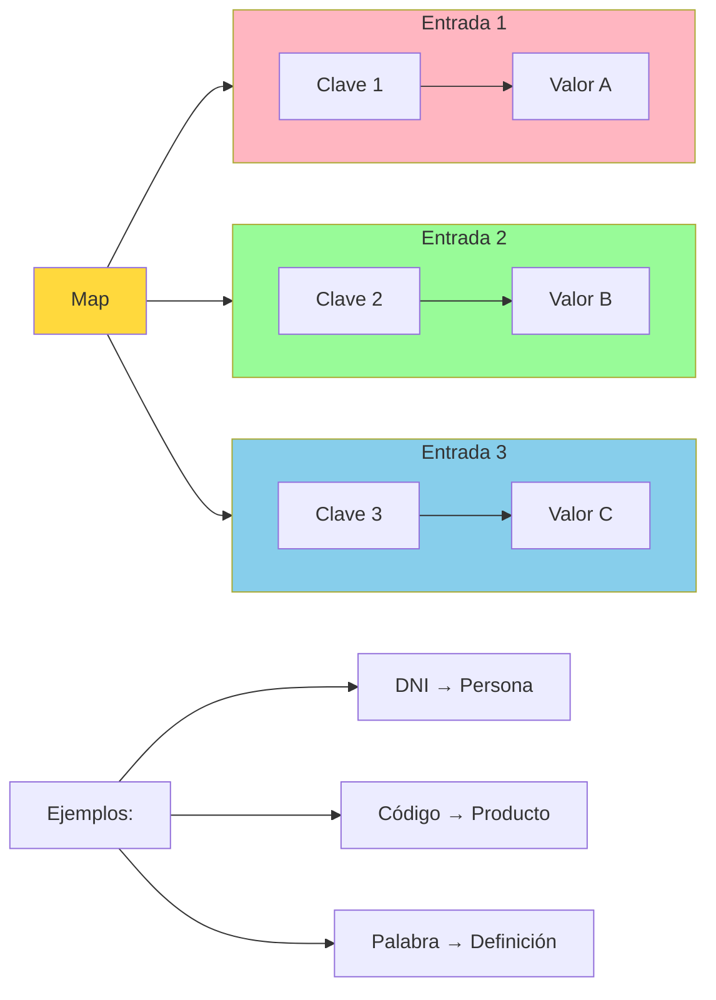

**Características principales:**

- **🔑 Claves únicas**: No puede haber claves duplicadas
- **🎯 Acceso directo**: Acceso rápido a valores mediante su clave
- **🔄 Valores duplicados**: Los valores sí pueden repetirse
- **❌ No es Collection**: Map no extiende la interfaz Collection

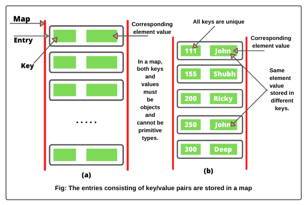

### 10.2 Interfaz Map y Entry

#### Interfaz `Map<K,V>`

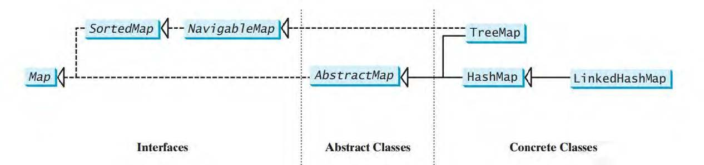

**Métodos principales de Map:**

| Método | Descripción | Ejemplo |
| :-- | :-- | :-- |
| `put(K key, V value)` | Asocia valor con clave (si ya existe la clave, actualiza el valor) | `mapa.put("ES", "España")` |
| `putIfAbsent(K key, V value)` | Asocia valor con clave (Si ya existe la clave, no modifica nada) | `mapa.putIfAbsent("ES", "Eslovenia")` |
| `get(Object key)` | Obtiene valor por clave | `String pais = mapa.get("ES")` |
| `remove(Object key)` | Elimina entrada por clave | `mapa.remove("ES")` |
| `containsKey(Object key)` | ¿Existe la clave? | `boolean existe = mapa.containsKey("ES")` |
| `containsValue(Object value)` | ¿Existe el valor? | `boolean existe = mapa.containsValue("España")` |
| `keySet()` | Conjunto de claves | `Set<String> claves = mapa.keySet()` |
| `values()` | Colección de valores | `Collection<String> valores = mapa.values()` |
| `entrySet()` | Conjunto de pares clave-valor | `Set<Map.Entry<String,String>> entradas = mapa.entrySet()` |

#### Interfaz `Map.Entry<K,V>`

**Map.Entry** es una **interfaz anidada** dentro de Map que representa una **entrada individual** del mapa, es decir, un par clave-valor específico.

Cada elemento de un Map es técnicamente una **entrada** (Entry) que contiene:

- **Una clave única** (key)
- **Un valor asociado** (value)

**Métodos principales:**

| Método | Descripción | Ejemplo |
| :-- | :-- | :-- |
| `K getKey()` | Devuelve la clave de la entrada | `String clave = entry.getKey()` |
| `V getValue()` | Devuelve el valor de la entrada | `Integer valor = entry.getValue()` |
| `V setValue(V value)` | Establece un nuevo valor y devuelve el anterior | `Integer anterior = entry.setValue(30)` |
| `boolean equals(Object o)` | Compara con otra entrada | `boolean iguales = entry.equals(otra)` |
| `int hashCode()` | Código hash de la entrada | `int hash = entry.hashCode()` |

**Obtención de Map.Entry:**

Las entradas se obtienen principalmente através del método `entrySet()` del Map:

```java
Map<String, Integer> edades = new HashMap<>();
edades.put("Ana", 25);
edades.put("Juan", 30);
edades.put("María", 28);

// Obtener el conjunto de entradas
Set<Map.Entry<String, Integer>> entradas = edades.entrySet();
```

<details>
<summary>Ejemplos de código</summary>

#### Iteración con Map.Entry

```java
import java.util.*;

public class EjemploMapEntry {
    public static void main(String[] args) {
        Map<String, Double> notas = new HashMap<>();
        notas.put("Matemáticas", 8.5);
        notas.put("Historia", 7.2);
        notas.put("Inglés", 9.1);
        notas.put("Física", 6.8);
        
        System.out.println("=== RECORRIDO CON MAP.ENTRY ===");
        
        // Forma más eficiente de recorrer un Map
        for (Map.Entry<String, Double> entrada : notas.entrySet()) {
            String asignatura = entrada.getKey();
            Double nota = entrada.getValue();
            
            System.out.println(asignatura + ": " + nota);
            
            // Ejemplo de modificación durante la iteración
            if (nota < 7.0) {
                entrada.setValue(nota + 0.5); // Subir nota
                System.out.println("  ↑ Nota subida a: " + entrada.getValue());
            }
        }
        
        System.out.println("\nMapa después de las modificaciones: " + notas);
    }
}
```


#### Operaciones con Map.Entry

```java
public class OperacionesMapEntry {
    public static void main(String[] args) {
        Map<String, Integer> inventario = new HashMap<>();
        inventario.put("Manzanas", 50);
        inventario.put("Peras", 30);
        inventario.put("Naranjas", 25);
        inventario.put("Plátanos", 40);
        
        System.out.println("=== ANÁLISIS DE INVENTARIO ===");
        
        // Encontrar el producto con más stock
        Map.Entry<String, Integer> mayorStock = null;
        for (Map.Entry<String, Integer> entrada : inventario.entrySet()) {
            if (mayorStock == null || entrada.getValue() > mayorStock.getValue()) {
                mayorStock = entrada;
            }
        }
        
        if (mayorStock != null) {
            System.out.println("Producto con mayor stock: " + 
                             mayorStock.getKey() + " (" + mayorStock.getValue() + " unidades)");
        }
        
        // Filtrar productos con stock bajo
        System.out.println("\nProductos con stock bajo (< 35):");
        for (Map.Entry<String, Integer> entrada : inventario.entrySet()) {
            if (entrada.getValue() < 35) {
                System.out.println("  " + entrada.getKey() + ": " + entrada.getValue() + " unidades");
            }
        }
        
        // Reabastecer productos con stock bajo
        System.out.println("\n--- Reabastecimiento ---");
        for (Map.Entry<String, Integer> entrada : inventario.entrySet()) {
            if (entrada.getValue() < 35) {
                int stockAnterior = entrada.getValue();
                entrada.setValue(50); // Reabastecer a 50 unidades
                System.out.println(entrada.getKey() + ": " + stockAnterior + " → " + entrada.getValue());
            }
        }
        
        System.out.println("\nInventario final: " + inventario);
    }
}
```
</details>

#### Ventajas de usar Map.Entry

**🚀 Eficiencia:**

- **Una sola iteración**: Obtienes clave y valor juntos
- **Sin búsquedas adicionales**: No necesitas llamar a `get(key)` por cada clave

```java
// ❌ Menos eficiente - dos operaciones por elemento
for (String clave : mapa.keySet()) {
    String valor = mapa.get(clave); // Búsqueda adicional
    System.out.println(clave + ": " + valor);
}

// ✅ Más eficiente - una operación por elemento
for (Map.Entry<String, String> entrada : mapa.entrySet()) {
    System.out.println(entrada.getKey() + ": " + entrada.getValue());
}
```

**🔧 Funcionalidad:**

- **Modificación in-situ**: Puedes modificar valores durante la iteración
- **Acceso completo**: Tienes acceso tanto a clave como valor simultáneamente
- **Operaciones atómicas**: Las modificaciones son coherentes

> [!TIP]
> **Map.Entry es especialmente útil cuando necesitas:**
>
> - Recorrer todo el Map de forma eficiente
> - Modificar valores durante la iteración
> - Realizar operaciones que requieren tanto clave como valor
> - Encontrar entradas que cumplan ciertos criterios
>

### 10.3 HashMap

**HashMap** es la implementación más común de Map, basada en tabla hash:

**Características:**

- **⚡ Operaciones O(1)**: En promedio para get, put, remove
- **❌ Sin orden**: Las entradas (Map.Entry) no mantienen ningún orden específico
- **✅ Permite null**: Una clave null y múltiples valores null
- **🧵 No thread-safe**: No es seguro para acceso concurrente

```java
import java.util.*;

public class EjemploHashMap {
    public static void main(String[] args) {
        Map<String, String> paises = new HashMap<>();
        
        // Añadir pares clave-valor
        paises.put("ES", "España");
        paises.put("FR", "Francia");
        paises.put("IT", "Italia");
        paises.put("DE", "Alemania");
        
        // Acceso por clave
        System.out.println("ES: " + paises.get("ES"));
        System.out.println("Código no existente: " + paises.get("XX")); // null
        
        // Recorrer el mapa
        System.out.println("\nTodos los países:");
        for (Map.Entry<String, String> entrada : paises.entrySet()) {
            System.out.println(entrada.getKey() + " → " + entrada.getValue());
        }
    }
}
```

### 10.4 LinkedHashMap

**LinkedHashMap** mantiene el **orden de inserción** de las entradas:

```java
Map<String, Integer> edades = new LinkedHashMap<>();
edades.put("Ana", 25);
edades.put("Juan", 30);
edades.put("María", 28);

// Mantiene el orden de inserción: Ana, Juan, María
```

### 10.5 TreeMap

**TreeMap** mantiene las entradas **clasificadas** por clave, según orden natural o Comparator:

```java
Map<String, String> capitales = new TreeMap<>();
capitales.put("España", "Madrid");
capitales.put("Francia", "París");
capitales.put("Italia", "Roma");
capitales.put("Alemania", "Berlín");

// Las entradas se ordenan alfabéticamente por clave: Alemania, España, Francia, Italia
```

### 10.6 Práctica 3: Gestión de estudiantes

**Objetivo:** Crear un sistema de gestión de estudiantes usando Map para asociar IDs con información de estudiantes.

<details>
<summary>💻 Ver solución</summary>

```java
import java.util.*;

public class GestionEstudiantes {
    private Map<String, Estudiante> baseDatos;
    
    public static void main(String[] args) {
        GestionEstudiantes sistema = new GestionEstudiantes();
        sistema.inicio();
    }
    
    public GestionEstudiantes() {
        // Usar LinkedHashMap para mantener orden de inserción
        this.baseDatos = new LinkedHashMap<>();
    }
    
    public void inicio() {
        System.out.println("=== SISTEMA DE GESTIÓN DE ESTUDIANTES ===");
        
        // Añadir estudiantes de ejemplo
        cargarDatosEjemplo();
        
        // Mostrar todos los estudiantes
        mostrarTodosLosEstudiantes();
        
        // Buscar estudiantes específicos
        buscarEstudiantes();
        
        // Operaciones estadísticas
        mostrarEstadisticas();
        
        // Modificar información
        modificarInformacion();
        
        // Demostrar diferentes implementaciones de Map
        compararImplementacionesMap();
    }
    
    private void cargarDatosEjemplo() {
        System.out.println("\n--- Cargando datos de ejemplo ---");
        
        registrarEstudiante("20241001", "Ana García Martínez", 20, 8.5);
        registrarEstudiante("20241002", "Carlos López Sánchez", 19, 7.2);
        registrarEstudiante("20241003", "María Rodríguez Pérez", 21, 9.1);
        registrarEstudiante("20241004", "Juan Martín González", 20, 6.8);
        registrarEstudiante("20241005", "Laura Sánchez Ruiz", 22, 8.9);
        
        System.out.println("✅ " + baseDatos.size() + " estudiantes registrados");
    }
    
    public void registrarEstudiante(String id, String nombre, int edad, double notaMedia) {
        Estudiante estudiante = new Estudiante(id, nombre, edad, notaMedia);
        baseDatos.put(id, estudiante);
        // Si no quisieramos que se pueda actualizar: putIfAbsent.
        System.out.println("  Registrado: " + nombre + " (ID: " + id + ")");
    }
    
    private void mostrarTodosLosEstudiantes() {
        System.out.println("\n--- Lista completa de estudiantes ---");
        System.out.printf("%-12s %-25s %-5s %-10s%n", "ID", "Nombre", "Edad", "Nota Media");
        System.out.println("─".repeat(55));
        
        for (Map.Entry<String, Estudiante> entrada : baseDatos.entrySet()) {
            Estudiante e = entrada.getValue();
            System.out.printf("%-12s %-25s %-5d %-10.1f%n", 
                e.getId(), e.getNombre(), e.getEdad(), e.getNotaMedia());
        }
    }
    
    private void buscarEstudiantes() {
        System.out.println("\n--- Búsqueda de estudiantes ---");
        
        String[] idsBuscar = {"20241003", "20241999", "20241001"};
        
        for (String id : idsBuscar) {
            Estudiante encontrado = baseDatos.get(id);
            if (encontrado != null) {
                System.out.println("✅ " + id + ": " + encontrado.getNombre() + 
                                 " (Nota: " + encontrado.getNotaMedia() + ")");
            } else {
                System.out.println("❌ " + id + ": No encontrado");
            }
        }
    }
    
    private void mostrarEstadisticas() {
        System.out.println("\n--- Estadísticas ---");
        
        if (baseDatos.isEmpty()) {
            System.out.println("No hay estudiantes registrados");
            return;
        }
        
        // Calcular estadísticas
        double sumaNotas = 0;
        double notaMaxima = Double.MIN_VALUE;
        double notaMinima = Double.MAX_VALUE;
        String estudianteMejorNota = "";
        String estudiantePeorNota = "";
        int sumaEdades = 0;
        
        for (Estudiante estudiante : baseDatos.values()) {
            double nota = estudiante.getNotaMedia();
            sumaNotas += nota;
            sumaEdades += estudiante.getEdad();
            
            if (nota > notaMaxima) {
                notaMaxima = nota;
                estudianteMejorNota = estudiante.getNombre();
            }
            
            if (nota < notaMinima) {
                notaMinima = nota;
                estudiantePeorNota = estudiante.getNombre();
            }
        }
        
        double notaMediaGeneral = sumaNotas / baseDatos.size();
        double edadMedia = (double) sumaEdades / baseDatos.size();
        
        System.out.println("Total de estudiantes: " + baseDatos.size());
        System.out.printf("Nota media general: %.2f%n", notaMediaGeneral);
        System.out.printf("Edad media: %.1f años%n", edadMedia);
        System.out.printf("Mejor nota: %.1f (%s)%n", notaMaxima, estudianteMejorNota);
        System.out.printf("Peor nota: %.1f (%s)%n", notaMinima, estudiantePeorNota);
        
        // Contar estudiantes por rango de notas
        int sobresalientes = 0, notables = 0, aprobados = 0, suspensos = 0;
        
        for (Estudiante estudiante : baseDatos.values()) {
            double nota = estudiante.getNotaMedia();
            if (nota >= 9) sobresalientes++;
            else if (nota >= 7) notables++;
            else if (nota >= 5) aprobados++;
            else suspensos++;
        }
        
        System.out.println("\nDistribución por calificaciones:");
        System.out.println("  Sobresalientes (9-10): " + sobresalientes);
        System.out.println("  Notables (7-9): " + notables);
        System.out.println("  Aprobados (5-7): " + aprobados);
        System.out.println("  Suspensos (<5): " + suspensos);
    }
    
    private void modificarInformacion() {
        System.out.println("\n--- Modificación de información ---");
        
        String idModificar = "20241002";
        if (baseDatos.containsKey(idModificar)) {
            Estudiante estudiante = baseDatos.get(idModificar);
            System.out.println("Antes: " + estudiante);
            
            // Modificar nota
            estudiante.setNotaMedia(8.0);
            System.out.println("Después: " + estudiante);
            System.out.println("✅ Información actualizada");
        }
        
        // Eliminar un estudiante
        String idEliminar = "20241004";
        Estudiante eliminado = baseDatos.remove(idEliminar);
        if (eliminado != null) {
            System.out.println("🗑️  Eliminado: " + eliminado.getNombre());
        }
        
        System.out.println("Total estudiantes activos: " + baseDatos.size());
    }
    
    private void compararImplementacionesMap() {
        System.out.println("\n--- Comparación de implementaciones Map ---");
        
        // Datos de prueba
        String[][] estudiantes = {
            {"C001", "Carlos"}, {"A001", "Ana"}, {"B001", "Beatriz"}, {"D001", "David"}
        };
        
        // HashMap - sin orden
        Map<String, String> hashMap = new HashMap<>();
        for (String[] est : estudiantes) {
            hashMap.put(est[0], est[1]);
        }
        System.out.println("HashMap (sin orden): " + hashMap);
        
        // LinkedHashMap - orden de inserción
        Map<String, String> linkedHashMap = new LinkedHashMap<>();
        for (String[] est : estudiantes) {
            linkedHashMap.put(est[0], est[1]);
        }
        System.out.println("LinkedHashMap (orden inserción): " + linkedHashMap);
        
        // TreeMap - orden de claves
        Map<String, String> treeMap = new TreeMap<>();
        for (String[] est : estudiantes) {
            treeMap.put(est[0], est[1]);
        }
        System.out.println("TreeMap (orden claves): " + treeMap);
    }
    
    // Clase auxiliar
    static class Estudiante {
        private String id;
        private String nombre;
        private int edad;
        private double notaMedia;
        
        public Estudiante(String id, String nombre, int edad, double notaMedia) {
            this.id = id;
            this.nombre = nombre;
            this.edad = edad;
            this.notaMedia = notaMedia;
        }
        
        // Getters y setters
        public String getId() { return id; }
        public String getNombre() { return nombre; }
        public int getEdad() { return edad; }
        public double getNotaMedia() { return notaMedia; }
        
        public void setNotaMedia(double notaMedia) { this.notaMedia = notaMedia; }
        
        @Override
        public String toString() {
            return String.format("%s (ID: %s, Edad: %d, Nota: %.1f)", 
                               nombre, id, edad, notaMedia);
        }
    }
}
```

</details>

## 11. Buenas prácticas y recomendaciones

### 11.1 Elección de la colección apropiada

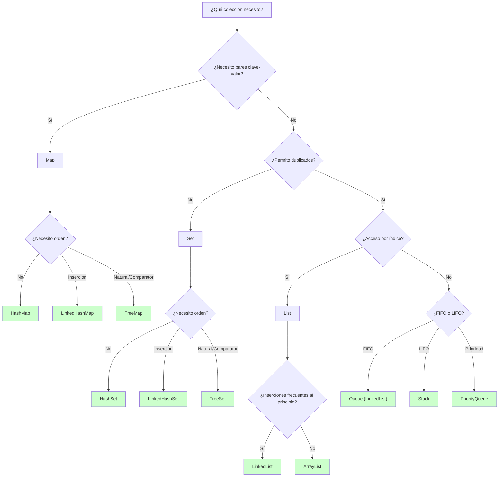

### 11.2 Recomendaciones generales

#### 🎯 Declaración de variables

```java
// ✅ Bueno - programar contra interfaces
List<String> lista = new ArrayList<>();
Set<Integer> conjunto = new HashSet<>();
Map<String, Person> mapa = new HashMap<>();

// ❌ Evitar - dependencia de implementación específica
ArrayList<String> lista = new ArrayList<>();
HashSet<Integer> conjunto = new HashSet<>();
```

> [!WARNING]
>
> **Excepción:** Cuando por encima de la flexibilidad necesitamos mayor identidad. Es decir, queremos usar métodos específicos que se encuentran en la clase concreta y no en la interfaz.

#### ⚡ Consideraciones de rendimiento

| Operación | ArrayList | LinkedList | HashSet | TreeSet |
| :-- | :-- | :-- | :-- | :-- |
| **add()** | O(1)* | O(1) | O(1) | O(log n) |
| **get(index)** | O(1) | O(n) | N/A | N/A |
| **contains()** | O(n) | O(n) | O(1) | O(log n) |
| **remove()** | O(n) | O(1)** | O(1) | O(log n) |

*Amortizado | **Si tienes referencia al nodo

#### 🧠 Gestión de memoria

```java
// ✅ Especificar capacidad inicial si conoces el tamaño aproximado
List<String> lista = new ArrayList<>(1000);
Map<String, Integer> mapa = new HashMap<>(500);

// ✅ Limpiar referencias cuando no necesites la colección
lista.clear();
lista = null;
```

#### 📋 Comparaciones de igualdad

```java
// ✅ Implementar equals() y hashCode() en clases personalizadas
public class Persona {
    private String nombre;
    private int edad;
    
    @Override
    public boolean equals(Object obj) {
        if (this == obj) return true;
        if (obj == null || getClass() != obj.getClass()) return false;
        Persona persona = (Persona) obj;
        return edad == persona.edad && Objects.equals(nombre, persona.nombre);
    }
    
    @Override
    public int hashCode() {
        return Objects.hash(nombre, edad);
    }
}
```

> [!IMPORTANT]
> Recuerda que en las estructuras `TreeSet`, `TreeMap` o `PriorityQueue` no se determina la igualdad mediante `equals` sino mediante el método `compareTo` de la interfaz `Comparable` o bien el método `compare` de la interfaz `Comparator`

### 11.3 Patrones comunes

#### 🔄 Iteración segura con modificaciones

```java
// ✅ Usar Iterator para eliminaciones seguras
Iterator<String> it = lista.iterator();
while (it.hasNext()) {
    String elemento = it.next();
    if (elemento.contains("-")) {
        it.remove(); // Seguro
    }
}

// ✅ O usar removeIf (Java 8+) [Programación funcional]
lista.removeIf(elemento -> debeSerEliminado(elemento));
```

#### 📊 Conversiones entre colecciones

```java
// List → Set (eliminar duplicados)
Set<String> sinDuplicados = new HashSet<>(listaConDuplicados);

// Set → List (si necesitas índices y clasificación alfabética)
List<String> listaOrdenada = new ArrayList<>(conjunto);
Collections.sort(listaOrdenada);

// Array → List
List<String> lista = new ArrayList<>(Arrays.asList(array));

// Collection → Array
String[] array = lista.toArray(new String[0]);
```

> [!TIP]
> **Recuerda:** Elige siempre la colección más simple que satisfaga tus necesidades. No uses TreeSet si no necesitas orden, ni LinkedList si no haces inserciones frecuentes al principio o intermedias.
---
> [!IMPORTANT]
> Las colecciones son una de las partes más importantes de Java. Dominarlas bien te permitirá escribir código más eficiente, legible y mantenible. Practica con diferentes tipos de colecciones para interiorizar cuándo usar cada una.
---
> [!NOTE]
> Si quieres profundizar en los aspectos de esta unidad, existe un libro que lo cubre al detalle: [Java Generics and Collections](https://www.oreilly.com/library/view/java-generics-and/9781098136710/)

<center><em>📚 Fin del apartado UT8.3 - Colecciones</em></center>
