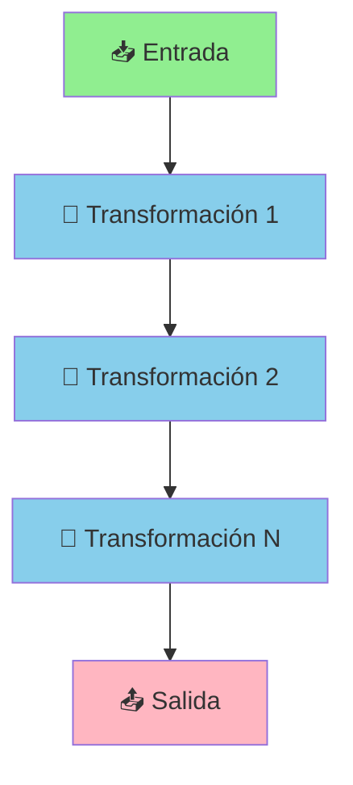
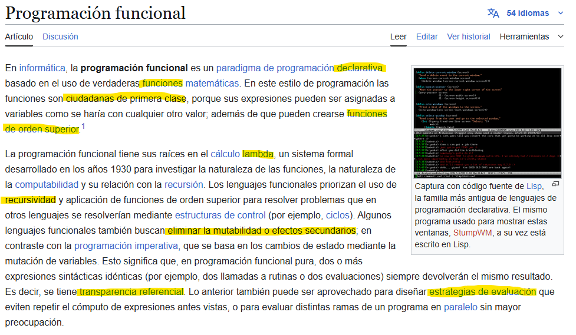
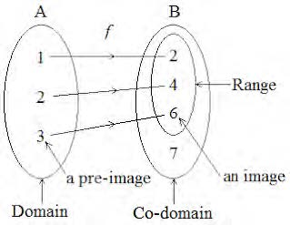
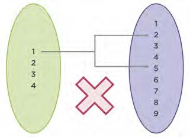
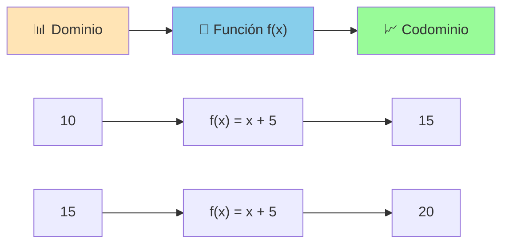
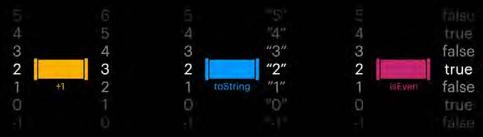
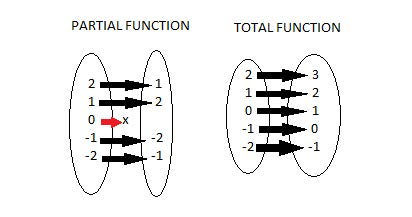
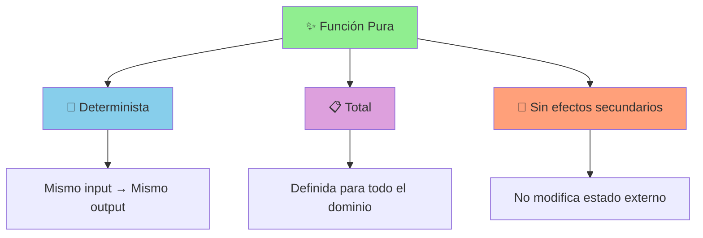
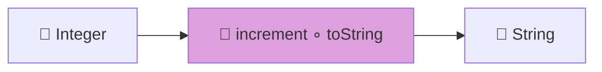
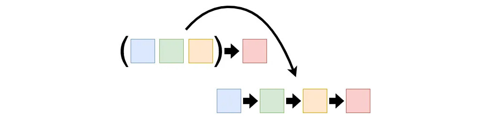

# UT9.1 Introducción a la Programación Funcional

## 📋 Índice de contenidos

1. [Ejemplo inicial](#1-ejemplo-inicial)
2. [¿Qué es la programación funcional?](#2-qu%C3%A9-es-la-programaci%C3%B3n-funcional)
3. [Conceptos fundamentales](#3-conceptos-fundamentales)
    1. [Solo funciones y expresiones](#31-solo-funciones-y-expresiones)
    2. [Funciones](#32-funciones)
    3. [Efectos secundarios (side-effect)](#33-efectos-secundarios-side-effect)
    4. [Función pura](#34-funci%C3%B3n-pura)
    5. [Aridad](#35-aridad)
    6. [Composición de funciones](#36-composici%C3%B3n-de-funciones)
4. [Prácticas a evitar en programación funcional](#4-pr%C3%A1cticas-a-evitar-en-programaci%C3%B3n-funcional)
5. [Transparencia referencial](#5-transparencia-referencial)
6. [Inmutabilidad](#6-inmutabilidad)
7. [Funciones como ciudadanas de primera clase](#7-funciones-como-ciudadanas-de-primera-clase)
8. [Función de orden superior](#8-funci%C3%B3n-de-orden-superior)
9. [Funciones aplicadas parcialmente](#9-funciones-aplicadas-parcialmente)
10. [Currificación (currying)](#10-currificaci%C3%B3n-currying)
11. [POO vs PF](#11-poo-vs-pf)

## 1. Ejemplo inicial

Antes de comenzar, veamos un ejemplo que ilustra la diferencia entre programación imperativa y funcional:

**🔄 Versión imperativa:**

```java
ArrayList<String> ciudades = new ArrayList<>(
    Arrays.asList("Alacant",
                  "Villena", 
                  "Petrer",
                  "Novelda",
                  "Elda"));

// Versión imperativa:
boolean encontrado = false;
for (String ciudad : ciudades) {
    if (ciudad.equals("Petrer")) {
        encontrado = true;
        break;
    }
}
System.out.println("¿Encontrado Petrer?: " + encontrado);
```

**✨ Versión funcional:**

```java
ArrayList<String> ciudades = new ArrayList<>(
    Arrays.asList("Alacant",
                  "Villena",
                  "Petrer", 
                  "Novelda",
                  "Elda"));

// Versión funcional:
System.out.println("¿Encontrado Petrer?: " + ciudades.contains("Petrer"));
```

Para entender mejor el contexto histórico, veamos cómo en el siglo pasado, un programador podía escribir este código en C:

```c
#include <stdio.h>

typedef int (*opBinaria)(int, int);

int sumar(int a, int b) { return a + b; }

int multiplicar(int a, int b) { return a * b; }

void ejecutar(opBinaria f, int op1, int op2) {
    int resultado = f(op1, op2);
    printf("%d\n", resultado);
}

int main() {
    ejecutar(sumar, 1, 2);
    ejecutar(multiplicar, 1, 2);
    return 0;
}
```

> [!NOTE]
> En Java, las variables solo pueden contener datos, no funciones. Así pues, no es posible declarar un método que acepte como parámetro una función. A partir de Java 8 se resuelve esa limitación acercando la POO a la Programación Funcional, como veremos a lo largo de esta unidad.

## 2. ¿Qué es la programación funcional?

La **programación funcional** es un paradigma de programación que sigue las siguientes ideas principales:

- **📋 Las funciones son el centro del diseño**: Todo gira en torno a la definición y uso de funciones
- **🔧 Resolución mediante composición**: Los problemas complejos se descomponen en funciones más simples que se combinan
- **👥 Ciudadanas de primera clase**: Las funciones pueden ser tratadas como cualquier otro valor
- **📝 Programación declarativa**: Se describe *qué* queremos hacer, no *cómo* hacerlo paso a paso
- **🔄 Transformaciones**: Se ve el programa como una serie de transformaciones de datos desde la entrada hasta la salida



### Conceptos clave extraídos de la definición en Wikipedia



> [!IMPORTANT]
> **Requisitos para programar de manera funcional:**
>
> - Solo funciones y expresiones
> - Sin efectos colaterales
> - Flujo de control completamente fijo

## 3. Conceptos fundamentales

### 3.1 Solo funciones y expresiones

Comparemos dos enfoques para resolver un problema:

**❌ Enfoque imperativo (no recomendado):**

```java
public double sumarDuplicar(double x, double y) {
    double suma = 0, doble = 0;
    suma = x + y;
    doble = suma * 2;
    return doble;
}
```

**✅ Enfoque funcional (recomendado):**

```java
public double sumarDuplicar(double x, double y) {
    return (x + y) * 2;
}
```

En el primer caso tenemos dos variables, dependemos de dos espacios de memoria y por eso al final tenemos efectos colaterales: si cambiamos el orden de las asignaciones o, en un programa muy largo, otro desarrollador modifica alguna de las operaciones, estará afectando el resultado final sin que sea sencillo ver el error (de hecho, no nos da ningún error).

En la segunda opción no usamos variables, sino que retornamos una expresión. Queda más sencillo para que lo lean futuros compañeros. Tenemos una mayor integridad en los cálculos al hacerlos en la misma instrucción y evitamos efectos colaterales (que serían aún mayores si trabajamos con variables globales, evidentemente).

> [!TIP]
> En el enfoque funcional, no usamos variables intermedias, sino que retornamos una expresión. Esto simplifica la lectura del código, mejora la integridad de los cálculos y evita efectos colaterales.

### 3.2 Funciones

En matemáticas, una función establece una relación entre dos conjuntos, asignando a cada elemento del primero (dominio) un único elemento del segundo (codominio).




Ejemplo matemático:

```text
F(x) = x + 5

F(10) = 15
F(15) = 20
```



Entra un valor a una función, y sale transformado:



Si hacemos una abstracción de las funciones anteriores podemos observar lo siguiente:


Es habitual expresar lo anterior mediante la notación de tipos de Haskell:

```haskell
increment :: Integer -> Integer
toString :: Integer -> String  
isEven :: Integer -> Boolean
```

#### 🎯 Función determinista

Una **función determinista** es aquella que **para el mismo argumento siempre retornará el mismo resultado**. El resultado de una función determinista es predictible. Por el contrario una función no-determinista no es predictible.

**Ejemplos:**

- ✅ `f(x) = x + 5` → Determinista
- ✅ `f(x) = x * 2` → Determinista
- ❌ `f(x) = x * Math.random()` → No determinista

#### 📋 Función total

Una función se dice que es **total** si está definida para todo el conjunto de partida. Es decir, **existe una salida para cualquier valor del conjunto de entrada**.

**Ejemplos:**

- ✅ `f(x) = x + 1` → Función total
- ❌ `f(x) = 2/x` → Función parcial (no definida para x=0)

> [!NOTE]
> Una función que no es total se denomina **función parcial**.



#### 🏹 Otras características de las funciones

Para conocer otros conceptos básicos sobre funciones que quizá no recuerdes, es recomendable que revises el siguiente enlace: <https://www.fisicalab.com/apartado/f-inyectiva-sobreyectiva-biyectiva>

### 3.3 Efectos secundarios (side-effect)

Un **efecto secundario** o colateral es todo **cambio observable desde fuera del sistema**.

**Ejemplos de efectos secundarios:**

- 📁 CRUD sobre archivos
- 🗄️ CRUD sobre base de datos
- 🌐 Enviar/Recibir llamada de red
- 🔧 Alterar objeto/variable usada por otras funciones

> [!IMPORTANT]
> Hay que **reducir y acotar** los efectos secundarios (no eliminarlos por completo) para tener una mejor estructura del código. Los efectos secundarios son inevitables porque al final son necesarios, pero debemos minimizar su uso.

### 3.4 Función pura

Una **función pura** es una función **determinista**, **total** y **sin efectos secundarios**.



**Ejemplos de funciones puras:**

```java
// ✅ Función pura
public int sumar(int a, int b) {
    return a + b;
}

// ✅ Función pura
public double calcularArea(double radio) {
    return Math.PI * radio * radio;
}

// ❌ NO es función pura (efecto secundario)
public int contadorGlobal = 0;
public int incrementarContador() {
    contadorGlobal++; // Modifica estado externo
    return contadorGlobal;
}
```

**🎯 Ventajas de las funciones puras:**

- **🗑️ Eliminables**: Se pueden eliminar sin afectar el resto del programa
- **🔄 Predecibles**: Siempre retornan el mismo resultado para los mismos parámetros
- **↔️ Intercambiables**: Se puede invertir el orden de las invocaciones
- **⚡ Optimizables**: Los compiladores pueden optimizarlas mejor
- **♻️ Memoizables**: En general, las funciones puras se pueden memoizar

**Ejemplo en JavaScript:**

```javascript
const dobleNumero = (n) => {
    return n * 2;
};

const mitadNumero = n => n / 2;

console.log(dobleNumero(mitadNumero(4))); // 4
console.log(mitadNumero(dobleNumero(4))); // 4

// Las dos instrucciones anteriores retornan 4
```

> [!TIP]
> En general, las funciones puras se pueden memoizar para mejorar el rendimiento.
---
> [!NOTE]
> Una función pura puede invocar a otra función pura pero no a una impura. Si una función pura invoca una impura se transformará entonces en una función impura puesto que la naturaleza de la impura hará impredecible el resultado de la función pura, ya sea por el resultado o por los efectos secundarios y contexto que implican.

### 3.5 Aridad

La **aridad** es la cantidad de argumentos que toma una función, operación o relación.

**Clasificación:**

- **0 argumentos**: Función de aridad 0, nularia o nilódica
- **1 argumento**: Función de aridad 1, unaria o monádica
- **2 argumentos**: Función de aridad 2, binaria o diádica
- **3 argumentos**: Función de aridad 3, ternaria o triádica
- **n argumentos**: Función de aridad N, n-aria o poliádica
- **argumentos variables**: Función de aridad variable o variádica

**Ejemplos:**

```java
// Aridad 0
public int obtenerConstante() { return 42; }

// Aridad 1
public int doble(int x) { return x * 2; }

// Aridad 2  
public int sumar(int a, int b) { return a + b; }

// Aridad variable
public int sumarTodos(int... numeros) { 
    //...
}
```

### 3.6 Composición de funciones

Antes hemos visto estas dos funciones:


Podemos **componer funciones** cuando el tipo de salida de una es compatible con el tipo de entrada de otra:



**Ejemplo de composición:**

Si tenemos:

- `f` : `Integer → Integer` (función increment)
- `g` : `Integer → String` (función toString)

Podemos crear la composición: `g ∘ f` : `Integer → String`

```scala
//EJEMPLO EN LENGUAJE SCALA

val increment: Int => Int = _ + 1
val intToString: Int => String = _.toString

// Composición con `andThen` (f → g)
val incrementThenToString = increment andThen intToString

// Composición al estilo matemático (g ∘ f)
val incrementComposeToString = intToString compose increment

println(incrementThenToString(5))      // "6"
println(incrementComposeToString(5))  // "6"
```

## 4. Prácticas a evitar en programación funcional

1. **🔄 El uso de bucles de iteración** es una práctica desaconsejada en programación funcional a favor de la **recursión**
2. **📝 Las declaraciones de variables** también están desaconsejadas, de manera que siempre que podamos utilizaremos **constantes** (`final`)
3. **🔧 Las mutaciones de objetos** y los métodos que producen mutaciones o efectos secundarios como `pop()` o `push()` no se consideran buena práctica si se aplican sobre la colección original

## 5. Transparencia referencial

La **transparencia referencial** es un concepto fundamental en la programación funcional. Se dice que una función es **referencialmente transparente** si se puede reemplazar con el valor al que equivale sin cambiar el comportamiento del programa.

**Características:**

- Como resultado, la evaluación de una función referencialmente transparente da el mismo valor para los mismos argumentos
- Estas funciones son las que hemos visto que se denominan **funciones puras**
- Una expresión que no es referencialmente transparente se llama **referencialmente opaca**

**Ejemplos:**

✅ **Transparente:**

```java
public int cuadrado(int x) {
    return x * x;
}

// Siempre que aparezca cuadrado(5), puede ser reemplazado por 25
int resultado = cuadrado(5); // ≡ int resultado = 25;
```

❌ **No transparente:**

```java
public int numeroAleatorio() {
    return new Random().nextInt(100);
}

// numeroAleatorio() NO puede ser reemplazado por un valor constante
// porque cada llamada produce un resultado diferente
```

> [!IMPORTANT]
> La transparencia referencial permite al compilador realizar optimizaciones y hace que el código sea más fácil de razonar y probar.

## 6. Inmutabilidad

Una **mutación** es un **cambio en la estructura de un objeto**, en lugar de una sustitución de la instancia.

> [!CAUTION]
> Las mutaciones son generalmente peligrosas, ya que aumentan el número de efectos secundarios.

Hay que **utilizar métodos que copian el contenido del objeto y no modifican el original**, como `Arrays.copyOf` (para arrays) o `addAll` (para listas) en Java.

### **✅ Ventajas de la Inmutabilidad:**

1. Seguridad en concurrencia.  
2. Facilita la creación de funciones puras.  
3. Simplifica el razonamiento y debugging.  
4. Permite optimizaciones como memoización.  
5. Reduce efectos secundarios no deseados.  

### **❌ Desventajas de la Inmutabilidad:**

1. Puede afectar al rendimiento por copias constantes.  
2. Curva de aprendizaje al cambiar de paradigma (mayor atención al diseño).  
3. Interoperabilidad complicada con APIs mutables.  
4. No siempre es natural para dominios con estado complejo.  
5. Boilerplate en lenguajes sin soporte nativo.  

> [!NOTE]
>
> Investiga qué son los "withers" como alternativa a los getters y setters para trabajar con objetos inmutables.

## 7. Funciones como ciudadanas de primera clase

Diremos que un lenguaje tiene **funciones de primera clase** o **de primer orden** si pueden ser tratadas como cualquier variable.

Esto significa que una función puede ser:

- **📥 Pasada como argumento** a otra función
- **📤 Retornada por otra función** como resultado
- **📝 Asignada a una variable** para su uso posterior

En lenguajes como **JavaScript** o **Kotlin**, las funciones sí que son de primera clase y es sencillo aplicar todos estos conceptos:

```javascript
// JavaScript - Funciones de primera clase
const sumar = (a, b) => a + b;
const multiplicar = (a, b) => a * b;

// Asignar función a variable
const operacion = sumar;

// Pasar función como parámetro
function aplicarOperacion(func, x, y) {
    return func(x, y);
}

const resultado = aplicarOperacion(multiplicar, 5, 3); // 15
```

En otros lenguajes como **Java**, las funciones no son ciudadanas de primera clase, por lo que tendremos que encontrar **mecanismos alternativos** para aplicar estos conceptos (como las interfaces funcionales que veremos más adelante).

```java
// Java - Simulando funciones de primera clase con interfaces
@FunctionalInterface
interface OperacionBinaria {
    int aplicar(int a, int b);
}

class Suma implements OperacionBinaria {
    @Override
    public int aplicar(int a, int b) {
        return a + b;
    }
}

class Multiplicacion implements OperacionBinaria {
    @Override
    public int aplicar(int a, int b) {
        return a * b;
    }
}

public class Ejemplo {
    public static int ejecutarOperacion(OperacionBinaria op, int x, int y) {
        return op.aplicar(x, y);
    }
    
    public static void main(String[] args) {
        OperacionBinaria suma = new Suma();
        int resultadoSuma = ejecutarOperacion(suma, 10, 5); // 15
        
        OperacionBinaria multiplicacion = new Multiplicacion();
        int resultadoMultiplicacion = ejecutarOperacion(multiplicacion, 10, 5); // 50
        
        System.out.println("Suma: " + resultadoSuma);
        System.out.println("Multiplicación: " + resultadoMultiplicacion);
    }
}
```

> [!NOTE]
> A partir de Java 8, con las expresiones lambda y las interfaces funcionales, Java se acerca mucho al concepto de funciones de primera clase, aunque técnicamente sigue siendo a través de objetos.

## 8. Función de orden superior

Las funciones de orden superior o HOF (Higher Order Functions) funciones que **trabajan con funciones**, es decir, aquellas funciones que tienen otra función como parámetro de entrada o como parámetro de salida.

Las funciones de orden superior son una abstracción de tareas comunes para funciones.

```javascript
// Ejemplo en JavaScript
const sumar = (x, y) => x + y;
const restar = (x, y) => x - y;
const multiplicar = (x, y) => x * y;

const operar = (x, y, f) => f(x, y); // Operar es una HOF

operar(6, 2, restar); // Retorna 4
operar(6, 2, sumar);  // Retorna 8
```

**Ejemplos conceptuales:**

**Pregunta:**  
Si tenemos una función `f(x) = 2x` y otra función `g(x) = 3x`, ¿cuál es la diferencia entre aplicar `g(f(5))` y aplicar `(g ∘ f)(5)`?

**Respuesta:**  

- **`g(f(5))`**:
  - **Proceso:** Primero se evalúa `f(5)` (obteniendo `10`), y luego ese resultado se pasa directamente a `g`, calculando `g(10)` (resultando `30`).  
  - **Naturaleza:** Es una **aplicación secuencial** de las dos funciones, donde el cálculo se realiza inmediatamente.  

- **`(g ∘ f)(5)`**:  
  - **Proceso:** La notación `(g ∘ f)` define una **nueva función compuesta** (que primero aplica `f` y luego `g`), pero no la evalúa hasta que se le pasa el argumento `5`. Al escribir `(g ∘ f)(5)`, se invoca esa función compuesta con el valor `5`, obteniendo también `30`.  
  - **Naturaleza:** La composición `(g ∘ f)` es un **objeto función** en sí mismo, que puede almacenarse, pasarse como argumento o evaluarse más tarde.  

**Diferencia clave:**  

- `g(f(5))` es una **ejecución inmediata** de ambas funciones.
- `(g ∘ f)(5)` implica:  
  1. Crear una función compuesta (`g ∘ f`).  
  2. Invocarla después con `5`.  

**Ejemplo práctico:**

Imagina el caso donde tenemos una función que recibe un String, lo convierte a mayúsculas y lo imprime. Más adelante necesitamos la función que recibe un String, lo convierte a minúsculas y lo imprime, etc. Podemos ahorrar la repetición de código haciendo una función más general, que recibe un String y **una función**, aplica esa función al String y lo imprime:

```kotlin
// Ejemplo en Kotlin
fun procesarEImprimir(texto: String, transformacion: (String) -> String) {
    val resultado = transformacion(texto)
    println(resultado)
}

// Uso:
procesarEImprimir("Hola Mundo") { it.uppercase() }
procesarEImprimir("Hola Mundo") { it.lowercase() }
procesarEImprimir("Hola Mundo") { it.reversed() }
```

> [!NOTE]
> El uso de funciones de orden superior nos permite utilizar la **composición de funciones** para obtener nuestros resultados.

## 9. Funciones aplicadas parcialmente

Como tenemos funciones como ciudadanas de primera clase y por tanto podemos construir funciones de orden superior, aparece el concepto de **funciones parcialmente aplicadas** (*No confundir con funciones parciales*).

Por **aplicación parcial** se entiende la aplicación de una función, pero suministrando **menos parámetros que los que requiere**. El resultado de aplicar parcialmente una función es **otra función** que espera menos parámetros que la original, ya que puede hacer reemplazamientos en la definición por expresiones o valores concretos.

La aplicación parcial es muy útil para:

- 🧩 Componer funciones
- ⚙️ Parametrizar funciones de orden superior

**Ejemplo práctico en JavaScript:**

```javascript
const valor1 = sumar4valores(5, 1, 2, 4);    // valor1 = 12
const parcial1 = sumar4valores(5, 9, 1);    // parcial1(x) = 5 + 9 + 1 + x
const valor2 = parcial1(3);                 // valor2 = 18
const valor3 = parcial1(2);                 // valor3 = 17
const parcial2 = sumar4valores(4, 1);       // parcial2(x,y) = 4 + 1 + x + y
const valor4 = parcial2(2, 3);              // valor4 = 10
const valor5 = parcial2(3, 1);              // valor5 = 9
const parcial3 = parcial2(6);               // parcial3(x) = 4 + 1 + 6 + x
const valor6 = parcial3(4);                 // valor6 = 15
const valor7 = parcial3(1);                 // valor7 = 12

const valor8 = sumar4valores(2, 1, 5)(4);    // valor8 = 12
const valor9 = sumar4valores(7)(1, 3)(2);    // valor9 = 13
const valor10 = sumar4valores(1)(3)(2)(6);    // valor10 = 12 [CURRIFICADA]
```

> [!TIP]
> La aplicación parcial es especialmente útil cuando queremos crear versiones especializadas de funciones más generales, lo que facilita la reutilización de código y la composición funcional.

## 10. Currificación (currying)



En programación funcional, las funciones suelen recibir un **único parámetro de entrada**. Estas funciones son denominadas **funciones unarias**. En Java se representan por el tipo `Function<T,R>`.

**Currying** es el **proceso de convertir funciones de N argumentos a N funciones de 1 argumento**. Es una forma de reutilizar funciones convirtiéndolas en factorias de funciones.

### ¿Qué pasa con las funciones que tienen más de un parámetro de entrada?

Se pueden convertir en funciones que dado un parámetro de entrada **retornan otra función**.

**Ejemplo de transformación:**

**Función tradicional:**

```text
f(X, Y) → X + Y
"A la función le entran dos valores (X e Y) y retorna un valor (X+Y)"
```

**Función currificada:**

```text
f(X) → f(Y) → X + Y
"A la función le entra un valor (X) y retorna una segunda función"
"A esta segunda función le entra un valor (Y) y retorna un valor (X+Y)"
```

**Ejemplo en JavaScript:**

```javascript
// Función tradicional
function sumar(a, b, c) {
    return a + b + c;
}

// Función currificada
function sumarCurrificada(a) {
    return function(b) {
        return function(c) {
            return a + b + c;
        };
    };
}

// Con arrow functions (más conciso)
const sumarCurry = a => b => c => a + b + c;

// Uso
console.log(sumar(1, 2, 3));           // 6
console.log(sumarCurrificada(1)(2)(3)); // 6
console.log(sumarCurry(1)(2)(3));      // 6

// Ventaja: aplicación parcial
const sumar1 = sumarCurry(1);
const sumar1y2 = sumar1(2);
console.log(sumar1y2(3)); // 6
```

> [!IMPORTANT]
> Currying nos permite trabajar con **funciones aplicadas parcialmente** que admiten solo un parámetro de entrada, lo que facilita enormemente la **composición** y **reutilización** de funciones.

**Ventajas del currying:**

- **🔧 Reutilización**: Podemos crear versiones especializadas de funciones
- **🧩 Composición**: Facilita combinar funciones pequeñas en funciones más complejas
- **📝 Legibilidad**: El código se vuelve más expresivo y declarativo
- **🏭 Factory pattern**: Las funciones se convierten en generadoras de otras funciones

## 11. POO vs PF

### 🏗️ Programación Orientada a Objetos (POO)

La **programación orientada a objetos** es ideal cuando necesitas modelar entidades del mundo real con comportamientos específicos y estados complejos.

#### 📋 Casos de uso principales

##### 1. 🎮 **Sistemas con múltiples entidades interactivas**

- **Videojuegos** con personajes, enemigos y objetos
- **Simuladores** (tráfico, ecosistemas, física)
- **Sistemas multi-agente** donde cada entidad tiene comportamiento independiente

**Ejemplo:** Un RPG donde cada personaje tiene atributos, habilidades y comportamientos únicos

##### 2. 🏢 **Modelado de dominios empresariales complejos**

- **Sistemas de gestión** con múltiples entidades relacionadas
- **E-commerce** con usuarios, productos, pedidos y pagos
- **Sistemas financieros** con cuentas, transacciones y clientes

**Ejemplo:** Sistema bancario con diferentes tipos de cuentas y operaciones específicas

##### 3. 🖥️ **Interfaces gráficas de usuario**

- **Aplicaciones desktop** con ventanas, botones y menús
- **Frameworks de UI** donde cada componente tiene estado y comportamiento
- **Editores** y herramientas interactivas

**Ejemplo:** Un editor de texto donde cada elemento (toolbar, editor, sidebar) es un objeto

##### 4. 🔧 **Sistemas extensibles y modulares**

- **Frameworks y librerías** que otros desarrolladores extenderán
- **Plugins y complementos** con arquitectura flexible
- **APIs** que necesitan diferentes implementaciones

**Ejemplo:** Sistema CMS donde se pueden añadir nuevos tipos de contenido mediante herencia

#### ✅ Ventajas clave

- **🎯 Modelado intuitivo:** Representa conceptos del mundo real de forma natural
- **🔒 Encapsulación:** Protege datos y agrupa funcionalidad relacionada
- **🔄 Reutilización:** Herencia y polimorfismo facilitan código reutilizable
- **🛠️ Mantenibilidad:** Cambios localizados en clases específicas
- **👥 Colaboración:** Diferentes desarrolladores pueden trabajar en clases independientes

### 🎯 Programación Funcional (PF)

La **programación funcional** es especialmente útil en escenarios donde necesitas procesar datos de forma predecible, segura y eficiente.

#### 📋 Casos de uso principales

##### 1. 🌐 **Aplicaciones sin estado (Stateless)**

- **APIs REST y microservicios** donde cada petición es independiente
- **Middlewares** que procesan requests sin efectos secundarios
- Sistemas donde no necesitas mantener información entre operaciones

**Ejemplo:** Un endpoint que calcula el precio final de un producto aplicando descuentos

##### 2. 📈 **Procesamiento masivo de datos**

- **Transformaciones ETL** (Extract, Transform, Load)
- **Pipelines de datos** con múltiples operaciones secuenciales
- **Streams de datos** en tiempo real

**Ejemplo:** Procesar miles de registros de ventas para generar reportes

##### 3. 💼 **Aplicaciones de gestión empresarial**

- **Sistemas CRUD** con lógica de negocio compleja
- **Gestión de estados** predecibles (como Redux)
- Aplicaciones que manejan datos desde bases de datos

**Ejemplo:** Sistema de facturación que calcula impuestos y descuentos

##### 4. 📊 **Business Intelligence y Data Science**

- **Análisis de datos** con cálculos complejos
- **Pipelines de machine learning** donde la reproducibilidad es clave
- Reportes y dashboards con múltiples transformaciones

**Ejemplo:** Dashboard que analiza patrones de comportamiento de usuarios

##### 5. ⚡ **Sistemas de alto rendimiento**

- **Procesamiento paralelo** (map/reduce)
- **Sistemas distribuidos** que requieren concurrencia segura
- Aplicaciones que necesitan escalar horizontalmente

**Ejemplo:** Sistema de procesamiento de imágenes que usa múltiples cores

#### ✅ Ventajas clave

- **🔒 Seguridad:** Las funciones puras evitan bugs difíciles de rastrear
- **🧪 Testeable:** Más fácil escribir tests unitarios
- **⚡ Paralelizable:** Se puede ejecutar en múltiples procesadores
- **🔄 Reutilizable:** Las funciones se pueden combinar fácilmente
- **🐛 Menos bugs:** Al evitar mutaciones, reduces errores de estado

### 📊 Comparación práctica

| Aspecto | 🏗️ POO | 🎯 PF |
|---------|---------|-------|
| **🎯 Enfoque** | Objetos y sus interacciones | Funciones y transformaciones |
| **📊 Datos** | Encapsulados en objetos | Inmutables, fluyen entre funciones |
| **🔄 Reutilización** | Herencia y polimorfismo | Composición de funciones |
| **🧪 Testing** | Mocks y stubs complejos | Funciones puras fáciles de probar |
| **🔄 Concurrencia** | Sincronización compleja | Natural y segura |
| **📈 Escalabilidad** | Vertical (más potencia) | Horizontal (más máquinas) |
| **🎮 Casos típicos** | Juegos, GUIs, simuladores | APIs, ETL, análisis de datos |
| **🧠 Complejidad** | Modelado intuitivo | Abstracción matemática |

> [!NOTE]
> En el desarrollo moderno, la tendencia es hacia la **programación multiparadigma**, donde elegimos el paradigma más adecuado para cada situación específica dentro del mismo proyecto.
---
> [!IMPORTANT]
> Has completado la introducción a la programación funcional. En los siguientes apartados profundizaremos en las herramientas específicas que Java proporciona para programar de manera funcional, como las interfaces funcionales, expresiones lambda, streams y mucho más.

<p align="center">📚 <em>Fin del apartado UT9.1 - Introducción a la Programación Funcional</em></p>
