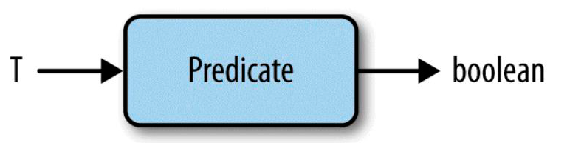
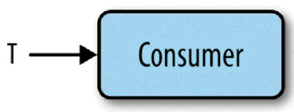
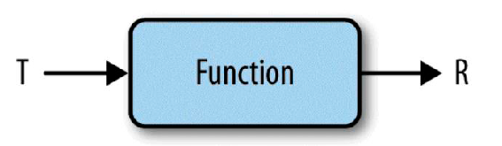
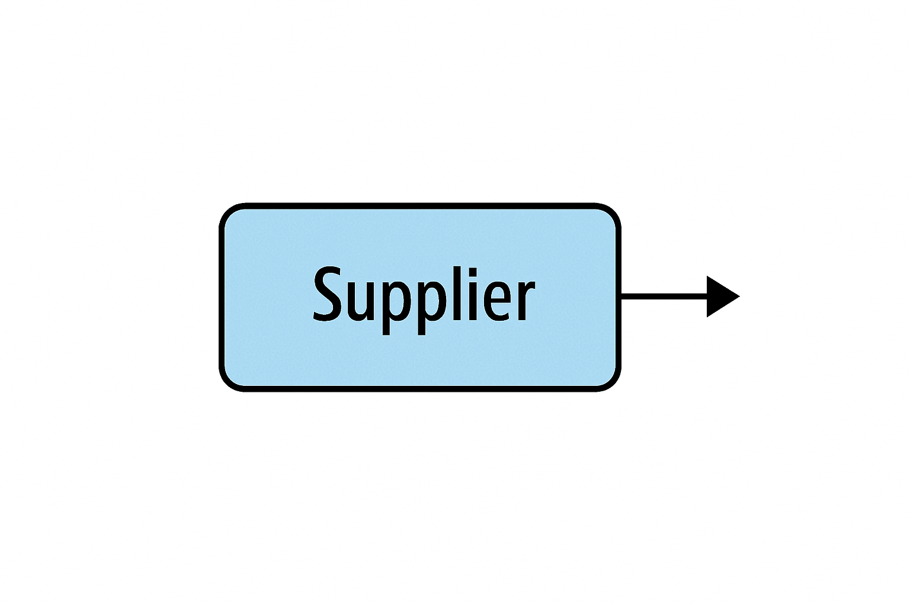
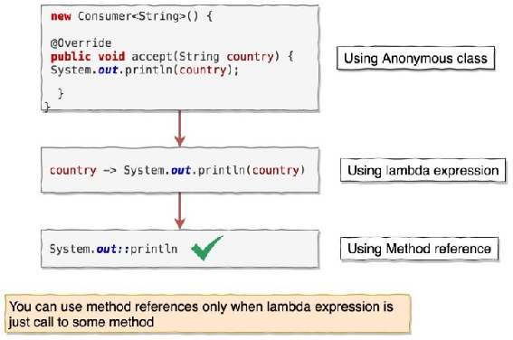

# UT9.2 Interfaces funcionales y expresiones lambda

## 📋 Índice de contenidos

1. [Interfaces en Java](#1-interfaces-en-java)
2. [¿Qué es una interfaz funcional?](#2-qu%C3%A9-es-una-interfaz-funcional)
    1. [Ejemplo: interfaz funcional Comparator](#21-ejemplo-interfaz-funcional-comparator)
    2. [Uso con clases anónimas y lambda](#22-uso-con-clases-an%C3%B3nimas-y-lambda)
3. [Expresiones lambda](#3-expresiones-lambda)
    1. [Sintaxis y características](#31-sintaxis-y-caracter%C3%ADsticas)
    2. [Ejemplo de uso con interfaz funcional propia](#32-ejemplo-de-uso-con-interfaz-funcional-propia)
    3. [Captura de variables (closures)](#33-captura-de-variables-closures)
    4. [Ejercicio de práctica](#34-ejercicio-de-pr%C3%A1ctica)
4. [Principales interfaces funcionales en la API de Java](#4-principales-interfaces-funcionales-en-la-api-de-java)
    1. [`Predicate<T>`](#41-predicatet)
    2. [`Consumer<T>`](#42-consumert)
    3. [`Function<T,R>`](#43-functiontr)
    4. [`Supplier<T>`](#44-suppliert)
    5. [Otras interfaces funcionales frecuentes](#45-otras-interfaces-funcionales-frecuentes)
5. [Referencias a métodos y constructores](#5-referencias-a-m%C3%A9todos-y-constructores)
    1. [Referencia a métodos estáticos](#51-referencia-a-m%C3%A9todos-est%C3%A1ticos)
    2. [Referencia a métodos de instancia](#52-referencia-a-m%C3%A9todos-de-instancia)
    3. [Referencia a métodos de objeto concreto](#53-referencia-a-m%C3%A9todos-de-objeto-concreto)
    4. [Referencia a constructores](#54-referencia-a-constructores)
6. [Expresiones switch (Java 12+)](#6-expresiones-switch-java-12)
7. [Resumen y buenas prácticas](#7-resumen-y-buenas-pr%C3%A1cticas)

## 1. Interfaces en Java

> [!WARNING]
> Antes de empezar este apartado debes haber revisado el [Anexo 1. Inferencia de tipos, records y clases selladas](./UT9.1.%20Introducció.pdf)

Recordemos que una **interfaz** en Java es un contrato que especifica qué métodos debe implementar una clase, pero no cómo debe implementarlos. Es una forma de lograr abstracción y herencia múltiple de tipos en Java.

```java
// Ejemplo básico de interfaz
public interface Operable {
    double operar(double op1, double op2);
}

// Implementación en una clase real
public class Suma implements Operable {
    public double operar(double op1, double op2) {
        return op1 + op2;
    }
}
```

A partir de Java 8, las interfaces pueden contener:

- **Métodos default**: Métodos con implementación por defecto
- **Métodos static**: Métodos estáticos que pertenecen a la interfaz

```java
public interface OperacionBinaria {
    // Método abstracto tradicional
    double calcular();
    
    // Método default (Java 8+)
    default void mostrarResultado() {
        System.out.println("El resultado es: " + calcular());
    }
    
    // Método static (Java 8+)
    static boolean esPositivo(double numero) {
        return numero > 0;
    }


}

public class Multiplicacion implements OperacionMatematica {
    private double operando1;
    private double operando2;
    public Multiplicacion(double operando1, double operando2){
        this.operando1 = operando1;
        this.operando2 = operando2;
    }
    @Override
    public double calcular() {
        return operando1 * operando2;
    }
    
    // Heredamos automáticamente mostrarResultado()
    // Podemos sobrescribirlo si queremos
}
```

---

> [!NOTE]
> Las interfaces no se pueden instanciar directamente con `new`. Se utilizan como tipos de referencia facilitando el polimorfismo y el desacoplamiento del código.

**Ejemplo de uso como referencia:**

```java
List<String> lista = new ArrayList<>();
```

## 2. ¿Qué es una interfaz funcional?

Una **interfaz funcional** es una interfaz que contiene **exactamente un método abstracto**. Puede tener métodos `default`, `static`, y métodos que sobrescriben los de `Object`, pero solo un método abstracto.

Aunque no es obligatoria, es recomendable usar la anotación `@FunctionalInterface` para:

- Documentar la intención del desarrollador
- Permitir que el compilador verifique que la interfaz cumple los requisitos
- Evitar errores al añadir métodos abstractos adicionales

```java
@FunctionalInterface
public interface MiOperacion {
    int ejecutar(int a, int b);
}
```

Las más conocidas de la API de Java se encuentran en el paquete `java.util.function`, como `Predicate`, `Function`, `Consumer`, etc.

### 2.1 Ejemplo: interfaz funcional Comparator

La interfaz `Comparator<T>` es un excelente ejemplo de interfaz funcional de la API de Java:

```java
@FunctionalInterface
public interface Comparator<T> {
    // El único método abstracto
    int compare(T o1, T o2);
    
    // Métodos default para composición
    default Comparator<T> reversed() { /* ... */ }
    default Comparator<T> thenComparing(Comparator<? super T> other) { /* ... */ }
    
    // Métodos static de utilidad
    static <T extends Comparable<? super T>> Comparator<T> naturalOrder() { /* ... */ }
    static <T> Comparator<T> comparing(Function<? super T, ? extends U> keyExtractor) { /* ... */ }
}
```

### 2.2 Uso con clases anónimas y lambda

Veamos la evolución del uso de interfaces funcionales:

#### 📝 Implementación tradicional con clase concreta

```java
public class ComparadorPorLongitud implements Comparator<String> {
    @Override
    public int compare(String a, String b) {
        return Integer.compare(a.length(), b.length());
    }
}

public class ComparadorAlfabeticoDescendente implements Comparator<String> {
    @Override
    public int compare(String a, String b) {
        return b.compareTo(a);
    }
}

// Uso
List<String> nombres = Arrays.asList("Ana", "Beatriz", "Carlos", "David");
// Podemos ordenar por longitud
nombres.sort(new ComparadorPorLongitud());
// También podemos ordenar por orden alfabético inverso
nombres.sort(new ComparadorAlfabeticoDescendente());
```

#### 🎭 Clase anónima (Java 1.1+)

```java
List<String> nombres = Arrays.asList("Ana", "Beatriz", "Carlos", "David");

// Ya no es necesario crear una clase para cada "estrategia" de comparación
// Podemos usar "new Comparator<String>" (INTERFAZ!!) si implementamos los métodos abstractos. A esto se le llama clase anónima.

nombres.sort(new Comparator<String>() {
    @Override
    public int compare(String a, String b) {
        return Integer.compare(a.length(), b.length());
    }
});

System.out.println(nombres); // [Ana, David, Carlos, Beatriz]
```

Imagina que queremos ordenar una lista de usuarios por su edad ascendente. Podríamos crear distintas clases que hereden de `Comparator<Usuario>`, o también mediante una clase anónima:

```java
lista.sort(
    new Comparator<Usuario>() {
        public int compare(Usuario o1, Usuario o2) {
            return o1.getEdat() - o2.getEdat();
        }
    }
);

```

#### ⚡ Expresión lambda (Java 8+)

```java
List<String> nombres = Arrays.asList("Ana", "Beatriz", "Carlos", "David");

// Versión completa
nombres.sort((String a, String b) -> Integer.compare(a.length(), b.length()));

// Inferencia de tipos -> los tipos que indique su único método abstracto
nombres.sort((a, b) -> Integer.compare(a.length(), b.length()));

// Versión más compacta
nombres.sort((a, b) -> a.length() - b.length());

System.out.println(nombres); // [Ana, David, Carlos, Beatriz]
```

¿Y para hacer como en el ejemplo anterior, para ordenar usuarios por su edad?

```java
lista.sort((o1, o2) -> o1.getEdat() - o2.getEdat());
```

> [!TIP]
> El compilador deduce el tipo de datos por inferencia. Se puede usar directamente en métodos que esperan interfaces funcionales como argumento.

## 3. Expresiones lambda

Una **expresión lambda** es una función anónima que puede ser tratada como un valor. Permite escribir código más compacto y expresivo cuando trabajamos con interfaces funcionales.

### 3.1 Sintaxis y características

```java
(parámetros) -> {  cuerpo de la función  }
```

1. **Paréntesis en parámetros**: Opcionales para un solo parámetro, obligatorios para cero o múltiples
2. **Tipos de parámetros**: Opcionales si el compilador puede inferirlos
3. **Llaves**: Opcionales para una sola expresión
4. **Return**: Implícito para expresiones simples, explícito en bloques

- Desde el cuerpo se puede acceder a variables del contexto (siempre que sean `final` o "efectivamente finales").

**Ejemplos de sintaxis:**

```java
// Sin parámetros de entrada ni salida
() -> System.out.println("Hola")
() -> {System.out.println("Hola");}

// Sin entrada y con una salida
() -> "Hola"
() -> {return "Hola";}

// Con un parámetro de entrada
(String x) -> System.out.println(x)
(x) -> System.out.println(x)
x -> System.out.println(x)
System.out::println // Referencia a método. Lo veremos más adelante

// Con un parámetro de salida y varias instrucciones
x -> {System.out.println(x); return x.length();}

// Con múltiples parámetros de entrada
(x, y) -> {
    System.out.println(x);
    System.out.println(y);
    return x + y;
}

(Integer x, Integer y) -> x + y

(x, y) -> x + y

Integer::sum  // Referencia a método. Lo veremos más adelante

```

**Ejemplo de iteración de una lista:**

```java
import java.util.Arrays;
import java.util.List;
import java.util.function.Consumer;

public class EjemploIteracion {
    public static void main(String[] args) {
        // Crear una lista de números del 1 al 10
        List<Integer> numeros = Arrays.asList(1,2,3,4,5,6,7,8,9,10);

        // Iterador externo 1
        for(int i = 0; i < numeros.size(); i++) {
            System.out.println(numeros.get(i));
        }

        // Iterador externo 2 (bucle for mejorado)
        for(int numero : numeros) {
            System.out.println(numero);
        }

        // Iterador interno utilizando una clase anónima
        numeros.forEach(new Consumer<Integer>() {
            public void accept(Integer valor) {
                System.out.println(valor);
            }
        });

        // Iterador interno utilizando expresiones lambda
        numeros.forEach((Integer valor) -> System.out.println(valor));
        numeros.forEach(valor -> System.out.println(valor));

        // Iterador interno utilizando referencia a método (lo veremos más adelante)
        numeros.forEach(System.out::println);
    }
}

```

### 3.2 Ejemplo de uso con interfaz funcional propia

Vamos a crear un ejemplo completo que muestre cómo definir y usar nuestras propias interfaces funcionales:

```java
@FunctionalInterface
public interface OperacionDouble {
    double operar(double op1, double op2);
}

@FunctionalInterface
public interface ValidadorNumero {
    boolean esValido(double numero);
}

@FunctionalInterface
public interface GeneradorTexto {
    String generar(String prefijo, double numero);
}

public class EjemploInterfacesFuncionales {
    public static void main(String[] args) {
        // Diferentes operaciones matemáticas
        OperacionDouble suma = (a, b) -> a + b;
        OperacionDouble resta = (a, b) -> a - b;
        OperacionDouble producto = (a, b) -> a * b;
        OperacionDouble division = (a, b) -> b != 0 ? a / b : 0;
        
        // Validadores
        ValidadorNumero esPositivo = n -> n > 0;
        ValidadorNumero esPar = n -> n % 2 == 0;
        ValidadorNumero enRango = n -> n >= 1 && n <= 100;
        
        // Generador de texto
        GeneradorTexto generador = (prefijo, num) -> prefijo + ": " + num;
        
        // Uso de las interfaces funcionales
        double a = 15.0, b = 3.0;
        
        System.out.println("=== Operaciones Matemáticas ===");
        System.out.println(generador.generar("Suma", suma.operar(a, b)));
        System.out.println(generador.generar("Resta", resta.operar(a, b)));
        System.out.println(generador.generar("Producto", producto.operar(a, b)));
        System.out.println(generador.generar("División", division.operar(a, b)));
        
        System.out.println("\n=== Validaciones ===");
        System.out.println("¿15 es positivo? " + esPositivo.esValido(a));
        System.out.println("¿15 es par? " + esPar.esValido(a));
        System.out.println("¿15 está en rango [1-100]? " + enRango.esValido(a));
        
        // Uso con método que acepta interface funcional
        realizarOperacion(10, 5, (x, y) -> Math.pow(x, y), "Potencia");
        realizarOperacion(10, 3, (x, y) -> Math.max(x, y), "Máximo");
    }
    
    // Método que recibe una interface funcional como parámetro
    public static void realizarOperacion(double a, double b, 
                                       OperacionDouble operacion, 
                                       String nombreOperacion) {
        double resultado = operacion.operar(a, b);
        System.out.println(nombreOperacion + "(" + a + ", " + b + ") = " + resultado);
    }
}
```

> [!IMPORTANT]
> Las lambdas solo pueden asignarse a **interfaces funcionales**, no a cualquier interfaz.

### 3.3 Captura de variables (closures)

Las expresiones lambda pueden acceder a variables del ámbito que las contiene, pero con ciertas restricciones:

```java
public class EjemploClosure {
    private static int contador = 0;
    
    public static void main(String[] args) {
        int multiplicador = 2; // Variable efectivamente final
        final String prefijo = "Resultado: "; // Variable final explícita
        
        // ✅ Acceso a variables finales o efectivamente finales
        Function<Integer, String> procesador = numero -> {
            return prefijo + (numero * multiplicador);
        };
        
        // ✅ Acceso a campos de clase
        Runnable incrementar = () -> contador++;
        
        // ❌ Error: no se puede modificar variable local desde lambda
        // Function<Integer, Integer> incorrecto = n -> {
        //     multiplicador++; // Error de compilación
        //     return n;
        // };
        
        System.out.println(procesador.apply(5)); // Resultado: 10
        
        incrementar.run();
        System.out.println("Contador: " + contador); // Contador: 1
    }
}
```

> [!IMPORTANT]
> **Restricciones en la captura de variables:**
>
> - Las variables locales deben ser `final` o "efectivamente finales"
> - Se pueden modificar campos de instancia y variables estáticas
> - No se pueden modificar parámetros del método contenedor

### 3.4 Ejercicio de práctica

💡 **Prueba:** Implementa una interfaz funcional `OperacionInt` y crea una lambda que calcule la potencia de dos enteros, otra para calcular el módulo y otra para calcular el máximo común divisor.

<details>
<summary>Solucion</summary>

```java
@FunctionalInterface
interface OperacionInt {
    int operar(int op1, int op2);
}

// Implementa las siguientes operaciones usando lambdas:
public class EjercicioOperaciones {
    public static void main(String[] args) {
        // 1. Potencia
        OperacionInt potencia = (b, e) -> (int) Math.pow(b, e);
        
        // 2. Módulo
        OperacionInt modulo = (a, b) -> b != 0 ? a % b : 0;
        
        // 3. Máximo común divisor
        OperacionInt mcd = (a, b) -> {
            while (b != 0) {
                int temp = b;
                b = a % b;
                a = temp;
            }
            return a;
        };
        
        // Pruebas
        System.out.println("2^4 = " + potencia.operar(2, 4)); // 16
        System.out.println("17 % 5 = " + modulo.operar(17, 5)); // 2
        System.out.println("mcd(48, 18) = " + mcd.operar(48, 18)); // 6
    }
}
```

</details>

## 4. Principales interfaces funcionales en la API de Java

Java 8 introdujo el paquete `java.util.function` que contiene las interfaces funcionales más comunes. Estas interfaces están diseñadas para cubrir los casos de uso más frecuentes en programación funcional.

### 4.1 `Predicate<T>`



La interfaz `Predicate<T>` representa una función que toma un argumento y devuelve un booleano. Es perfecta para **filtros y condiciones**.

- **Propósito:** Evaluar condiciones, devolviendo true/false (filtros)
- **Método principal:** `boolean test(T t)`

```java
@FunctionalInterface
public interface Predicate<T> {
    boolean test(T t);
    
    // Métodos default para composición
    default Predicate<T> and(Predicate<? super T> other) { /* ... */ }
    default Predicate<T> or(Predicate<? super T> other) { /* ... */ }
    default Predicate<T> negate() { /* ... */ }
    
    // Método static
    static <T> Predicate<T> isEqual(Object targetRef) { /* ... */ }
}
```

**Ejemplo práctico:**

```java
public class EjemplosPredicate {
    public static void main(String[] args) {
        // Predicados básicos
        Predicate<Integer> esPar = n -> n % 2 == 0;
        Predicate<Integer> esPositivo = n -> n > 0;
        Predicate<String> noVacia = s -> s != null && !s.isEmpty();
        Predicate<String> longitudMinima = s -> s != null && s.length() >= 3;
        
        // Composición de predicados
        Predicate<Integer> esParYPositivo = esPar.and(esPositivo);
        Predicate<Integer> esImparONegativo = esPar.negate().or(n -> n < 0);
        Predicate<String> esValidaBasica = noVacia.and(longitudMinima);
        
        // Pruebas con números
        List<Integer> numeros = Arrays.asList(-2, -1, 0, 1, 2, 3, 4, 5);
        
        System.out.println("=== Filtrado de números ===");
        System.out.println("Pares: " + filtrar(numeros, esPar));
        System.out.println("Positivos: " + filtrar(numeros, esPositivo));
        System.out.println("Pares y positivos: " + filtrar(numeros, esParYPositivo));
        System.out.println("Impares o negativos: " + filtrar(numeros, esImparONegativo));
        
        // Pruebas con cadenas
        List<String> palabras = Arrays.asList("", "a", "hola", "mundo", "Java");
        
        System.out.println("\n=== Filtrado de cadenas ===");
        System.out.println("No vacías: " + filtrar(palabras, noVacia));
        System.out.println("Longitud >= 3: " + filtrar(palabras, longitudMinima));
        System.out.println("Válidas básicas: " + filtrar(palabras, esValidaBasica));
        
        // Predicate con objetos personalizados
        List<Persona> personas = Arrays.asList(
            new Persona("Ana", 25),
            new Persona("Carlos", 17),
            new Persona("María", 30),
            new Persona("Luis", 16)
        );
        
        Predicate<Persona> esMayorDeEdad = p -> p.edad() >= 18;
        Predicate<Persona> nombreCorto = p -> p.nombre().length() <= 4;
        
        System.out.println("\n=== Filtrado de personas ===");
        System.out.println("Mayores de edad: " + filtrar(personas, esMayorDeEdad));
        System.out.println("Nombre corto: " + filtrar(personas, nombreCorto));
    }
    
    // Método utilitario genérico para filtrar
    public static <T> List<T> filtrar(List<T> lista, Predicate<T> predicado) {
        List<T> resultado = new ArrayList<>();
        for (T elemento : lista) {
            if (predicado.test(elemento)) {
                resultado.add(elemento);
            }
        }
        return resultado;
    }
}

record Persona(String nombre, int edad) {
    @Override
    public String toString() {
        return nombre + "(" + edad + ")";
    }
}
```

> [!TIP]
> **Métodos útiles de Predicate:**
>
> - `.and(other)`: Operador AND lógico
> - `.or(other)`: Operador OR lógico  
> - `.negate()`: Negación lógica
> - `Predicate.isEqual(obj)`: Método static para igualdad

Podemos combinar predicados como en el ejemplo:

```java
Predicate<Persona> mayorEdad = p -> p.edad() >= 18;
Predicate<Persona> nombreConA = p -> p.nombre().toLowerCase().contains("a");

Predicate<Persona> complejo = mayorEdad.and(nombreConA).and(p -> p.nom().startsWith("D"));
```

#### 4.1.1 Predicate con argumentos primitivos

Java proporciona versiones especializadas de `Predicate` para tipos primitivos, evitando el **boxing/unboxing** automático y mejorando el rendimiento:

- **`IntPredicate`**: Para argumentos `int`
- **`LongPredicate`**: Para argumentos `long`  
- **`DoublePredicate`**: Para argumentos `double`

```java
@FunctionalInterface
public interface IntPredicate {
    boolean test(int value);
    
    // Métodos default para composición
    default IntPredicate and(IntPredicate other) { /* ... */ }
    default IntPredicate or(IntPredicate other) { /* ... */ }
    default IntPredicate negate() { /* ... */ }
}
```

**Ejemplo práctico con predicados primitivos:**

```java
public class EjemplosPredicatePrimitivos {
    public static void main(String[] args) {
        // Predicados para int
        IntPredicate esPar = n -> n % 2 == 0;
        IntPredicate esPositivo = n -> n > 0;
        IntPredicate esMayorQue10 = n -> n > 10;
        
        // Composición
        IntPredicate esParYPositivo = esPar.and(esPositivo);
        IntPredicate esImparOMenorIgual10 = esPar.negate().or(n -> n <= 10);
            
        // Predicados para double
        DoublePredicate esPositivoDouble = d -> d > 0.0;
        DoublePredicate esCercanoACero = d -> Math.abs(d) < 0.001;
    }
}
```

> [!NOTE]
> **Ventajas de los predicados primitivos:**
>
> - **Mejor rendimiento**: Evita boxing/unboxing automático
> - **Menor uso de memoria**: No se crean objetos wrapper
> - **API más limpia**: Métodos específicos para tipos primitivos
> - **Integración con streams**: Funcionan perfectamente con `IntStream`, `LongStream`, `DoubleStream`

#### 4.1.2 Predicate con dos argumentos

Para situaciones donde necesitamos evaluar condiciones con **dos argumentos**, Java proporciona `BiPredicate<T, U>`:

```java
@FunctionalInterface
public interface BiPredicate<T, U> {
    boolean test(T t, U u);
    
    // Métodos default para composición
    default BiPredicate<T, U> and(BiPredicate<? super T, ? super U> other) { /* ... */ }
    default BiPredicate<T, U> or(BiPredicate<? super T, ? super U> other) { /* ... */ }
    default BiPredicate<T, U> negate() { /* ... */ }
}
```

**Ejemplo práctico con BiPredicate:**

```java
public class EjemplosBiPredicate {
    public static void main(String[] args) {
        // BiPredicates básicos
        BiPredicate<String, Integer> longitudMinima = (s, min) -> s != null && s.length() >= min;
        BiPredicate<Integer, Integer> sonIguales = (a, b) -> Objects.equals(a, b);
        BiPredicate<Integer, Integer> sumaMayorQue10 = (a, b) -> (a + b) > 10;
        BiPredicate<String, String> tienenMismaLongitud = (s1, s2) -> 
            s1 != null && s2 != null && s1.length() == s2.length();
        
        // Composición de BiPredicates
        BiPredicate<String, Integer> longitudValidaYNoVacia = 
            longitudMinima.and((s, min) -> !s.trim().isEmpty());
        
        BiPredicate<Integer, Integer> sonIgualesOSumaGrande = 
            sonIguales.or(sumaMayorQue10);
        
        // Pruebas con cadenas y números
        System.out.println("=== Pruebas con BiPredicate ===");
        
        // Pruebas de longitud
        System.out.println("'Hola' tiene longitud >= 3: " + 
            longitudMinima.test("Hola", 3)); // true
        System.out.println("'Hi' tiene longitud >= 5: " + 
            longitudMinima.test("Hi", 5)); // false
        
        // Pruebas de igualdad
        System.out.println("5 y 5 son iguales: " + sonIguales.test(5, 5)); // true
        System.out.println("3 y 7 son iguales: " + sonIguales.test(3, 7)); // false
        
        // Pruebas de suma
        System.out.println("6 + 7 > 10: " + sumaMayorQue10.test(6, 7)); // true
        System.out.println("2 + 3 > 10: " + sumaMayorQue10.test(2, 3)); // false
        
        // Pruebas con composición
        System.out.println("3 y 7 (iguales O suma>10): " + 
            sonIgualesOSumaGrande.test(3, 7)); // true (suma>10)
        System.out.println("2 y 2 (iguales O suma>10): " + 
            sonIgualesOSumaGrande.test(2, 2)); // true (son iguales)
    }
}

```

> [!TIP]
> **Casos de uso comunes para BiPredicate:**
>
> - **Comparaciones entre objetos**: Verificar relaciones entre dos elementos
> - **Validaciones complejas**: Combinar múltiples condiciones con dos parámetros
> - **Filtros avanzados**: En streams que requieren información adicional
> - **Búsquedas con criterios**: Buscar elementos que cumplan condiciones específicas respecto a otros valores

#### 4.1.1 Predicate con argumentos primitivos

Java proporciona versiones especializadas de `Predicate` para tipos primitivos, evitando el **boxing/unboxing** automático y mejorando el rendimiento:

- **`IntPredicate`**: Para argumentos `int`
- **`LongPredicate`**: Para argumentos `long`  
- **`DoublePredicate`**: Para argumentos `double`

```java
@FunctionalInterface
public interface IntPredicate {
    boolean test(int value);
    
    // Métodos default para composición
    default IntPredicate and(IntPredicate other) { /* ... */ }
    default IntPredicate or(IntPredicate other) { /* ... */ }
    default IntPredicate negate() { /* ... */ }
}
```

**Ejemplo práctico con predicados primitivos:**

```java
public class EjemplosPredicatePrimitivos {
    public static void main(String[] args) {
        // Predicados para int
        IntPredicate esPar = n -> n % 2 == 0;
        IntPredicate esPositivo = n -> n > 0;
        IntPredicate esMayorQue10 = n -> n > 10;
        
        // Composición
        IntPredicate esParYPositivo = esPar.and(esPositivo);
        IntPredicate esImparOMenorIgual10 = esPar.negate().or(n -> n <= 10);
        
        // Predicados para long
        LongPredicate esLongGrande = n -> n > 1_000_000L;
        LongPredicate esLongPar = n -> n % 2 == 0;
        
        // Predicados para double
        DoublePredicate esPositivoDouble = d -> d > 0.0;
        DoublePredicate esCercanoACero = d -> Math.abs(d) < 0.001;
        
        // Pruebas
        int[] numeros = {-5, -2, 0, 3, 8, 15, 20};
        
        System.out.println("=== Predicados para int ===");
        System.out.println("Números originales: " + Arrays.toString(numeros));
        System.out.println("Pares: " + filtrarInt(numeros, esPar));
        System.out.println("Positivos: " + filtrarInt(numeros, esPositivo));
        System.out.println("Pares y positivos: " + filtrarInt(numeros, esParYPositivo));
        System.out.println("Mayores que 10: " + filtrarInt(numeros, esMayorQue10));
        
        // Pruebas con long
        long[] numerosLong = {500_000L, 1_500_000L, 2_000_001L, 999_999L};
        
        System.out.println("\n=== Predicados para long ===");
        System.out.println("Números long: " + Arrays.toString(numerosLong));
        System.out.println("Grandes (>1M): " + filtrarLong(numerosLong, esLongGrande));
        System.out.println("Pares: " + filtrarLong(numerosLong, esLongPar));
        
        // Pruebas con double
        double[] decimales = {-0.5, 0.0001, 0.1, 1.5, -2.3};
        
        System.out.println("\n=== Predicados para double ===");
        System.out.println("Números double: " + Arrays.toString(decimales));
        System.out.println("Positivos: " + filtrarDouble(decimales, esPositivoDouble));
        System.out.println("Cercanos a cero: " + filtrarDouble(decimales, esCercanoACero));
    }
    
    // Métodos utilitarios para filtrar arrays primitivos
    public static int[] filtrarInt(int[] array, IntPredicate predicado) {
        return Arrays.stream(array)
                    .filter(predicado)
                    .toArray();
    }
    
    public static long[] filtrarLong(long[] array, LongPredicate predicado) {
        return Arrays.stream(array)
                    .filter(predicado)
                    .toArray();
    }
    
    public static double[] filtrarDouble(double[] array, DoublePredicate predicado) {
        return Arrays.stream(array)
                    .filter(predicado)
                    .toArray();
    }
}
```

> [!NOTE]
> **Ventajas de los predicados primitivos:**
>
> - **Mejor rendimiento**: Evita boxing/unboxing automático
> - **Menor uso de memoria**: No se crean objetos wrapper
> - **API más limpia**: Métodos específicos para tipos primitivos
> - **Integración con streams**: Funcionan perfectamente con `IntStream`, `LongStream`, `DoubleStream`

#### 4.1.2 Predicate con dos argumentos

Para situaciones donde necesitamos evaluar condiciones con **dos argumentos**, Java proporciona `BiPredicate<T, U>`:

```java
@FunctionalInterface
public interface BiPredicate<T, U> {
    boolean test(T t, U u);
    
    // Métodos default para composición
    default BiPredicate<T, U> and(BiPredicate<? super T, ? super U> other) { /* ... */ }
    default BiPredicate<T, U> or(BiPredicate<? super T, ? super U> other) { /* ... */ }
    default BiPredicate<T, U> negate() { /* ... */ }
}
```

**Ejemplo práctico con BiPredicate:**

```java
public class EjemplosBiPredicate {
    public static void main(String[] args) {
        // BiPredicates básicos
        BiPredicate<String, Integer> longitudMinima = (s, min) -> s != null && s.length() >= min;
        BiPredicate<Integer, Integer> sonIguales = (a, b) -> Objects.equals(a, b);
        BiPredicate<Integer, Integer> sumaMayorQue = (a, b) -> (a + b) > 10;
        BiPredicate<String, String> tienenMismaLongitud = (s1, s2) -> 
            s1 != null && s2 != null && s1.length() == s2.length();
        
        // Composición de BiPredicates
        BiPredicate<String, Integer> longitudValidaYNoVacia = 
            longitudMinima.and((s, min) -> !s.trim().isEmpty());
        
        BiPredicate<Integer, Integer> sonIgualesOSumaGrande = 
            sonIguales.or(sumaMayorQue);
        
        // Pruebas con cadenas y números
        System.out.println("=== Pruebas con BiPredicate ===");
        
        // Pruebas de longitud
        System.out.println("'Hola' tiene longitud >= 3: " + 
            longitudMinima.test("Hola", 3)); // true
        System.out.println("'Hi' tiene longitud >= 5: " + 
            longitudMinima.test("Hi", 5)); // false
        
        // Pruebas de igualdad
        System.out.println("5 y 5 son iguales: " + sonIguales.test(5, 5)); // true
        System.out.println("3 y 7 son iguales: " + sonIguales.test(3, 7)); // false
        
        // Pruebas de suma
        System.out.println("6 + 7 > 10: " + sumaMayorQue.test(6, 7)); // true
        System.out.println("2 + 3 > 10: " + sumaMayorQue.test(2, 3)); // false
        
        // Pruebas con composición
        System.out.println("3 y 7 (iguales O suma>10): " + 
            sonIgualesOSumaGrande.test(3, 7)); // true (suma>10)
        System.out.println("2 y 2 (iguales O suma>10): " + 
            sonIgualesOSumaGrande.test(2, 2)); // true (son iguales)
        
        // Ejemplo práctico: validación de usuarios
        List<Usuario> usuarios = Arrays.asList(
            new Usuario("ana@email.com", "Ana", 25),
            new Usuario("carlos@email.com", "Carlos", 17),
            new Usuario("", "María", 30),
            new Usuario("luis@email.com", "Luis", 16)
        );
        
        BiPredicate<Usuario, Integer> esMayorQueEdad = (u, edad) -> u.edad() >= edad;
        BiPredicate<Usuario, String> contieneEnNombre = (u, texto) -> 
            u.nombre().toLowerCase().contains(texto.toLowerCase());
        
        System.out.println("\n=== Filtrado de usuarios ===");
        System.out.println("Usuarios >= 18 años:");
        usuarios.stream()
                .filter(u -> esMayorQueEdad.test(u, 18))
                .forEach(System.out::println);
                
        System.out.println("\nUsuarios con 'a' en el nombre:");
        usuarios.stream()
                .filter(u -> contieneEnNombre.test(u, "a"))
                .forEach(System.out::println);
        
        // Ejemplo con pares de datos
        List<ParDatos> pares = Arrays.asList(
            new ParDatos("Java", 8),
            new ParDatos("Python", 3),
            new ParDatos("JavaScript", 10),
            new ParDatos("C++", 2)
        );
        
        BiPredicate<String, Integer> nombreLargoYVersionAlta = 
            (nombre, version) -> nombre.length() > 4 && version >= 5;
        
        System.out.println("\n=== Filtrado de tecnologías ===");
        System.out.println("Nombre largo (>4) y versión alta (>=5):");
        pares.stream()
             .filter(p -> nombreLargoYVersionAlta.test(p.nombre(), p.version()))
             .forEach(System.out::println);
    }
}

record Usuario(String email, String nombre, int edad) {
    @Override
    public String toString() {
        return nombre + " (" + edad + ") - " + email;
    }
}

record ParDatos(String nombre, Integer version) {
    @Override
    public String toString() {
        return nombre + " v" + version;
    }
}
```

> [!TIP]
> **Casos de uso comunes para BiPredicate:**
>
> - **Comparaciones entre objetos**: Verificar relaciones entre dos elementos
> - **Validaciones complejas**: Combinar múltiples condiciones con dos parámetros
> - **Filtros avanzados**: En streams que requieren información adicional
> - **Búsquedas con criterios**: Buscar elementos que cumplan condiciones específicas respecto a otros valores

**Comparación entre Predicate y BiPredicate:**

| Característica | `Predicate<T>` | `BiPredicate<T, U>` |
|---|---|---|
| **Parámetros** | 1 argumento | 2 argumentos |
| **Método principal** | `test(T t)` | `test(T t, U u)` |
| **Uso típico** | Filtros simples | Comparaciones, validaciones complejas |
| **Composición** | `.and()`, `.or()`, `.negate()` | `.and()`, `.or()`, `.negate()` |
| **Streams** | `.filter(predicate)` | Menos directo, requiere adaptación |

#### 4.1.3 Ejercicio

Antes de continuar con otras interfaces funcionales, es importante que explores cómo se utilizan los `Predicate` en la API de Java. Investiga y experimenta con los siguientes métodos:

1. **`ArrayList.removeIf(Predicate<? super E> filter)`**

2. **`Optional.filter(Predicate<? super T> predicate)`**

**Tareas a realizar:**

**Parte 1 - removeIf():**

- Crea una lista de números enteros del 1 al 20
- Usa `removeIf()` para eliminar todos los números pares
- Usa `removeIf()` para eliminar todos los números mayores que 10
- Experimenta combinando predicados con `.and()`, `.or()` y `.negate()`

**Parte 2 - Optional.filter():**

- Crea varios `Optional<String>` con diferentes valores (algunos vacíos, algunos con texto)
- Usa `filter()` para quedarte solo con strings que tengan más de 5 caracteres
- Usa `filter()` para quedarte solo with strings que contengan la letra 'a'

Implementa tu solución y luego compárala con la propuesta a continuación.

<details>
<summary><strong>💡 Solución propuesta</strong></summary>

```java
import java.util.*;
import java.util.function.Predicate;

public class EjercicioPredicate {
    public static void main(String[] args) {
        System.out.println("=== PARTE 1: ArrayList.removeIf() ===");
        parte1RemoveIf();
        
        System.out.println("\n=== PARTE 2: Optional.filter() ===");
        parte2OptionalFilter();
        
    }
    
    private static void parte1RemoveIf() {
        // Lista original del 1 al 20
        List<Integer> numeros1 = new ArrayList<>();
        for (int i = 1; i <= 20; i++) {
            numeros1.add(i);
        }
        System.out.println("Lista original: " + numeros1);
        
        // Eliminar números pares
        List<Integer> numeros2 = new ArrayList<>(numeros1);
        Predicate<Integer> esPar = n -> n % 2 == 0;
        numeros2.removeIf(esPar);
        System.out.println("Después de eliminar pares: " + numeros2);
        
        // Eliminar números mayores que 10
        List<Integer> numeros3 = new ArrayList<>(numeros1);
        Predicate<Integer> mayorQue10 = n -> n > 10;
        numeros3.removeIf(mayorQue10);
        System.out.println("Después de eliminar >10: " + numeros3);
        
        // Combinar predicados: eliminar pares O mayores que 15
        List<Integer> numeros4 = new ArrayList<>(numeros1);
        Predicate<Integer> paresOMayores15 = esPar.or(n -> n > 15);
        numeros4.removeIf(paresOMayores15);
        System.out.println("Después de eliminar (pares O >15): " + numeros4);
        
        // Negación: mantener solo números entre 5 y 15 (eliminar el resto)
        List<Integer> numeros5 = new ArrayList<>(numeros1);
        Predicate<Integer> entre5y15 = n -> n >= 5 && n <= 15;
        numeros5.removeIf(entre5y15.negate()); // Elimina los que NO están entre 5 y 15
        System.out.println("Solo números entre 5 y 15: " + numeros5);
    }
    
    private static void parte2OptionalFilter() {
    // Crear varios Optional con diferentes valores
    Optional<String> vacio = Optional.empty();
    Optional<String> corto = Optional.of("Hi");
    Optional<String> mediano = Optional.of("Hello");
    Optional<String> largo = Optional.of("Programming");
    Optional<String> conA = Optional.of("Java");
    Optional<String> sinA = Optional.of("Python");
    
    List<Optional<String>> opcionales = Arrays.asList(vacio, corto, mediano, largo, conA, sinA);
    
    // Filtrar strings con más de 5 caracteres
    System.out.println("Filtrar strings con >5 caracteres:");
    Predicate<String> masDe5Letras = s -> s.length() > 5;
    for (Optional<String> opt : opcionales) {
        Optional<String> filtrado = opt.filter(masDe5Letras);
        System.out.println(opt + " -> " + filtrado);
    }
    
    // Filtrar strings que contienen 'a'
    System.out.println("\nFiltrar strings que contienen 'a':");
    Predicate<String> contieneA = s -> s.toLowerCase().contains("a");
    for (Optional<String> opt : opcionales) {
        Optional<String> filtrado = opt.filter(contieneA);
        System.out.println(opt + " -> " + filtrado);
    }
}
   
```

</details>

### 4.2 `Consumer<T>`



La interfaz `Consumer<T>` representa una operación que acepta un argumento y **no devuelve resultado**. Se usa para **efectos secundarios** como imprimir, guardar, enviar, etc.

- **Propósito:** Recibir y procesar un elemento, sin devolver valor.
- **Método principal:** `void accept(T t)`

```java
@FunctionalInterface
public interface Consumer<T> {
    void accept(T t);
    
    // Composición de consumers
    default Consumer<T> andThen(Consumer<? super T> after) { /* ... */ }
}
```

**Ejemplo práctico:**

```java
record Persona(String nombre, int edad) {}
public class EjemplosConsumer {
    private static int contador = 0;
    public static void main(String[] args) {
        // Consumers básicos
        Consumer<String> imprimir = s -> System.out.println(s);
        Consumer<String> imprimirMayus = s -> System.out.println(s.toUpperCase());
        Consumer<String> guardarLog = s -> System.out.println("[LOG] " + s);
        Consumer<Integer> incrementarContador = n -> contador += n;
        
        // Composición de consumers
        Consumer<String> procesarCompleto = imprimir
            .andThen(imprimirMayus)
            .andThen(guardarLog);
        
        // Consumer para objetos
        Consumer<Persona> mostrarInfo = p -> 
            System.out.println(p.nombre() + " tiene " + p.edad() + " años");
        
        Consumer<Persona> validarEdad = p -> 
            System.out.println(
                (p.edad() < 18) ? 
                "⚠️ " + p.nombre() + " es menor de edad" :
                "✅ " + p.nombre() + " es mayor de edad"
            );
        
        // Uso con cadenas
        System.out.println("=== Procesamiento de cadenas ===");
        List<String> mensajes = Arrays.asList("Hola", "Mundo", "Java");
        
        // forEach es un método que acepta Consumer
        mensajes.forEach(imprimir);
        
        System.out.println("\n=== Procesamiento complejo ===");
        mensajes.forEach(procesarCompleto);
        
        // Uso con objetos
        System.out.println("\n=== Procesamiento de personas ===");
        List<Persona> personas = Arrays.asList(
            new Persona("Ana", 25),
            new Persona("Carlos", 17),
            new Persona("María", 30)
        );
        
        personas.forEach(mostrarInfo.andThen(validarEdad));
        
        // Consumer con efectos secundarios
        System.out.println("\n=== Efectos secundarios ===");
        List<Integer> numeros = Arrays.asList(1, 2, 3, 4, 5);
        numeros.forEach(incrementarContador);
        System.out.println("Suma total: " + contador);
    }
    
}
```

#### 4.2.1 Consumer con argumentos primitivos

Java proporciona versiones especializadas de `Consumer` para tipos primitivos, evitando el boxing/unboxing:

- **`IntConsumer`**: Para argumentos `int`
- **`LongConsumer`**: Para argumentos `long`  
- **`DoubleConsumer`**: Para argumentos `double`

```java
@FunctionalInterface
public interface IntConsumer {
    void accept(int value);
    
    default IntConsumer andThen(IntConsumer after) { /* ... */ }
}
```

**Ejemplo práctico:**

```java
public class EjemplosConsumerPrimitivos {
    private static int suma = 0;
    private static long producto = 1L;
    
    public static void main(String[] args) {
        // Consumers para int
        IntConsumer imprimirInt = System.out::println;
        IntConsumer sumarAcumulado = n -> suma += n;
        IntConsumer mostrarCuadrado = n -> System.out.println(n + "² = " + (n * n));
        
        // Consumers para long
        LongConsumer multiplicarProducto = n -> producto *= n;
        LongConsumer imprimirLong = n -> System.out.println("Long: " + n);
        
        // Consumers para double
        DoubleConsumer imprimirRedondeado = d -> System.out.printf("%.2f%n", d);
        DoubleConsumer mostrarRaiz = d -> System.out.printf("√%.1f = %.3f%n", d, Math.sqrt(d));
        
        // Composición con andThen
        IntConsumer procesarCompleto = imprimirInt
            .andThen(sumarAcumulado)
            .andThen(mostrarCuadrado);
        
        // Pruebas con int
        System.out.println("=== Procesamiento de enteros ===");
        int[] enteros = {1, 2, 3, 4, 5};
        Arrays.stream(enteros).forEach(procesarCompleto);
        System.out.println("Suma acumulada: " + suma);
        
        // Pruebas con long
        System.out.println("\n=== Procesamiento de long ===");
        long[] largos = {2L, 3L, 4L};
        Arrays.stream(largos).forEach(imprimirLong.andThen(multiplicarProducto));
        System.out.println("Producto: " + producto);
        
        // Pruebas con double
        System.out.println("\n=== Procesamiento de decimales ===");
        double[] decimales = {3.14159, 2.71828, 1.41421};
        Arrays.stream(decimales).forEach(imprimirRedondeado.andThen(mostrarRaiz));
    }
}
```

#### 4.2.2 Consumer con dos argumentos

`BiConsumer<T, U>` permite procesar dos argumentos sin devolver resultado:

```java
@FunctionalInterface
public interface BiConsumer<T, U> {
    void accept(T t, U u);
    
    default BiConsumer<T, U> andThen(BiConsumer<? super T, ? super U> after) { /* ... */ }
}
```

**Ejemplo práctico:**

```java
public class EjemplosBiConsumer {
    private static Map<String, Integer> contador = new HashMap<>();
    
    public static void main(String[] args) {
        // BiConsumers básicos
        BiConsumer<String, Integer> mostrarPar = (s, n) -> 
            System.out.println(s + ": " + n);
        
        BiConsumer<String, Integer> guardarContador = (clave, valor) -> 
            contador.put(clave, contador.getOrDefault(clave, 0) + valor);
        
        BiConsumer<String, String> saludar = (nombre, apellido) -> 
            System.out.println("Hola " + nombre + " " + apellido);
        
        // Composición
        BiConsumer<String, Integer> procesarCompleto = mostrarPar.andThen(guardarContador);
        
        // Uso con Map.forEach() - acepta BiConsumer
        System.out.println("=== Procesamiento de Map ===");
        Map<String, Integer> edades = Map.of(
            "Ana", 25,
            "Carlos", 30,
            "María", 22
        );
        
        edades.forEach(procesarCompleto);
        System.out.println("Contador final: " + contador);
        
        // Uso con pares de datos
        System.out.println("\n=== Procesamiento de pares ===");
        List<String> nombres = Arrays.asList("Juan", "Ana", "Luis");
        List<String> apellidos = Arrays.asList("García", "López", "Martín");
        
        // Procesar pares usando índices
        for (int i = 0; i < nombres.size(); i++) {
            saludar.accept(nombres.get(i), apellidos.get(i));
        }
        
        // BiConsumer para logging
        BiConsumer<String, Object> logger = (nivel, mensaje) -> 
            System.out.println("[" + nivel.toUpperCase() + "] " + mensaje);
        
        System.out.println("\n=== Logging ===");
        logger.accept("info", "Aplicación iniciada");
        logger.accept("warning", "Memoria baja");
        logger.accept("error", "Conexión perdida");
    }
}
```

#### 4.2.3 Ejercicio

Explora estos métodos de la API de Java que utilizan `Consumer`:

1. **`List.forEach(Consumer<? super T> action)`**: Ejecuta una acción en cada elemento
2. **`Optional.ifPresent(Consumer<? super T> action)`**: Ejecuta acción solo si hay valor
3. **`Map.forEach(BiConsumer<? super K, ? super V> action)`**: Procesa cada par clave-valor

**Tareas:**

**Parte 1:** Crea una lista de productos y usa `forEach()` para:

- Imprimir cada producto
- Aplicar descuento del 10% a productos caros (>50€)
- Combinar ambas acciones con `andThen()`

**Parte 2:** Experimenta con `Optional.ifPresent()`:

- Crea Optional con/sin valores
- Procesa solo los que tienen contenido

**Parte 3:** Usa `Map.forEach()` para procesar un mapa de inventario (producto → cantidad)

<details>
<summary><strong>💡 Solución propuesta</strong></summary>

```java
import java.util.*;
import java.util.function.*;

public class EjercicioConsumer {
    public static void main(String[] args) {
        System.out.println("=== PARTE 1: List.forEach() ===");
        parte1ListForEach();
        
        System.out.println("\n=== PARTE 2: Optional.ifPresent() ===");
        parte2OptionalIfPresent();
        
        System.out.println("\n=== PARTE 3: Map.forEach() ===");
        parte3MapForEach();
    }
    
    private static void parte1ListForEach() {
        List<Producto> productos = new ArrayList<>(Arrays.asList(
            new Producto("Mouse", 25.0),
            new Producto("Teclado", 75.0),
            new Producto("Monitor", 299.0),
            new Producto("Cable", 8.0)
        ));
        
        // Consumer para imprimir
        Consumer<Producto> imprimir = p -> 
            System.out.println(p.nombre() + " - " + p.precio() + "€");
        
        // Consumer para aplicar descuento
        Consumer<Producto> aplicarDescuento = p -> {
            if (p.precio() > 50.0) {
                double nuevoPrecio = p.precio() * 0.9;
                System.out.println("¡Descuento aplicado a " + p.nombre() + 
                    "! Precio: " + p.precio() + "€ → " + String.format("%.2f€", nuevoPrecio));
            }
        };
        
        System.out.println("Productos originales:");
        productos.forEach(imprimir);
        
        System.out.println("\nAplicando descuentos:");
        productos.forEach(aplicarDescuento);
        
        System.out.println("\nProcesamiento combinado:");
        productos.forEach(imprimir.andThen(aplicarDescuento));
    }
    
    private static void parte2OptionalIfPresent() {
        // Crear diferentes Optional
        Optional<String> vacio = Optional.empty();
        Optional<String> conValor = Optional.of("Java Programming");
        Optional<String> posibleNull = Optional.ofNullable(null);
        Optional<String> otroValor = Optional.of("Spring Boot");
        
        List<Optional<String>> opcionales = Arrays.asList(vacio, conValor, posibleNull, otroValor);
        
        // Consumer para procesar strings
        Consumer<String> procesar = s -> {
            System.out.println("Procesando: " + s);
            System.out.println("Longitud: " + s.length());
            System.out.println("Mayúsculas: " + s.toUpperCase());
            System.out.println("---");
        };
        
        System.out.println("Procesando Optional con ifPresent():");
        opcionales.forEach(opt -> {
            System.out.print("Optional " + opt + " → ");
            opt.ifPresent(procesar);
            if (opt.isEmpty()) {
                System.out.println("Vacío, no se procesa");
            }
        });
    }
    
    private static void parte3MapForEach() {
        Map<String, Integer> inventario = new HashMap<>();
        inventario.put("Laptops", 15);
        inventario.put("Mouses", 50);
        inventario.put("Teclados", 30);
        inventario.put("Monitores", 8);
        inventario.put("Cables", 100);
        
        // BiConsumer para mostrar inventario
        BiConsumer<String, Integer> mostrarStock = (producto, cantidad) -> 
            System.out.println(producto + ": " + cantidad + " unidades");
        
        // BiConsumer para alertas de stock
        BiConsumer<String, Integer> alertaStock = (producto, cantidad) -> {
            if (cantidad < 10) {
                System.out.println("⚠️ ALERTA: Poco stock de " + producto);
            } else if (cantidad > 80) {
                System.out.println("📦 INFO: Exceso de stock de " + producto);
            }
        };
        
        System.out.println("Estado del inventario:");
        inventario.forEach(mostrarStock);
        
        System.out.println("\nAlertas de stock:");
        inventario.forEach(alertaStock);
        
        System.out.println("\nProcesamiento combinado:");
        inventario.forEach(mostrarStock.andThen(alertaStock));
    }
}

record Producto(String nombre, double precio) {}
```

</details>

### 4.3 `Function<T,R>`



La interfaz `Function<T,R>` representa una función que acepta un argumento de tipo `T` y produce un resultado de tipo `R`. Es ideal para **transformaciones**.

- **Propósito:** Recibe un parámetro y retorna un valor (transformaciones)
- **Método principal:** `R apply(T t)`

```java
@FunctionalInterface
public interface Function<T, R> {
    R apply(T t);
    
    // Composición de funciones
    default <V> Function<V, R> compose(Function<? super V, ? extends T> before) { /* ... */ }
    default <V> Function<T, V> andThen(Function<? super R, ? extends V> after) { /* ... */ }
    
    // Función identidad
    static <T> Function<T, T> identity() { /* ... */ }
}
```

> [!IMPORTANT]
> Es importante recordar que `f1.andThen(f2)` compone la función aplicando primero `f1` y después `f2` mientras que `f1.compose(f2)` compone la función aplicando primero `f2` y después `f1`.
> Ejemplo:
>
> ```text
> f1 :: String -> Integer
> f2 :: Integer -> Double
> f3 :: Double -> Double
> ✅ f1.andThen(f2).andThen(f3)
> ❌ f1.compose(f2).compose(f3)
> ❌ f3.andThen(f2).andThen(f1)
> ✅ f3.compose(f2).compose(f1)
> ```

**Ejemplo práctico:**

```java
import java.util.ArrayList;
import java.util.Arrays;
import java.util.List;
import java.util.function.Function;

record Persona(String nombre, int edad) {}
public class EjemplosFunction {
    public static void main(String[] args) {
        // Functions básicas
        Function<String, Integer> longitud = s -> s.length();
        Function<String, String> mayusculas = s -> s.toUpperCase();
        Function<Integer, String> aTexto = n -> "Número: " + n;
        Function<Double, Integer> redondear = d -> (int) Math.round(d);
        
        // Composición de funciones
        Function<String, String> procesarTexto = mayusculas
            .andThen(s -> s.replace(" ", "_"))
            .andThen(s -> "[" + s + "]");
        
        Function<String, Integer> longitudMayus = mayusculas.andThen(longitud);
        
        // Function con objetos
        Function<Persona, String> obtenerNombre = p -> p.nombre();
        Function<Persona, String> descripcion = p -> 
            p.nombre() + " (" + p.edad() + " años)";
        Function<Persona, Boolean> esMayorEdad = p -> p.edad() >= 18;
        
        // Ejemplos de uso
        System.out.println("=== Transformaciones básicas ===");
        List<String> palabras = Arrays.asList("hola mundo", "java", "programación");
        
        // Versión sin stream para map()
        List<Integer> longitudes = new ArrayList<>();
        for (String palabra : palabras) {
            longitudes.add(longitud.apply(palabra));
        }
        System.out.println("Longitudes: " + longitudes);
        
        List<String> procesadas = new ArrayList<>();
        for (String palabra : palabras) {
            procesadas.add(procesarTexto.apply(palabra));
        }
        System.out.println("Procesadas: " + procesadas);
        
        // Composición compleja
        System.out.println("\n=== Composición de funciones ===");
        Function<String, Integer> pipeline = Function.<String>identity()
            .andThen(s -> s.trim())
            .andThen(s -> s.toLowerCase())
            .andThen(s -> s.replace(" ", ""))
            .andThen(s -> s.length());
        
        String texto = "  Hola Mundo Java  ";
        System.out.println("'" + texto + "' -> " + pipeline.apply(texto));
        
        // Con objetos personalizados
        System.out.println("\n=== Transformación de objetos ===");
        List<Persona> personas = Arrays.asList(
            new Persona("Ana", 25),
            new Persona("Carlos", 17),
            new Persona("María", 30)
        );
        
        List<String> nombres = new ArrayList<>();
        for (Persona persona : personas) {
            nombres.add(obtenerNombre.apply(persona));
        }
        System.out.println("Nombres: " + nombres);
        
        List<String> descripciones = new ArrayList<>();
        for (Persona persona : personas) {
            descripciones.add(descripcion.apply(persona));
        }
        System.out.println("Descripciones: " + descripciones);
        
        // Función matemática compleja
        System.out.println("\n=== Funciones matemáticas ===");
        Function<Double, Double> funcionCompleja = x -> {
            double y = Math.sin(x);
            y = Math.abs(y);
            y = y * 100;
            y = Math.round(y);
            return Double.valueOf(y);
        };
        
        double[] valores = {0, Math.PI/2, Math.PI, 3*Math.PI/2};
        for (double valor : valores) {
            System.out.printf("f(%.2f) = %.0f%n", valor, funcionCompleja.apply(valor));
        }
    }
}

```

#### 4.3.1 Function con argumentos primitivos

Java proporciona versiones especializadas de `Function` para tipos primitivos, mejorando el rendimiento:

**Funciones especializadas disponibles:**

- **`IntFunction<R>`**: `int` → cualquier tipo
- **`LongFunction<R>`**: `long` → cualquier tipo  
- **`DoubleFunction<R>`**: `double` → cualquier tipo
- **`ToIntFunction<T>`**: cualquier tipo → `int`
- **`ToLongFunction<T>`**: cualquier tipo → `long`
- **`ToDoubleFunction<T>`**: cualquier tipo → `double`
- **`IntToDoubleFunction`**: `int` → `double`
- **`DoubleToIntFunction`**: `double` → `int`
- Y más combinaciones...

```java
@FunctionalInterface
public interface IntFunction<R> {
    R apply(int value);
}

@FunctionalInterface  
public interface ToIntFunction<T> {
    int applyAsInt(T value);
}
```

**Ejemplo práctico:**

```java
public class EjemplosFunctionPrimitivas {
    public static void main(String[] args) {
        // Funciones desde primitivos
        IntFunction<String> intATexto = n -> "Número: " + n;
        DoubleFunction<String> doubleFormateado = d -> String.format("%.2f", d);
        LongFunction<String> longAHex = n -> "0x" + Long.toHexString(n).toUpperCase();
        
        // Funciones hacia primitivos  
        ToIntFunction<String> longitudTexto = s -> s.length();
        ToDoubleFunction<String> parseDouble = s -> {
            try { return Double.parseDouble(s); }
            catch (NumberFormatException e) { return 0.0; }
        };
        ToLongFunction<String> hashToLong = s -> (long) s.hashCode();
        
        // Conversiones entre primitivos
        IntToDoubleFunction intADouble = n -> n * 1.5;
        DoubleToIntFunction doubleAInt = d -> (int) Math.round(d);
        
        // Pruebas con funciones desde primitivos
        System.out.println("=== Funciones desde primitivos ===");
        int[] enteros = {42, 100, -15};
        for (int num : enteros) {
            System.out.println(intATexto.apply(num));
        }
        
        double[] decimales = {3.14159, 2.71828, 1.41421};
        for (double num : decimales) {
            System.out.println(doubleFormateado.apply(num));
        }
        
        // Pruebas con funciones hacia primitivos
        System.out.println("\n=== Funciones hacia primitivos ===");
        String[] textos = {"Hola", "Mundo", "Java", "123.45"};
        for (String texto : textos) {
            System.out.println(texto + " → longitud: " + longitudTexto.applyAsInt(texto) +
                             ", como double: " + parseDouble.applyAsDouble(texto) +  
                             ", hash: " + hashToLong.applyAsLong(texto));
        }
        
        // Conversiones entre primitivos
        System.out.println("\n=== Conversiones entre primitivos ===");
        for (int i : enteros) {
            double convertido = intADouble.applyAsDouble(i);
            int redondeado = doubleAInt.applyAsInt(convertido);
            System.out.println(i + " → " + convertido + " → " + redondeado);
        }
    }
}
```

#### 4.3.2 Function con dos argumentos

`BiFunction<T, U, R>` permite transformar dos argumentos en un resultado:

```java
@FunctionalInterface
public interface BiFunction<T, U, R> {
    R apply(T t, U u);
    
    default <V> BiFunction<T, U, V> andThen(Function<? super R, ? extends V> after) { /* ... */ }
}
```

**También existen versiones especializadas:**

- **`ToIntBiFunction<T, U>`**: (T, U) → `int`
- **`ToLongBiFunction<T, U>`**: (T, U) → `long`  
- **`ToDoubleBiFunction<T, U>`**: (T, U) → `double`

**Ejemplo práctico:**

```java
public class EjemplosBiFunction {
    public static void main(String[] args) {
        // BiFunctions básicas
        BiFunction<String, String, String> concatenar = (a, b) -> a + " " + b;
        BiFunction<Integer, Integer, Integer> sumar = (a, b) -> a + b;
        BiFunction<String, Integer, String> repetir = (s, n) -> s.repeat(n);
        BiFunction<Double, Double, String> compararNumeros = (a, b) -> 
            a > b ? a + " > " + b : a < b ? a + " < " + b : a + " = " + b;
        
        // BiFunctions especializadas hacia primitivos
        ToIntBiFunction<String, String> sumarLongitudes = (s1, s2) -> s1.length() + s2.length();
        ToDoubleBiFunction<Integer, Integer> promedio = (a, b) -> (a + b) / 2.0;
        
        // Composición con andThen
        BiFunction<String, String, String> nombreCompleto = concatenar
            .andThen(s -> s.toUpperCase())
            .andThen(s -> "Sr./Sra. " + s);
        
        // Ejemplos de uso
        System.out.println("=== BiFunctions básicas ===");
        System.out.println(concatenar.apply("Hola", "Mundo"));
        System.out.println(sumar.apply(15, 27));
        System.out.println(repetir.apply("Java", 3));
        System.out.println(compararNumeros.apply(5.5, 3.2));
        
        // Con listas de datos relacionados
        System.out.println("\n=== Procesamiento de pares ===");
        List<String> nombres = Arrays.asList("Ana", "Carlos", "María");
        List<String> apellidos = Arrays.asList("García", "López", "Martín");
        List<Integer> edades = Arrays.asList(25, 30, 22);
        
        for (int i = 0; i < nombres.size(); i++) {
            String completo = nombreCompleto.apply(nombres.get(i), apellidos.get(i));
            System.out.println(completo + " (" + edades.get(i) + " años)");
        }
        
        // Operaciones matemáticas
        System.out.println("\n=== Operaciones matemáticas ===");
        List<Integer> nums1 = Arrays.asList(10, 20, 30);
        List<Integer> nums2 = Arrays.asList(5, 15, 25);
        
        for (int i = 0; i < nums1.size(); i++) {
            int a = nums1.get(i), b = nums2.get(i);
            System.out.println(a + " + " + b + " = " + sumar.apply(a, b));
            System.out.println("Longitudes totales: " + 
                sumarLongitudes.applyAsInt(String.valueOf(a), String.valueOf(b)));
            System.out.println("Promedio: " + promedio.applyAsDouble(a, b));
            System.out.println("---");
        }
        
        // Ejemplo práctico: calculadora de descuentos
        BiFunction<Double, Double, Double> aplicarDescuento = (precio, porcentaje) -> 
            precio * (1 - porcentaje / 100);
        
        BiFunction<Double, Double, String> facturaDescuento = aplicarDescuento
            .andThen(precioFinal -> String.format("Precio final: %.2f€", precioFinal));
        
        System.out.println("\n=== Calculadora de descuentos ===");
        double[] precios = {100.0, 250.0, 75.0};
        double[] descuentos = {10.0, 20.0, 15.0};
        
        for (int i = 0; i < precios.length; i++) {
            System.out.println("Precio original: " + precios[i] + "€, Descuento: " + descuentos[i] + "%");
            System.out.println(facturaDescuento.apply(precios[i], descuentos[i]));
        }
    }
}
```

#### 4.3.3 Ejercicio

Explora estos métodos de la API que utilizan `Function`:

1. **`Optional.map(Function<? super T, ? extends U> mapper)`**
2. **`HashMap.computeIfPresent(K key, BiFunction<? super K, ? super V, ? extends V> remappingFunction)`**

**Tareas:**

**Parte 1:** Usa `Optional.map()` para transformar valores:

- Crear Optional con strings y transformarlos a mayúsculas, longitudes, etc.
- Encadenar múltiples transformaciones

**Parte 2:** Experimenta con `HashMap.computeIfPresent()`:

- Crear un HashMap con algunos valores
- Modificar valores existentes usando diferentes funciones
- Observar qué sucede cuando la clave no existe

**Parte 3:** Crea una función compleja que combine transformaciones usando `compose()` y `andThen()`

<details>
<summary><strong>💡 Solución propuesta</strong></summary>

```java
import java.util.*;
import java.util.function.*;

public class EjercicioFunction {
    public static void main(String[] args) {
        System.out.println("=== PARTE 1: Optional.map() ===");
        parte1OptionalMap();
        
        System.out.println("\n=== PARTE 2: HashMap.computeIfPresent() ===");
        parte2HashMapComputeIfPresent();
        
        System.out.println("\n=== PARTE 3: Composición compleja ===");
        parte3ComposicionCompleja();
    }
    
    private static void parte1OptionalMap() {
        // Crear diferentes Optional
        Optional<String> vacio = Optional.empty();
        Optional<String> texto = Optional.of("  Java Programming  ");
        Optional<String> numero = Optional.of("12345");
        
        List<Optional<String>> opcionales = Arrays.asList(vacio, texto, numero);
        
        // Transformaciones simples
        Function<String, String> limpiar = s -> s.trim();
        Function<String, String> mayusculas = s -> s.toUpperCase();
        Function<String, Integer> longitud = s -> s.length();
        
        System.out.println("Transformaciones con Optional.map():");
        opcionales.forEach(opt -> {
            System.out.println("Original: " + opt);
            System.out.println("  Limpio: " + opt.map(limpiar));
            System.out.println("  Mayúsculas: " + opt.map(mayusculas));
            System.out.println("  Longitud: " + opt.map(longitud));
            
            // Encadenamiento de transformaciones
            Optional<String> procesado = opt
                .map(limpiar)
                .map(mayusculas)
                .map(s -> "[" + s + "]");
            System.out.println("  Procesado: " + procesado);
            System.out.println("---");
        });
    }
    
    private static void parte2HashMapComputeIfPresent() {
        // Crear un HashMap inicial
        Map<String, Integer> inventario = new HashMap<>();
        inventario.put("Manzanas", 10);
        inventario.put("Peras", 5);
        inventario.put("Plátanos", 7);
        
        System.out.println("Inventario inicial: " + inventario);
        
        // Función para incrementar la cantidad
        BiFunction<String, Integer, Integer> incrementar = (k, v) -> v + 2;
        inventario.computeIfPresent("Manzanas", incrementar);
        System.out.println("Después de incrementar Manzanas: " + inventario);
        
        // Función para duplicar la cantidad
        BiFunction<String, Integer, Integer> duplicar = (k, v) -> v * 2;
        inventario.computeIfPresent("Peras", duplicar);
        System.out.println("Después de duplicar Peras: " + inventario);
        
        // Función que usa la clave en la transformación
        BiFunction<String, Integer, Integer> transformarConClave = 
            (k, v) -> k.length() + v;
        inventario.computeIfPresent("Plátanos", transformarConClave);
        System.out.println("Después de transformar Plátanos: " + inventario);
        
        // Intentar modificar una clave que no existe
        inventario.computeIfPresent("Naranjas", incrementar);
        System.out.println("Después de intentar modificar Naranjas (inexistente): " + inventario);
        
        // Función más compleja con condiciones
        BiFunction<String, Integer, Integer> ajustarStock = (k, v) -> {
            if (v < 5) return v + 5; // Reponer stock bajo
            else return v - 2; // Reducir stock alto
        };
        
        inventario.computeIfPresent("Manzanas", ajustarStock);
        inventario.computeIfPresent("Peras", ajustarStock);
        System.out.println("Después de ajustar stock: " + inventario);
    }
    
    private static void parte3ComposicionCompleja() {
        // Funciones individuales
        Function<String, String> limpiar = String::trim;
        Function<String, String> minusculas = String::toLowerCase;
        Function<String, String> sinEspacios = s -> s.replace(" ", "");
        Function<String, String> primeras3 = s -> s.length() > 3 ? s.substring(0, 3) : s;
        Function<String, String> conPrefijo = s -> "proc_" + s;
        
        // Composición usando andThen (de izquierda a derecha)
        Function<String, String> procesadorCompleto = limpiar
            .andThen(minusculas)
            .andThen(sinEspacios)
            .andThen(primeras3)
            .andThen(conPrefijo);
        
        // Composición usando compose (de derecha a izquierda)
        Function<String, String> procesadorInverso = conPrefijo
            .compose(primeras3)
            .compose(sinEspacios)
            .compose(minusculas)
            .compose(limpiar);
        
        // Función matemática compuesta
        Function<Double, Double> matematica1 = x -> x * 2;
        Function<Double, Double> matematica2 = x -> x + 10;
        Function<Double, Double> matematica3 = Math::sqrt;
        
        Function<Double, Double> formulaCompleja = matematica1
            .andThen(matematica2)
            .andThen(matematica3);
        
        // Pruebas
        System.out.println("Composición de funciones de texto:");
        List<String> textos = Arrays.asList("  HOLA mundo  ", "Java Programming", "   test   ");
        
        textos.forEach(texto -> {
            System.out.println("Original: '" + texto + "'");
            System.out.println("andThen(): '" + procesadorCompleto.apply(texto) + "'");
            System.out.println("compose(): '" + procesadorInverso.apply(texto) + "'");
            System.out.println("---");
        });
        
        System.out.println("Composición matemática f(x) = √(2x + 10):");
        List<Double> valores = Arrays.asList(1.0, 4.0, 9.0, 16.0);
        valores.forEach(x -> {
            double resultado = formulaCompleja.apply(x);
            System.out.printf("f(%.1f) = %.3f%n", x, resultado);
        });
    }
}
```

</details>

### 4.4 `Supplier<T>`



La interfaz `Supplier<T>` representa un proveedor de resultados. **No acepta argumentos** pero produce un valor de tipo `T`. Es útil para **generación bajo demanda**.

- **Propósito:** Proporcionar valores sin parámetros de entrada.
- **Método principal:** `T get()`

```java
@FunctionalInterface
public interface Supplier<T> {
    T get();
}
```

**Ejemplo práctico:**

```java
import java.time.LocalDateTime;
import java.util.ArrayList;
import java.util.HashMap;
import java.util.List;
import java.util.Map;
import java.util.Optional;
import java.util.Properties;
import java.util.UUID;
import java.util.function.Supplier;

record Persona(String nombre, int edad) {
    public Persona() {
        this("anónimo", 0);
    }
}
public class EjemplosSupplier {
    public static void main(String[] args) {
        // Suppliers básicos
        Supplier<Double> aleatorio = () -> Math.random();
        Supplier<String> saludo = () -> "¡Hola mundo!";
        Supplier<LocalDateTime> ahora = () -> LocalDateTime.now();
        Supplier<UUID> identificador = () -> UUID.randomUUID();
        
        // Suppliers con lógica
        Supplier<Integer> dadoSeisCaras = () -> (int)(Math.random() * 6) + 1;
        Supplier<String> colorAleatorio = () -> {
            String[] colores = {"rojo", "verde", "azul", "amarillo", "naranja"};
            return colores[(int)(Math.random() * colores.length)];
        };
        
        // Supplier que mantiene estado (contador)
        Supplier<Integer> contador = new Supplier<Integer>() {
            private int count = 0;
            @Override
            public Integer get() { return ++count; }
        };
        
        // Factory methods con Supplier
        Supplier<List<String>> listaVacia = () -> new ArrayList<>();
        Supplier<Map<String, Integer>> mapaVacio = () -> new HashMap<>();
        Supplier<Persona> personaDefecto = () -> new Persona(); 
        Supplier<Persona> personaDefecto2 = Persona::new;
        
        // Ejemplos de uso
        System.out.println("=== Generación de valores ===");
        System.out.println("Número aleatorio: " + aleatorio.get());
        System.out.println("Saludo: " + saludo.get());
        System.out.println("Fecha actual: " + ahora.get());
        System.out.println("UUID: " + identificador.get());
        
        System.out.println("\n=== Generación repetida ===");
        for (int i = 0; i < 5; i++) {
            System.out.println("Dado: " + dadoSeisCaras.get() + 
                             ", Color: " + colorAleatorio.get() + 
                             ", Contador: " + contador.get());
        }
        
        // Uso en lazy initialization
        System.out.println("\n=== Inicialización perezosa ===");
        Supplier<ExpensiveObject> lazyObject = () -> new ExpensiveObject();
        System.out.println("Supplier creado, objeto aún no instanciado");
        
        ExpensiveObject obj = lazyObject.get(); // Aquí se crea el objeto
        System.out.println("Objeto creado: " + obj);
    }
}

class ExpensiveObject {
    public ExpensiveObject() {
        System.out.println("Creando objeto costoso...");
        // Simulamos una operación costosa
        try { Thread.sleep(100); } catch (InterruptedException e) {}
    }
    
    @Override
    public String toString() {
        return "ExpensiveObject@" + Integer.toHexString(hashCode());
    }
}
```

#### 4.4.1 Supplier con argumentos primitivos

Java proporciona versiones especializadas de `Supplier` para tipos primitivos, evitando el boxing/unboxing y mejorando el rendimiento:

- **`IntSupplier`**: Proporciona valores `int`
- **`LongSupplier`**: Proporciona valores `long`
- **`DoubleSupplier`**: Proporciona valores `double`
- **`BooleanSupplier`**: Proporciona valores `boolean`

```java
@FunctionalInterface
public interface IntSupplier {
    int getAsInt();
}

@FunctionalInterface  
public interface BooleanSupplier {
    boolean getAsBoolean();
}
```

**Ejemplo práctico con suppliers primitivos:**

```java
import java.util.function.*;
import java.util.Random;

public class EjemplosSupplierPrimitivos {
    private static final Random random = new Random();
    
    public static void main(String[] args) {
        // Suppliers para int
        IntSupplier enteroAleatorio = () -> random.nextInt(100);
        IntSupplier secuenciaFibonacci = new IntSupplier() {
            private int a = 0, b = 1;
            @Override
            public int getAsInt() {
                int resultado = a;
                int temp = a + b;
                a = b;
                b = temp;
                return resultado;
            }
        };
        
        // Suppliers para long
        LongSupplier timestampActual = () -> System.currentTimeMillis();
        LongSupplier largoAleatorio = () -> random.nextLong(1_000_000L);
        
        // Suppliers para double
        DoubleSupplier pi = () -> Math.PI;
        DoubleSupplier temperaturaSimulada = () -> 15.0 + (random.nextDouble() * 25.0); // 15-40°C
        DoubleSupplier seno = () -> Math.sin(Math.random() * 2 * Math.PI);
        
        // Suppliers para boolean
        BooleanSupplier moneda = () -> random.nextBoolean();
        BooleanSupplier probabilidad70 = () -> random.nextDouble() < 0.7;
        
        // Pruebas con IntSupplier
        System.out.println("=== IntSupplier ===");
        System.out.print("Secuencia Fibonacci: ");
        for (int i = 0; i < 8; i++) {
            System.out.print(secuenciaFibonacci.getAsInt() + " ");
        }
        System.out.println();
        
        System.out.print("Enteros aleatorios: ");
        for (int i = 0; i < 5; i++) {
            System.out.print(enteroAleatorio.getAsInt() + " ");
        }
        System.out.println();
        
        // Pruebas con LongSupplier
        System.out.println("\n=== LongSupplier ===");
        System.out.println("Timestamp actual: " + timestampActual.getAsLong());
        System.out.println("Long aleatorio: " + largoAleatorio.getAsLong());
        
        // Pruebas con DoubleSupplier
        System.out.println("\n=== DoubleSupplier ===");
        System.out.println("Valor de π: " + pi.getAsDouble());
        System.out.printf("Temperatura simulada: %.1f°C%n", temperaturaSimulada.getAsDouble());
        System.out.printf("Seno aleatorio: %.3f%n", seno.getAsDouble());
        
        // Pruebas con BooleanSupplier
        System.out.println("\n=== BooleanSupplier ===");
        System.out.print("Lanzamientos de moneda: ");
        for (int i = 0; i < 10; i++) {
            System.out.print((moneda.getAsBoolean() ? "C" : "X") + " ");
        }
        System.out.println();
        
        System.out.print("Probabilidad 70%: ");
        for (int i = 0; i < 10; i++) {
            System.out.print((probabilidad70.getAsBoolean() ? "✓" : "✗") + " ");
        }
        System.out.println();
        
        // Ejemplo práctico: generador de datos de prueba
        System.out.println("\n=== Generador de datos de prueba ===");
        generarDatosPrueba(enteroAleatorio, temperaturaSimulada, moneda);
    }
    
    private static void generarDatosPrueba(IntSupplier id, DoubleSupplier temp, BooleanSupplier activo) {
        for (int i = 0; i < 3; i++) {
            System.out.printf("Sensor ID: %d, Temperatura: %.1f°C, Activo: %s%n",
                id.getAsInt(), temp.getAsDouble(), activo.getAsBoolean() ? "Sí" : "No");
        }
    }
}
```

#### 4.4.2 Ejercicio

Antes de continuar, es importante que explores la **evaluación perezosa** con `Supplier`. Investiga y experimenta con los métodos de `Optional`:

1. **`Optional.orElse(T other)`**
2. **`Optional.orElseGet(Supplier<? extends T> supplier)`**

**Tareas a realizar:**

**Parte 1 - Comparación básica:**

- Crea varios `Optional` (algunos vacíos, otros con valor)
- Usa tanto `orElse()` como `orElseGet()` con valores que sean costosos de calcular
- Observa cuándo se ejecutan las operaciones costosas

**Parte 2 - Evaluación perezosa:**

- Crea métodos que simulen operaciones costosas (con `System.out.println` para ver cuándo se ejecutan)
- Compara el comportamiento de `orElse()` vs `orElseGet()`
- Mide el tiempo de ejecución

**Parte 3 - Casos prácticos:**

- Implementa un sistema de configuración con valores por defecto
- Usa `orElseGet()` para lazy loading de recursos

Implementa tu solución y luego compárala con la propuesta a continuación.

<details>
<summary><strong>💡 Solución propuesta</strong></summary>

```java
import java.util.*;
import java.util.function.Supplier;

public class EjercicioSupplier {
    private static int contadorOperacionesCostosas = 0;
    
    public static void main(String[] args) {
        System.out.println("=== PARTE 1: Comparación básica ===");
        parte1ComparacionBasica();
        
        System.out.println("\n=== PARTE 2: Evaluación perezosa ===");
        parte2EvaluacionPerezosa();
        
        System.out.println("\n=== PARTE 3: Casos prácticos ===");
        parte3CasosPracticos();
        
        System.out.println("\nTotal operaciones costosas ejecutadas: " + contadorOperacionesCostosas);
    }
    
    private static void parte1ComparacionBasica() {
        // Crear diferentes Optional
        Optional<String> conValor = Optional.of("Java");
        Optional<String> vacio = Optional.empty();
        
        // Método costoso que queremos evitar si es posible
        String valorCostoso = operacionCostosa("Valor por defecto costoso");
        Supplier<String> supplierCostoso = () -> operacionCostosa("Supplier costoso");
        
        System.out.println("--- Optional CON valor ---");
        System.out.println("Valor original: " + conValor.get());
        
        // Con Optional que tiene valor
        System.out.println("Usando orElse():");
        String resultado1 = conValor.orElse(valorCostoso); // ¡La operación costosa ya se ejecutó!
        System.out.println("Resultado: " + resultado1);
        
        System.out.println("Usando orElseGet():");
        String resultado2 = conValor.orElseGet(supplierCostoso); // El supplier NO se ejecuta
        System.out.println("Resultado: " + resultado2);
        
        System.out.println("\n--- Optional VACÍO ---");
        
        // Con Optional vacío
        System.out.println("Usando orElse():");
        String resultado3 = vacio.orElse(valorCostoso); // Ya se ejecutó arriba
        System.out.println("Resultado: " + resultado3);
        
        System.out.println("Usando orElseGet():");
        String resultado4 = vacio.orElseGet(supplierCostoso); // AHORA sí se ejecuta
        System.out.println("Resultado: " + resultado4);
    }
    
    private static void parte2EvaluacionPerezosa() {
        List<Optional<Integer>> opcionales = Arrays.asList(
            Optional.of(42),
            Optional.empty(),
            Optional.of(100),
            Optional.empty()
        );
        
        System.out.println("Midiendo tiempo de ejecución...");
        
        // Test con orElse (evaluación ansiosa)
        long inicio = System.nanoTime();
        contadorOperacionesCostosas = 0;
        
        System.out.println("\n--- Usando orElse() ---");
        for (Optional<Integer> opt : opcionales) {
            Integer resultado = opt.orElse(operacionCostosaInt("orElse"));
            System.out.println("Resultado: " + resultado);
        }
        
        long tiempoOrElse = System.nanoTime() - inicio;
        int operacionesOrElse = contadorOperacionesCostosas;
        
        // Reset contador
        contadorOperacionesCostosas = 0;
        
        // Test con orElseGet (evaluación perezosa)
        inicio = System.nanoTime();
        
        System.out.println("\n--- Usando orElseGet() ---");
        for (Optional<Integer> opt : opcionales) {
            Integer resultado = opt.orElseGet(() -> operacionCostosaInt("orElseGet"));
            System.out.println("Resultado: " + resultado);
        }
        
        long tiempoOrElseGet = System.nanoTime() - inicio;
        int operacionesOrElseGet = contadorOperacionesCostosas;
        
        // Resultados
        System.out.println("\n--- COMPARACIÓN DE RENDIMIENTO ---");
        System.out.printf("orElse(): %d operaciones costosas, %.2f ms%n", 
            operacionesOrElse, tiempoOrElse / 1_000_000.0);
        System.out.printf("orElseGet(): %d operaciones costosas, %.2f ms%n", 
            operacionesOrElseGet, tiempoOrElseGet / 1_000_000.0);
        System.out.printf("Diferencia: %.2fx más eficiente orElseGet()%n", 
            (double) tiempoOrElse / tiempoOrElseGet);
    }
    
    // Métodos auxiliares para simular operaciones costosas
    private static String operacionCostosa(String prefijo) {
        contadorOperacionesCostosas++;
        System.out.println("🔄 Ejecutando operación costosa: " + prefijo);
        try { Thread.sleep(50); } catch (InterruptedException e) {}
        return prefijo + " (procesado)";
    }
    
    private static Integer operacionCostosaInt(String contexto) {
        contadorOperacionesCostosas++;
        System.out.println("🔄 Operación costosa en " + contexto);
        try { Thread.sleep(20); } catch (InterruptedException e) {}
        return -1; // Valor por defecto
    }
}
```

</details>

**Puntos clave del ejercicio:**

> [!IMPORTANT]
> **Diferencias fundamentales entre `orElse()` y `orElseGet()`:**
>
> - **`orElse(valor)`**: El valor se evalúa **SIEMPRE**, incluso si el Optional contiene un valor
> - **`orElseGet(supplier)`**: El supplier solo se ejecuta **SI** el Optional está vacío
> - **Impacto en rendimiento**: `orElseGet()` es más eficiente cuando el valor por defecto es costoso de calcular
> - **Casos de uso**: Usa `orElse()` para valores simples y constantes, `orElseGet()` para cálculos o operaciones costosas

Esta diferencia es un ejemplo perfecto de **evaluación perezosa (lazy evaluation)**, un concepto fundamental en programación funcional que permite optimizar el rendimiento al diferir cálculos hasta que realmente se necesiten.

### 4.5 Otras interfaces funcionales frecuentes

Además de las interfaces principales, Java proporciona algunas especializaciones y interfaces relacionadas que son muy útiles:

#### 4.5.1 UnaryOperator<T>

Es una **especialización de `Function<T,T>`** para operaciones que reciben y devuelven el mismo tipo:

```java
@FunctionalInterface
public interface UnaryOperator<T> extends Function<T, T> {
    // Hereda: T apply(T t)
    
    // Método static útil
    static <T> UnaryOperator<T> identity() { return t -> t; }
}
```

**Ejemplo práctico:**

```java
public class EjemplosUnaryOperator {
    public static void main(String[] args) {
        // UnaryOperators básicos
        UnaryOperator<String> mayusculas = s -> s.toUpperCase();
        UnaryOperator<String> eliminarEspacios = s -> s.replace(" ", "");
        UnaryOperator<Integer> duplicar = n -> n * 2;
        UnaryOperator<Integer> cuadrado = n -> n * n;
        
        // Composición (hereda de Function)
        UnaryOperator<String> procesarTexto = mayusculas
            .andThen(eliminarEspacios)
            .andThen(s -> "[" + s + "]");
        
        // Ejemplos de uso
        System.out.println("=== UnaryOperator ===");
        String texto = "hola mundo";
        System.out.println("Original: " + texto);
        System.out.println("Procesado: " + procesarTexto.apply(texto));
    }
}
```

#### 4.5.2 BinaryOperator<T>

Es una **especialización de `BiFunction<T,T,T>`** para operaciones que combinan dos valores del mismo tipo:

```java
@FunctionalInterface
public interface BinaryOperator<T> extends BiFunction<T, T, T> {
    // Hereda: T apply(T t, T u)
    
    // Métodos static útiles
    static <T> BinaryOperator<T> minBy(Comparator<? super T> comparator) { /* ... */ }
    static <T> BinaryOperator<T> maxBy(Comparator<? super T> comparator) { /* ... */ }
}
```

**Ejemplo práctico:**

```java
public class EjemplosBinaryOperator {
    public static void main(String[] args) {
        // BinaryOperators básicos
        BinaryOperator<Integer> suma = (a, b) -> a + b;
        BinaryOperator<Integer> maximo = (a, b) -> a > b ? a : b;
        BinaryOperator<Integer> minimo = Integer::min;
        BinaryOperator<String> concatenar = (a, b) -> a + " " + b;
        
        System.out.println("=== BinaryOperator ===");
        System.out.println("5 + 3 = " + suma.apply(5, 3));
        System.out.println("max(5, 3) = " + maximo.apply(5, 3));
        System.out.println("Concatenar: " + concatenar.apply("Hola", "Mundo"));
    }
}
```

#### 4.5.3 Callable<V>

Representa una tarea que **devuelve un resultado** y puede **lanzar excepciones**. Se usa principalmente con concurrencia:

```java
@FunctionalInterface
public interface Callable<V> {
    V call() throws Exception;
}
```

#### 4.5.4 Runnable

Representa una tarea que **no devuelve resultado** y **no lanza excepciones checked**. Interfaz clásica para hilos:

```java
@FunctionalInterface
public interface Runnable {
    void run();
}
```

> [!NOTE]
> **Diferencias clave:**
>
> - **`Supplier<T>`** vs **`Callable<V>`**: Ambos no reciben parámetros y devuelven un valor, pero `Callable` puede lanzar excepciones checked y se usa típicamente con concurrencia
> - **`Consumer<T>`** vs **`Runnable`**: Ambos no devuelven valor, pero `Consumer` recibe un parámetro mientras que `Runnable` no recibe ninguno
> - **`UnaryOperator<T>`** y **`BinaryOperator<T>`**: Son especializaciones que garantizan que entrada y salida son del mismo tipo

### 4.6 Tabla resumen de interfaces funcionales

<table style="width: 100%; border-collapse: collapse; margin: 25px 0; font-family: 'Arial', sans-serif; box-shadow: 0 0 20px rgba(0, 0, 0, 0.15); border-radius: 10px; overflow: hidden;">
        <thead>
            <tr style="background-color: #2c3e50; color: #ffffff; text-align: left;">
                <th style="padding: 15px 20px;">Interfaz Funcional</th>
                <th style="padding: 15px 20px;">Tipo Entrada/Salida</th>
                <th style="padding: 15px 20px;">Método Abstracto</th>
                <th style="padding: 15px 20px;">Uso Típico</th>
            </tr>
        </thead>
        <tbody>
            <tr style="border-bottom: 1px solid #dddddd;">
                <td style="padding: 15px 20px;"><code>Predicate&lt;T&gt;</code></td>
                <td style="padding: 15px 20px; color: #e74c3c; font-family: 'Courier New', monospace;">T → boolean</td>
                <td style="padding: 15px 20px; color: #2980b9; font-family: 'Courier New', monospace;">boolean test(T t)</td>
                <td style="padding: 15px 20px;">Filtrado de datos basado en condiciones</td>
            </tr>
            <tr style="border-bottom: 1px solid #dddddd; background-color: #f8f9fa;">
                <td style="padding: 15px 20px;"><code>Consumer&lt;T&gt;</code></td>
                <td style="padding: 15px 20px; color: #e74c3c; font-family: 'Courier New', monospace;">T → void</td>
                <td style="padding: 15px 20px; color: #2980b9; font-family: 'Courier New', monospace;">void accept(T t)</td>
                <td style="padding: 15px 20px;">Efectos colaterales con datos de tipo T</td>
            </tr>
            <tr style="border-bottom: 1px solid #dddddd;">
                <td style="padding: 15px 20px;"><code>Function&lt;T, R&gt;</code></td>
                <td style="padding: 15px 20px; color: #e74c3c; font-family: 'Courier New', monospace;">T → R</td>
                <td style="padding: 15px 20px; color: #2980b9; font-family: 'Courier New', monospace;">R apply(T t)</td>
                <td style="padding: 15px 20px;">Transformación de datos de tipo T a tipo R</td>
            </tr>
            <tr style="border-bottom: 1px solid #dddddd; background-color: #f8f9fa;">
                <td style="padding: 15px 20px;"><code>Supplier&lt;T&gt;</code></td>
                <td style="padding: 15px 20px; color: #e74c3c; font-family: 'Courier New', monospace;">() → T</td>
                <td style="padding: 15px 20px; color: #2980b9; font-family: 'Courier New', monospace;">T get()</td>
                <td style="padding: 15px 20px;">Generación de datos de tipo T</td>
            </tr>
            <tr style="border-bottom: 1px solid #dddddd;">
                <td style="padding: 15px 20px;"><code>UnaryOperator&lt;T&gt;</code></td>
                <td style="padding: 15px 20px; color: #e74c3c; font-family: 'Courier New', monospace;">T → T</td>
                <td style="padding: 15px 20px; color: #2980b9; font-family: 'Courier New', monospace;">T apply(T t)</td>
                <td style="padding: 15px 20px;">Modificación de datos preservando el tipo</td>
            </tr>
            <tr style="border-bottom: 1px solid #dddddd; background-color: #f8f9fa;">
                <td style="padding: 15px 20px;"><code>BinaryOperator&lt;T&gt;</code></td>
                <td style="padding: 15px 20px; color: #e74c3c; font-family: 'Courier New', monospace;">(T, T) → T</td>
                <td style="padding: 15px 20px; color: #2980b9; font-family: 'Courier New', monospace;">T apply(T t1, T t2)</td>
                <td style="padding: 15px 20px;">Combinación de dos datos de tipo T en uno</td>
            </tr>
            <tr style="border-bottom: 1px solid #dddddd;">
                <td style="padding: 15px 20px;"><code>BiPredicate&lt;T, U&gt;</code></td>
                <td style="padding: 15px 20px; color: #e74c3c; font-family: 'Courier New', monospace;">(T, U) → boolean</td>
                <td style="padding: 15px 20px; color: #2980b9; font-family: 'Courier New', monospace;">boolean test(T t, U u)</td>
                <td style="padding: 15px 20px;">Validación de condiciones con dos datos</td>
            </tr>
            <tr style="border-bottom: 1px solid #dddddd; background-color: #f8f9fa;">
                <td style="padding: 15px 20px;"><code>BiConsumer&lt;T, U&gt;</code></td>
                <td style="padding: 15px 20px; color: #e74c3c; font-family: 'Courier New', monospace;">(T, U) → void</td>
                <td style="padding: 15px 20px; color: #2980b9; font-family: 'Courier New', monospace;">void accept(T t, U u)</td>
                <td style="padding: 15px 20px;">Efectos colaterales con dos datos</td>
            </tr>
            <tr style="border-bottom: 1px solid #dddddd;">
                <td style="padding: 15px 20px;"><code>BiFunction&lt;T, U, R&gt;</code></td>
                <td style="padding: 15px 20px; color: #e74c3c; font-family: 'Courier New', monospace;">(T, U) → R</td>
                <td style="padding: 15px 20px; color: #2980b9; font-family: 'Courier New', monospace;">R apply(T t, U u)</td>
                <td style="padding: 15px 20px;">Transformación de dos datos en uno de tipo R</td>
            </tr>
            <tr style="border-bottom: 1px solid #dddddd; background-color: #f8f9fa;">
                <td style="padding: 15px 20px;"><code>Runnable</code></td>
                <td style="padding: 15px 20px; color: #e74c3c; font-family: 'Courier New', monospace;">() → void</td>
                <td style="padding: 15px 20px; color: #2980b9; font-family: 'Courier New', monospace;">void run()</td>
                <td style="padding: 15px 20px;">Ejecución de tareas sin parámetros ni retorno</td>
            </tr>
            <tr style="border-bottom: 1px solid #dddddd;">
                <td style="padding: 15px 20px;"><code>IntConsumer</code></td>
                <td style="padding: 15px 20px; color: #e74c3c; font-family: 'Courier New', monospace;">int → void</td>
                <td style="padding: 15px 20px; color: #2980b9; font-family: 'Courier New', monospace;">void accept(int value)</td>
                <td style="padding: 15px 20px;">Consumir datos primitivos de tipo int</td>
            </tr>
            <tr style="border-bottom: 1px solid #dddddd; background-color: #f8f9fa;">
                <td style="padding: 15px 20px;"><code>IntFunction&lt;R&gt;</code></td>
                <td style="padding: 15px 20px; color: #e74c3c; font-family: 'Courier New', monospace;">int → R</td>
                <td style="padding: 15px 20px; color: #2980b9; font-family: 'Courier New', monospace;">R apply(int value)</td>
                <td style="padding: 15px 20px;">Construir datos de tipo R desde un int</td>
            </tr>
            <tr style="border-bottom: 1px solid #dddddd;">
                <td style="padding: 15px 20px;"><code>ToIntFunction&lt;T&gt;</code></td>
                <td style="padding: 15px 20px; color: #e74c3c; font-family: 'Courier New', monospace;">T → int</td>
                <td style="padding: 15px 20px; color: #2980b9; font-family: 'Courier New', monospace;">int applyAsInt(T value)</td>
                <td style="padding: 15px 20px;">Extraer datos int desde datos de tipo T</td>
            </tr>
            <tr style="border-bottom: 1px solid #dddddd; background-color: #f8f9fa;">
                <td style="padding: 15px 20px;"><code>IntPredicate</code></td>
                <td style="padding: 15px 20px; color: #e74c3c; font-family: 'Courier New', monospace;">int → boolean</td>
                <td style="padding: 15px 20px; color: #2980b9; font-family: 'Courier New', monospace;">boolean test(int value)</td>
                <td style="padding: 15px 20px;">Validación de datos numéricos enteros</td>
            </tr>
            <tr style="border-bottom: 1px solid #dddddd;">
                <td style="padding: 15px 20px;"><code>IntSupplier</code></td>
                <td style="padding: 15px 20px; color: #e74c3c; font-family: 'Courier New', monospace;">() → int</td>
                <td style="padding: 15px 20px; color: #2980b9; font-family: 'Courier New', monospace;">int getAsInt()</td>
                <td style="padding: 15px 20px;">Generación de datos de tipo int</td>
            </tr>
            <tr style="border-bottom: 1px solid #dddddd; background-color: #f8f9fa;">
                <td style="padding: 15px 20px;"><code>IntUnaryOperator</code></td>
                <td style="padding: 15px 20px; color: #e74c3c; font-family: 'Courier New', monospace;">int → int</td>
                <td style="padding: 15px 20px; color: #2980b9; font-family: 'Courier New', monospace;">int applyAsInt(int value)</td>
                <td style="padding: 15px 20px;">Modificación de datos de tipo int</td>
            </tr>
            <tr style="border-bottom: 1px solid #dddddd;">
                <td style="padding: 15px 20px;"><code>IntBinaryOperator</code></td>
                <td style="padding: 15px 20px; color: #e74c3c; font-family: 'Courier New', monospace;">(int, int) → int</td>
                <td style="padding: 15px 20px; color: #2980b9; font-family: 'Courier New', monospace;">int applyAsInt(int a, int b)</td>
                <td style="padding: 15px 20px;">Combinación de dos datos de tipo int</td>
            </tr>
            <tr style="border-bottom: 1px solid #dddddd; background-color: #f8f9fa;">
                <td style="padding: 15px 20px;"><code>LongConsumer</code></td>
                <td style="padding: 15px 20px; color: #e74c3c; font-family: 'Courier New', monospace;">long → void</td>
                <td style="padding: 15px 20px; color: #2980b9; font-family: 'Courier New', monospace;">void accept(long value)</td>
                <td style="padding: 15px 20px;">Consumir datos primitivos de tipo long</td>
            </tr>
            <tr style="border-bottom: 1px solid #dddddd;">
                <td style="padding: 15px 20px;"><code>DoubleConsumer</code></td>
                <td style="padding: 15px 20px; color: #e74c3c; font-family: 'Courier New', monospace;">double → void</td>
                <td style="padding: 15px 20px; color: #2980b9; font-family: 'Courier New', monospace;">void accept(double value)</td>
                <td style="padding: 15px 20px;">Consumir datos primitivos de tipo double</td>
            </tr>
            <tr style="border-bottom: 1px solid #dddddd; background-color: #f8f9fa;">
                <td style="padding: 15px 20px;"><code>ToDoubleFunction&lt;T&gt;</code></td>
                <td style="padding: 15px 20px; color: #e74c3c; font-family: 'Courier New', monospace;">T → double</td>
                <td style="padding: 15px 20px; color: #2980b9; font-family: 'Courier New', monospace;">double applyAsDouble(T value)</td>
                <td style="padding: 15px 20px;">Extraer datos double desde datos de tipo T</td>
            </tr>
            <tr style="border-bottom: 2px solid #2c3e50;">
                <td style="padding: 15px 20px;"><code>DoubleToIntFunction</code></td>
                <td style="padding: 15px 20px; color: #e74c3c; font-family: 'Courier New', monospace;">double → int</td>
                <td style="padding: 15px 20px; color: #2980b9; font-family: 'Courier New', monospace;">int applyAsInt(double value)</td>
                <td style="padding: 15px 20px;">Transformación de datos double a int</td>
            </tr>
        </tbody>
    </table>

## 5. Referencias a métodos y constructores

Una **referencia a método** es una forma compacta de escribir una expresión lambda que simplemente llama a un método existente. En lugar de escribir `x -> Clase.metodoExistente(x)`, podemos escribir `Clase::metodoExistente`.

Un tipo de datos que corresponda con una interfaz funcional puede aceptar como valor tanto una expresión lambda como una referencia a un método ya existente. A partir de la versión 8 de Java, es posible trabajar con referencias a métodos ya definidos en alguna clase. Por ejemplo, la función lambda `x -> Math.sqrt(x)` puede sustituirse directamente por `Math::sqrt`, siempre que los parámetros de entrada y los tipos de entrada y salida sean compatibles.  



### 5.1 Referencia a métodos estáticos

Cuando queremos referenciar un método estático, usamos la sintaxis `Clase::metodoEstatico`:

```java
public class EjemplosMetodosEstaticos {
    public static void main(String[] args) {
        // Lambda tradicional vs referencia a método
        Function<String, Integer> lambdaParseInt = s -> Integer.parseInt(s);
        Function<String, Integer> refParseInt = Integer::parseInt;
        
        Function<Double, Double> lambdaAbs = x -> Math.abs(x);
        Function<Double, Double> refAbs = Math::abs;
        
        Function<String, Integer> lambdaLongitud = s -> EjemplosMetodosEstaticos.calcularLongitud(s);
        Function<String, Integer> refLongitud = EjemplosMetodosEstaticos::calcularLongitud;
    }
    
    // Método estático personalizado
    public static Integer calcularLongitud(String texto) {
        return texto != null ? texto.length() : 0;
    }
}
```

Ten en cuenta que se puede guardar un método de instancia (no estático) que luego podemos aplicar a cualquier objeto. No estamos haciendo referencia a un objeto ya creado:

```java
Function<Usuario,String> funcionNombre = Usuario::getNombre;
Usuario u1 = new Usuario("Antonio", 33);
System.out.println(funcionNombre.apply(u1));
```

### 5.2 Referencia a métodos de instancia

Si el objeto de llamada es el parámetro de entrada:

```java
 // Lambda vs referencia - método de instancia
        Function<String, Integer> lambdaLength = s -> s.length();
        Function<String, Integer> refLength = String::length;
        
        Function<String, String> lambdaUpper = s -> s.toLowerCase();
        Function<String, String> refUpper = String::toLowerCase;
```

Si el método requiere parámetros además del objeto:

```java
BiFunction<String, String, Boolean> contiene =
        String::contains; // s1.contains(s2)
System.out.println(contiene.apply("abc", "b")); // true
```

### 5.3 Referencia a métodos de objeto concreto

Cuando queremos referenciar un método de un objeto específico que ya existe:

```java
LinkedList<Integer> lista = new LinkedList<>(Arrays.asList(2, 6, 9, 3));
Supplier<Integer> eliminarUltimo = lista::removeLast;

System.out.println(eliminarUltimo.get());
System.out.println(lista.toString());
```

### 5.4 Referencia a constructores

Las referencias a constructores permiten crear objetos de forma funcional usando la sintaxis `Clase::new`:

```java
import java.util.ArrayList;
import java.util.HashMap;
import java.util.HashSet;
import java.util.List;
import java.util.Map;
import java.util.Objects;
import java.util.Set;
import java.util.function.BiFunction;
import java.util.function.Function;
import java.util.function.Supplier;


public class EjemplosConstructores {
    public static void main(String[] args) {
        // Referencias a constructores
        Supplier<Persona> personaVacia = Persona::new; // () -> new Persona()
        Function<String, Persona> personaConNombre = Persona::new; // name -> new Persona(name)
        BiFunction<String, Integer, Persona> personaCompleta = Persona::new; // (name, age) -> new Persona(name, age)
        
        // Constructores de colecciones
        Supplier<List<String>> nuevaLista = ArrayList::new;
        Supplier<Set<String>> nuevoSet = HashSet::new;
        Supplier<Map<String, Integer>> nuevoMapa = HashMap::new;
        
        // Ejemplos de uso
        System.out.println("=== Creación de objetos ===");
        
        // Crear personas
        Persona p1 = personaVacia.get();
        Persona p2 = personaConNombre.apply("Ana");
        Persona p3 = personaCompleta.apply("Carlos", 30);
        
        System.out.println("Persona vacía: " + p1);
        System.out.println("Persona con nombre: " + p2);
        System.out.println("Persona completa: " + p3);
        
        // Crear colecciones
        List<String> lista = nuevaLista.get();
        Set<String> conjunto = nuevoSet.get();
        Map<String, Integer> mapa = nuevoMapa.get();
        
        lista.add("elemento");
        conjunto.add("único");
        mapa.put("clave", 42);
        
        System.out.println("Lista: " + lista);
        System.out.println("Set: " + conjunto);
        System.out.println("Map: " + mapa);
        
        // Ejemplo avanzado: factory de objetos
        Function<Integer, ArrayList<Persona>> generador = EjemplosConstructores::generarPersonas;
        System.out.println(generador.apply(4));
        
        // Array creation con referencias a constructores
        Function<Integer, String[]> crearArrayString = String[]::new;
        Function<Integer, Integer[]> crearArrayInteger = Integer[]::new;
        
        String[] array1 = crearArrayString.apply(5);
        Integer[] array2 = crearArrayInteger.apply(3);
        
        System.out.println("Array String length: " + array1.length);
        System.out.println("Array Integer length: " + array2.length);
    }

    public static ArrayList<Persona> generarPersonas(int n){
        ArrayList<Persona> personas = new ArrayList<>();
        for(int i = 0; i < n; i++) personas.add(new Persona("Persona" + i));
        return personas;
    }
}

// Clase Persona con múltiples constructores
class Persona {
    private String nombre;
    private int edad;
    
    // Constructor sin parámetros
    public Persona() {
        this("Anónimo", 0);
    }
    
    // Constructor con nombre
    public Persona(String nombre) {
        this(nombre, 0);
    }
    
    // Constructor completo
    public Persona(String nombre, int edad) {
        this.nombre = nombre;
        this.edad = edad;
    }
    
    // Getters
    public String getNombre() { return nombre; }
    public int getEdad() { return edad; }
    
    @Override
    public String toString() {
        return nombre + "(" + edad + ")";
    }
    
    @Override
    public boolean equals(Object obj) {
        if (this == obj) return true;
        if (!(obj instanceof Persona)) return false;
        Persona persona = (Persona) obj;
        return edad == persona.edad && Objects.equals(nombre, persona.nombre);
    }
    
    @Override
    public int hashCode() {
        return Objects.hash(nombre, edad);
    }
}
```

> [!NOTE]
> Si existe sobrecarga de métodos o constructores, Java elegirá la firma compatible con el tipo de la interfaz funcional.

## 6. Expresiones switch (Java 12+)

Las **expresiones switch** representan una evolución significativa del tradicional `switch` statement. Mientras que el `switch` tradicional es una estructura de control, las expresiones `switch` son expresiones que **devuelven un valor**.

```java
String dia = "lunes";
String accion = switch (dia) {
    case "lunes", "martes" -> "trabajar";
    case "sábado", "domingo" -> "descansar";
    default -> "desconocido";
};
System.out.println("Hoy toca: " + accion);
```

Cuando el bloque de un caso es más largo, al usar llaves, se debe usar `yield` para especificar el valor devuelto por la expresión.

```java
public static String notaCualitativa(int nota) {
    return switch (nota) {
        case 1,2,3,4 -> {
            System.out.println("Suspenso...");
            yield "Suspenso";
        }
        case 5,6 -> {
            System.out.println("Aprobado justito");
            yield "Aprobado";
        }
        case 7,8,9 -> {
            System.out.println("¡Bien!");
            yield "Notable";
        }
        case 10 -> {
            System.out.println("¡Excelente!");
            yield "Sobresaliente";
        }
        default -> "No válida";
    };
}
```

**Ventajas de las expresiones switch:**

- **Más concisas**: Menos código boilerplate
- **Más seguras**: No hay fall-through accidental (se nos olvida un `break`)
- **Más expresivas**: Se pueden usar en cualquier lugar donde se espere una expresión
- **Exhaustividad**: El compilador verifica que todos los casos estén cubiertos (especialmente con enums o pattern matching)

> [!TIP]
> Se recomienda utilizar expresiones switch para lógica funcional declarativa más clara y concisa.

## 7. Resumen y buenas prácticas

- Las **interfaces funcionales** son la base de la programación funcional en Java y permiten tratar funciones como objetos.
- Las **expresiones lambda** te permiten escribir código más conciso y expresar operaciones como filtros, transformaciones, recorridos, etc.
- Las **principales interfaces funcionales** están en el paquete `java.util.function`.
- Usa **referencias a métodos** para simplificar código cuando una lambda simplemente invoca un método.
- Las **expresiones switch** modernizan la lógica condicional y son especialmente útiles a partir de Java 12.
- Beneficios de este enfoque: mayor legibilidad, posibilidad de trabajar con streams, y un código más declarativo y expresivo.

> [!CAUTION]
> Realiza ejercicios con expresiones lambda y referencias a método para afianzar estos conceptos, ya que su dominio es imprescindible para trabajar de manera funcional en Java.

<p align="center">📚 <em>Fin del apartado UT9.2 – Interfaces funcionales y expresiones lambda</em></p>