# UT9.3 Streams

## 📋 Índice de contenidos

1. [Introducción a los Streams](#1-introducci%C3%B3n-a-los-streams)
2. [Características de un Stream](#2-caracter%C3%ADsticas-de-un-stream)
3. [Subtipos básicos](#3-subtipos-b%C3%A1sicos)
4. [Formas de crear un Stream](#4-formas-de-crear-un-stream)
5. [Opciones de filtrado](#5-opciones-de-filtrado)
    1. [Filter](#51-filter)
    2. [Limit](#52-limit)
    3. [Skip](#53-skip)
    4. [Distinct](#54-distinct)
6. [Concatenación de Streams](#6-concatenaci%C3%B3n-de-streams)
7. [Ordenación de datos - Sorted](#7-ordenaci%C3%B3n-de-datos---sorted)
8. [Transformación de datos](#8-transformaci%C3%B3n-de-datos)
    1. [Map](#81-map)
    2. [MapToInt y mapToDouble](#82-maptoint-y-maptodouble)
    3. [MapToObj](#83-maptoobj)
    4. [FlatMap](#84-flatmap)
    5. [MapMulti](#85-mapmulti)
9. [Reducción de datos - Reduce](#9-reducci%C3%B3n-de-datos---reduce)
10. [Operaciones terminales](#10-operaciones-terminales)
11. [Recolectores (Collectors)](#11-recolectores-collectors)
    1. [A Collection](#111-a-collection)
    2. [A Map](#112-a-map)
    3. [Collecting and then](#113-collecting-and-then)
    4. [Joining](#114-joining)
    5. [Counting](#115-counting)
    6. [Summarizing](#116-summarizing)
    7. [MaxBy / MinBy](#117-maxby--minby)
    8. [GroupingBy](#118-groupingby)
    9. [PartitioningBy](#119-partitioningby)
    10. [Mapping](#1110-mapping)
    11. [Filtering](#1111-filtering)
    12. [Teeing](#1112-teeing)
    13. [ToArray](#1113-toarray)
12. [Combinando todo](#12-combinando-todo)
13. [Extensión de operaciones](#13-extensi%C3%B3n-de-operaciones)
14. [Streams infinitos](#14-streams-infinitos)
15. [Evaluación perezosa (Lazy Evaluation)](#15-evaluaci%C3%B3n-perezosa-lazy-evaluation)
16. [Paralelización](#16-paralelizaci%C3%B3n)
17. [Otros lenguajes](#17-otros-lenguajes)
18. [Consideraciones finales](#18-consideraciones-finales)

## 1. Introducción a los Streams

Los **Streams** llegaron a Java en la JSR-335 (Java 8) para facilitar un estilo *funcional* de procesamiento masivo de datos. Un **Stream** es **una secuencia inmutable de elementos sobre la que se encadenan operaciones**; no es una colección nueva ni almacena datos por sí misma. Su objetivo es expresar *qué* hacer con los datos, no *cómo* recorrerlos.

> [!IMPORTANT]
> Un **Stream** es una **secuencia o sucesión de datos** (NO una colección NI una estructura de datos) sobre las cuales se puede realizar una serie de operaciones, que pueden ir encadenadas (*chaining*) hasta dar un resultado final.

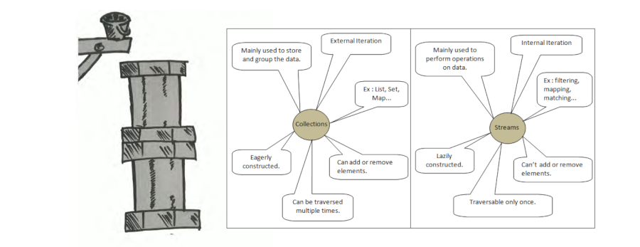

Estas operaciones realizadas con los Stream pueden ser de dos tipos:

- **🔄 Intermedia**: Filtran o transforman la secuencia de datos. Dan como resultado un nuevo **stream** al cual le podemos seguir aplicando nuevas operaciones (operaciones pendientes)
- **🏁 Terminal**: Finalizan el procesamiento (efectúa la operación resultante de las intermedias). Retornan un valor o realizan alguna acción sobre los datos.

Las colecciones en Java ofrecen métodos para pasar a streams de los objetos que contienen (métodos `stream()` y `parallelStream()`). Así, si tenemos un ArrayList llamado "usuarios" que contiene objetos de tipo "Usuario" podríamos hacer:

```java
Stream<Usuario> flujoUsuarios = usuarios.stream();
```

La idea es crear, a partir de una colección o tabla (Map), o bien explícitamente, un Stream al cual se aplican operaciones intermedias encadenadas (lo que se conoce como una tubería o *pipeline*), obteniendo un resultado final por medio de una operación terminal.

> [!TIP]
> Una primera ventaja que podemos ver en los Stream (más adelante veremos más) es que dispone de muchas más operaciones para procesar los datos que las colecciones o los mapas.

Los Stream son objetos que implementan la **interfaz Stream**. Por tanto, la clase Stream no existe y los objetos Stream no se pueden crear con un constructor sino solo invocando ciertos métodos que retornan un Stream.

Se denominan "**operaciones agregadas**" aquellas que operan sobre la totalidad de un Stream, permitiendo la ejecución en paralelo, transparente al programador, para aumentar la velocidad del proceso (imagina cálculos o búsquedas sobre matrices).

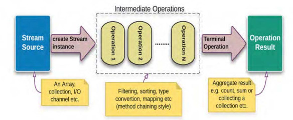

## 2. Características de un Stream

> [!IMPORTANT]
> Los cuatro pilares —inmutabilidad, encadenamiento, pereza y posibilidad de paralelizar— son la base sobre la que se construye toda la API.

| Icono | Característica | Explicación breve |
| :-- | :-- | :-- |
| 🔗 | **Encadenables** | Cada operación intermedia devuelve otro Stream; esto permite *pipelines* legibles. |
| ⏳ | **Evaluación perezosa** | Nada se ejecuta hasta que llega una operación terminal. Las operaciones intermedias se ponen en cola y son invocadas al ejecutar una operación terminal (se invoca la composición de las intermedias). Eso habilita optimizaciones. |
| 🛡️ | **Inmutables** | El Stream no altera la colección fuente; genera resultados nuevos. |
| ⚡ | **Paralelizables** | Basta `.parallel()` para repartir el trabajo sobre varios hilos; el *spliterator* decide la división óptima. |

> [!WARNING]
> Una vez que un Stream ha sido consumido por una operación terminal, no puede ser reutilizado. Es decir, **solo se puede consumir una vez**. Intentar usarlo de nuevo lanzará una `IllegalStateException`.

### Iteración interna vs. externa

Los bucles `for` son **iteración externa**: el programador controla cada paso.
Los Streams delegan ese detalle en la API (**iteración interna**); esto permite paralelizar sin reescribir el código.

## 3. Subtipos básicos

Los Streams de primitivos evitan el *autoboxing* y añaden utilidades estadísticas:

- **IntStream**: Stream de elementos "int" (ya que sabemos que no se puede hacer `Stream<int>`)
- **LongStream**: Stream de elementos `long`
- **DoubleStream**: Stream de elementos `double`


```java
IntStream enteros = IntStream.of(1, 2, 3, 4, 5);
LongStream largos = LongStream.range(1, 1000000);
DoubleStream decimales = DoubleStream.of(1.1, 2.2, 3.3);
```

**Métodos principales:**

| Método               | Descripción                                                                 |
|----------------------|-----------------------------------------------------------------------------|
| **`sum()`**          | Devuelve la suma de todos los elementos del stream                          |
| **`average()`**      | Calcula la media aritmética de los elementos (devuelve `OptionalDouble`)    |
| **`summaryStatistics()`** | Devuelve objeto con estadísticas (suma, media, min, max, count)            |
| **`range(inicio, fin)`** | Genera secuencia de números desde `inicio` (incluido) hasta `fin` (excluido) |
| **`rangeClosed(inicio, fin)`** | Genera secuencia desde `inicio` hasta `fin` (ambos incluidos)               |
| **`boxed()`**        | Convierte el stream de primitivos a `Stream` del tipo envoltorio correspondiente (objetos)                     |
| **`mapToObj()`**     | Transforma elementos primitivos a objetos mediante función de mapeo         |
| **`max()`**          | Devuelve el valor máximo (`Optional` del tipo primitivo)                    |
| **`min()`**          | Devuelve el valor mínimo (`Optional` del tipo primitivo)                    |

> [!IMPORTANT]
>
> Los métodos anteriores están disponibles en `IntStream`, `LongStream` y `DoubleStream`, excepto los métodos `range` y `rangeClosed` que no están disponibles en `DoubleStream`

## 4. Formas de crear un Stream

Hay diversas maneras de obtener un Stream inicial, es decir, que no proceda de otro Stream:

### 📂 A partir de una colección

Método: `default Stream<E> stream()` de la interfaz `Collection<T>`

Ejemplo:

```java
List<Alumno> lista = ...;
Stream<Alumno> s1 = lista.stream();
```

### 📋 A partir de un array

Método: `public static <T> Stream<T> of(T... values)` de la interfaz `Stream<T>`

Ejemplo:

```java
// Debes usarlo solo para arrays de tipos derivados.
Stream<Integer> nombreStream = Stream.of(new Integer[]{1,2,3});
```

Método: `public static IntStream stream(int[] array)` de la clase `Arrays`

- También sobrecargado para otros tipos primitivos.
- Para tipos derivados el método es `static <T> Stream<T> stream(T[] array)`

Ejemplo:

```java
// Puedes usarlo para arrays de tipos derivados o primitivos.
IntStream nombreStream2 = Arrays.stream(new int[]{1,2,3});
```

### 🎯 Inicializándolo directamente

Método: `public static <T> Stream<T> of(T... values)` de la interfaz `Stream<T>`

Ejemplo:

```java
Stream<String> vocales = Stream.of("a","e","i","o","u");
```

### 🔄 Iterando sobre un valor inicial

Método (Stream infinito): `static <T> Stream<T> iterate(T seed, UnaryOperator<T> f)` de la interfaz `Stream<T>`

Ejemplo:

```java
// Stream infinito con los números pares a partir del 4
Stream<Integer> nombreStream = Stream.iterate(4, i -> i + 2);
```

Método (Stream finito): `static <T> Stream<T> iterate(T seed, Predicate<? super T> hasNext, UnaryOperator<T> next)` de la interfaz `Stream<T>`

Ejemplo:

```java
// Stream con condición de parada (como el anterior, pero solo hasta el 100)
Stream<Integer> nombreStream = Stream.iterate(4, i -> i < 100; i -> i + 2);
```

### 🎲 A partir de un Supplier

Método: `static <T> Stream<T> generate(Supplier<? extends T> s)` de la interfaz `Stream<T>`

Ejemplo:

```java
Stream<Double> aleatorios = Stream.generate(Math::random);  
```

### ↔️ A partir de un rango

También podemos crear IntStream haciendo un rango abierto o bien cerrado:

```java
IntStream cifrasPositivas = IntStream.range(1, 10);      // [1, 10)
// o bien
IntStream cifrasPositivas = IntStream.rangeClosed(1, 9); // [1, 9]
```

### 🌊 A partir de otros métodos de la API

Algunas clases de la API de Java tienen métodos que retornan Stream o alguno de sus derivados (IntStream, DoubleStream...), a destacar por ejemplo la clase Random:

```java
// Genera un stream de 100 enteros aleatorios entre 0 y 10
IntStream aleatorios = new Random().ints(100, 0, 10);
```

Otro ejemplo, la clase String nos ofrece `chars()` que genera un IntStream con todos sus caracteres (en formato entero):

```java
String hola = "Hola mundo!";
hola.chars().forEach(System.out::println);

// O para verlos como caracteres
hola.chars().forEach(i -> System.out.println((char) i));
```

En realidad no necesitamos crear las variables:

```java
"Hola mundo!".chars().forEach(i -> System.out.println((char) i));
```

> [!NOTE]
> Más adelante veremos otras clases que también devuelven Streams, como puede ser la clase `Files`con su método `lines()` que nos devuelve un Stream con las líneas del fichero de texto leído.
---
> [!TIP]
> Prueba el método `tokens()` de la clase Scanner.

## 5. Opciones de filtrado

- **filter(`Predicate<T>`)**: Mantiene solo los elementos que cumplan la condición.
- **limit(n)**: Mantiene solo los *n* primeros elementos
- **skip(m)**: Omite los *m* primeros elementos
- **distinct**: Descarta los elementos repetidos (según marque `equals`)

### 5.1 Filter

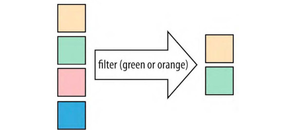

- **🔄 Operación intermedia**
- Nos permite eliminar aquellos elementos del stream que no cumplen una determinada condición
- Condición como Predicate
- Muy combinable con findFirst, findAny
- Combinable con el resto de métodos intermedios y terminales

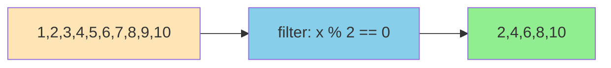

**Ejemplos:**

```java
List<Integer> valores = Arrays.asList(1, 2, 3, 4, 5, 6, 7, 8, 9, 10);
Stream<Integer> temporal = valores.stream();
temporal.filter(e -> e > 3).forEach(e -> System.out.println(e));
```

```java
List<Integer> valores = Arrays.asList(1, 2, 3, 4, 5, 6, 7, 8, 9, 10);
Predicate<Integer> esPar = e -> e % 2 == 0;
Consumer<Integer> imprimir = System.out::println;

Stream<Integer> temporal = valores.stream();
temporal.filter(esPar).forEach(imprimir);
```

```java
public class AplicacionFilter {
    public static void main(String[] args) {
        List<Integer> valores = Arrays.asList(1, 2, 3, 4, 5, 6, 7, 8, 9, 10);
        
        valores.stream()
               .filter(AplicacionFilter::esPar)
               .filter(AplicacionFilter::esMayorQue5)
               .forEach(System.out::println);
    }
    
    public static boolean esPar(Integer e) {
        return e % 2 == 0;
    }
    
    public static boolean esMayorQue5(Integer e) {
        return e > 5;
    }
}
```

**Con funciones de orden superior:**

```java
List<Integer> valores = Arrays.asList(1, 2, 3, 4, 5, 6, 7, 8, 9, 10);
Function<Integer, Predicate<Integer>> mayorQue = max -> e -> e > max;

valores.stream()
       .filter(numero -> numero % 2 == 0)
       .filter(mayorQue.apply(6))
       .forEach(System.out::println);
```

### 5.2 Limit

- **🔄 Operación intermedia**
- Nos permite limitar el número de elementos que contendrá el stream
- Pasamos como parámetro el número de elementos que tendrá el stream resultante

```java
Stream<Integer> temporal = Stream.iterate(0, n -> n + 2);
temporal.limit(5).forEach(System.out::println); // 0, 2, 4, 6, 8
```

```java
Stream.of(1, 2, 3, 4, 5, 6, 7, 8, 9, 10)
      .filter(i -> i % 2 == 0)
      .limit(3)
      .forEach(n -> System.out.print(n + " ")); // 2 4 6
```

### 5.3 Skip

- **🔄 Operación intermedia**
- Este método toma un número N como argumento y retorna una secuencia (stream) después de eliminar los primeros N elementos

```java
Stream.of(1, 2, 3, 4, 5, 6, 7, 8, 9, 10)
      .skip(3)
      .forEach(System.out::println); // 4, 5, 6, 7, 8, 9, 10
```

### 5.4 Distinct

- **🔄 Operación intermedia**
- Este método elimina los elementos duplicados y retorna el Stream sin duplicados

```java
Stream.of(1, 2, 2, 3, 3, 3, 4, 4, 4, 4)
      .distinct()
      .forEach(System.out::println); // 1, 2, 3, 4
```

**Diferencias entre operaciones:**

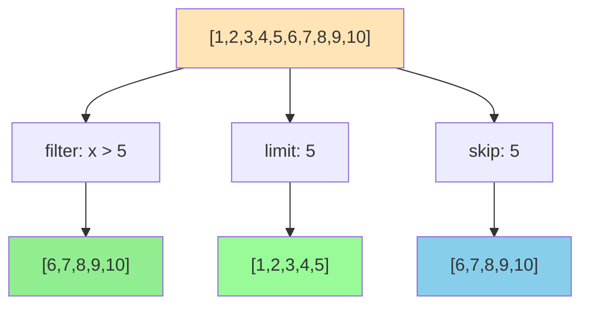

## 6. Concatenación de Streams

El método `Stream.concat()` crea un flujo concatenado en el que los elementos son todos los elementos del primer flujo seguidos de todos los elementos del segundo flujo. El flujo resultante se ordena si los dos flujos de entrada están ordenados y es paralelo si cualquier flujo de entrada es paralelo.

```java
Stream<String> s1 = Stream.of("daw", "dam", "asir");
Stream<String> s2 = Stream.of("leche", "lechuga", "agua", "sal");
Stream<String> s3 = Stream.of("verde", "azul");

Stream<String> concatenado = Stream.concat(s1, Stream.concat(s2, s3));
concatenado.forEach(System.out::println);
```

También se pueden concatenar streams de subtipos:

```java
Stream<Integer> enteros = Stream.of(9, 8, -3, 2);
Stream<Double> doubles = Stream.of(3.2, 0.75);

Stream<Number> numeros = Stream.concat(enteros, doubles);
```

## 7. Ordenación de datos - Sorted

- **🔄 Operación intermedia**
- Nos permite ordenar los elementos de un stream
- Recordemos que para ordenar cualquier conjunto de objetos de una clase necesitamos en primer lugar que implemente la interfaz `Comparable<T>`. También se puede pasar como parámetro un `Comparator<T>`

| Firma | Orden que aplica | Requisitos |
| :-- | :-- | :-- |
| `sorted()` | Orden natural (`Comparable`) | Elementos implementan `Comparable` |
| `sorted(Comparator)` | Personalizado | Se pasa una instancia `Comparator` |

```java
// Ordenación natural
Stream.of(15, 4, 8, 1, -5)
      .sorted()
      .forEach(n -> System.out.print(n + " ")); // -5 1 4 8 15

// Ordenación inversa
Stream.of(15, 4, 8, 1, -5)
      .sorted((a, b) -> b - a)
      .forEach(n -> System.out.print(n + " ")); // 15 8 4 1 -5
```

Con objetos complejos:

```java
record Persona(String dni, String nombre, int edad) {}

Persona p1 = new Persona("75849521X", "Pepito López", 32);
Persona p2 = new Persona("94874621T", "Laura Coves", 31);
Persona p3 = new Persona("44746921V", "Ana Cazorla", 25);

// Ordenar por DNI
Stream.of(p1, p2, p3)
      .sorted((a, b) -> a.dni().compareTo(b.dni()))
      .forEach(System.out::println);

// Ordenar por edad
Stream.of(p1, p2, p3)
      .sorted((a, b) -> a.edad() - b.edad())
      .forEach(System.out::println);
```

Otras maneras de usar `sorted`:

```java
// Con Comparator.comparingInt
Stream.of(p1, p2, p3)
      .sorted(Comparator.comparingInt(Persona::edad))
      .forEach(System.out::println);

// Con Function
Function<Persona, Integer> porEdad = Persona::edad;
Function<Persona, String> porDni = Persona::dni;

Stream.of(p1, p2, p3)
      .sorted(Comparator.comparing(porEdad).thenComparing(porDni))
      .forEach(System.out::println);
```

**Ejemplo gráfico de las operaciones vistas:**

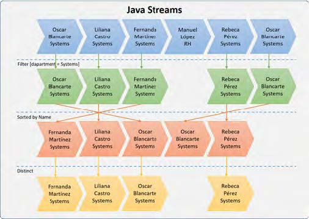

## 8. Transformación de datos

### 8.1 map

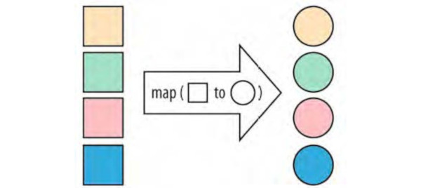

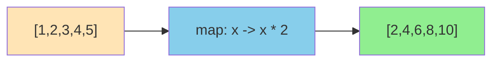

- **🔄 Operación intermedia muy utilizada**
- Permite aplicar una transformación a una serie de datos
- Retorna un stream resultado de la correspondencia de cada elemento de la secuencia original transformado en otro dato
- Acepta como parámetro una función (`Function<T, R>`)

> [!IMPORTANT]
> Recuerda que `map` hace una transformación 1 a 1, es decir, mantendremos **el mismo número de elementos** que en el Stream original.

**Ejemplos:**

```java
// Bloque 1: Duplicar números y mostrarlos por pantalla
Stream.of(15, 4, 8, 1, -5)
    .map(n -> n * 2)
    .forEach(System.out::println);

// Bloque 2: Crear objetos Persona y mostrar sus DNIs
Persona p1 = new Persona("75849521X", "Pepito López", 32);
Persona p2 = new Persona("94874621I", "Laura Coves", 31);
Persona p3 = new Persona("44746921V", "Ana Cazorla", 25);

Stream.of(p1, p2, p3)
    .map(Persona::dni)
    .forEach(System.out::println);

// Bloque 3: Mostrar DNIs invertidos usando StringBuilder
Stream.of(p1, p2, p3)
    .map(Persona::dni)
    .map(StringBuilder::new)
    .map(StringBuilder::reverse)
    .forEach(System.out::println);

// Bloque 4: Convertir números decimales a fracciones simplificadas
Stream.of(0.6, 2.5, 0.25, 0.4)
    .map(Fraccion::new)
    .map(Fraccion::simplificar)
    .forEach(System.out::println);

// Bloque 5: Ordenar fracciones simplificadas por valor numérico
Stream.of(0.6, 2.5, 0.25, 0.4)
    .map(Fraccion::new)
    .map(Fraccion::simplificar)
    .sorted((a, b) -> Double.compare(a.toDouble(), b.toDouble()))
    .forEach(System.out::println);
```

> [!IMPORTANT]
> Observa que intentamos dividir en el máximo número de pasos posibles. Cada paso es una transformación `map`. Esto permite corregir errores más fácilmente, y evita excepciones de tipo `NullPointerException`.
>
> Mejor hacer `.map(Persona::dni).map(String::toUpperCase)` que `.map(p -> p.dni().toUpperCase())`

### 8.2 mapToInt y mapToDouble

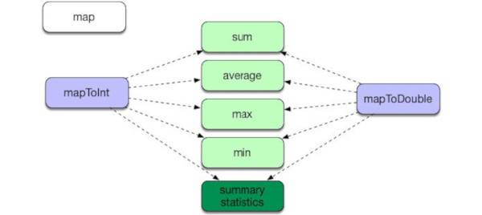

Hay tres métodos adicionales orientados a trabajar con datos numéricos primitivos (Evitan el coste de *boxing*). Estos métodos son `mapToInt`, `mapToLong` y `mapToDouble`. Si cambiamos nuestro método de map a mapToInt, mapToLong o mapToDouble (cuando sabemos que la transformación es **a un entero, entero largo, o un double primitivos**) se nos abrirá la posibilidad de acceder a métodos adicionales orientados a estadísticas.

> [!WARNING]
> Ten en cuenta que `mapToInt` devuelve un `IntStream` y no un `Stream<Integer>`, `mapToLong` devuelve un `LongStream` y `mapToDouble` devuelve un `DoubleStream`.
---
> [!IMPORTANT]
> Los métodos **sum, average, max y min son TERMINALES** (igual que forEach) por lo que retornan un resultado y no otro stream. En el caso de "average", "max" y "min" retornan un **Optional**.

```java
// MapToInt para trabajar con enteros primitivos
final int suma = Stream.of("1", "2", "3", "4", "5") // Stream<String>
      .mapToInt(Integer::parseInt)                  // IntStream
      .sum(); // 15

Stream.of(15, 4, 7, 1, -5)  // Stream<Integer>
    .mapToInt(n -> n*2)     // IntStream
    .max()                  // OptionalInt
    .ifPresent(System.out::println);

// MapToDouble para media de precios
Stream.of(producto1, producto2, producto3)
      .mapToDouble(Producto::precio)
      .average()
      .ifPresent(System.out::println);
```

Estadísticas:

```java
final IntSummaryStatistics stats = Stream.of(p1, p2, p3)
                                   .mapToInt(Persona::edad)
                                   .summaryStatistics();

System.out.println("Count: " + stats.getCount());
System.out.println("Sum: " + stats.getSum());
System.out.println("Min: " + stats.getMin());
System.out.println("Average: " + stats.getAverage());
System.out.println("Max: " + stats.getMax());
```

### 8.3 MapToObj

Una otra de las operaciones intermedias que podemos hacer es `mapToObj` sobre un IntStream / LongStream / DoubleStream. Este método retorna un Stream (de tipos derivados) con valor de objeto que consta de los resultados de aplicar la función dada.

**Ejemplos:**

```java

// Convertir enteros a hexadecimal
IntStream.range(10, 16)                     // IntStream
         .mapToObj(Integer::toHexString)    // Stream<String>
         .forEach(System.out::println);     // a, b, c, d, e, f

// Convertir doubles a objetos
DoubleStream.of(90.0, 45.0, 30.0)                       // DoubleStream
            .mapToObj(grados -> new Angulo(grados))     // Stream<Angulo>
            .forEach(System.out::println);
```

### 8.4 flatMap

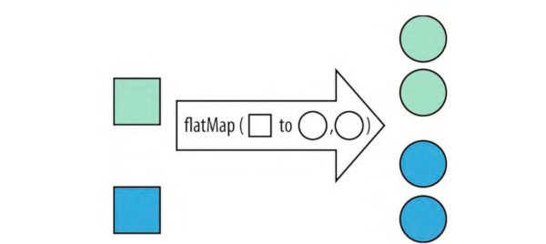

Los streams sobre colecciones de un nivel (como List) se pueden transformar (map) fácilmente. Pero **¿qué pasa si tenemos una colección que incluye dentro otra?**

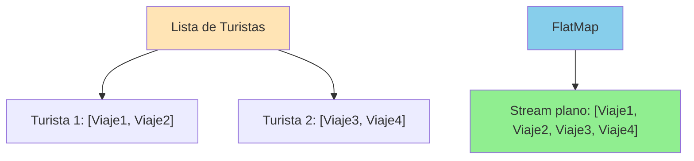

**Ejemplo práctico:**

```java
record Viaje(String destino, int dias) {}
record Turista(List<Viaje> viajes, String dni, String nombre, int edad) {}

final Viaje v1 = new Viaje("Mallorca", 7);
final Viaje v2 = new Viaje("Roma", 10);
final Viaje v3 = new Viaje("París", 8);
final Viaje v4 = new Viaje("Valencia", 3);

final Turista t1 = new Turista(List.of(v1, v3), "78459874X", "David Tibar", 28);
final Turista t2 = new Turista(List.of(v2, v4), "95415258Q", "Laura Méndez", 32);

final List<Turista> turistas = new ArrayList<>(List.of(t1, t2));
```

Para ver todas las destinaciones, con estilo imperativo "for" anidamos dos bucles:

```java
for (Turista t : turistas) {
    for (Viaje v : t.viajes()) {
        System.out.println(v.destino());
    }
}
```

Podemos observar bien para darnos cuenta de los tipos de retorno de los métodos intermedios:

```java
// Intento sin flatMap
turistas.stream()                       // Stream<Turista>
        .map(t -> t.viajes())           // Stream<List<Viaje>>
        .forEach(System.out::println);  // Imprime las listas, no los viajes individuales
```

Necesitamos un método que unifique todas las listas de viajes en un solo Stream: Esa es la funcionalidad de flatMap (transforma y aplana).

Con flatMap no solo aplicamos una transformación, sino que pasan a un solo Stream, a un solo nivel de anidación:

```java
turistas.stream()      
        .map(t -> t.viajes())         // Stream<List<Viaje>>
        .flatMap(lv -> lv.stream())   // Stream<Viaje>
        .map(v -> v.destino())        // Stream<String>
        .forEach(System.out::println);
```

Imaginemos que queremos obtener la suma de todos los días que han estado de vacaciones nuestros turistas en todos sus viajes:

```java
final int totalDias = turistas.stream()
    .map(Turista::viajes)
    .flatMap(List::Stream)
    .mapToInt(Viaje::dias)
    .sum();
System.out.println("Total días de vacaciones: " + totalDias);
```

También tenemos las versiones primitivas (flatMapToInt, ...):

```java
final int[][] numeros = {{1, 2, 2, 3, 1, 4}, {4, 2, 3, 3, 1, 1}};
Arrays.stream(numeros)
      .flatMapToInt(fila -> Arrays.stream(fila))
      .forEach(System.out::println);
```

**Otra forma de concatenar Streams:**

```java
// ==================================================
// Ejemplo 1: Concatenación de Streams usando Stream.concat()
// Forma tradicional anidando llamadas a concat
// ==================================================
Stream<String> s1 = Stream.of("daw", "dam", "asir");
Stream<String> s2 = Stream.of("leche", "lechuga", "agua", "sal");
Stream<String> s3 = Stream.of("verde", "azul");

Stream<String> concatenado = Stream.concat(s1, Stream.concat(s2, s3));

concatenado.forEach(System.out::println);

// ==================================================
// Ejemplo 2: Concatenación alternativa usando flatMap()
// Versión más limpia sin anidamientos
// ==================================================
Stream<String> s1 = Stream.of("daw", "dam", "asir");
Stream<String> s2 = Stream.of("leche", "lechuga", "agua", "sal");
Stream<String> s3 = Stream.of("verde", "azul");

Stream<String> concatenado = Stream.of(s1, s2, s3)
    .flatMap(x -> x); // flatMap aplana los streams

concatenado.forEach(System.out::println);
```

>[!IMPORTANT]
> Hemos dicho que `map` hace una transformación 1 a 1, por lo que el Stream resultante mantenía el mismo número de elementos que el original.
>
> Cuando usamos `flatMap` **el número de elementos del Stream resultante será siempre igual o mayor** al número de elementos del Stream original.

### 8.5 mapMulti

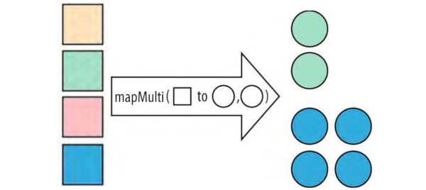

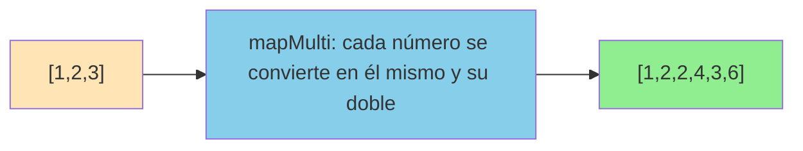

- **🔄 Operación intermedia** introducida en **Java 16**
- Permite mapear cada elemento a **cero, uno o múltiples elementos**
- Es una alternativa más eficiente a `flatMap` en ciertos casos
- Utiliza un `Consumer` que acepta el elemento actual y un `Consumer` para emitir resultados

> [!IMPORTANT]
> `mapMulti` es especialmente útil cuando:
>
> - La transformación es condicional (algunos elementos pueden no generar salida)
> - Cada elemento puede generar un número variable de resultados
> - Queremos mejor rendimiento que `flatMap` para transformaciones simples

**Firma del método:**

```java
<R> Stream<R> mapMulti(BiConsumer<? super T, ? super Consumer<R>> mapper)
```

**Ejemplos básicos:**

```java
// Ejemplo 1: Cada número genera él mismo y su doble
Stream.of(1, 2, 3)
      .mapMulti((numero, consumer) -> {
          consumer.accept(numero);      // Emite el número original
          consumer.accept(numero * 2);  // Emite el doble
      })
      .forEach(System.out::println); // 1, 2, 2, 4, 3, 6
```

```java
// Ejemplo 2: Filtrado condicional - solo números pares y su doble
Stream.of(1, 2, 3, 4, 5)
      .mapMulti((numero, consumer) -> {
          if (numero % 2 == 0) {
              consumer.accept(numero);
              consumer.accept(numero * 10);
          }
      })
      .forEach(System.out::println); // 2, 20, 4, 40
```

**Comparación con flatMap:**

```java
// Con flatMap (menos eficiente para casos simples)
Stream.of(1, 2, 3)
      .flatMap(n -> Stream.of(n, n * 2))
      .forEach(System.out::println);

// Con mapMulti (más eficiente)
Stream.of(1, 2, 3)
      .mapMulti((n, consumer) -> {
          consumer.accept(n);
          consumer.accept(n * 2);
      })
      .forEach(System.out::println);
```

**Ejemplo práctico con objetos:**

```java
record Persona(String nombre, List<String> hobbies) {}

Persona p1 = new Persona("Ana", List.of("leer", "correr"));
Persona p2 = new Persona("Luis", List.of("cocinar", "viajar", "fotografía"));
Persona p3 = new Persona("María", List.of());

// Obtener todos los hobbies de todas las personas
Stream.of(p1, p2, p3)
      .mapMulti((persona, consumer) -> {
          for (String hobby : persona.hobbies()) {
              consumer.accept(hobby);
          }
      })
      .forEach(System.out::println); // leer, correr, cocinar, viajar, fotografía
```

**Ejemplo con transformación condicional:**

```java
// Solo procesar personas mayores de edad y emitir sus datos
record PersonaCompleta(String nombre, int edad, String email) {}

Stream.of(
    new PersonaCompleta("Ana", 17, "ana@email.com"),
    new PersonaCompleta("Luis", 25, "luis@email.com"),
    new PersonaCompleta("María", 16, "maria@email.com")
)
.mapMulti((persona, consumer) -> {
    if (persona.edad() >= 18) {
        consumer.accept("Nombre: " + persona.nombre());
        consumer.accept("Email: " + persona.email());
        consumer.accept("---");
    }
})
.forEach(System.out::println);
// Salida:
// Nombre: Luis
// Email: luis@email.com
// ---
```

**Ejemplo con números primos:**

```java
// Para cada número, emitir todos sus divisores primos
public static boolean esPrimo(int n) {
    if (n < 2) return false;
    for (int i = 2; i <= Math.sqrt(n); i++) {
        if (n % i == 0) return false;
    }
    return true;
}

Stream.of(12, 15, 20)
      .mapMulti((numero, consumer) -> {
          for (int i = 2; i <= numero; i++) {
              if (numero % i == 0 && esPrimo(i)) {
                  consumer.accept(i);
              }
          }
      })
      .forEach(System.out::println); // 2, 3, 3, 5, 2, 5
```

**mapMulti con tipos primitivos:**

Java también proporciona versiones especializadas para tipos primitivos:

```java
// mapMultiToDouble
Stream.of(1, 2, 3)
      .mapMultiToDouble((numero, consumer) -> {
          consumer.accept(numero);
          consumer.accept(numero + 0.5);
      })
      .forEach(System.out::println); // 1.0, 1.5, 2.0, 2.5, 3.0, 3.5
```

**Ventajas de mapMulti sobre flatMap:**

| Aspecto | mapMulti | flatMap |
|---------|----------|---------|
| **Rendimiento** | ✅ Mejor para transformaciones simples | ❌ Overhead de crear streams intermedios |
| **Memoria** | ✅ Menor uso de memoria | ❌ Crea objetos Stream adicionales |
| **Legibilidad** | ⚠️ Puede ser menos intuitivo | ✅ Más declarativo |
| **Flexibilidad** | ✅ Control total sobre cuándo emitir | ❌ Debe crear un Stream completo |

**Cuándo usar mapMulti:**

- ✅ **Transformaciones condicionales**: Cuando algunos elementos no deben generar salida
- ✅ **Rendimiento crítico**: Cuando necesitas optimizar el uso de memoria
- ✅ **Emisión controlada**: Cuando quieres control fino sobre cuándo emitir elementos
- ✅ **Transformaciones simples**: Para reemplazar `flatMap` con lógica básica

**Cuándo preferir flatMap:**

- ✅ **Código más legible**: Cuando la claridad es más importante que el rendimiento
- ✅ **Transformaciones complejas**: Cuando ya tienes streams o colecciones para trabajar
- ✅ **Composición funcional**: Cuando quieres mantener un estilo más funcional

> [!TIP]
> **Regla práctica**: Usa `mapMulti` cuando necesites mejor rendimiento y tengas lógica imperativa simple. Usa `flatMap` cuando priorices la legibilidad y tengas transformaciones más complejas.

## 9. Reducción de datos - Reduce

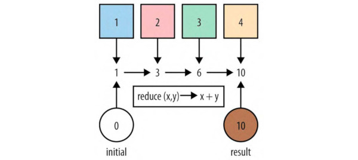

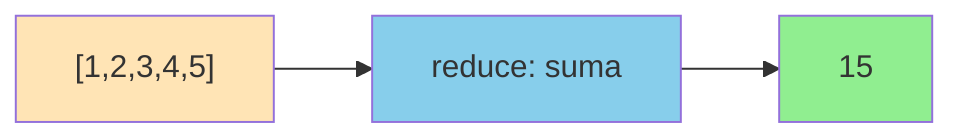

Firmas del método reduce:

- `reduce(BinaryOperator<T> accumulator): Optional<T>`
Realiza la reducción del Stream usando una función asociativa. Retorna un Optional
- `reduce(T identity, BinaryOperator<T> accumulator): T`
Realiza la reducción usando un valor inicial y una función asociativa. Retorna un valor como resultado
- `reduce(U identity, BiFunction<U,? super T,U> accumulator, BinaryOperator<U> combiner): U`
Realiza la reducción parcial (programación parapela) usando un valor inicial y una función asociativa. Finalmente combina los resultados parciales y retorna el valor resultante.

Reduce el Stream, lo que nos permite obtener un único resultado partiendo de un stream. Es por tanto una **Operación terminal**.

Para poder conseguir nuestro resultado único final, haremos uso de los parámetros siguientes:

- **Identidad (Identity)**: Es el valor inicial del proceso. [Parámetro opcional. Si no se proporciona este parámetro el método "reduce" retorna un Optional]
- **Acumulador (Accumulator)**: Es el encargado de procesar los valores y acumular el resultado
- **Combinador (Combiner)**: El combinador es usado para combinar el resultado parcial obtenido cuando la reducción es paralelizada. [Parámetro opcional]

**Ejemplos:**

```java
// Sin identity (retorna Optional)
final Optional<Integer> suma = Stream.of(9, 8, 2, 15, 3)
    .reduce((acumulador, siguiente) -> acumulador + siguiente);

suma.ifPresent(System.out::println);

// Con identity (retorna el tipo directamente)
final Integer suma2 = Stream.of(9, 8, 2, 15, 3)
    .reduce(0, (acumulador, siguiente) -> acumulador + siguiente);
System.out.println(suma2);

// Usando Integer::sum
final int suma3 = Stream.of(9, 8, 2, 15, 3)
    .reduce(0, Integer::sum);
System.out.println(suma3);
```

**¿Cómo podemos imprimir la suma de días de todos los viajes efectuados por los turistas? ¿Y la suma de días de cada turista?**

```java
// Suma total de días
final int totalDias = turistas.stream()
                       .map(Turista::viajes)
                       .flatMap(List::stream)
                       .map(Viaje::dias)
                       .reduce(0, Integer::sum);
System.out.println("Total días: " + totalDias);

// Suma de días por turista
turistas.stream()
        .map(Turista::viajes)
        .map(List::stream)
        .map(ls -> ls.map(Viaje::dias))
        .map(sd -> sd.reduce(0, Integer::sum))
        .forEach(diasTurista -> System.out.println("Días del turista: " + diasTurista));
```

> [!WARNING]
> **Analiza qué imprime el siguiente código:**
>
> ```java
> String reduce = Stream.of("Enero", "Marzo", "Junio", "Agosto", "Noviembre")
>                      .map(String::toUpperCase) 
>                      .reduce("", (a, m) -> a + m.charAt(a.length())); 
> System.out.println(reduce); 
> ```
>
> Respuesta: "EANSE" (para cada palabra extrae el caracter correspondiente al índice de dicha palabra en el Stream y los concatena)

**Otra forma más de concatenar Streams:**

```java
// ==================================================
// Ejemplo: Concatenación de Streams usando reduce()
// Alternativa funcional para combinar múltiples streams
// ==================================================
Stream<String> s1 = Stream.of("daw", "dam", "asir");
Stream<String> s2 = Stream.of("leche", "lechuga", "agua", "sal"); 
Stream<String> s3 = Stream.of("verde", "azul");

// Concatenación con reduce (Stream vacío como identidad + operador concat)
Stream<String> concatenado = Stream.of(s1, s2, s3)
    .reduce(Stream.empty(), Stream::concat);

concatenado.forEach(System.out::println);
```

## 10. Operaciones terminales

Hasta ahora la mayoría de operaciones vistas son intermedias (generan otro stream). Un ejemplo de operación terminal sería "reduce" o "forEach" que ya no retornan otro stream. También hemos visto otras operaciones terminales como sum, average, max y min (en este caso solo para los IntStream o DoubleStream).

**Operaciones terminales principales:**

- **`long count()`**: Retorna un entero largo con el número de elementos que contiene el Stream
- **`Optional<T> findFirst()`**: Retorna un Optional con el primer elemento del Stream, o un Optional vacío si no hay ningún elemento
- **`Optional<T> findAny()`**: Retorna un Opcional con un elemento cualquiera del Stream o un Optional vacío si no hay ningún elemento
- **`boolean allMatch(predicado)`**: Retorna true si la condición del predicado se cumple para todos los elementos del Stream, false para el resto de casos
- **`boolean anyMatch(predicado)`**: Retorna true si la condición del predicado la cumple al menos un elemento del Stream, false para el resto de casos
- **`boolean noneMatch(predicado)`**: Retorna true si la condición del predicado no se cumple para ningún elemento del Stream, false para el resto de casos

Ejemplos:

```java
final List<Integer> lista = List.of(1, 9, 3, 7, 65, 9, -32, 1);

// Contar cuantos números positivos hay
final long numerosPositivos = lista.filter(i -> i > 0).count();
System.out.println("Positivos: " + numerosPositivos)


// Primer elemento que sea par
final Optional<Integer> primer = List.of(1, 9, -3, 7)
                               .stream()
                               .filter(i -> i % 2 == 0)
                               .findFirst();
primer.ifPresentOrElse(
    i -> System.out.println("Primer par: " + i),
    () -> System.out.println("No se ha encontrado ningún elemento par")
);

// Un elemento que sea par
List.of(1, 2, -3, 8)
    .stream()
    .filter(i -> i % 2 == 0)
    .findAny();
    .ifPresentOrElse(
        i -> System.out.println("Número par: " + i),
        () -> System.out.println("No se ha encontrado ningún elemento par")
    );


// allMatch, anyMatch, noneMatch
final boolean todosPositivos = List.of(1, 7, 3, 9)
                                .stream()
                                .allMatch(i -> i > 0);
System.out.println("Todos positivos: " + todosPositivos);

final boolean algunNegativo = List.of(1, 7, -3, 9)
                                .stream()
                                .anyMatch(i -> i < 0);
System.out.println("Hay al menos un negativo: " + algunNegativo);

final boolean sinPares = List.of(1, 7, 3, 9)
                            .stream()
                            .noneMatch(i -> i % 2 == 0);
System.out.println("No hay pares: " + sinPares);
```

**Combinando predicados:**

```java
final Predicate<Integer> positivo = i -> i > 0;
final Predicate<Integer> positivoPar = positivo.and(i -> i % 2 == 0);

final boolean algunPositivoPar = Arrays.asList(1, 7, 2, 9)
                           .stream()
                           .anyMatch(positivoPar);
System.out.println("Hay al menos un positivo par: " + algunPositivoPar);
```

> [!NOTE]
> Con todo lo visto hasta el momento, ya se pueden realizar los **ejercicios 1 al 15** del problema de esta unidad.

## 11. Recolectores (Collectors)

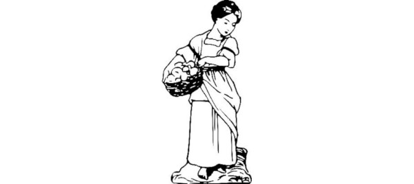

Hasta ahora, las operaciones realizadas con streams han acabado con una salida por consola.

¿Y si queremos transformar un stream (inmutable) y guardar el resultado en una colección (mutable)? → Operación collect

Java SE 8 introduce **Collectors**, con métodos estáticos muy usuales y prácticos en el paquete `java.util.stream.Collectors.*`

Nos permite realizar algún tipo de operación y recolectar el valor en uno solo (un solo valor, una sola colección...).

Algunos recolectores básicos son:

- **counting**: cuenta el número de elementos
- **minBy, maxBy**: obtiene el mínimo o máximo según un comparador
- **summingInt, summingLong, summingDouble**: la suma de los elementos (según el tipo)
- **averagingInt, averagingLong, averagingDouble**: la media (según el tipo)
- **summarizingInt, summarizingLong, summarizingDouble**: los valores anteriores, agrupados en un objeto de resumen de estadísticas (según el tipo)
- **joining**: unión de los elementos en una cadena de texto

### 11.1 A Collection

Producen como resultado una de las colecciones ya conocidas: List y Set.

En el siguiente ejemplo convertimos el "stream" en una **lista modificable**:

```java
final List<Integer> lista = Stream.iterate(0, i -> i + 7)
                             .filter(i -> i % 2 == 0)
                             .limit(5)
                             .collect(toList());
lista.add(99);
System.out.println(lista);
```

> [!NOTE]
> Utiliza `Collectors.toList()` si no has importado la clase "Collectors" en tu proyecto

También podemos hacerlo en una lista no modificable:

```java
final List<Integer> lista = datos.collect(Collectors.toUnmodifiableList());
```

> [!TIP]
> A partir del JDK 16 se añade el método `toList()` a la clase "Stream" (sin hacer uso de "collect") que simplifica mucho nuestra tarea (en este caso la lista que devuelve es **inmutable**):
>
> ```java
> final List<Integer> datos = Stream.iterate(0, i -> i + 7) 
>                               .filter(i -> i % 2 == 0) 
>                               .limit(5) 
>                               .toList(); 
> ```
>
>---

También podemos recolectar los datos en un **Set**:

```java
final Set<Integer> conjunto = Stream.of(2, 8, 3, 2, 5, 8, 2)
                                .filter(i -> i % 2 == 0)
                                .collect(Collectors.toSet());
System.out.println(conjunto); // [2, 8] (sin duplicados)
```

Si queremos utilizar una **implementación personalizada (ArrayList, LinkedList, HashSet...)**, necesitaremos utilizar el recolector `toCollection`:

```java
final ArrayList<Integer> lista = Stream.of(2, 8, 3, 2, 5, 8, 2)
                                    .filter(i -> i % 2 == 0)
                                    .collect(Collectors.toCollection(ArrayList::new));

final LinkedList<Integer> listaEnlazada = Stream.of(2, 8, 3, 2, 5, 8, 2)
                                            .filter(i -> i % 2 == 0)
                                            .collect(Collectors.toCollection(LinkedList::new));
```

### 11.2 A Map

El recolector `toMap` se puede utilizar para recolectar elementos Stream en una instancia de "map". Para hacerlo, necesitamos proporcionar dos funciones.

Para cada elemento del Stream:

- **keyMapper**: extrae la clave de mapa
- **valueMapper**: extrae un valor asociado a la clave del mapa

Por ejemplo si queremos guardar los elementos en un "Map" que tenga cadenas como claves y sus longitudes como valores:

```java
final Map<String, Integer> mapaLongitudes = Stream.of("leche", "agua", "pescado", "lechuga")
                                            .collect(Collectors.toMap(
                                                Function.identity(),    // clave: la misma cadena
                                                String::length         // valor: su longitud
                                            ));
System.out.println(mapaLongitudes);
```

También podemos, a partir de un Stream de personas generar un "Map" cuya clave sea el DNI y su valor sea su nombre:

```java
final Map<String, String> dniNombre = Stream.of(p1, p2, p3)
                                        .collect(Collectors.toMap(
                                            Persona::dni,
                                            Persona::nombre
                                        ));
```

> [!CAUTION]
>
> `toMap` NO evalúa si los valores clave son iguales. Si encuentra claves duplicadas, lanza inmediatamente una `IllegalStateException`.
>
> En estos casos con colisión de claves, deberíamos utilizar toMap con un tercer parámetro que indica qué hacer en caso de colisiones:
>
> ```java
> final Map<String, String> mapa = personas.stream()
>                                   .collect(Collectors.toMap(
>                                      Persona::edad,      // Clave que puede repetirse
>                                      Persona::nombre,
>                                      (existente, nuevo) -> existente + ", " + nuevo // Combinar valores
>                                   ));
> ```
>

### 11.3 Collecting and then

`collectingAndThen` es un recolector especial que nos permite realizar otra acción en un resultado, inmediatamente después de que finaliza la recolección.

```java
// Recolecta a una lista, y la convierte a lista inmodificable.
final List<Integer> lista = Stream.iterate(0, i -> i + 7)
    .filter(i -> i % 2 == 0)
    .limit(5)
    .collect(Collectors.collectingAndThen(
        Collectors.toList(), 
        Collections::unmodifiableList
    ));
```

```java
// Recolecta en una lista, y llama al método size de dicha lista
final int longitud = Stream.iterate(0, i -> i + 7)
    .filter(i -> i % 2 == 0)
    .limit(5)
    .collect(Collectors.collectingAndThen(
        Collectors.toList(), 
        List::size
    ));
```

 **¿Qué mostrará por pantalla?**

 ```java
 final String resultado = Stream.of("uno", "dos", "tres")
                            .collect(Collectors.collectingAndThen( 
                                Collectors.joining("-"), 
                                String::toUpperCase 
                            )); 
System.out.println(resultado); 
```

 Respuesta: UNO-DOS-TRES

```java
final List<String> productos = Stream.of("leche", "agua", "pescado", "lechuga")
    .collect(Collectors.collectingAndThen(
        Collectors.toList(), 
        l -> l.subList(0, l.size() - 1)  
    ));

System.out.println(productos);
```

Respuesta: [leche, agua, pescado]

### 11.4 Joining

El recolector `joining` se puede utilizar para unir elementos `Stream<String>`.

Podemos unirlos haciendo:

```java
final String resultado = Stream.of("Java", "Python", "JavaScript")
                            .collect(Collectors.joining());
System.out.println(resultado); // "JavaPythonJavaScript"
```

Podemos mostrar una lista de enteros separados por comas:

```java
final String numeros = Stream.of(1, 2, 3, 4, 5)
                        .map(Object::toString)
                        .collect(Collectors.joining(", "));
System.out.println(numeros); // "1, 2, 3, 4, 5"
```

También podemos concatenar un String a principio y final de la cadena resultante:

```java
final String resultado = Stream.of("Java", "Python", "JavaScript")
                            .collect(Collectors.joining(", ", "[", "]"));
System.out.println(resultado); // "[Java, Python, JavaScript]"
```

### 11.5 Counting

Counting es un recolector simple que permite contar todos los elementos del Stream:

```java
final long elementos = Stream.of("leche", "agua", "pescado", "lechuga")
                        .collect(Collectors.counting());
System.out.println(elementos); // 4
```

### 11.6 Summarizing

```java
final DoubleSummaryStatistics longitudes = Stream.of("leche", "agua", "pez", "lechuga")
                                            .collect(Collectors.summarizingDouble(String::length));
System.out.println(longitudes);
// DoubleSummaryStatistics{count=4, sum=19,000000, min=3,000000, average=4,750000, max=7,000000}

final IntSummaryStatistics edades = Stream.of(p1, p2, p3)
                                    .collect(Collectors.summarizingInt(Persona::edad));
System.out.println(edades);
// IntSummaryStatistics{count=3, sum=88, min=25, average=29,333333, max=32}
```

Podemos obtener solo la media o solo la suma de los valores:

```java
final double mediaEdades = Stream.of(p1, p2, p3)
                          .collect(Collectors.averagingInt(Persona::edad));

final int sumaEdades = Stream.of(p1, p2, p3)
                          .collect(Collectors.summingInt(Persona::edad));

final double mediaLetras = Stream.of(p1, p2, p3)
                          .collect(Collectors.averagingInt(p -> p.nombre().length()));
```

### 11.7 MaxBy / MinBy

Los recolectores `maxBy`/`minBy` retornan el elemento más grande o más pequeño de un Stream según una instancia de Comparator proporcionada.

```java
    final Optional<Integer> max = Stream.of(2,8,3,2,5,8,2)
        .collect(Collectors.maxBy(
            Comparator.naturalOrder()    
        ));
```

```java
final Optional<Persona> personaMasJoven = Stream.of(p1, p2, p3)
                                            .collect(Collectors.minBy(
                                                Comparator.comparing(Persona::edad)
                                            ));

// Otra manera
final Optional<Persona> personaMasJoven2 = Stream.of(p1, p2, p3)
                                          .min(Comparator.comparing(Persona::edad));
```

> [!NOTE]
> Podemos ver que **retorna un "Optional"** que será "empty" si no encuentra ningún valor.

### 11.8 GroupingBy

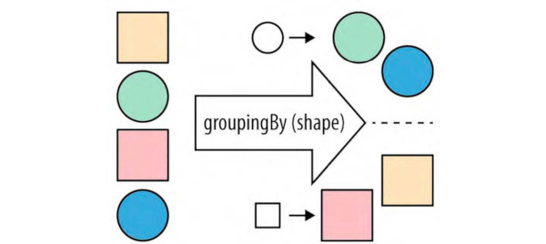

El recolector `groupingBy` se utiliza para agrupar objetos por alguna propiedad y después almacenar los resultados en una instancia de Map.

`groupingBy(Function<? super T, ? extends K> classifier, Collector<? super T, A, D> downstream)`

El primer parámetro indica la función de clasificación (de agrupamiento), mientras que el segundo indica el recolector con el que vamos a recolectar los grupos generados. Si no se indica este `downstream`por defecto se usa `toList` como se aprecia en el siguiente ejemplo.

**Por ejemplo podemos agruparlos por longitud de cadena:**

```java
final Map<Integer, List<String>> agrupadoPorLongitud = Stream.of("a", "bb", "ccc", "dd")
        .collect(Collectors.groupingBy(String::length));

System.out.println(agrupadoPorLongitud);
// {1=[a], 2=[bb, dd], 3=[ccc]}
```

```java
final Map<Integer, Set<Persona>> agrupadoPorLongitudNombre = Stream.of(p1,p2,p3)
    .collect(Collectors.groupingBy(p -> p.nombre().length(), Collectors.toSet()));

System.out.println(agrupadoPorLongitudNombre);
/* {
     11=[Persona[dni=94874621T, nombre=Laura Coves, edad=31], Persona[dni=44746921V, nombre=Ana Cazorla, edad=25]], 
     12=[Persona[dni=75849521X, nombre=Pepito López, edad=32]]
    }
*/
```

```java
final Map<Integer, Long> agrupadosPorLongitudCuantos = Stream.of(p1,p2,p3)
    .collect(Collectors.groupingBy(p -> p.nombre().length(), Collectors.counting()));

System.out.println(agrupadosPorLongitudCuantos); // {11=2, 12=1}
```

**Se pueden crear varios niveles de agrupamiento:**

```java
// Se pueden crear múltiples niveles de agrupamiento:

final Persona p1 = new Persona("75849521X", "Pepito López", 32);  
final Persona p2 = new Persona("94874621T", "Laura Coves", 31);  
final Persona p3 = new Persona("44746921V", "Ana Cazorla", 24);  
final Persona p4 = new Persona("77846512N", "Lorenzo Map", 31);

// Agrupamiento anidado usando Set (colección sin duplicados)
final Map<Integer, Map<Integer, Set<Persona>>> porLetrasYEdad = Stream.of(p1, p2, p3, p4)
    .collect(Collectors.groupingBy(
        p -> p.nombre().length(), 
        Collectors.groupingBy(Persona::edad, Collectors.toSet())
    ));

// Si omitimos toSet(), los elementos se agrupan en una List (por defecto)
final Map<Integer, Map<Integer, List<Persona>>> porLetrasYEdad = Stream.of(p1, p2, p3, p4)
    .collect(Collectors.groupingBy(
        p -> p.nombre().length(), 
        Collectors.groupingBy(Persona::edad)
    ));
```

**Importante no confundir us uso con el del recolector `toMap`:**

Cuando lo que queremos es simplemente un mapa que tenga tantos registros como elementos tiene el Stream, entonces usaremos toMap. Sin embargo cuando queremos agrupar varios elementos del Stream en un solo registro entonces usaremos groupingBy.

Ejemplo del funcionamiento de toMap:

```java
final List<String> nombres = List.of("Pepe", "Antonio", "Ana", "Alejandra");

nombres.stream()
    .collect(Collectors.toMap(
        e -> e.toUpperCase(),   // Función que aplicamos a cada elemento del Stream para obtener las "key" del Map.
        e -> e.length()         // Función que aplicamos a cada elemento del Stream para obtener los “value” del Map.
    ));     
```

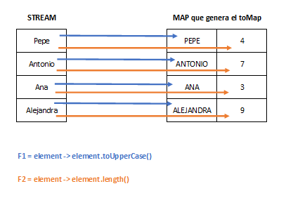

Ejemplo del funcionamiento de groupingBy:

```java
final List<String> nombres = List.of("Pepe", "Antonio", "Ana", "Alejandra");

nombres.stream()
    .collect(Collectors.groupingBy(
        element -> element.charAt(0) // Agrupa por primer carácter
    );
```

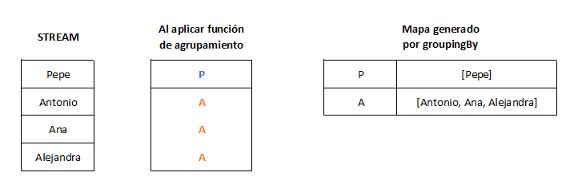

### 11.9 PartitioningBy

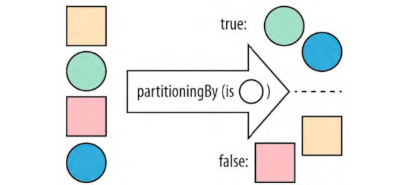

`partitioningBy` es un caso especializado de `groupingBy` que acepta una instancia de Predicate y después recolecta elementos del Stream en una instancia de Map que almacena valores booleanos como claves y colecciones como valores.

```java
final Map<Boolean, List<Integer>> paresImpares = 
    Stream.of(1, 2, 3, 4, 5, 6)
          .collect(Collectors.partitioningBy(n -> n % 2 == 0));

System.out.println(paresImpares);
// {false=[1, 3, 5], true=[2, 4, 6]}

final Map<Boolean, List<Persona>> mayoresYMenores = 
    personas.stream()
            .collect(Collectors.partitioningBy(p -> p.edad() >= 18));
```

### 11.10 Mapping

A veces puede pasar que queremos transformar los elementos después de la función de agrupamiento, pero antes de recolectar dichos grupos. Para eso tenemos la función `mapping`.

Antes hemos podido agrupar personas según su edad:

```java
final Map<Integer, List<Persona>> personasPorEdad = 
    personas.stream()
            .collect(Collectors.groupingBy(Persona::edad));
```

Nos puede interesar agrupar por edad, pero no hacer grupos de personas sino simplemente de nombres:

```java
final Map<Integer, List<String>> nombresPorEdad = 
    personas.stream()
            .collect(Collectors.groupingBy(
                Persona::edad,
                Collectors.mapping(Persona::nombre, Collectors.toList())
            ));
```

Fíjate que en el ejemplo anterior no se podría resolver con `map` ya que si transformamos las personas a su nombre, ya no disponemos de su edad para poder agrupar. Hay momentos que necesitamos hacer la transformación después de la función de agrupamiento, es ahí donde se usa `mapping` como cualquier otro recolector visto hasta ahora (por tanto también se podrá anidar).

> [!TIP]
> Recuerda que con `collectingAndThen` primero se recolecta, y posteriormente se aplica una función al resultado, mientras que con `mapping` se hace justo al contrario, aplicamos una función a cada elemento antes de recolectar en el grupo.

### 11.11 Filtering

Igual que con `mapping`, a veces puede pasar que deseamos filtrar los elementos antes de recolectar. Para eso tenemos la función `filtering`.

```java
final Map<Integer, List<String>> nombresPorEdadFiltrados = 
    personas.stream()
            .collect(Collectors.groupingBy(
                Persona::edad,
                Collectors.filtering(
                    p -> p.nombre().length() < 12,
                    Collectors.mapping(Persona::nombre, Collectors.toList())
                )
            ));
```

### 11.12 Teeing

A partir de Java 12 tenemos un recolector integrado que se encarga de ejecutar dos recolectores y combinarlos. Todo lo que tenemos que hacer es proporcionar los dos recolectores y la función combinadora.

```java
final int sumaMinMaxEdad = Stream.of(p1, p2, p3, p4)
    .map(Persona::edat)
    .collect(teeing(
        minBy(Integer::compareTo),
        maxBy(Integer::compareTo),
        (min, max) -> min.orElse(0d) + max.orElse(0d)));
}
```

### 11.13 ToArray

Hay veces que no nos interesa recolectar los datos en una colección sino en un array clásico. Para eso disponemos de la función `toArray`:

La primera y más sencilla simplemente retornará un array (de tipo Object o de tipo primitivo):

```java
final Object[] arrayObjetos = stream.toArray();
final int[] arrayEnteros = intStream.toArray();
```

Si lo que queremos es recoger los datos en un array de tipos de datos complejos, entonces tenemos que usar el segundo método pasándole la función generadora:

```java
final Persona[] arrayPersonas = personas.stream().toArray(Persona[]::new);
final String[] arrayStrings = Stream.of("leche", "lechuga", "agua").toArray(String[]::new);

// Este generador también podría ser una función lambda:
final Persona[] arrayPersonas2 = personas.stream().toArray(size -> new Persona[size]);
```

**Para finalizar:**

> [!IMPORTANT]
>
> En los ejemplos anteriores se han creado constantes `final` con estructuras de datos tipo `List` o `Map` para posteriormente imprimirlas con `System.out.println`. Esto es ha hecho para comprender el tipo de datos que devuelven los recolectores, pero no es lo aconsejable en estos casos.
>
> Si queremos imprimir la colección o mapa resultante de una recolección, en programación funcional se recomienda no guardar en una constante, sino imprimir directamente haciendo uso de `forEach`como se muestra en los ejemplos a continuación.

```java
Stream.iterate(0, i -> i + 7)
    .filter(i -> i % 2 == 0)
    .limit(5)
    .collect(toList())
    .forEach(System.out::println);

personas.stream()
    .collect(Collectors.groupingBy(Persona::edad))
    .forEach((k,v) -> System.out.println("Edad: " + k + " Lista de personas: " + v));
```

## 12. Combinando todo

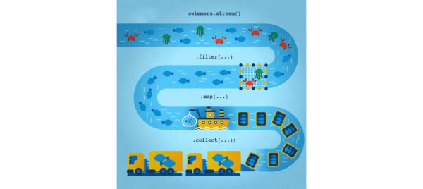

**Para obtener e imprimir una lista con los nombres en mayúsculas de aquellas personas mayores de 30 años:**

```java
Stream.of(p1, p2, p3, p4)
    .filter(p -> p.edad() > 30)
    .map(Persona::nombre)
    // .forEach(nombre -> nombreDeMayoresDe30.add(nombre)); NO HACER ESTO JAMÁS!
    .toList()
    .forEach(System.out::println);
```

**Obtener e imprimir un "Map" que tenga como clave el DNI y como valor la edad de aquellas personas mayores de 30 años:**

```java
Stream.of(p1, p2, p3, p4)
    .filter(p -> p.edad() > 30)
    .collect(Collectors.toMap(
        Persona::dni, 
        Persona::edad
    ))
    .forEach((k,v) -> System.out.println("DNI: " + k + " - Edad: " + v));
```

**Queremos recolectar las personas por la máxima edad posible (una o ninguna persona) y que solo recolecte el nombre:**

```java
Stream.of(p1, p2, p3, p4)
                .collect(
                        Collectors.collectingAndThen(
                                Collectors.maxBy(Comparator.comparing(Persona::edad)),
                                p -> p.map(Persona::nombre)
                        )
                )
                .ifPresentOrElse(
                        nombre -> System.out.println("Nombre con máxima edad: " + nombre),
                        () -> System.out.println("No se ha encontrado ninguna persona.")
                );
```

**¿Qué obtendremos en este caso?**

```java
final Map<Integer, List<String>> resultado = Stream.of(p1, p2, p3, p4)
    .collect(Collectors.groupingBy(
        Persona::edad,
        Collectors.mapping(
            p -> p.nombre().toUpperCase(),
            Collectors.flatMapping(
                nombre -> Stream.of(nombre.split("")),
                filtering(
                    letra -> !letra.equals(" "),
                    Collectors.toList()
                    )
                )
            )
        )
    );
```

**¿Y en este caso?**

```java

final Map<Integer, List<String>> resultado = Stream.of(p1, p2, p3, p4)
    .collect(Collectors.groupingBy(
        Persona::edad,
        Collectors.mapping(
            p -> p.nombre().toUpperCase(),
            Collectors.flatMapping(
                nombre -> Stream.of(nombre.split("")),
                filtering(
                    letra -> !letra.equals(" "),
                    Collectors.collectingAndThen(
                        Collectors.toSet(),
                        l -> String.join("", l)
                        )
                    )
                )
            )
        )
    );

```

**A partir de una matriz de 3 columnas y N filas queremos crear para cada fila de la matriz un nuevo triángulo. Después queremos transformar cada triángulo en un double que contenga el área de ese triángulo, y retornar una lista de Doubles con las áreas calculadas de todos los triángulos:**

```java
final double[][] lados = {
    {10, 7, 5.27},
    {10, 19.06, 20},
    {15.64, 16, 20}
};

final List<Double> areas = Stream.of(lados)
    .map(t -> new Triangulo(t[0], t[1], t[2]))
    .map(Triangulo::getArea)
    .toList();

```

**¿Y si tuviéramos los lados en un array unidimensional?**

```java
final double[] lados = {10, 7, 5.27, 10, 19.06, 20, 15.64, 16, 20};

final List<Double> areas = IntStream.range(0, lados.length / 3)
    .mapToObj(i -> new Triangulo(lados[3*i], lados[3*i + 1], lados[3*i + 2]))
    .map(Triangulo::getArea)
    .toList();

```

**Convertir el código siguiente al estilo funcional:**

```java
double[] precios = {2.54, 9.25, 1.23, 0.90, 9.24, 5.05};

double max = 0;
for (double precio : precios) {
    if (max < precio) {
        max = precio;
    }
}
```

**Solución 1 (con reduce):**

```java
final Optional<Double> max = Arrays.stream(precios).reduce(Math::max);
```

**Solución 2 (con max):**

```java
final Optional<Double> max = Arrays.stream(precios).max();
```

**Solución 3 (con sorted y findFirst):**

```java
final Optional<Double> max = Arrays.stream(precios)
    .boxed()
    .sorted(Comparator.reverseOrder())
    .findFirst();
```

**Solución 4 (con collect y maxBy):**

```java
final Optional<Double> max = Arrays.stream(precios)
    .boxed()
    .collect(Collectors.maxBy(Comparator.naturalOrder()));

```

**Solución 5 (con collectingAndThen):**

```java
final double max  = Arrays.stream(precios)
    .boxed()
    .collect(Collectors.collectingAndThen(
        Collectors.toList(),
        Collections::max // Problemático si no hay elementos
    ));

```

**Desarrolla un método que a partir de una lista de Integers y un selector (predicado) nos retorne la suma de todos aquellos elementos que cumplen con este selector:**

```java
public static int sumaFiltrada(List<Integer> lista, Predicate<Integer> selector) {
    return lista.stream()
                .filter(selector)
                .mapToInt(Integer::intValue)
                .sum();
}
```

**Finalmente convierte este método imperativo a funcional:**

```java
private static boolean isPrime(final int n) {  
    for(int i = 2; i < n; i++) {
        if(n % i == 0) return false;
    }
    return n > 1;
}
```

Solución:

```java
public static boolean isPrime(final int n) {
    return n > 1 && 
        IntStream.range(2, n).noneMatch(i -> n % i == 0);
}
```

> [!NOTE]
> Con todo lo visto hasta el momento, ya se pueden realizar los **ejercicios 16 al 20** del problema de esta unidad.

## 13. Extensión de operaciones

Podemos crear nuevas operaciones terminales utilizando el método de fábrica `java.util.stream.Collector.of(...)` o con el uso de los recolectores predefinidos en `Collectors`, creando operaciones terminales definidas por el usuario y reutilizables.

De la misma manera podemos crear nuevas operaciones intermedias utilizando los métodos de fábrica `java.util.stream.Gatherer.of(...)` y `java.util.stream.Gatherer.ofSequential(...)` o utilizar los recopiladores predefinidos en `Gatherers`. Esta funcionalidad, que fue introducida como preview en JDK 22, se convirtió en una característica estándar del lenguaje a partir de JDK 24. 

> [!NOTE]
>
> Para no complicar demasiado el tema no entraremos en detalle sobre este apartado, aunque si quieres saber más, recomiendo la visualización de este vídeo: [Los nuevos Stream Gatherers de Java 24](https://www.youtube.com/watch?v=l4-KFFJUtx4)

## 14. Streams infinitos

Como hemos visto, hay dos maneras de generar streams infinitos, mediante los métodos `generate` e `iterate`.

El método iterate necesita un primer parámetro como seed (semilla) o elemento inicial y un segundo parámetro que será un operador unario:

```java
Stream.iterate(0, n -> n + 1)
      .limit(10)
      .forEach(System.out::println); // 0, 1, 2, 3, ..., 9
```

Esto se hace muy útil cuando desconocemos la cantidad de resultados posibles que nos va a retornar, o el máximo valor encontrado:

```java
final String valores = Stream.iterate(12, i -> i + 1)
    .filter(i -> i % 19 == 0)
    .map(String::valueOf)
    .limit(5)
    .collect(Collectors.joining(", "));
```

Por otra parte la función generate solo necesita un parámetro que será de tipo Supplier:

```java
Stream.generate(Math::random)
      .limit(5)
      .forEach(System.out::println);
```

El proveedor puede ser cualquier generador que a partir de cero parámetros de entrada retorne un valor de salida:

```java
final List<String> valores = Stream.generate(() -> new Random().nextInt(100))
      .limit(10)
      .map(Integer::toBinaryString)
      .toList();
```

## 15. Evaluación perezosa (Lazy Evaluation)

Cuando ejecutamos un cálculo, una función o una expresión, lo podemos hacer de dos maneras. La primera es de forma "ansiosa" (**eager**) lo que supone ejecutarla tan pronto como se obtiene esa expresión en particular. Por contra, la evaluación "perezosa" (**lazy**) supone posponer esta ejecución hasta que podamos hacerla más adelante o hasta el punto que ya no necesitamos la ejecución y la podemos evitar. Por tanto, uno de los beneficios de ser perezosos es precisamente que podemos ser más eficientes.

Analicemos el siguiente código:

```java
public static int computar(int n) {
    System.out.println("Computando...");  
    return n;                           
}

public static void main(String[] args) {
    int x = 4;                          
    int temp = computar(x);             

    if (x > 5 && temp > 5) {           
        System.out.println("Resultado"); 
    } else {
        System.out.println("Sin resultado"); 
    }
}
```

Java por defecto lleva a cabo una **evaluación ansiosa**, por lo que ejecuta el método "computar", aunque después nunca llegue a necesitar este valor (ya que en el if se incumple el operando izquierdo y nunca evalúa el derecho).

Este funcionamiento es lódico, ya que en la programación imperativa el lenguaje "teme" por posibles efectos secundarios si se pospone la ejecución. En programación funcional esto no debería suponer un problema.

Ahora fíjate en el siguiente ejemplo:

```java
public static int computar(int n) {
    System.out.println("Computando...");  // Imprime un mensaje cuando se ejecuta
    return n;                           // Devuelve el mismo valor recibido
}

public static void main(String[] args) {
    int x = 4;                         
    Supplier<Integer> temp = () -> computar(x);  
    
    // Importante: La función computar() no se ejecuta aquí todavía
    // Solo se crea una referencia a la operación

    if (x > 5 && temp.get() > 5) {      
        System.out.println("Resultado"); 
    } else {
        System.out.println("Sin resultado"); 
    }
}
```

En este ejemplo NO se ejecuta el método "computar" porque no hace falta. No obstante, si asignamos por ejemplo un 15 a la "x" apreciamos que sí que se ejecutará el método. Acabamos de crear un código perezoso.

Vemos un ejemplo con colecciones.

Versión tradicional:

```java
List<Integer> valores = Arrays.asList(1, 2, 3, 4, 5, 6, 7, 8, 9, 10);

// Encontrar el doble del primer número par mayor que 3
int resultado = 0;
for (int e : valores) {
    if (e > 3 && e % 2 == 0) {
        resultado = e * 2;
        break;
    }
}
System.out.println(resultado);  
```

Este código presenta varios problemas. Podría ser que en la colección no tuviéramos números más grandes que 3, o no tuviesemos pares, o incluso una colección vacía. En todos estos casos el resultado sería 0, cosa que no es correcta. Es un código muy "familiar", pero muy poco declarativo.

Versión funcional:

```java
valores.stream()
    .filter(e -> e > 3) 
    .filter(e % 2 == 0)
    .map(e -> e* 2)
    .findFirst()
    .ifPresent(System.out::println);  // También imprime 8
```

Por tanto, el siguiente código no ejecuta ningún cálculo al no tener operaciones terminales:

```java
valores.stream()
    .filter(e -> e > 3) 
    .filter(e % 2 == 0)
    .map(e -> e* 2)```
```

Todo esto nos permite utilizar streams infinitos ya que no se hará ningún cálculo a priori.

**A continuación tenemos un método al cual pasamos un entero "k" y otro entero "n". Deberá retornar la suma total del doble de los primeros "n" números pares comenzando por "k" y cuya raíz cuadrada (de cada número) sea mayor que 20:**

```java
public int calcularSuma(int k, int n) {
    return Stream.iterate(k, i -> i + 1)
                 .filter(i -> i % 2 == 0)
                 .filter(i -> Math.sqrt(i) > 20)
                 .mapToInt(i -> i * 2)
                 .limit(n)
                 .sum();
}
```

## 16. Paralelización

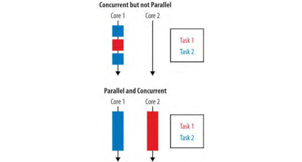

El objetivo del paralelismo es reducir el tiempo de ejecución de una tarea específica descomponiéndola en componentes más pequeños que se lleven a cabo en paralelo. El paralelismo funciona muy bien cuando queremos aplicar la misma operación sobre un gran conjunto de datos.

Si tenemos el siguiente método:

```java
public static int sumarEnteros(List<Integer> valores) {
    return valores.parallelStream()
                .mapToInt(Function.identity())
                .sum();
}
```

Java hará lo siguiente:

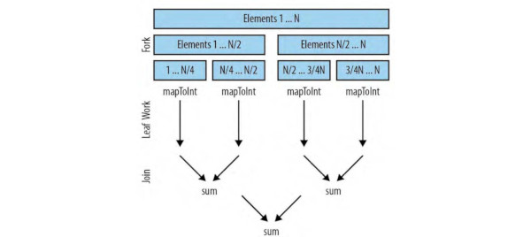

Comparación de tiempos:

```java
long start = System.currentTimeMillis();
IntStream.range(1, 1000000).forEach(i -> { ; });
long end = System.currentTimeMillis();
System.out.println("Secuencial: " + (end - start));

start = System.currentTimeMillis();
IntStream.range(1, 1000000).parallel().forEach(i -> { ; });
end = System.currentTimeMillis();
System.out.println("Paralelo: " + (end - start));
```

Resultado (en mi equipo):

```text
Secuencial: 74
Paralelo: 11
```

**Queremos encontrar la media aritmética de los divisibles entre 3 desde el 10 al 1000000:**

```java
System.out.println(
    IntStream.range(10, 1000000)
             .parallel()
             .filter(i -> i % 3 == 0)
             .average()
);
```

**Si trabajamos con paralelismo desconocemos el orden en que se ejecutarán los resultados parciales:**

```java
Stream.of(1, 2, 3, 4, 5, 6)
      .parallel()
      .forEach(System.out::println); // Orden impredecible
```

**Podemos indicar "para cada elemento ordenado" (forEachOrdered):**


```java
Stream.of(1, 2, 3, 4, 5, 6)
      .parallel()
      .forEachOrdered(System.out::println); // 1, 2, 3, 4, 5, 6
```

**Diferencia entre `findFirst` y `findAny` en paralelo:**

También debemos tener en cuenta el paralelismo a la hora de retornar el primer elemento (`findFirst`) o algún elemento que cumpla las condiciones (`findAny`):

```java
Persona p1 = new Persona("78457415X", "Pere", 23);
Persona p2 = new Persona("12487482T", "Ana", 22);
Persona p3 = new Persona("87456984D", "Laura", 19);
Persona p4 = new Persona("27316372V", "Pere", 35);
Persona p5 = new Persona("44514996G", "Marc", 18);

System.out.println(
    Stream.of(p1, p2, p3, p4, p5)
        .filter(p -> p.edad() > 20)
        .map(Persona::nombre)
        .map(String::toUpperCase)
        .findFirst()
        .orElse("NO ENCONTRADO")
);
```

Si hacemos el stream paralelo:

```java
System.out.println(
    Stream.of(p1, p2, p3, p4, p5)
        .parallel()
        .filter(p -> p.edad() > 20)
        .map(Persona::nombre)
        .map(String::toUpperCase)
        .findFirst()
        .orElse("NO ENCONTRADO")
);
```

El resultado **siempre será "PERE"**, tanto si lo hacemos paralelo como si no. 

Sin embargo, si usamos `findAny` con un stream paralelo, el resultado **ya no será predecible**:

```java
System.out.println(
    Stream.of(p1, p2, p3, p4, p5)
        .parallel()
        .filter(p -> p.edad() > 20)
        .map(Persona::nombre)
        .map(String::toUpperCase)
        .findAny()
        .orElse("NO ENCONTRADO")
);
```

En este último caso `findAny` puede retornar cualquiera de los nombres que cumplan la condición, dependiendo del hilo de ejecución que lo encuentre antes (trabajan en paralelo).

### Reducción con combiner en paralelo

Recordemos el funcionamiento de la reducción:

```java
Stream.of("Pere", "Ana", "Laura", "Pere", "Marc")
      .map(String::length)
      .reduce(0, Integer::sum); // 20
```

Si tenemos un stream paralelo, recordemos que se realizarán las operaciones parciales de forma paralela, y finalmente se combinarán mediante una **función combinadora** o "combiner". Esta función "combiner" la debemos indicar como tercer parámetro del método `reduce`:

```java
Stream.of("Pere", "Ana", "Laura", "Pere", "Marc")
      .parallel()
      .map(String::length)
      .reduce(0, Integer::sum, Integer::sum); //20
```

Así, podríamos saber el hilo que se ha quedado con la suma parcial más pequeña:

```java
Stream.of("Pere", "Ana", "Laura", "Pere", "Marc")
            .parallel()
            .map(String::length)
            .reduce(0, Integer::sum, Integer::min)
```

**Algunos ejemplos más para finalizar:**

```java
// Suma de números del 1 al 100
final int resultado = Stream.iterate(1, v -> v + 1)
                     .limit(100)
                     .parallel()
                     .reduce(0, Integer::sum, Integer::sum);
System.out.println(resultado); // 5050
```

```java
// Concatenación problemática sin combiner adecuado
final String resultado = Stream.iterate(1, v -> v + 1)
                        .limit(100)
                        .parallel()
                        .map(String::valueOf)
                        .reduce("0", (p, v) -> String.valueOf(Integer.valueOf(p) + Integer.valueOf(v)));
System.out.println(resultado);
```

```java
// Concatenación con combiner adecuado
final String resultado = Stream.iterate(1, v -> v + 1)
                        .limit(100)
                        .parallel()
                        .map(String::valueOf)
                        .reduce("0", 
                               (p, v) -> String.valueOf(Integer.valueOf(p) + Integer.valueOf(v)), 
                               (p, v) -> p + " " + v);
System.out.println(resultado);
```

> [!NOTE]
> Con todo lo visto hasta el momento, ya se pueden realizar los **últimos ejercicios** del problema de esta unidad.

## 17. Otros lenguajes

Para poner en contexto las capacidades de los streams de Java, veamos cómo otros lenguajes manejan conceptos similares:

### Kotlin

En Kotlin, las colecciones como las listas o los conjuntos ya disponen de métodos como "filter", "map"... de forma nativa:

```kotlin
val numbers = listOf(1, 2, 3, 4, 5)
val evenSquares = numbers
    .filter { it % 2 == 0 }
    .map { it * it }
println(evenSquares) // Output: [4, 16]
```

```kotlin
val numbers = listOf(6, 2, 3, 9, 4, 6, 8, 7, 5, 1)

// Sumar todos los números usando reduce
val sum = numbers.reduce { acc, num -> acc + num }
println("Sum of all numbers: $sum")

// Obtener los tres números más grandes usando sorted y take
val largestThree = numbers.sorted().reversed().take(3)
println("Three largest numbers: $largestThree")

// Obtener números únicos usando distinct
val distinctNumbers = numbers.distinct()
println("Distinct numbers: $distinctNumbers")
```

```kotlin
data class Person(val name: String, val age: Int)

fun main() {
    val people = listOf(
        Person("Alice", 25),
        Person("Bob", 30),
        Person("Charlie", 35),
        Person("David", 20),
        Person("Emily", 28),
        Person("Frank", 25)
    )

    // Ejemplo de filtrar por edad
    val filteredPeople = people.filter { it.age > 25 }

    // Ejemplo de reducir las edades de las personas a una sola suma
    val totalAge = people.map { it.age }.reduce { acc, age -> acc + age }

    // Ejemplo de comprobar si hay alguna persona con edad superior a 30
    val isAnyoneOver30 = people.any { it.age > 30 }

    // Ejemplo de comprobar si todas las personas tienen más de 18 años
    val areAllOver18 = people.all { it.age > 18 }

    // Ejemplo de transformar la lista de personas a una lista de nombres
    val names = people.map { it.name }

    // Ejemplo de recortar la lista de personas a partir del segundo elemento
    val slicedPeople = people.slice(1..3)

    // Ejemplo de ordenar la lista de personas por edad de menor a mayor
    val sortedPeople = people.sortedBy { it.age }

    // Ejemplo de eliminar duplicados de la lista de personas (por edad)
    val distinctPeople = people.distinctBy { it.age }
}
```

Si se quiere trabajar de forma perezosa también dispone de "Sequence":

```kotlin
val list = listOf("foo", "bar", "baz", "hello", "world")
val sequence = list.asSequence()
    .filter { it.length > 3}
    .map { it.toUpperCase() }
    .toList()
```

### Scala

En Scala encontramos capacidades similares:

```scala
val numbers = List(1, 2, 3, 4, 5)

val evenSquares = numbers
    .filter(_ % 2 == 0)
    .map(n => n * n)

println(evenSquares) // Output: List(4, 16)
```

```scala
val numbers = List(6, 2, 3, 9, 4, 6, 8, 7, 5, 1)

// Sumar todos los números con reduce
val sum = numbers.reduce(_ + _)
println(s"Sum of all numbers: $sum")

// Obtener los tres números más grandes
val largestThree = numbers.sorted.reverse.take(3)
println(s"Three largest numbers: $largestThree")

// Obtener los valores únicos
val distinctNumbers = numbers.distinct
println(s"Distinct numbers: $distinctNumbers")
```

Con case classes para objetos más complejos:

```scala
case class Person(name: String, age: Int)

object Main extends App {
  val people = List(
    Person("Alice", 25),
    Person("Bob", 30),
    Person("Charlie", 35),
    Person("David", 20),
    Person("Emily", 28),
    Person("Frank", 25)
  )

  // Filtrar personas mayores de 25 años
  val filteredPeople = people.filter(_.age > 25)

  // Reducir edades a una sola suma
  val totalAge = people.map(_.age).reduce(_ + _)

  // Verificar si hay alguien con más de 30 años
  val isAnyoneOver30 = people.exists(_.age > 30)

  // Verificar si todos son mayores de 18 años
  val areAllOver18 = people.forall(_.age > 18)

  // Obtener solo los nombres
  val names = people.map(_.name)

  // Cortar la lista a partir del segundo elemento
  val slicedPeople = people.slice(1, 4)

  // Ordenar por edad
  val sortedPeople = people.sortBy(_.age)

  // Eliminar duplicados por edad
  val distinctPeople = people.distinctBy(_.age)
}
```

Para evaluación perezosa:

```scala
val list = List("foo", "bar", "baz", "hello", "world")

val sequence = list.view
    .filter(_.length > 3)
    .map(_.toUpperCase)
    .toList

println(sequence) // Output: List("HELLO", "WORLD")
```

### JavaScript

En JavaScript pasa lo mismo:

```javascript
// Crear un array de números
const numbers = [1, 2, 3, 4, 5];

// Usar reduce para sumar todos los números del array
const sum = numbers.reduce((acc, val) => acc + val, 0);
console.log(sum); // output: 15

// Usar filter para obtener solo los números pares del array
const evenNumbers = numbers.filter(val => val % 2 === 0);
console.log(evenNumbers); // output: [2, 4]

// Usar some para comprobar si algún número del array cumple una condición
const anyMatch = numbers.some(val => val > 3);
console.log(anyMatch); // output: true

// Usar every para comprobar si todos los números del array cumplen una condición
const allMatch = numbers.every(val => val > 0);
console.log(allMatch); // output: true

// Usar map para transformar los números del array en strings
const strings = numbers.map(val => `Number ${val}`);
console.log(strings); // output: ["Number 1", "Number 2", "Number 3", "Number 4", "Number 5"]

// Usar slice para obtener solo los primeros n elementos del array
const limit = numbers.slice(0, 3);
console.log(limit); // output: [1, 2, 3]
```

### Swift

En Swift también encontramos estas capacidades funcionales:

```swift
let numbers = [1, 2, 3, 4, 5]

let evenSquares = numbers
    .filter { $0 % 2 == 0 }
    .map { $0 * $0 }

print(evenSquares) // Output: [4, 16]
```

### C\#

En C\# con LINQ (Language Integrated Query):

```csharp
var numbers = new[] {1, 2, 3, 4, 5};

var evenSquares = numbers
    .Where(n => n % 2 == 0)
    .Select(n => n * n)
    .ToList();

Console.WriteLine(string.Join(", ", evenSquares));
```

### Python

Python ofrece capacidades funcionales similares:

```python
from dataclasses import dataclass
from typing import List

@dataclass
class Person:
    name: str
    age: int

def main():
    people = [
        Person("Alice", 25),
        Person("Bob", 30),
        Person("Charlie", 35),
        Person("David", 20),
        Person("Emily", 28),
        Person("Frank", 25)
    ]

    # 1. Filtrar personas mayores de 25 años
    filtered_people = list(filter(lambda p: p.age > 25, people))

    # 2. Sumar todas las edades (reduce)
    total_age = sum(p.age for p in people)

    # 3. Verificar si hay al menos una persona mayor de 30 años
    is_anyone_over_30 = any(p.age > 30 for p in people)

    # 4. Verificar si todas las personas son mayores de 18 años
    are_all_over_18 = all(p.age > 18 for p in people)

    # 5. Extraer solo los nombres (mapeo)
    names = [p.name for p in people]

    # 6. Subconjunto de la lista (slice) desde el índice 1 al 3 (inclusive)
    sliced_people = people[1:4]  # Equivalente a people[1..4] en otros lenguajes

    # 7. Ordenar personas por edad (ascendente)
    sorted_people = sorted(people, key=lambda p: p.age)

    # 8. Eliminar duplicados por edad usando un diccionario
    distinct_people = list({p.age: p for p in people}.values())

    # Imprimir resultados
    print("Personas filtradas (>25 años):", filtered_people)
    print("Edad total:", total_age)
    print("¿Alguien mayor de 30?:", is_anyone_over_30)
    print("¿Todos mayores de 18?:", are_all_over_18)
    print("Nombres:", names)
    print("Subconjunto [1:4]:", sliced_people)
    print("Personas ordenadas por edad:", sorted_people)
    print("Personas únicas por edad:", distinct_people)

if __name__ == "__main__":
    main()
```

> [!NOTE]
> Como podemos observar, la programación funcional y los conceptos de streams no son exclusivos de Java. Muchos lenguajes modernos han adoptado estos paradigmas, cada uno con su propia sintaxis pero manteniendo los conceptos fundamentales de transformación, filtrado y reducción de datos.

## 18. Consideraciones finales

### Buenas prácticas con streams

```java
// ❌ INCORRECTO - Usar un stream más de una vez
List<String> beers = List.of("Heineken", "Delirium Tremens", "Amstel");
Stream<String> beerStream = beers.stream();

beerStream.forEach(b -> System.out.println(b.toUpperCase())); // 1
beerStream.forEach(b -> System.out.println(b.toLowerCase())); // 2 - ¡ERROR!
```

La línea 2 dará: `java.lang.IllegalStateException: stream has already been operated upon or closed`

```java
// ❌ CUIDADO - Devolver un Stream
public Stream<Beer> getMeMyBeers() {
    return beers.stream(); // ¿Ya se ha consumido?
}

public void execute() {
    getMeMyBeers(); // ¡No sabemos si está consumido!
}
```

```java
// ❌ PELIGROSO - Usar peek para debugging
List<Beer> beers = List.of(new Beer("Heineken", 5.2), 
                          new Beer("Delirium Tremens", 9.0), 
                          new Beer("Amstel", 5.1));

beers.stream()
     .limit(10)
     .map(Beer::getAlcohol)
     .peek(alcohol -> {
         if (alcohol > 7.0)
             throw new RuntimeException(); // ¡Problema!
     }); // ¡No se ejecuta porque no hay operación terminal!
```

> [!CAUTION]
> Usar `peek` es peligroso. Solo debes utilizarlo para pruebas. Sin operación terminal, el stream no se ejecuta.

### Resumen final

Los **Streams** en Java son una herramienta poderosa para el procesamiento de datos que nos permite:

- **📝 Escribir código más declarativo**: Nos centramos en *qué* queremos hacer, no en *cómo*
- **🔄 Facilitar la paralelización**: Con `.parallel()` de forma transparente
- **⚡ Aprovechar la evaluación perezosa**: Las operaciones no se ejecutan hasta encontrar una operación terminal
- **🔗 Encadenar operaciones**: Pipeline de transformaciones legibles y componibles

Sin embargo, debemos recordar:

- **Un stream solo se puede consumir una vez**
- **Siempre terminar con una operación terminal**
- **Usar con criterio** - no siempre son más eficientes que bucles tradicionales
- **Evitar efectos secundarios** en las operaciones intermedias

> [!TIP]
> 💡 Recuerda que los streams son una herramienta poderosa para el procesamiento de datos, pero deben ser utilizados de manera adecuada para obtener el máximo beneficio en términos de legibilidad y rendimiento del código.

<p align="center">📚 <em>Fin del apartado UT9.3 - Streams</em></p>
