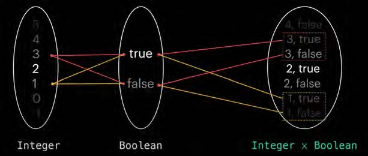
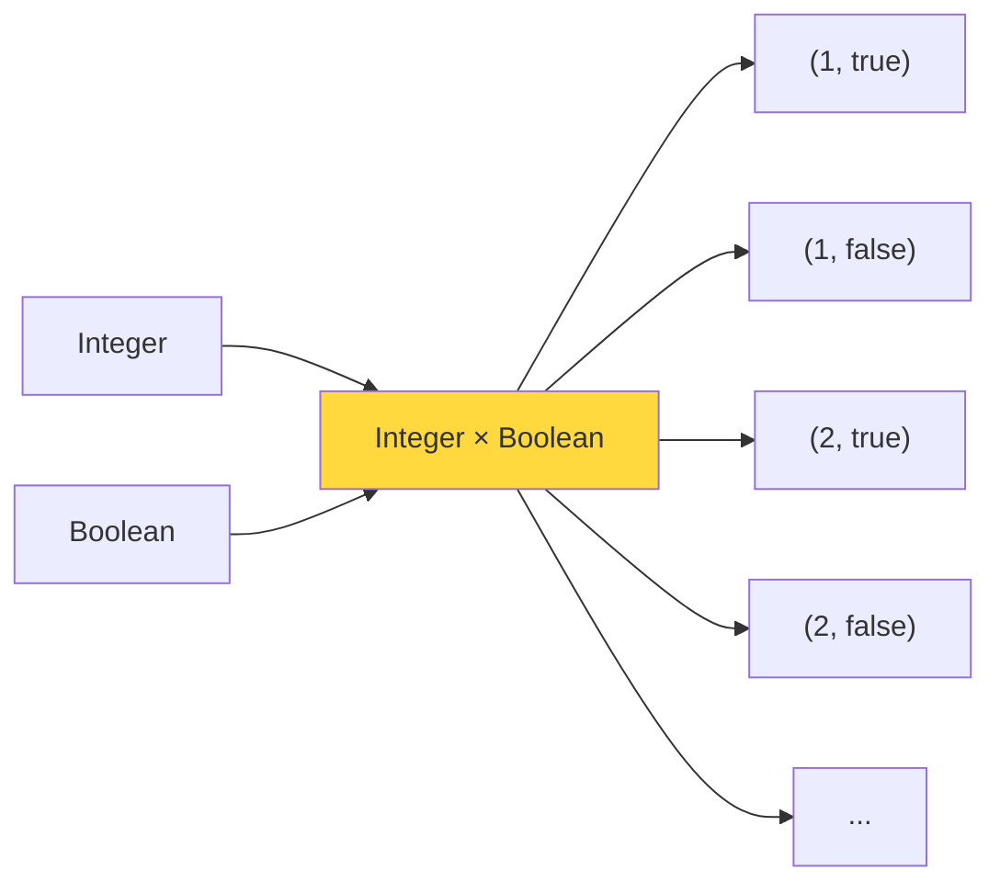
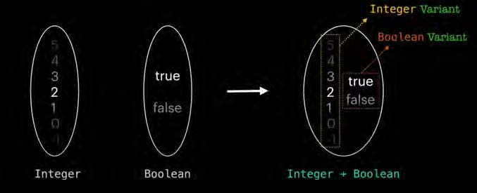
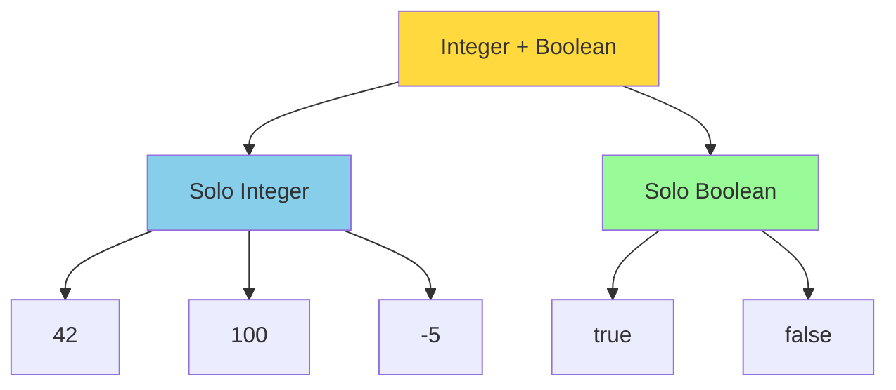
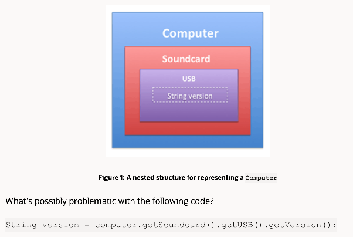
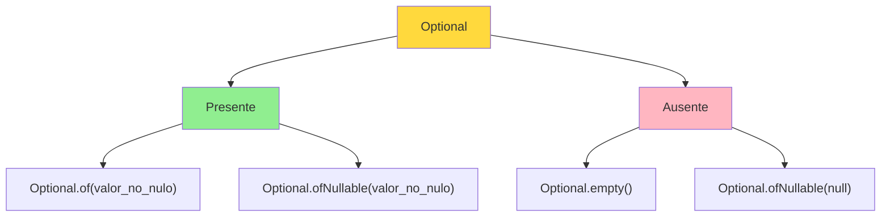
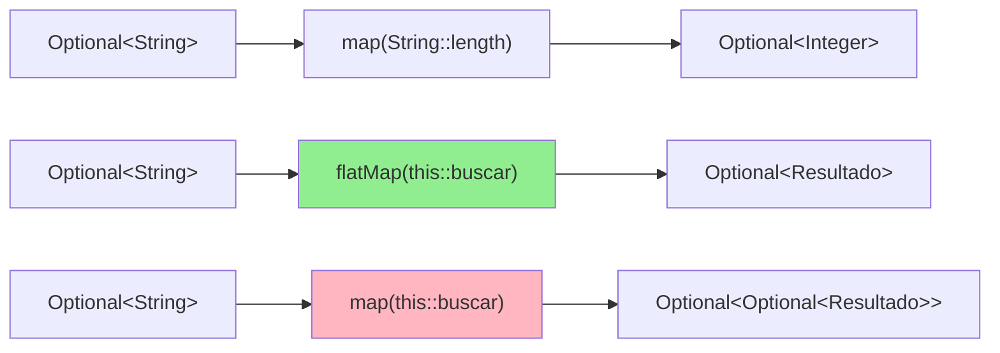
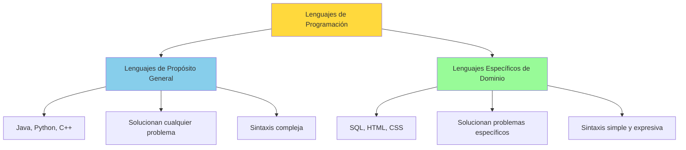

# UT9.4 Tipos, Composición de tipos y Optional

## 📋 Índice de contenidos

1. [Fundamentos de tipos](#1-fundamentos-de-tipos)
    1. [Universos de valores, tipos y kinds](#11-universos-de-valores-tipos-y-kinds)
    2. [Higher-kinded types](#12-higher-kinded-types)
    3. [Type Classes](#13-type-classes)
2. [Composición de tipos](#2-composici%C3%B3n-de-tipos)
    1. [Product Type](#21-product-type)
    2. [Sum Type](#22-sum-type)
3. [ADT (Algebraic Data Type)](#3-adt-algebraic-data-type)
4. [Pattern matching](#4-pattern-matching)
5. [Maybe en Java: Optional](#5-maybe-en-java-optional)
    1. [Concepto y motivación](#51-concepto-y-motivaci%C3%B3n)
    2. [Creación de Optional](#52-creaci%C3%B3n-de-optional)
    3. [Obteniendo el valor](#53-obteniendo-el-valor)
    4. [Comprobando si hay valor](#54-comprobando-si-hay-valor)
    5. [Valor por defecto](#55-valor-por-defecto)
    6. [Obteniendo otro opcional](#56-obteniendo-otro-opcional)
    7. [Excepciones](#57-excepciones)
    8. [Acción condicional](#58-acci%C3%B3n-condicional)
    9. [Filtraje](#59-filtraje)
    10. [Transformación](#510-transformaci%C3%B3n)
    11. [Transformación y aplanamiento](#511-transformaci%C3%B3n-y-aplanamiento)
    12. [Conversión a Stream](#512-conversi%C3%B3n-a-stream)
    13. [Cuándo usar y cuándo no usar Optional](#513-cu%C3%A1ndo-usar-y-cu%C3%A1ndo-no-usar-optional)
6. [Ópticas](#6-%C3%B3pticas)
    1. [Concepto y tipos de ópticas](#61-concepto-y-tipos-de-%C3%B3pticas)
    2. [Ejemplos en Scala](#62-ejemplos-en-scala)
7. [Desarrollo de DSLs](#7-desarrollo-de-dsls)

## 1. Fundamentos de tipos

En un lenguaje de programación fuertemente tipado, los **valores** son las instancias concretas o las representaciones de un tipo particular. Cada valor pertenece a un tipo específico y cumple las reglas y restricciones de ese tipo. Por otro lado, los **tipos** son fundamentales para garantizar la seguridad y corrección del código. Los tipos nos permiten organizar y categorizar los datos, proporcionando al compilador la información necesaria para detectar errores en tiempo de compilación.

### 1.1 Universos de valores, tipos y kinds

Para comprender completamente los sistemas de tipos, debemos entender tres niveles de abstracción diferentes que forman una jerarquía conceptual.

#### 🌍 1. Universo de valores

Ya estamos familiarizados con valores como `12`, `"hola"`, o `true`. Cuando escribimos código en Java, operamos dentro del **universo de valores** donde los utilizamos para realizar diversos cálculos.

```java
int numero = 42;
String saludo = "Hola mundo";
boolean activo = true;
```

#### 🏗️ 2. Universo de tipos

También sabemos que podemos agrupar estos valores en conjuntos llamados **tipos**, como el tipo `int`, `boolean`, `String`, o tipos más complejos como *tipos función* o *tipos envoltorio*.

Pasamos a un nivel de abstracción superior donde, en lugar de tratar directamente con valores, nos centramos en los tipos. Esto nos ayuda a alejarnos de los errores y hacer programas robustos delegando la responsabilidad al compilador.

```java
// Si intentamos esto:
int numero = "hola";  // ❌ Error de compilación
```

**Ejemplos de tipos:**

- `int`: Todos los números enteros de 32 bits
- `String`: Todas las secuencias de caracteres
- `boolean`: Los valores `true` y `false`
- `ArrayList<String>`: Listas que contienen cadenas
- `Function<String, Integer>`: Funciones que toman un String y devuelven un Integer

#### ⚡ 3. Universo de kinds

Podemos tomar tipos como `Integer`, `String`, `Boolean` y agruparlos en **kind** o **tipos de los tipos** que llamaremos `Type` (o `*` en convención Haskell).

El **universo de kinds** (o "tipos de tipos") clasifica los tipos según su estructura y cómo se relacionan entre sí. Los kinds nos permiten razonar sobre los tipos de la misma manera que los tipos nos permiten razonar sobre los valores.

Pensaremos en los tipos como si fueran funciones. Existen tipos a los que tenemos que dar como entrada un tipo para que nos construyan el tipo concreto:

- `Optional<String>`: `Optional` necesita un tipo (`String`) para generar un tipo concreto
- `ArrayList<Integer>`: `ArrayList` necesita un tipo (`Integer`) para ser un tipo completo
- `HashMap<String, Integer>`: `HashMap` necesita dos tipos para generar el tipo concreto

**Tabla resumen:**

| Universo de valores | Universo de tipos | Universo de kinds |
| :--: | :--: | :--: |
| `12`, `"Hola"`, `true`, `'c'` | `Integer`, `String`, `Integer → Boolean`, `Optional<String>` | `Type`, `Type → Type`, `Type → Type → Type` |

Utilizando la nomenclatura de tipos de Haskell:

```haskell
-- Universo de valores
1 :: Integer                  -- 1 pertenece al tipo Integer
parseInt :: String → Integer  -- parseInt pertenece al tipo función de String a Integer

-- Universo de tipos
Integer :: *                  -- Integer pertenece al kind *
ArrayList :: * → *            -- ArrayList pertenece al kind * → *
HashMap :: * → * → *          -- HashMap pertenece al kind * → * → * 
```

> [!NOTE]
> La notación `* → *` significa "toma un tipo y produce un tipo". Por ejemplo, `Optional` toma un tipo como `String` y produce el tipo concreto `Optional<String>`.

### 1.2 Higher-kinded types

Si recordamos, explicamos que una función podía ser de orden superior cuando era capaz de tomar otra función como parámetro de entrada o salida. Esto también se puede trasladar a los tipos.

Los tipos que pertenecen a kinds con signaturas que tienen paréntesis en algún lugar del lado izquierdo se llaman **tipos de orden superior** o **higher-kinded types**. Son tipos que **reciben otros tipos constructores** como parámetro.

Ejemplo de kind: `(* → *) → *`

Java **no soporta HKTs de forma nativa**, pero sí otros lenguajes como Scala, Haskell o TypeScript.

Con HKTs podríamos generalizar para listas, opciones, streams, etc.

> [!NOTE]
> Un higher-kinded type es un tipo que se abstrae sobre algún tipo que, a su vez, se abstrae sobre otro tipo.

| No es un HKT | Sí es un HKT |
| :-- | :-- |
| `ArrayList<A>`<br>`Type → Type` | `F<Integer>`<br>`(Type → Type) → Type` |
| Permite construir:<br>`ArrayList<Integer>`<br>`ArrayList<Boolean>`<br>`ArrayList<String>` | Permite construir:<br>`ArrayList<Integer>`<br>`List<Integer>`<br>`Optional<Integer>` |

Así, los lenguajes que soportan HTK permiten un nivel de abstracción mayor, y por tanto escribir código más general que podemos usar en varias situaciones. Vamos a ver un último ejemplo sobre esto:

Imagina que tenemos una función "map" que transforma un opcional a otro, y otra función "map" que transforma una lista a otra. En Scala:

```typescript
type map_option = <A,B>(f: A=>B) => Option<A> => Option<B>
type map_list = <A,B>(f: A=>B) => List<A> => List<B>
```

Como puedes apreciar lo único que difiere en ambas funciones es el tipo "Option" o "List". Podríamos generalizarlo usando HKT de la siguiente manera:

```typescript
Functor<F>{
    map: <A,B>(f: A=>B) => F<A> => F<B>
}
```

### 1.3 Type Classes

Las **Type Classes** proporcionan polimorfismo ad-hoc, permitiendo que diferentes tipos se comporten de manera uniforme a pesar de no compartir una jerarquía de herencia.

**Ejemplo de polimorfismo paramétrico (genéricos):**

```java
public <T> void printList(List<T> list) {
    for (T item : list) {
        System.out.println(item);
    }
}
```

**Ejemplo conceptual de Type Class en Haskell:**

```haskell
class Show a where
    show :: a -> String

-- Instancia de la clase Show para enteros
instance Show Int where
    show x = "Entero: " ++ show x

-- Instancia de la clase Show para booleanos
instance Show Bool where
    show True  = "Sí"
    show False = "No"
```

En Java, esto se aproxima con interfaces:

```java
public interface Mostrable<T> {
    String mostrar(T valor);
}

public class MostradorEntero implements Mostrable<Integer> {
    @Override
    public String mostrar(Integer valor) {
        return "Entero: " + valor;
    }
}
```

## 2. Composición de tipos

La **composición de tipos** en programación funcional es una idea fundamental que se refiere a la capacidad de crear tipos de datos más complejos combinando tipos de datos más simples.

### 2.1 Product Type

Un **Product Type** representa la composición de múltiples tipos donde **todos los componentes están presentes simultáneamente**. Es equivalente al producto cartesiano en matemáticas.

Imagina que queremos crear un nuevo tipo de datos a partir de la composición de `Integer` y `Boolean`: 



El tipo resultante es realmente el **producto cartesiano** entre los dos conjuntos.

Si hablamos de tipos, se conoce como **Product Type** o **Tipos Producto** (en este caso `Integer × Boolean`) ya que podrá contener cualquier pareja y por tanto tendrá tantos valores como tenga el conjunto `Integer` multiplicado por la cantidad de valores que contiene `Boolean`.



En Java, podemos modelar esta composición mediante una clase o un record:

```java
public record IntegerBoolean(Integer intValue, Boolean boolValue) {}

// Ejemplo de uso
IntegerBoolean producto = new IntegerBoolean(42, true);
```

**En SQL tendríamos el siguiente equivalente:**

```sql
SELECT * FROM Integer, Boolean;
```

> [!TIP]
> Los records de Java son perfectos para representar Product Types de manera concisa.

### 2.2 Sum Type

Un **Sum Type** representa la composición donde el valor puede ser **uno de varios tipos posibles, pero no todos a la vez**. Es equivalente a la unión en matemáticas.

Ahora queremos crear un nuevo tipo de datos a partir de la composición de `Integer` y `Boolean` de manera diferente:



El tipo resultante es una suma categórica o **coproducto**.

Si hablamos de tipos, **Sum Type** o **Tipos Suma** (en este caso `Integer + Boolean`) solo podrá contener un valor, que podrá ser cualquier entero o cualquier booleano, por ese motivo tendrá tantos posibles valores como la cantidad de valores de los enteros más la cantidad de valores de los booleanos.



En Java, podemos modelar esta composición gracias al polimorfismo:

```java
public sealed interface IntegerOrBoolean permits IntegerVariant, BooleanVariant {}

public record IntegerVariant(int value) implements IntegerOrBoolean {}
public record BooleanVariant(boolean value) implements IntegerOrBoolean {}

// Ejemplo de uso
IntegerOrBoolean valor1 = new IntegerVariant(42);
IntegerOrBoolean valor2 = new BooleanVariant(true);
```

> [!NOTE]
> El ejemplo más típico de coproducto o "sum type" en Java es el tipo **enumerado**, ya que puede contener solo uno de los valores enumerados.
> 
> ```java
> public enum EstadoPedido {
>     PENDIENTE, CONFIRMADO, ENVIADO, ENTREGADO, CANCELADO
> }
> ```
>

**En SQL tendríamos el siguiente equivalente:**

```sql
SELECT * FROM Integer UNION ALL SELECT * FROM Boolean;
```

## 3. ADT (Algebraic Data Type)

Un **Algebraic Data Type** (ADT) es un tipo de datos compuesto que utiliza operaciones algebraicas de suma (OR) y producto (AND) para construir estructuras de datos más complejas.

Algunos ejemplos de ADT son `Maybe`, `Either`, `Result`, `Pair` etc.

**Ejemplo: `Pair`**

```java
public class Pair<A, B> {
    private final A a;
    private final B b;

    public Pair(A a, B b) {
        this.a = a;
        this.b = b;
    }

    public static <A, B> Pair<A, B> of(A a, B b) {
        return new Pair<>(a, b);
    }

    public A fst() {
        return a;
    }

    public B snd() {
        return b;
    }
}
```

**Ejemplo: `Maybe`**

```java
// Sum type: Maybe<T> = Some<T> + None
public sealed interface Maybe<T> {
    record Just<T>(T value) implements Maybe<T> {}
    record Nothing<T>() implements Maybe<T> {}
    
    static <T> Maybe<T> of(T value) {
        if (value == null) {
            return new Nothing<>();
        } else {
            return new Just<>(value);
        }
    }
}
```

**Ejemplo: `Either`**

```java
// Sum type: Either<L, R> = Left<L> + Right<R>
public sealed interface Either<L, R> permits Left, Right {
    
    record Left<L, R>(L value) implements Either<L, R> {}
    record Right<L, R>(R value) implements Either<L, R> {}
    
    // Factory methods
    static <L, R> Either<L, R> left(L value) {
        return new Left<>(value);
    }
    
    static <L, R> Either<L, R> right(R value) {
        return new Right<>(value);
    }
}
```

**Ejemplo: `Persona`**

```java
// Product type: Persona = String × Integer × String
public record Persona(String nombre, Integer edad, String email) {}

```

> [!TIP]
> Los ADT son especialmente útiles para modelar dominios de negocio complejos de manera type-safe, eliminando muchos errores que podrían ocurrir con tipos primitivos o estructuras de datos menos expresivas.

## 4. Pattern matching

El pattern matching o **concordancia de patrones** es una técnica que permite examinar la estructura de los datos y ejecutar código específico basado en esa estructura. Es especialmente útil con Sum Types y ADT.

> [!IMPORTANT]
> Pattern matching nos permite "descomponer" un valor y acceder a sus componentes de manera segura, garantizando que manejamos todos los casos posibles.

### Pattern matching con instanceof

```java
public static IntegerOrBoolean operate(IntegerOrBoolean value) {
    if (value instanceof IntegerVariant) {
        return new IntegerVariant(((IntegerVariant) value).value() * 2);
    } else if (value instanceof BooleanVariant) {
        return new BooleanVariant(!((BooleanVariant) value).value());
    }
    throw new IllegalArgumentException("Tipo desconocido");
}
```

### Pattern matching con instanceof moderno (JDK 16+)

```java
public static IntegerOrBoolean operate(IntegerOrBoolean value) {
    if (value instanceof IntegerVariant iv) {
        return new IntegerVariant(iv.value() * 2);
    } else if (value instanceof BooleanVariant bv) {
        return new BooleanVariant(!bv.value());
    }
    throw new IllegalArgumentException("Tipo desconocido");
}
```

### Pattern matching con switch expressions (JDK 17+)

```java
public static String describir(IntegerOrBoolean value) {
    return switch (value) {
        case IntegerVariant iv -> "Es un entero: " + iv.value();
        case BooleanVariant bv -> "Es un booleano: " + bv.value();
    };
}
```

### Pattern matching con switch expressions y record pattern matching (JDK 21+)

```java
public static String describir(IntegerOrBoolean value) {
    return switch (value) {
        case IntegerVariant(var num) -> "Es un entero: " + num;
        case BooleanVariant(var bool) -> "Es un booleano: " + bool;
    };
}
```

### Pattern matching con Maybe

```java
public static <T> String maybeToString(Maybe<T> maybe) {
    return switch (maybe) {
        case Some<T>(var value) -> value.toString();
        case None<T> _ -> ""; // Variable sin nombre _  (JDK 22+)
    };
}
```

> Para ver algún ejemplo más con lo anterior, te recomiendo que visualices este vídeo: [Pattern Matching con Records en Java](https://www.youtube.com/watch?v=2ih8_z6bEy8)
---
> [!IMPORTANT]
> El pattern matching nos permite trabajar de forma segura con sum types, asegurándonos de manejar todos los casos posibles (exhaustividad).

## 5. Maybe en Java: Optional

La clase `Optional<T>` en Java es una implementación del concepto de **Maybe**, que permite representar un valor que puede estar presente o ausente, evitando el uso de `null`.

### 5.1 Concepto y motivación



El valor `null` es una de las fuentes más comunes de errores en Java. Tony Hoare, quien inventó la referencia null, la llamó su "error de mil millones de dólares" debido a los innumerables bugs que ha causado.

El concepto **Maybe** viene de lenguajes funcionales y representa un contenedor que puede contener un valor o estar vacío. En Java se implementa como `Optional<T>`.




**Problemas que resuelve:**

- **NullPointerException**: El error más común en Java
- **Código defensivo**: Evita comprobaciones constantes de `null`
- **Claridad en APIs**: Hace explícito que un valor puede estar ausente

```java
// ❌ Código tradicional propenso a errores
public String obtenerNombreUsuario(Long id) {
    Usuario usuario = buscarUsuario(id);
    return usuario.getNombre();
}

// ✅ Con Optional
public String obtenerNombreUsuario(Long id) {
    return buscarUsuario(id)
        .map(Usuario::getNombre)
        .orElse("Usuario desconocido");
}
```

### 5.2 Creación de Optional

#### Métodos de creación

```java
// ✅ Optional vacío
Optional<String> vacio = Optional.empty();

// ✅ Optional con valor (OJO! lanza excepción si es null)
Optional<String> presente = Optional.of("Hola");

// ✅ Optional que puede ser null
String posibleNull = obtenerValor(); // Puede retornar null
Optional<String> nullable = Optional.ofNullable(posibleNull);

// ✅ Optional como resultado de otros métodos
Optional<String> optionalString = Stream.of("agua", "lechuga", "sal")
    .filter(e -> e.startsWith("z"))
    .findFirst();
```

> [!CAUTION]
> `Optional.of(null)` lanza `NullPointerException`. Usa `Optional.ofNullable()` cuando el valor pueda ser null.

Algunos ejemplos más:

```java
public class CreacionOptional {
    
    public static void ejemplosCreacion() {
        // 1. Optional vacío
        Optional<String> vacio = Optional.empty();
        System.out.println("Vacío: " + vacio); // Optional.empty
        
        // 2. Optional con valor (falla si el valor es null)
        Optional<String> conValor = Optional.of("Hola mundo");
        System.out.println("Con valor: " + conValor); // Optional[Hola mundo]
        
        // ❌ Esto lanza NullPointerException
        // Optional<String> falla = Optional.of(null);
        
        // 3. Optional que puede ser null (recomendado)
        String posibleNull = Math.random() > 0.5 ? "Aleatorio" : null;
        Optional<String> seguro = Optional.ofNullable(posibleNull);
        System.out.println("Seguro: " + seguro);
        
        // 4. A partir de métodos que pueden devolver null
        Optional<String> desdeMetodo = Optional.ofNullable(obtenerConfiguracion("timeout"));
        System.out.println("Desde método: " + desdeMetodo);
    }
    
    private static String obtenerConfiguracion(String clave) {
        // Simulación - podría retornar null si no existe la configuración
        return "timeout".equals(clave) ? "30000" : null;
    }
}
```

#### Ejemplo práctico de creación

```java
public class CreacionOptional {
    public void ejemplos() {
        // Casos de uso comunes
        Optional<String> config = Optional.ofNullable(System.getProperty("config.file"));
        Optional<Usuario> usuario = buscarUsuarioPorEmail("juan@email.com");
        Optional<Integer> numero = parsearEntero("42");
    }
    
    public Optional<Usuario> buscarUsuarioPorEmail(String email) {
        // Simular búsqueda en base de datos
        Usuario encontrado = database.findByEmail(email);
        return Optional.ofNullable(encontrado);
    }
    
    public Optional<Integer> parsearEntero(String texto) {
        try {
            return Optional.of(Integer.parseInt(texto));
        } catch (NumberFormatException e) {
            return Optional.empty();
        }
    }
}
```

### 5.3 Obteniendo el valor

> [!CAUTION]
> No es aconsejable el uso del método `get()` ya que un Optional precisamente puede contener valor o no contener valor.

```java
Optional<String> opcional = Optional.of("valor");

// ❌ Peligroso - puede lanzar NoSuchElementException
String valor = opcional.get();
```

### 5.4 Comprobando si hay valor

```java
Optional<String> opcional = Optional.of("test");

// Métodos de comprobación
if (opcional.isPresent()) {
    System.out.println("Tiene valor: " + opcional.get());
}

// Java 11+
if (opcional.isEmpty()) {
    System.out.println("Está vacío");
}

// Forma funcional preferida con "ifPresent" o "ifPresentOrElse" (ver más adelante)
```

### 5.5 Valor por defecto

```java
Optional<String> opcional = Optional.empty();

// Valor por defecto simple
String resultado = opcional.orElse("Valor por defecto");

// Valor por defecto con Supplier (evaluación perezosa)
String resultado2 = opcional.orElseGet(() -> calcularDefault());

// Diferencia entre orElse y orElseGet
String resultado3 = opcional.orElse(metodoCaroQueSeEjecutaSiempre());
String resultado4 = opcional.orElseGet(() -> metodoCaroQueSeEjecutaSoloSiEsNecesario());
```

> [!NOTE]
> **Diferencia importante:**
>
> - `orElse()`: Evalúa el parámetro **siempre** (evaluación ansiosa)
> - `orElseGet()`: Evalúa el Supplier **solo si es necesario** (evaluación perezosa)

### 5.6 Obteniendo otro opcional

```java
Optional<String> opcional = Optional.empty();

// Proporcionar otro Optional como alternativa
Optional<String> resultado = opcional.or(() -> Optional.of("Otro valor"));
```

### 5.7 Excepciones

```java
Optional<String> opcional = Optional.empty();

// Lanzar excepción por defecto
String valor = opcional.orElseThrow();

// Lanzar excepción personalizada
String valor2 = opcional.orElseThrow(() -> 
    new IllegalStateException("Valor requerido no encontrado"));

// Ejemplo práctico
public Usuario obtenerUsuario(Long id) {
    return repositorio.findById(id)
        .orElseThrow(() -> new UsuarioNoEncontradoException(
            "Usuario con ID " + id + " no encontrado"));
}
```

### 5.8 Acción condicional

```java
Optional<String> opcional = Optional.of("valor");

// Ejecutar acción si hay valor
opcional.ifPresent(valor -> System.out.println("Valor: " + valor));

// Java 9+ - Ejecutar acción si hay valor, otra si no
opcional.ifPresentOrElse(
    valor -> System.out.println("Valor presente: " + valor),
    () -> System.out.println("No hay valor")
);
```

### 5.9 Filtraje

El método `filter` acepta un predicado (`Predicate<T>`) como parámetro. Si el `Optional` está vacío, o si el predicado es falso, `filter` retorna un `Optional` vacío. Si el `Optional` contiene un valor y el predicado es cierto, se retorna un `Optional` con el mismo valor. Esto permite realizar comprobaciones condicionales sobre el valor del `Optional` sin necesidad de extraer el valor explícitamente o verificar si está presente.

```java
Optional<Integer> numero = Optional.of(42);

// Filtrar basado en condición
Optional<Integer> pares = numero.filter(n -> n % 2 == 0); // Optional[42]
Optional<Integer> mayores = numero.filter(n -> n > 50);   // Optional.empty

// Ejemplo práctico: validación
public Optional<String> validarEmail(String email) {
    return Optional.ofNullable(email)
        .filter(e -> e.contains("@"))
        .filter(e -> e.length() > 5);
}
```

**¿Qué problema encuentras en este código?**

```java
public static void main(String[] args) {
    String nombre = generarNombre();
    if(nombre.length() > 3) System.out.println("Nombre de más de 3 letras.");
}

public static String generarNombre() {
    String[] nombres = {"Pepe", "Ana", "Joan", null, "David", "Laura", "Maria", null};
    return nombres[new Random().nextInt(8)];
}
```

```text
Exception in thread "main" java.lang.NullPointerException: Cannot invoke "String.length()" because "nombre" is null
```

Con Optional ya no tendremos `NullPointerException`. ¡Filter sólo se aplica si el Optional contiene valor!

```java
public static void main(String[] args) {
    generarNombre()
        .filter(nombre -> nombre.length() > 3)
        .ifPresent(nombre -> System.out.println("Nombre de más de 3 letras"));
}

public static Optional<String> generarNombre() {
    String[] nombres = {"Pepe", "Ana", "Joan", null, "David", "Laura", "Maria", null};
    return Optional.ofNullable(nombres[new Random().nextInt(8)]);
}
```

### 5.10 Transformación

Este método se utiliza para aplicar una función de transformación al valor contenido dentro del `Optional`, si el valor está presente. La función pasada a `map` toma el valor contenido dentro del `Optional` y lo transforma en otro valor, que luego se vuelve a envolver en un nuevo `Optional`. Si el valor no está presente (`empty`), devuelve `Optional.empty`. Esto ayuda a evitar errores como `NullPointerException` y hace que el código sea más limpio y fácil de leer.

**Ejemplo problemático (sin Optional):**

```java
public static void main(String[] args) {
    String nombre = generarNombre();
    System.out.println(generarNombre().toUpperCase());
}

public static String generarNombre() {
    String[] nombres = {"Pepe", "Ana", "Joan", null, "David", "Laura", "Maria", null};
    return nombres[new Random().nextInt(8)];
}

// Error posible:
// java.lang.NullPointerException: Cannot invoke "String.toUpperCase()"
```

**Solución con Optional y map:**

```java
public static void main(String[] args) {
    generarNombre()
        .map(String::toUpperCase)
        .ifPresent(System.out::println);
}

public static Optional<String> generarNombre() {
    String[] nombres = {"Pepe", "Ana", "Joan", null, "David", "Laura", "Maria", null};
    return Optional.ofNullable(nombres[new Random().nextInt(8)]);
}
```

**Ejemplo práctico con encadenamiento:**

Cómo imprimir la ciudad de un cliente con código 23:

```java
System.out.println(CustomerDAO.getCustomerById(23)
    .map(Customer::getAddress)
    .map(Address::getCity)
    .orElse("NO ENCONTRADO!"));
```

¿Cómo implementarías esto sin usar Optional?

La versión tradicional sin Optional requeriría múltiples comprobaciones de null:

```java
Customer customer = CustomerDAO.getCustomerById(23);
if (customer != null) {
    Address address = customer.getAddress();
    if (address != null) {
        String city = address.getCity();
        if (city != null) {
            System.out.println(city);
        } else {
            System.out.println("NO ENCONTRADO!");
        }
    } else {
        System.out.println("NO ENCONTRADO!");
    }
} else {
    System.out.println("NO ENCONTRADO!");
}
```

**Diferencias clave:**

1. El código con Optional es más conciso y expresivo
2. Elimina la anidación de comprobaciones de null
3. Proporciona una forma segura de encadenar operaciones
4. El valor por defecto (`orElse`) se especifica una sola vez

### 5.11 Transformación y aplanamiento

Mientras que `map` se puede utilizar para aplicar una función de transformación al valor contenido dentro de un Optional, produciendo como resultado un nuevo Optional que contiene el resultado de la función, `flatMap` se usa cuando la función de transformación ya retorna un Optional, y queremos evitar acabar con un `Optional<Optional<T>>`.



```java
public class EjemploFlatMap {
    
    public Optional<String> buscarConfiguracion(String clave) {
        // Simular búsqueda que puede fallar
        if ("server.port".equals(clave)) {
            return Optional.of("8080");
        }
        return Optional.empty();
    }
    
    public void ejemplos() {
        Optional<String> clave = Optional.of("server.port");
        
        // ❌ Con map obtenemos Optional<Optional<String>>
        Optional<Optional<String>> anidado = clave.map(this::buscarConfiguracion);
        
        // ✅ Con flatMap obtenemos Optional<String>
        Optional<String> aplanado = clave.flatMap(this::buscarConfiguracion);
        
        // Encadenamiento con flatMap
        String resultado = Optional.of("usuario")
            .flatMap(this::buscarUsuario)
            .flatMap(this::obtenerConfiguracion)
            .orElse("configuracion por defecto");
    }
    
    public Optional<Usuario> buscarUsuario(String nombre) {
        // Implementación de búsqueda
        return Optional.ofNullable(database.findUser(nombre));
    }
    
    public Optional<String> obtenerConfiguracion(Usuario usuario) {
        // Obtener configuración del usuario
        return Optional.ofNullable(usuario.getConfiguracion());
    }
}
```

### 5.12 Conversión a Stream

El método `stream()` permite transformar un `Optional<T>` en un `Stream<T>`:

```java
Optional<String> opcional = Optional.of("valor");

// Convertir a Stream
List<String> lista = opcional.stream().toList();

// Útil para trabajar con listas de Optional
List<Optional<String>> opcionales = List.of(
    Optional.of("a"),
    Optional.empty(),
    Optional.of("b"),
    Optional.empty(),
    Optional.of("c")
);

// Filtrar los que tienen valor y obtener una lista
List<String> valores = opcionales.stream()
    .flatMap(Optional::stream)
    .toList();
// Resultado: ["a", "b", "c"]
```

### 5.13 Cuándo usar y cuándo no usar Optional

#### ✅ Cuándo utilizar Optional

**Como tipo de retorno en métodos donde el resultado puede estar ausente:**

```java
public Optional<Usuario> buscarUsuario(String email) {
    Usuario usuario = database.findByEmail(email);
    return Optional.ofNullable(usuario);
}
```

**Para encadenar operaciones de forma segura evitando control de nulidad:**

```java
public String obtenerNombreCompleto(Long userId) {
    return repositorio.findById(userId)
        .map(Usuario::getNombre)
        .map(String::toUpperCase)
        .orElse("USUARIO DESCONOCIDO");
}
```

**Para evitar NullPointerException:**

```java
public void procesarConfiguracion() {
    Optional.ofNullable(System.getProperty("config.path"))
        .filter(path -> !path.isEmpty())
        .ifPresent(this::cargarConfiguracion);
}
```

#### ❌ Cuándo no utilizar Optional

**Como atributos de clase:**

```java
// ❌ Desaconsejado
public class Usuario {
    private Optional<String> email; // NO hacer esto
}

// ✅ Mejor
public class Usuario {
    private String email; // Puede ser null
    
    public Optional<String> getEmail() {
        return Optional.ofNullable(email);
    }
}
```

**En parámetros de métodos:**

```java
// ❌ Desaconsejado
public Persona(String nombre, String apellidos, Optional<String> telefono) {
    // NO hacer esto
}

// ✅ Mejor sobrecarga
public Persona(String nombre, String apellidos, String telefono) {

}

public Persona(String nombre, String apellidos) {

}
```

**Para colecciones vacías:**

```java
// ❌ Innecesario
public Optional<List<String>> obtenerTags() {
    List<String> tags = database.findTags();
    return Optional.ofNullable(tags);
}

// ✅ Mejor
public List<String> obtenerTags() {
    List<String> tags = database.findTags();
    return tags != null ? tags : Collections.emptyList();
}
```

**Cuando los valores null son suficientes:**

```java
// ❌ Abuso de Optional
String proceso(String s) {
    return Optional.ofNullable(s).orElse(getDefault());
}

// ✅ Más simple
String proceso(String s) {
    return (s != null) ? s : getDefault();
}
```

En resumen, Optional es una herramienta poderosa para mejorar la seguridad y legibilidad del código cuando se utiliza adecuadamente. No obstante, es importante no abusar de esta característica y utilizarla solo cuando aporta un valor claro en términos de gestión de valores ausentes y mejora de la claridad del código.

<details>
<summary>Los apartados 6 y 7 se muestran replegados dado que son contenido extra (no evaluable)</summary>

## 6. Ópticas

### 6.1 Concepto y tipos de ópticas

Las **ópticas** son un concepto avanzado en programación funcional que permite trabajar con estructuras de datos inmutables de manera elegante, proporcionando una forma compositiva de acceder, modificar y transformar datos anidados profundamente.

> [!NOTE]
> Aunque Java no tiene soporte nativo para ópticas, es importante entender el concepto ya que están presentes en muchos lenguajes funcionales y existen bibliotecas de terceros para Java.

**Tipos principales de ópticas:**

- **Lens**: Se enfoca en una parte específica de una estructura (como un campo de un objeto)
- **Prism**: Trabaja con Sum Types, permitiendo acceder a un caso específico
- **Traversal**: Permite acceder y modificar múltiples valores dentro de una estructura
- **Fold**: Lee múltiples partes de una estructura de manera agregada
- **Iso**: Representa una transformación bidireccional entre dos tipos

### 6.2 Ejemplos en Scala

Lentes (Lens):

```scala
import monocle.Lens

case class Coche(modelo: String, motor: Motor)
case class Motor(potencia: Int, tipo: String)

// Debemos proporcionar el método "get" (primer paréntesis) y el método "set" (segundo paréntesis)
val motorLens: Lens[Coche, Motor] = Lens[Coche, Motor](_.motor)(m => c => c.copy(motor = m))
val potenciaLens: Lens[Motor, Int] = Lens[Motor, Int](_.potencia)(p => m => m.copy(potencia = p))

val coche = Coche("Toyota", Motor(150, "Híbrido"))

// Acceder a la potencia del motor
val potencia = motorLens.andThen(potenciaLens).get(coche) // 150

// Modificar la potencia
val cocheModificado = motorLens.andThen(potenciaLens).set(200)(coche)
println(cocheModificado) // Coche("Toyota", Motor(200, "Híbrido"))
```

Prismas (Prism):

```scala
import monocle.Prism

sealed trait Forma
case class Circulo(radio: Double) extends Forma
case class Cuadrado(lado: Double) extends Forma

val circuloPrism: Prism[Forma, Circulo] = Prism[Forma, Circulo] {
    case c: Circulo => Some(c)
    case _ => None
} (c => c)

// Ejemplo de uso
val forma: Forma = Circulo(10)
val radio = circuloPrism.getOption(forma).map(_.radio) // Some(10)

val forma2: Forma = Cuadrado(5)
val radio2 = circuloPrism.getOption(forma2).map(_.radio) // None
```

Traversales (Traversal):

```scala
import monocle.Traversal

val traversal: Traversal[List[Int], Int] = Traversal.fromTraverse[List, Int]
val lista = List(1, 2, 3, 4, 5)

// Multiplicar cada elemento por 3
val nuevaLista = traversal.modify(_ * 3)(lista) // List(3, 6, 9, 12, 15)
```

Plegados (Fold):

```scala
import monocle.Fold

val fold: Fold[List[Int], Int] = Fold.fromFoldable[List, Int]
val lista = List(1, 2, 3, 4, 5)

// Sumar todos los elementos
val suma = fold.fold(lista)(_ + _) // 15
```

Isomorfismos (Iso):

```scala
import monocle.Iso

// Definir un isomorfismo entre List[T] y Array[T]

// Debemos implementar "get" (primer paréntesis) y "reverseGet" (segundo paréntesis)
def listArrayIso[T]: Iso[List[T], Array[T]] =
    Iso[List[T], Array[T]](_.toArray)(_.toList)

// Ejemplo de uso
val lista: List[Int] = List(1, 2, 3, 4, 5)

// Convertir de List a Array
val array: Array[Int] = listArrayIso.get(lista)
println(array.mkString(",")) // "1,2,3,4,5"

// Convertir de nuevo de Array a List
val nuevaLista: List[Int] = listArrayIso.reverseGet(array)
println(nuevaLista) // List(1, 2, 3, 4, 5)
```

**Ventajas de las ópticas:**

- 🔍 **Acceso compositivo**: Permiten navegar estructuras complejas de manera elegante
- 🔄 **Inmutabilidad**: Facilitan la modificación de datos inmutables
- 🧩 **Composición**: Las ópticas se pueden componer para crear navegaciones más complejas
- 🛡️ **Seguridad de tipos**: Garantizan la corrección en tiempo de compilación
- 📖 **Legibilidad**: Hacen el código más expresivo y fácil de entender

> [!TIP]
> Las ópticas son especialmente útiles en aplicaciones donde se trabaja intensivamente con estructuras de datos inmutables complejas, como en arquitecturas funcionales o sistemas de gestión de estado.

## 7. Desarrollo de DSLs

### 7.1 ¿Qué son los DSLs?

Los **Domain-Specific Languages** (DSL) o Lenguajes Específicos de Dominio son mini-lenguajes diseñados para resolver problemas específicos de un dominio particular, en contraposición a los lenguajes de propósito general como Java.

**Características principales:**

- 🎯 **Especializados**: Diseñados para un problema específico
- 📖 **Expresivos**: Usan vocabulario del dominio
- 🧩 **Simples**: Más fáciles de usar que lenguajes generales
- 🔧 **Enfocados**: No necesitan ser completos computacionalmente

> [!IMPORTANT]
> Los DSLs no pretenden ser lenguajes completos, sino herramientas expresivas para describir problemas específicos de manera natural y clara.



### 7.2 Tipos de DSLs

**DSLs Externos:**

- Tienen su propia sintaxis y requieren un parser/compilador propio
- Ejemplos: SQL, HTML, CSS, JSON

**DSLs Internos (Embedded DSLs):**

- Se construyen dentro de un lenguaje anfitrión (como Java)
- Aprovechan la sintaxis del lenguaje host
- También llamados "Fluent Interfaces" o "Fluent APIs"[^2]

> [!TIP]
> La programación funcional facilita enormemente la creación de DSLs internos expresivos y potentes.

### 7.3 Ventajas de usar programación funcional para DSLs

**🔗 Composición natural**: Las funciones se componen fácilmente, permitiendo crear expresiones complejas

**📝 Sintaxis declarativa**: Se enfoca en "qué hacer" en lugar de "cómo hacerlo"

**🎯 Inmutabilidad**: Reduce efectos secundarios y hace el DSL más predecible

**⚡ Method chaining**: Permite crear flujos de trabajo legibles y expresivos

### 7.4 Ejemplo práctico: DSL para consultas de datos

Vamos a crear un DSL simple para realizar consultas sobre una lista de personas:

```java
// Clase de dominio
public record Persona(String nombre, int edad, String ciudad, double salario) {}

// DSL para consultas
public class PersonaQuery {
    private final List<Persona> personas;
    private Predicate<Persona> filtro = p -> true;
    
    private PersonaQuery(List<Persona> personas) {
        this.personas = personas;
    }
    
    // Punto de entrada del DSL
    public static PersonaQuery from(List<Persona> personas) {
        return new PersonaQuery(personas);
    }
    
    // Métodos del DSL que se pueden encadenar
    public PersonaQuery whereAge(Predicate<Integer> condicion) {
        this.filtro = filtro.and(p -> condicion.test(p.edad()));
        return this;
    }
    
    public PersonaQuery whereName(Predicate<String> condicion) {
        this.filtro = filtro.and(p -> condicion.test(p.nombre()));
        return this;
    }
    
    public PersonaQuery whereCity(String ciudad) {
        this.filtro = filtro.and(p -> p.ciudad().equals(ciudad));
        return this;
    }
    
    public PersonaQuery whereSalary(Predicate<Double> condicion) {
        this.filtro = filtro.and(p -> condicion.test(p.salario()));
        return this;
    }
    
    // Operaciones terminales
    public List<Persona> toList() {
        return personas.stream()
                .filter(filtro)
                .collect(Collectors.toList());
    }
    
    public Optional<Persona> findFirst() {
        return personas.stream()
                .filter(filtro)
                .findFirst();
    }
    
    public long count() {
        return personas.stream()
                .filter(filtro)
                .count();
    }
    
    public double averageSalary() {
        return personas.stream()
                .filter(filtro)
                .mapToDouble(Persona::salario)
                .average()
                .orElse(0.0);
    }
}
```

**Uso del DSL:**

```java
public class EjemploDSL {
    public static void main(String[] args) {
        List<Persona> personas = List.of(
            new Persona("Ana", 25, "Madrid", 35000),
            new Persona("Carlos", 30, "Barcelona", 42000),
            new Persona("Elena", 28, "Madrid", 38000),
            new Persona("David", 35, "Valencia", 45000),
            new Persona("Sofía", 22, "Barcelona", 32000)
        );
        
        // Uso natural del DSL - lee como lenguaje natural
        List<Persona> jovenesEnMadrid = PersonaQuery
            .from(personas)
            .whereAge(edad -> edad < 30)
            .whereCity("Madrid")
            .toList();
        
        System.out.println("Jóvenes en Madrid: " + jovenesEnMadrid);
        
        // Consulta más compleja
        double salarioPromedio = PersonaQuery
            .from(personas)
            .whereAge(edad -> edad >= 25)
            .whereSalary(salario -> salario > 35000)
            .averageSalary();
        
        System.out.println("Salario promedio: " + salarioPromedio);
        
        // Búsqueda específica
        Optional<Persona> persona = PersonaQuery
            .from(personas)
            .whereName(nombre -> nombre.startsWith("C"))
            .whereCity("Barcelona")
            .findFirst();
        
        persona.ifPresent(p -> System.out.println("Encontrada: " + p));
    }
}
```

### 7.5 DSL más avanzado: Constructor de consultas SQL

```java
// DSL para construcción de consultas SQL
public class SQLBuilder {
    private StringBuilder query = new StringBuilder();
    private List<String> conditions = new ArrayList<>();
    
    public static SQLBuilder select(String... campos) {
        SQLBuilder builder = new SQLBuilder();
        builder.query.append("SELECT ");
        builder.query.append(String.join(", ", campos));
        return builder;
    }
    
    public SQLBuilder from(String tabla) {
        query.append(" FROM ").append(tabla);
        return this;
    }
    
    public SQLBuilder where(String condition) {
        conditions.add(condition);
        return this;
    }
    
    public SQLBuilder and(String condition) {
        if (!conditions.isEmpty()) {
            conditions.add("AND " + condition);
        }
        return this;
    }
    
    public SQLBuilder or(String condition) {
        if (!conditions.isEmpty()) {
            conditions.add("OR " + condition);
        }
        return this;
    }
    
    public SQLBuilder orderBy(String campo) {
        query.append(" ORDER BY ").append(campo);
        return this;
    }
    
    public SQLBuilder limit(int cantidad) {
        query.append(" LIMIT ").append(cantidad);
        return this;
    }
    
    public String build() {
        if (!conditions.isEmpty()) {
            query.append(" WHERE ");
            query.append(String.join(" ", conditions));
        }
        return query.toString();
    }
    
    @Override
    public String toString() {
        return build();
    }
}
```

**Ejemplo de uso:**

```java
public class EjemploSQLDSL {
    public static void main(String[] args) {
        // Construcción fluida de consultas SQL
        String consulta1 = SQLBuilder
            .select("nombre", "edad", "ciudad")
            .from("personas")
            .where("edad > 18")
            .and("ciudad = 'Madrid'")
            .orderBy("edad DESC")
            .limit(10)
            .build();
        
        System.out.println("Consulta 1:");
        System.out.println(consulta1);
        
        // Otra consulta más compleja
        String consulta2 = SQLBuilder
            .select("*")
            .from("empleados")
            .where("salario > 30000")
            .and("departamento = 'IT'")
            .or("cargo = 'Manager'")
            .orderBy("salario")
            .build();
        
        System.out.println("\nConsulta 2:");
        System.out.println(consulta2);
    }
}
```

### 7.6 Patrones funcionales para DSLs

**Method Chaining con Function Composition:**

```java
public class ValidationDSL {
    private final List<Function<String, Optional<String>>> validaciones = new ArrayList<>();
    
    public static ValidationDSL validate() {
        return new ValidationDSL();
    }
    
    public ValidationDSL notEmpty() {
        validaciones.add(s -> s.isEmpty() ? 
            Optional.of("No puede estar vacío") : Optional.empty());
        return this;
    }
    
    public ValidationDSL minLength(int min) {
        validaciones.add(s -> s.length() < min ? 
            Optional.of("Mínimo " + min + " caracteres") : Optional.empty());
        return this;
    }
    
    public ValidationDSL matches(String regex, String mensaje) {
        validaciones.add(s -> !s.matches(regex) ? 
            Optional.of(mensaje) : Optional.empty());
        return this;
    }
    
    public ValidationResult check(String valor) {
        List<String> errores = validaciones.stream()
            .map(validacion -> validacion.apply(valor))
            .filter(Optional::isPresent)
            .map(Optional::get)
            .collect(Collectors.toList());
            
        return new ValidationResult(errores.isEmpty(), errores);
    }
    
    public record ValidationResult(boolean valid, List<String> errors) {}
}
```

**Uso del DSL de validación:**

```java
public class EjemploValidacionDSL {
    public static void main(String[] args) {
        // Validación de email
        ValidationDSL.ValidationResult resultado = ValidationDSL
            .validate()
            .notEmpty()
            .minLength(5)
            .matches(".*@.*\\..*", "Debe tener formato de email")
            .check("usuario@ejemplo.com");
        
        if (resultado.valid()) {
            System.out.println("✅ Email válido");
        } else {
            System.out.println("❌ Errores: " + resultado.errors());
        }
        
        // Validación de contraseña
        ValidationDSL.ValidationResult passwordResult = ValidationDSL
            .validate()
            .notEmpty()
            .minLength(8)
            .matches(".*[A-Z].*", "Debe contener mayúsculas")
            .matches(".*[0-9].*", "Debe contener números")
            .check("MiPassword123");
        
        System.out.println("Contraseña válida: " + passwordResult.valid());
    }
}
```

### 7.7 Ventajas de los DSLs en aplicaciones reales

**🏢 Casos de uso empresariales:**

- Configuración de reglas de negocio
- Construcción de consultas complejas
- Definición de workflows y pipelines
- APIs de configuración más legibles

**⚡ Beneficios técnicos:**

- Mayor expresividad y legibilidad del código
- Reducción de errores mediante APIs type-safe
- Facilita la colaboración entre desarrolladores y expertos del dominio
- Código más mantenible y autodocumentado

> [!NOTE]
> Frameworks populares como Spring, jOOQ, AssertJ y Mockito utilizan extensivamente DSLs internos para proporcionar APIs más expresivas y fáciles de usar.

Los DSLs representan una aplicación práctica y valiosa de los conceptos de programación funcional, permitiendo crear herramientas más expresivas y cercanas al lenguaje natural del dominio de negocio.

</details>

---
---

> [!NOTE]
> Has completado el estudio de tipos, composición de tipos y Optional. Estos conceptos son fundamentales para entender patrones avanzados de programación funcional y para escribir código más robusto y expresivo.

<p align="center">📚 <em>Fin del apartado UT9.4 - Tipos, composición de tipos y Optional</em></p>
