# UT9.5 Functores, Monoides y Mónadas

## 📋 Índice de contenidos

1. [Introducción al álgebra](#1-introducci%C3%B3n-al-%C3%A1lgebra)
2. [La teoría de categorías](#2-la-teor%C3%ADa-de-categor%C3%ADas)
    1. [¿Qué es una categoría?](#21-qu%C3%A9-es-una-categor%C3%ADa)
    2. [Categorías en programación](#22-categor%C3%ADas-en-programaci%C3%B3n)
3. [Los functores](#3-los-functores)
    1. [Concepto de functor](#31-concepto-de-functor)
    2. [Functores en programación funcional](#32-functores-en-programaci%C3%B3n-funcional)
    3. [Métodos que deben implementar los functores: "map"](#33-m%C3%A9todos-que-deben-implementar-los-functores-map)
    4. [Leyes que deben cumplir los functores](#34-leyes-que-deben-cumplir-los-functores)
    5. [Functor apuntado o "pointed functor"](#35-functor-apuntado-o-pointed-functor)
    6. [Functor aplicativo o "applicative functor"](#36-functor-aplicativo-o-applicative-functor)
        1. [Métodos que deben implementar los functores aplicativos: "ap"](#361-m%C3%A9todos-que-deben-implementar-los-functores-aplicativos-ap)
        2. [Leyes que deben cumplir los functores aplicativos](#362-leyes-que-deben-cumplir-los-functores-aplicativos)
4. [Los monoides](#4-los-monoides)
    1. [Semigrupo](#41-semigrupo)
        1. [Métodos que deben implementar los semigrupos: "concat"](#411-m%C3%A9todos-que-deben-implementar-los-semigrupos-concat)
        2. [Leyes que deben cumplir los semigrupos](#412-leyes-que-deben-cumplir-los-semigrupos)
    2. [Monoide](#42-monoide)
        1. [Métodos que deben implementar los monoides: "empty"](#421-m%C3%A9todos-que-deben-implementar-los-monoides-empty)
        2. [Leyes que deben cumplir los monoides](#422-leyes-que-deben-cumplir-los-monoides)
5. [Las mónadas](#5-las-m%C3%B3nadas)
    1. [Concepto de mónada](#51-concepto-de-m%C3%B3nada)
    2. [Métodos que deben implementar las mónadas: "flatMap"](#52-m%C3%A9todos-que-deben-implementar-las-m%C3%B3nadas-flatmap)
    3. [Leyes que deben cumplir las mónadas](#53-leyes-que-deben-cumplir-las-m%C3%B3nadas)
6. [Ejemplos prácticos](#6-ejemplos-pr%C3%A1cticos)
7. [Point Free Style y Railway Oriented Programming](#7-point-free-style-y-railway-oriented-programming)
    1. [Programación tácita (Point Free Style)](#71-programaci%C3%B3n-t%C3%A1cita-point-free-style)
    2. [Railway Oriented Programming](#72-railway-oriented-programming)

## 1. Introducción al álgebra

Un **álgebra** es un conjunto matemático que cumple con ciertas propiedades y reglas de operación. En general, un álgebra se compone de:

- 🔢 **Un conjunto de elementos**
- ⚙️ **Un conjunto de operaciones** que se pueden realizar sobre estos elementos
- 📏 **Unas leyes** que debe obedecer

> [!NOTE]
> De forma resumida, un álgebra es un conjunto de valores, un conjunto de operadores bajo los cuales está definida y unas leyes que debe obedecer.

En el contexto de la programación funcional, estas estructuras algebraicas nos proporcionan patrones y abstracciones que nos permiten escribir código más expresivo, componible y libre de errores.

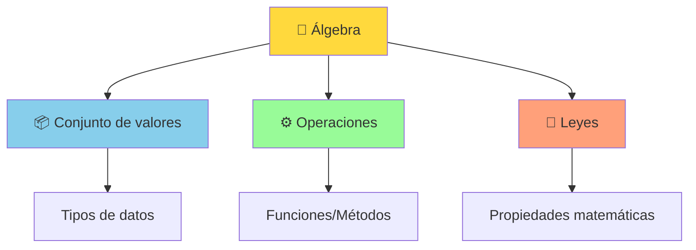

### Conceptos fundamentales

**🔗 Operación binaria**: Una función que toma dos elementos de un conjunto y produce otro elemento del mismo conjunto.

**🎯 Elemento identidad**: Un elemento que, cuando se combina con cualquier otro elemento mediante la operación, deja ese elemento inalterado.

**⚖️ Asociatividad**: Propiedad que dice que el orden de agrupación de operaciones no importa: `(a ⊕ b) ⊕ c = a ⊕ (b ⊕ c)`. Sea `⊕` una operación.

## 2. La teoría de categorías

La **teoría de categorías** es una teoría general de las estructuras matemáticas y sus relaciones que fue presentada por **Samuel Eilenberg** y **Saunders Mac Lane** a mediados del siglo XX en su trabajo fundacional sobre la topología algebraica.

> [!IMPORTANT]
> Hoy en día, la teoría de categorías se utiliza en casi todas las áreas de las matemáticas y en algunas áreas de la informática. **La programación funcional está basada en la teoría de categorías**.

### 2.1 ¿Qué es una categoría?

Una **categoría** es un tipo de estructura algebraica que consiste en:

- 🎯 **Objetos**: Las "cosas" que estudiamos. Se representan con un **punto**.
- ➡️ **Morfismos**: Las transformaciones entre objetos estudiados. Se representan con una **flecha**.
- 🧩 **Composición**: Manera de combinar morfismos.
- 🆔 **Identidad**: Morfismo que no cambia el objeto.

Las categorías se utilizan habitualmente para describir relaciones entre objetos y transformaciones en contextos abstractos, como la teoría de grupos o la topología.

En el contexto de un álgebra, una categoría se puede ver como una **manera de describir cómo operan los elementos de un álgebra y cómo se relacionan entre sí**.

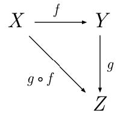

En la imagen anterior tenemos una **categoría** que se compone de los objetos **X** **Y** y **Z**, y los morfismos **f**, **g** y **g ∘ f**

```java
// Ejemplo de composición de funciones
final Function<String, Integer> longitud = String::length;
final Function<Integer, String> aString = Object::toString;

// Composición: String -> Integer -> String
final Function<String, String> compuesta = longitud.andThen(aString);

// Identidad: String -> String
final Function<String, String> identidad = Function.identity();
// identidad.apply("hola") devuelve "hola"
```

### 2.2 Categorías en programación

Imaginemos la categoría "tipos base" donde los objetos son los **tipos de datos** de nuestro lenguaje de programación, donde pueden haber transformaciones entre objetos.

**Ejemplo de categoría en programación:**

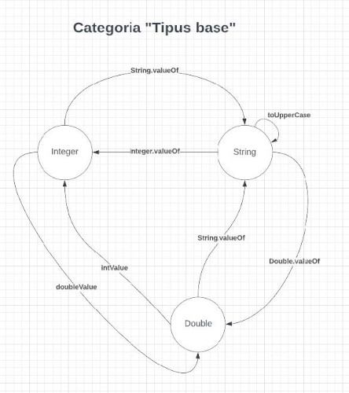

- `Integer` es un **objeto** de esta categoría
- `doubleValue` es un **morfismo** entre el objeto de origen `Integer` y el objeto de destino `Double`
- Cuando un morfismo tiene como origen y como destino el mismo objeto, lo llamaremos **endomorfismo**. Por ejemplo el método `toUpperCase` en los String

> [!TIP]
> Se recomienda ver el siguiente vídeo para comprender mejor estos conceptos:
> [Functional Programming - Category Theory](https://www.youtube.com/watch?v=M4xJtAAUiIE)

## 3. Los functores

### 3.1 Concepto de functor

En teoría de categorías, un **functor** es una **transformación o "mapeo" entre categorías que preserva las relaciones entre los objetos de cada categoría**.

Un functor se define como una transformación que asigna a cada objeto de una categoría un objeto de otra categoría de manera que se **preservan los morfismos** entre estos objetos.

> [!NOTE]
> Los functores se pueden considerar como morfismos en la categoría de todas las categorías.

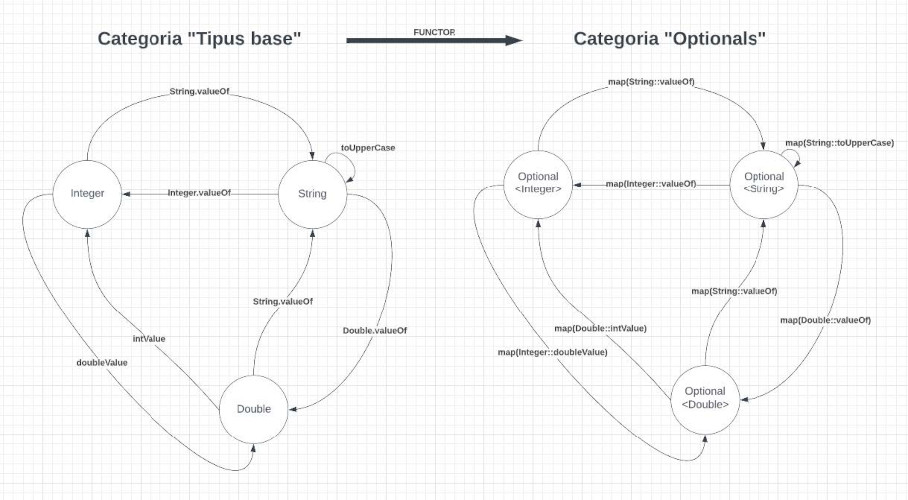

Como se puede apreciar, se **preserva la estructura** de "Tipos base" en la categoría transformada, ya que cada objeto de "tipos base" tiene su equivalente en "optionals" y pasa lo mismo con los morfismos. También hablamos del concepto matemático **homomorfismo** ya que los morfismos preservan la estructura original.

### 3.2 Functores en programación funcional

Para la programación funcional, **un Functor es simplemente una clase envolvente o "wrapper" que sigue ciertas normas e implementa ciertos métodos**.

> [!TIP]
> Piensa en un Functor como una "caja" que contiene un valor, y que nos permite aplicar funciones al contenido sin abrir la caja.

Por ejemplo, `Optional` es un Functor, ya que nos permite "mapear" objetos de una categoría a otra. Como hemos visto en el ejemplo anterior, podemos transformar de la categoría "tipos base" a la categoría "optionals" solo haciendo uso de la "clase envolvente" Optional.

**Conceptos importantes:**

- 📥 **Lifting**: Proceso de tomar un valor y devolver un functor que contiene ese valor (poner el valor en contexto)
- 📤 **Unlifting**: Proceso contrario, es decir extraer el valor del contexto de un Functor

```java
final var opt = Optional.of(23); // Lifting: 23 → Optional[23]
final var valor = opt.get(); // Unlifting: Optional[23] → 23
```

> [!NOTE]
> Igual como hemos visto que un **endomorfismo** tiene como origen y destino el mismo objeto, cuando tenemos como origen y como destino la misma categoría hablamos de un **endofunctor**. En programación todos los functores que utilizaremos son endofunctores.

### 3.3 Métodos que deben implementar los functores: "map"

Los functores deben implementar un método llamado **`map`**. El método `map`, también conocido como `fmap`, toma una función y aplica la función al valor que contiene el functor, devolviendo el resultado dentro de un nuevo functor.

```java
// Interfaz conceptual de un Functor
public interface Functor<T> {
    <U> Functor<U> map(Function<T, U> function);
}
```

Sin functores podemos hacer esto:

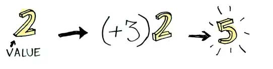

```java
final var value = 2;
final Function<Integer, Integer> plusThree = x -> x + 3;

final var result = plusThree.apply(value);
```

Con functores tenemos el valor dentro de un contexto:

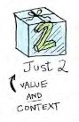

```java
final var valueInContext = Optional.of(2);
```

Cuando un valor está envuelto en un contexto, **no se puede aplicar una función** directamente:

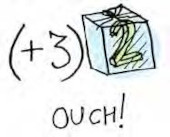

```java
// ❌ Esto NO funciona
final var valueInContext = Optional.of(2);
final Function<Integer, Integer> plusThree = x -> x + 3;
final var result = plusThree.apply(valueInContext); // Error de compilación
```

Aquí es donde entra **`map`**. El método `map` es consciente de los contextos y **sabe cómo aplicar funciones a valores que están envueltos en un contexto**.

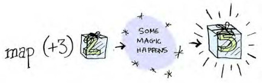

```java
// ✅ Ahora SÍ funciona
final var valueInContext = Optional.of(2);
final Function<Integer, Integer> plusThree = x -> x + 3;
final var result = valueInContext.map(plusThree);
System.out.println(result); // Imprime Optional[5]
```

**Definición general del método map:**

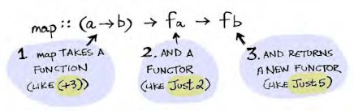

**Procedimiento interno del método `map`:**

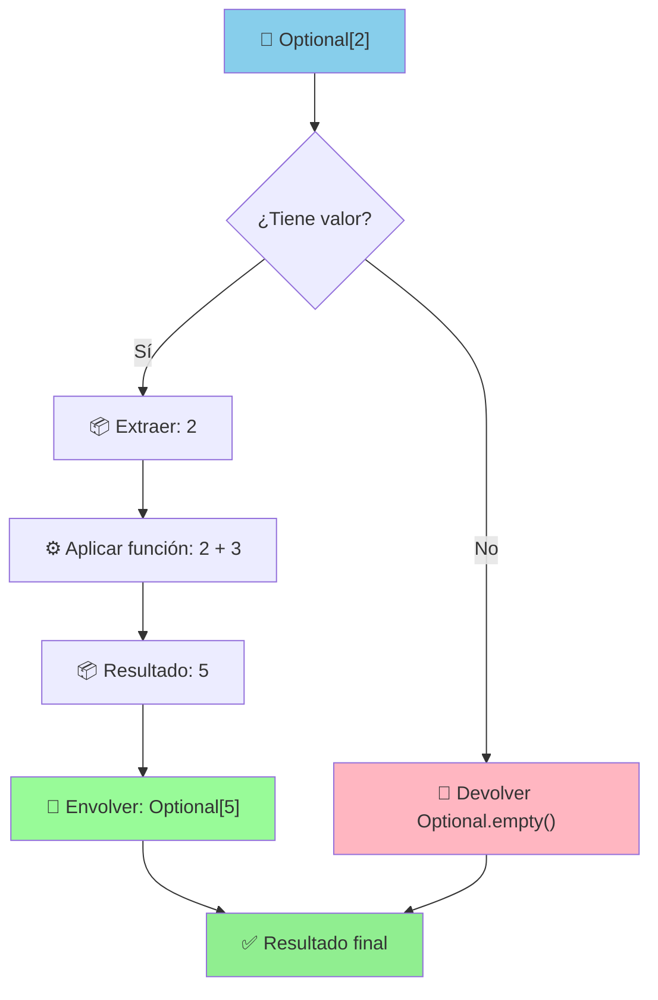

> [!IMPORTANT]
> Como `map` conoce el contexto, debe ser **capaz de gestionar lo que pasa cuando intentamos transformar "empty" o "nothing"**:
>
> ```java
> final Optional<String> empty = Optional.empty(); 
> final Optional<String> resultado = empty.map(s -> s.toUpperCase()); // Sigue siendo empty 
> ```

**En resumen**, un functor es un tipo de dato que implementa el método map, y que permite aplicar una función a los valores internos de manera "uniforme". Esto significa que el método map debe seguir ciertas reglas para garantizar que el comportamiento de la función sea consistente.

### 3.4 Leyes que deben cumplir los functores

<details><summary>Leyes que deben cumplir los functores</summary>

#### Ley de identidad

Si a map se le da una **función de identidad**, debe devolver exactamente el mismo functor. Dicho de otra forma, aplicar la función identidad no debe cambiar el functor.

```text
functor.map(x -> x) == functor
```

Ejemplo con Optional:

```java
// Para cualquier Optional en general
final Optional<Integer> opt1 = Optional.of(42);
final Optional<Integer> opt2 = opt1.map(x -> x);
System.out.println(opt1.equals(opt2)); // true

// Otro ejemplo con Optional<Integer>
final Optional<Integer> optInteger1 = Optional.of(42);
final Optional<Integer> optInteger2 = optInteger1.map(x -> x * 1);
System.out.println(optInteger1.equals(optInteger2)); // true

// Con Optional<String>  
final Optional<String> optString1 = Optional.of("Hola");
final Optional<String> optString2 = optString1.map(x -> x.concat(""));
System.out.println(optString1.equals(optString2)); // true
```

#### Ley de composición

Esta ley establece que al aplicar la función map al valor "x" con dos funciones "f" y "g", el resultado debe ser igual a aplicar primero la función "g" y después la función "f".

```text
functor.map(x -> f(g(x))) == functor.map(g).map(f)
```

Ejemplo práctico:

```java
final Optional<String> texto = Optional.of("hola");
final Function<String, String> mayusculas = String::toUpperCase;
final Function<String, Integer> longitud = String::length;

// Las dos formas siguientes deben dar el mismo resultado
final var resultado1 = texto.map(s -> longitud.apply(mayusculas.apply(s)));
final var resultado2 = texto.map(mayusculas).map(longitud);

System.out.println(resultado1.equals(resultado2)); // true
```

</details>

### 3.5 Functor apuntado o "pointed functor"

Un **functor apuntado**, también conocido como "pointed functor", es una variante del concepto de functor que incluye una función adicional llamada **`of`** o **`pure`** que permite crear un nuevo functor a partir de un valor.

```java
// Concepto de Pointed Functor
public interface PointedFunctor<T> {
    <U> PointedFunctor<U> map(Function<T, U> function);
    
    // Método adicional que lo convierte en "pointed"
    static <T> PointedFunctor<T> of(T value){
        //...
    }
}
```

> [!NOTE]
> La función `pure` es similar a la función `wrap` o `return` en otros lenguajes de programación.

La idea detrás de un functor apuntado es **proporcionar una manera de crear nuevos functores a partir de valores simples**, lo que puede ser útil en ciertas situaciones.

En resumen, un functor apuntado se puede definir como **un functor que implementa además el método `of`**.

**Ejemplo con Optional:**

```java
// Optional es un functor apuntado
final var opt1 = Optional.ofNullable("Hola");
final var opt2 = Optional.ofNullable(42);
final var opt3 = Optional.ofNullable(null);
```

### 3.6 Functor aplicativo o "applicative functor"

Un **functor aplicativo** o simplemente **aplicativo** es una variante del concepto de functor que incluye una función adicional llamada **`ap`** (llamada `apply` o `<*>` en otros lenguajes de programación).

La idea detrás de un functor aplicativo es **proporcionar una manera de aplicar funciones contenidas en functores a valores contenidos en otros functores**.

> [!IMPORTANT]
> Un functor aplicativo se puede definir como **un functor apuntado que implementa además el método `ap`** y que cumple ciertas leyes.

Los Aplicativos lo llevan al siguiente nivel. Con los Aplicativos, nuestros valores se envuelven en un contexto, pero **nuestras funciones también se pueden envolver en contextos**.

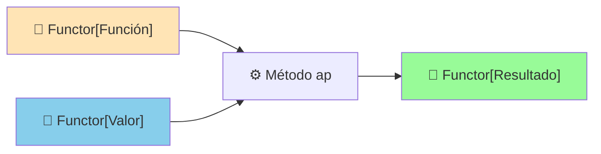

#### 3.6.1 Métodos que deben implementar los functores aplicativos: "ap"

El método **`ap`** de los functores aplicativos es una función que toma dos argumentos:

1. Un functor que contiene una **función**
2. Otro functor que contiene un **valor**

Aplica la función contenida en el primer functor al valor contenido en el segundo functor y devuelve el resultado en un nuevo functor.

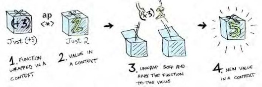

Si tenemos que `f[g]`es un functor que contiene una función "g" y que `f[x]` es un functor que contiene un valor "x", esta sería la definición del método `ap`

```text
ap :: f[g] -> f[x] -> f[g(x)]
```

La función `ap` es útil porque permite **aplicar funciones contenidas en functores a valores contenidos en otros functores de manera "uniforme"**, sin tener que escribir código específico para cada tipo de functor.

> [!WARNING]
> En Java, Optional no dispone del método `ap` por tanto no es un functor aplicativo. Podemos simular el funcionamiento con una clase personalizada.

**Ejemplo de implementación simulada:**

```java
public class AplicativeOptional<T> {
    private final Optional<T> value;
    
    public AplicativeOptional(Optional<T> value) {
        this.value = value;
    }
    
    public static <T> AplicativeOptional<T> of(T value) {
        return new AplicativeOptional<>(Optional.of(value));
    }
    
    public static <T> AplicativeOptional<T> empty() {
        return new AplicativeOptional<>(Optional.empty());
    }
    
    public <U> AplicativeOptional<U> ap(AplicativeOptional<T> valueOpt) {
        if (this.getValue().isPresent() && valueOpt.getValue().isPresent()) {
            if (this.getValue().get() instanceof Function) {
                @SuppressWarnings("unchecked")
                Function<T, U> function = (Function<T, U>) this.getValue().get();
                return new AplicativeOptional<>(
                    Optional.of(function.apply(valueOpt.getValue().get()))
                );
            }
        }
        return empty();
    }

    public Optional<T> getValue() { 
        return this.value; 
    }
}
```

```java
public static void main(String[] args) {
    // Crear los AplicativeOptional
    final AplicativeOptional<Function<Integer, Integer>> oafun = 
        AplicativeOptional.of(x -> x + 3);
    final AplicativeOptional<Integer> oados = AplicativeOptional.of(2);

    // Aplicar la función
    final AplicativeOptional<Integer> resultado = oafun.ap(oados);

    // Mostrar resultados
    System.out.println(resultado.getValue()); // Optional[5]
    System.out.println(resultado.getValue().map(x -> x * 2)); // Optional[10]
}
```

#### 3.6.2 Leyes que deben cumplir los functores aplicativos

> [!NOTE]
> No te preocupes demasiado en comprender todos los detalles. Suponemos que las estructuras que crearemos en el lenguaje de programación cumplen estas leyes.

<details><summary>Leyes que deben cumplir los functores aplicativos</summary>

##### Ley de identidad

Si a un functor aplicativo que contiene una función de identidad se le aplica (`ap`) un segundo functor aplicativo, debe devolver exactamente el segundo functor.

```text
functorAplicativo[identidad].ap(functorAplicativo[x]) == functorAplicativo[x]
```

```java
// 1. Identity
final Function<String, String> identityString = x -> x;
final var aplicativoX = ApplicativeFunctor.of("DAM");
final var aplicativoIdentidad = ApplicativeFunctor.of(identityString);

System.out.println("IDENTIDAD: " + aplicativoX.equals(aplicativoIdentidad.ap(aplicativoX)));
```

##### Ley de homomorfismo

Si a un functor aplicativo que contiene una función se le aplica (`ap`) un segundo functor aplicativo que contiene un valor, debe devolver un functor que contiene el resultado de aplicar la función al valor.

```text
functorAplicativo[f].ap(functorAplicativo[x]) == functorAplicativo[f(x)]
```

```java
// 2. Homomorphism
final Function<String, String> toUpperCase = String::toUpperCase;
final var ap2 = ApplicativeFunctor.of(toUpperCase).ap(ApplicativeFunctor.of("Paco"));
final var ap3 = ApplicativeFunctor.of(toUpperCase.apply("Paco"));
System.out.println("HOMOMORFISMO: " + ap2.equals(ap3));
```

##### Ley de intercambio

Si a un functor aplicativo que contiene una función 'f' se le aplica (`ap`) un segundo functor aplicativo que contiene un valor 'x', debe ser equivalente a si tenemos un functor aplicativo que contiene una función a la cual le entra una función 'g' y la aplica al valor 'x' y a ese functor le aplicamos (`ap`) el primer functor aplicativo.

```text
functorAplicativo[f].ap(functorAplicativo[x]) == 
functorAplicativo[g -> g(x)].ap(functorAplicativo[f])
```

```java
// 3. Interchange
final Function<String, String> toUpper = String::toUpperCase; 
final var word = "Poeta";

// Aplicación estándar: función aplicada a valor
final ApplicativeFunctor<String> ap5 = ApplicativeFunctor.of(toUpper).ap(ApplicativeFunctor.of(word));

// Versión intercambiada: valor aplicado a función
final Function<Function<String, String>, String> fun = f -> f.apply(word);
final ApplicativeFunctor<String> ap6 = ApplicativeFunctor.of(fun).ap(ApplicativeFunctor.of(toUpper));

System.out.println("INTERCAMBIO: " + ap5.equals(ap6));  // Debería imprimir true
```

##### Ley de composición

Establece que la composición de funciones se mantiene en todas las aplicaciones dentro del functor:

```java
functorAplicativo[(f∘g)(x)] == 
functorAplicativo[f].ap(functorAplicativo[g].ap(functorAplicativo[x]))
```

```java
final Function<String, String> toUpper = String::toUpperCase;
final Function<String, String> addDots = s -> s + "...";
// 4. Composite
final ApplicativeFunctor<String> ap7 = ApplicativeFunctor.of(toUpper);
final ApplicativeFunctor<String> ap8 = ApplicativeFunctor.of(addDots);
final ApplicativeFunctor<String> ap9 = ApplicativeFunctor.of("Informatica");

// Composición directa de funciones
final ApplicativeFunctor<String> compose1 = ApplicativeFunctor
    .of(toUpper.andThen(addDots).apply("Informatica"));

// Composición aplicativa
final ApplicativeFunctor<String> compose2 = ap7.ap(ap8.ap(ap9));

System.out.println("COMPOSICIÓN: " + compose1.equals(compose2));
```

</details>

## 4. Los monoides

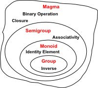

### 4.1 Semigrupo

Un **semigrupo** es un conjunto de valores cerrados por una **operación asociativa**, es decir, dados dos elementos del semigrupo, la operación asociativa devuelve otro elemento del mismo semigrupo.

En la teoría de categorías, un semigrupo se representa mediante una categoría con un único objeto y un único morfismo que cumple con la propiedad de asociatividad.

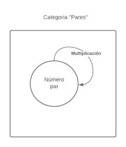

Como hemos dicho antes, un semigrupo está formado por:

- 📦 **Un conjunto de valores**
- ⚙️ **Una operación asociativa**

En caso de disponer de un conjunto de valores y una operación no asociativa, entonces no podemos hablar de un **semigrupo**, pero sí de un **magma** (*véase la imagen que precede a ese apartado*).

**Ejemplo:** Si nuestro conjunto de valores son los números pares (0,2,4,6,8...) y nuestra operación asociativa es la multiplicación, podemos intuir que aquí tenemos nuestro primer "semigrupo".

> [!TIP]
> Tal como pasaba con los functores, en programación veremos los semigrupos como **clases envolventes o "wrapper"**. Estas clases deben implementar ciertos métodos y seguir ciertas reglas.

#### 4.1.1 Métodos que deben implementar los semigrupos: "concat"

El método **`concat`** también conocido como "mappend", "mconcat" o "combine" es una función que se usa para concatenar dos elementos de un semigrupo. Realiza el morfismo del cual hemos hablado anteriormente.

Sabemos que un semigrupo se compone de un conjunto de valores y de una operación. **El método concat simplemente toma dos valores del conjunto, les aplica la operación y devuelve siempre un valor que pertenece al conjunto**.

**Ejemplo con semigrupo `EvenMultiplication`:**

```java
public class EvenMultiplication {
    private final int value;
    
    public EvenMultiplication(int value) {
        if (value % 2 != 0) {
            throw new IllegalArgumentException("El valor debe ser par");
        }
        this.value = value;
    }
    
    public EvenMultiplication concat(EvenMultiplication other) {
        return new EvenMultiplication(this.value * other.value);
    }
    
    // Getters, equals, toString...
}
```

```java
final var ev1 = new EvenMultiplication(4);
final var ev2 = new EvenMultiplication(2);
final var ev3 = new EvenMultiplication(6);

final var ev4 = ev1.concat(ev2); // EvenMultiplication[8]
final var ev5 = ev1.concat(ev2).concat(ev3); // EvenMultiplication[48]
```

#### 4.1.2 Leyes que deben cumplir los semigrupos

##### Ley de asociatividad

La **única regla** que deben cumplir los semigrupos es que su operación debe ser asociativa. Para cualquier elemento a, b y c del semigrupo, y un operador *, se cumple que:

```text
(a * b) * c = a * (b * c)
```

Esto significa que **el orden en que se aplican las operaciones no afecta el resultado final**.

**Ejemplo con `EvenMultiplication`:**

```java
final var a = new EvenMultiplication(2);
final var b = new EvenMultiplication(4);  
final var c = new EvenMultiplication(6);

// (a * b) * c
final var resultado1 = a.concat(b).concat(c); // ((2*4)*6) = 48

// a * (b * c)  
final var resultado2 = a.concat(b.concat(c)); // (2*(4*6)) = 48

System.out.println(resultado1.equals(resultado2)); // ✅ Son iguales
```

> [!WARNING]
> **Contraejemplo:** Si tenemos un conjunto formado por los números enteros, y la operación de división entera, NO tendremos un semigrupo ya que no cumplimos con la ley de asociatividad:
>
> ```text
> (8 ÷ 4) ÷ 2 = 2 ÷ 2 = 1 
> 8 ÷ (4 ÷ 2) = 8 ÷ 2 = 4 
> 1 ≠ 4 // ❌ No es asociativo 
>```
>
> El conjunto formado por los números enteros y la operación de la división entera no es un Semigrupo sino un **"Magma"**.

### 4.2 Monoide

Un **monoide** es un tipo especial de semigrupo. Básicamente, para que un semigrupo sea un monoide **debe contener en su conjunto de valores un valor especial llamado "neutro" o "identidad"**. Este elemento, cuando se combina con cualquier otro elemento, devuelve ese último elemento sin cambios.

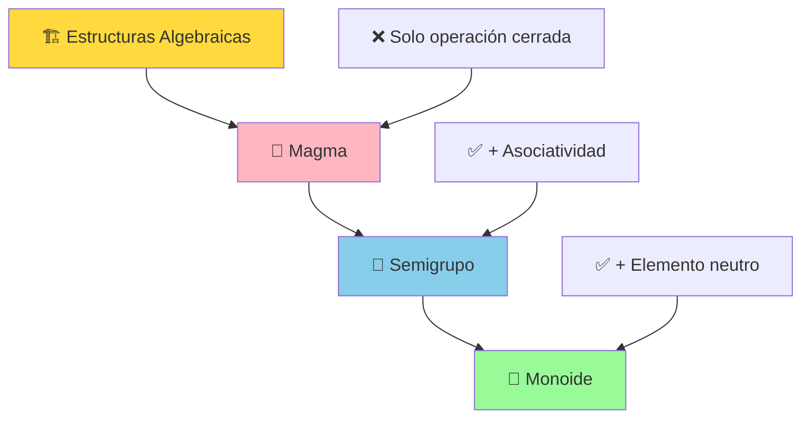

Como siempre, en programación veremos los monoides como **clases envolventes o "wrapper"**. Estas clases deben implementar ciertos métodos y seguir ciertas reglas.

> [!TIP]
> Para comprender mejor la relación Magma → Semigrupo → Monoide se recomienda visualizar este vídeo: [**Functional Programming - 18: Magma, Semigroup, Monoid**](https://www.youtube.com/watch?v=Vev5_wJDJig&feature=youtu.be)

**Ejemplos comunes de monoides:**


| Conjunto | Operación | Identidad | Nombre |
| :-- | :-- | :-- | :-- |
| Enteros | + | 0 | Suma |
| Enteros | × | 1 | Producto |
| Strings | concatenación | "" | Concatenación |
| Listas | concatenación | List.of() | Concatenación |
| Booleanos | \&\& | true | AND lógico |
| Booleanos | \|\| | false | OR lógico |

#### 4.2.1 Métodos que deben implementar los monoides: "empty"

Los monoides, además del método `concat` (ya que es un semigrupo) deben implementar un **método estático llamado `empty`** también conocido como "identity" o "mempty".

El método **`empty` devuelve el elemento neutro del conjunto de valores del monoide**.

**Ejemplos:**

- **Monoide `Sum`** (conjunto de valores enteros + operación suma): `empty()` debe devolver `Sum[0]`, ya que 0 es el valor neutro para la suma
- **Monoide `Product`** (conjunto de valores enteros + operación multiplicación): `empty()` devuelve `Product[1]`, ya que 1 es el valor neutro para la multiplicación

```java
public class Sum {
    private final int value;
    
    public Sum(int value) {
        this.value = value;
    }
    
    public Sum concat(Sum other) {
        return new Sum(this.value + other.value);
    }
    
    public static Sum empty() {
        return new Sum(0); // Elemento neutro para la suma
    }
    
    public int getValue() { return value; }
    
    @Override
    public boolean equals(Object obj) {
        return obj instanceof Sum && ((Sum) obj).value == this.value;
    }
}
```

```java
public class Product {
    private final int value;
    
    public Product(int value) {
        this.value = value;
    }
    
    public Product concat(Product other) {
        return new Product(this.value * other.value);
    }
    
    public static Product empty() {
        return new Product(1); // Elemento neutro para la multiplicación
    }
    
    public int getValue() { return value; }
    
    @Override  
    public boolean equals(Object obj) {
        return obj instanceof Product && ((Product) obj).value == this.value;
    }
}
```

```java
// MONOIDE "SUM"
// MONOIDE "SUM"

final var sum1 = new Sum(8);
final var sum2 = new Sum(0.5);
final var sum3 = new Sum(3);

final var sumTotal = sum1
    .concat(sum2)
    .concat(Sum.empty()) 
    .concat(sum3); // Monoide[11.5]
```

#### 4.2.2 Leyes que deben cumplir los monoides

##### Ley de asociatividad

Como se trata de un semigrupo, también debe cumplir la ley de asociatividad que hemos visto en los semigrupos.

##### Ley de identidad derecha y izquierda

**Derecha:** Cuando a un monoide le concatenamos el neutro, devuelve el mismo monoide.

```java
monoide[x].concat(identidad) == monoide[x]
```

**Ejemplo con `Product`:**

```java
final var prod = new Product(5);
final var neutro = Product.empty(); // Product[1]
final var resultado = prod.concat(neutro); // Product[5]

System.out.println(prod.equals(resultado)); // ✅ 5 * 1 = 5
```

**Izquierda:** Cuando al neutro le concatenamos un monoide, devuelve el mismo monoide.

```java
identidad.concat(monoide[x]) == monoide[x]  
```

**Ejemplo con `Product`:**

```java
final var prod = new Product(5);
final var neutro = Product.empty(); // Product[1]
final var resultado = neutro.concat(prod); // Product[5]

assertTrue(prod.equals(resultado)); // ✅ 1 * 5 = 5
```

> [!IMPORTANT]
> Por tanto, **para ser un monoide debe cumplir con la ley de asociatividad, con la de identidad derecha y la de identidad izquierda**.
---
> [!CAUTION]
> Si recordamos el semigrupo `EvenMultiplication` podemos ver que NO se trata de un monoide, ya que no cumple con las leyes de identidad derecha ni izquierda (no tiene elemento neutro en el conjunto de números pares).

**Pregunta de reflexión:** ¿Y la división de enteros, cumple las leyes de identidad derecha e izquierda?

<details>
<summary>🔍 Respuesta</summary>

La división entera **no cumple** las leyes de identidad:

- **Identidad derecha**: `a ÷ 1 = a` ✅ (se cumple)
- **Identidad izquierda**: `1 ÷ a = a` ❌ (no se cumple, `1 ÷ 5 = 0 ≠ 5`)

Además, como vimos antes, tampoco cumple la asociatividad. Por tanto, la división entera con los números enteros ni siquiera es un semigrupo.

</details>

## 5. Las mónadas

> [!NOTE]
> Llegamos a la "joya de la corona". La definición más extendida la tenemos aquí: **"A monad is just a monoid in the category of endofunctors"**.
>
> También existe una leyenda urbana que dice que cuando comprendemos del todo qué es una mónada perdemos la habilidad de explicar a otro lo que es.

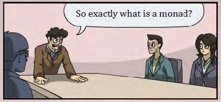

### 5.1 Concepto de mónada

Demos un paso atrás. **Functores y monoides** eran clases envolventes alrededor de un valor que nos permite ejecutar operaciones:

- En el caso de los **functores** se trataba de un "mapeo"
- En el caso de los **monoides** de la composición, donde la composición es una única operación

**Las mónadas son a la vez un functor y un monoide**. Esto no hace que sea más sencillo, pero podemos definirlo de forma más simple.


Matemáticamente se trata de un **functor aplicativo** (aunque en muchos lenguajes de programación solo hace falta que sea un functor apuntado) que también sigue las reglas de los monoides.

En un primer momento podemos pensar que todo esto no tiene utilidad en la programación funcional, pero **cuando más se trabaja en este paradigma más nos damos cuenta de que las mónadas son fundamentales**.

**¿Por qué son útiles las mónadas?**

- 🛡️ **Gestión segura de errores**: Permiten manejar errores y valores ausentes de manera segura y controlada
- 🔗 **Encadenamiento de operaciones**: Facilitan el encadenamiento de operaciones monádicas
- 📝 **Código más limpio**: Permiten escribir código más expresivo, conciso y fácil de entender
- 🚫 **Evitar excepciones**: Sin tener que preocuparse por la propagación de excepciones o la validación explícita de resultados

> [!TIP]
> El uso de mónadas permite a los programadores utilizar técnicas como el **encadenamiento de operaciones monádicas** y la composición de funciones monádicas para crear código más expresivo, conciso y fácil de entender, lo que puede mejorar la productividad y la calidad del código.

Como siempre, en programación veremos las mónadas como **clases envolventes o "wrapper"**. Estas clases deben implementar ciertos métodos y seguir ciertas reglas.

### 5.2 Métodos que deben implementar las mónadas: "flatMap"

Las mónadas además de implementar los métodos de los functores aplicativos (o al menos de los functores apuntados) también deben implementar un método **`flatMap`** que en otros lenguajes se conoce como "bind", "chain" o `>>=`.

**Recordemos las diferencias:**

- 🔸 **Functores**: Aplican una función a un valor envuelto en un contexto
- 🔹 **Aplicativos**: Aplican una función envuelta a un valor envuelto
- 🔶 **Mónadas**: Aplican una función a un valor envuelto en un contexto asegurando que no se anidan contextos (solo un nivel)

Vamos paso a paso.

Al principio hemos hecho el ejemplo de los functores con `Optional`. Resulta que **`Optional` es una mónada** (implementa también el método `flatMap`).

Imaginemos que tenemos una función `half` que solo funciona para números pares. La función `half` devuelve un Optional, concretamente un Optional que contiene la mitad del valor si es par, y si es impar un `Optional.empty`.

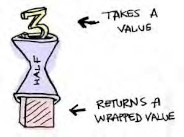

Tenemos la función `half` a la cual queremos aplicarle la mónada `Optional[3]`. Y falla...

```java

// Función que divide un entero por 2 si es par (devuelve Optional)
final Function<Integer, Optional<Integer>> half = x -> 
    (x % 2 == 0) 
    ? Optional.of(x / 2) 
    : Optional.empty();

final var tres = Optional.of(3);

// Corrección: Primero extraemos el valor del Optional con .flatMap()
final var resultado = half.apply(tres); // ❌ Error de compilación

```

La función `half` espera un valor entero y no una mónada `Optional<Integer>`, por eso falla.

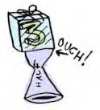

Pero ¿qué pasa si en lugar de aplicar la función directamente utilizamos `map` como vimos en los functores?

```java
final var tres = Optional.of(3);
final var resultado = tres.map(half);
System.out.println(resultado);  // Optional[Optional.empty]
```

¡Perfecto! Ya no marca errores el compilador. Pero espera... ¿Qué pasa si imprimimos los resultados? **Que devuelve una mónada dentro de una mónada**.

Como el método `map` hacía un "lifting" del resultado obtenido, al hacer un "lifting" de lo que devuelve `half` (devuelve una mónada) al final se produce esa anidación.

```java
// Resultado: Optional[Optional.empty()]  en lugar de Optional.empty()
```

**Para solucionar este problema aparece el método `flatMap`**. El método debe hacer primero la transformación (map) y después el aplanamiento (flat). Finalmente toma el valor resultante (fuera de toda mónada) y le hace un lifting para devolver una mónada sin ningún anidamiento.

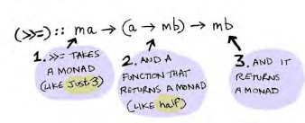

**Procedimiento gráfico del método `flatMap`:**

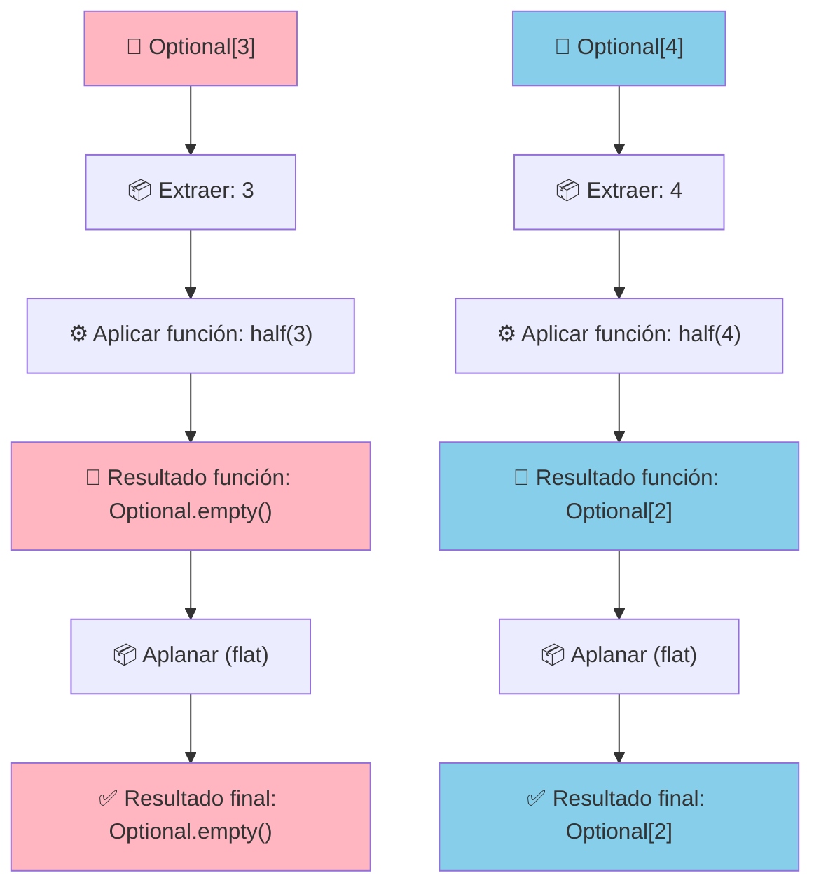

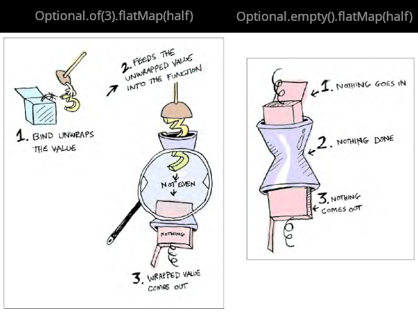

**¡Ahora sí!**

```java
final var tres = Optional.of(3);
final var resultado1 = tres.flatMap(half);
System.out.println(resultado1); // Optional.empty

final var cuatro = Optional.of(4);  
final var resultado2 = cuatro.flatMap(half);
System.out.println(resultado2); // Optional[2]
```

**Además, somos capaces de encadenar operaciones monádicas** ya que el resultado siempre será una mónada de un único nivel y por tanto le podemos aplicar funciones de forma encadenada:

```java
final var resultado = Optional.of(20)
    .flatMap(half)      // Optional[10]
    .flatMap(half)      // Optional[5]  
    .flatMap(half);     // Optional.empty (5 es impar)
    
System.out.println(resultado); // Optional.empty
```

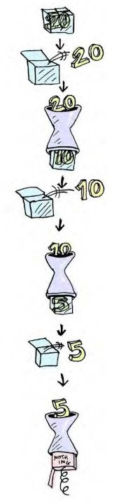

> [!NOTE]
> **Mónadas bien conocidas son:** Maybe (Optional), Either, Try, Result, Stream, IO...
---
> Un poco de humor sobre lo que hemos visto: [**Railway oriented programming Scott Wlaschin. Monads**](https://www.youtube.com/watch?v=r1GaQ5E2rao)
---
> [!TIP]
> Este documento contiene un resumen muy breve de las estructuras vistas: [Resum Functors, Monoides i Mònades](./assets/resum.pdf)

### 5.3 Leyes que deben cumplir las mónadas

Como se trata de un functor, **cualquier mónada cumplirá las leyes de los functores, y además cumplirá las leyes de los monoides**.

## 6. Ejemplos prácticos

Para consolidar los conceptos vistos, es importante revisar los ejemplos propuestos en los proyectos de NetBeans **"AlgebraicStructures"** y **"Monadas"**.

**Ejemplos que deberías practicar:**

1. 🔸 **Implementación de Functores**: Crear tu propia clase que implemente el patrón functor
2. 🔹 **Semigrupos y Monoides**: Definir operaciones asociativas con elementos neutros
3. 🔶 **Mónadas personalizadas**: Implementar el patrón mónada para casos específicos
4. 🔗 **Encadenamiento de operaciones**: Combinar múltiples operaciones monádicas

<details>
<summary>💻 Ejemplo práctico: Mónada Result</summary>

```java
import java.util.function.Function;

public sealed interface Result<T> permits Success, Failure {
    
    static <T> Result<T> success(T value) {
        return new Success<>(value);
    }

    static <T> Result<T> failure(String error) {
        return new Failure<>(error);
    }

    <U> Result<U> map(Function<T, U> function);
    <U> Result<U> flatMap(Function<T, Result<U>> function);
    boolean isSuccess();
    T getValue();
    String getError();
}

// --- Implementaciones permitidas ---
record Success<T>(T value) implements Result<T> {
    
    @Override
    public <U> Result<U> map(Function<T, U> function) {
        try {
            return Result.success(function.apply(value));
        } catch (Exception e) {
            return Result.failure(e.getMessage());
        }
    }

    @Override
    public <U> Result<U> flatMap(Function<T, Result<U>> function) {
        try {
            return function.apply(value);
        } catch (Exception e) {
            return Result.failure(e.getMessage());
        }
    }

    @Override
    public boolean isSuccess() { return true; }

    @Override
    public T getValue() { return value; }

    @Override
    public String getError() { throw new UnsupportedOperationException("Success no tiene error"); }
}

record Failure<T>(String error) implements Result<T> {

    @Override
    public <U> Result<U> map(Function<T, U> function) {
        return Result.failure(error);
    }

    @Override
    public <U> Result<U> flatMap(Function<T, Result<U>> function) {
        return Result.failure(error);
    }

    @Override
    public boolean isSuccess() { return false; }

    @Override
    public T getValue() { throw new UnsupportedOperationException("Failure no tiene valor"); }

    @Override
    public String getError() { return error; }
}

// --- Ejemplo de uso ---
class Main {
    public static void main(String[] args) {
        Result<Integer> resultado = Result.success(10)
            .flatMap(x -> x > 0 ? Result.success(x * 2) : Result.failure("Número no positivo"))
            .flatMap(x -> x < 100 ? Result.success(x + 5) : Result.failure("Número demasiado grande"))
            .map(Object::toString);

        if (resultado.isSuccess()) {
            System.out.println("Resultado: " + resultado.getValue()); // "25"
        } else {
            System.out.println("Error: " + resultado.getError());
        }
    }
}

```

</details>

## 7. Point Free Style y Railway Oriented Programming

Nos quedan muchos más conceptos que podemos trabajar en la programación funcional así como otros ADT (Algebraic Data Types) y ejemplos de uso. 

*A modo visual, y si tienes curiosidad por conocer más, se adjunta este [esquema de estructuras alegráicas](./assets/ADT.pdf).*

Aunque no podemos verlo todo, es interesante introducir al menos dos metodologías de trabajo muy utilizadas en la programación funcional:

### 7.1 Programación tácita (Point Free Style)

La **programación tácita**, también llamada estilo sin puntos (Point Free Style), es un estilo de programación en el que las definiciones de funciones **no identifican los argumentos** (o "puntos") sobre los que operan. En cambio, las definiciones solo componen otras funciones, entre las que se incluyen los combinadores que manipulan los argumentos.

**Características principales:**

- 🎯 **Sin variables explícitas**: No se mencionan los parámetros de entrada
- 🔗 **Composición de funciones**: Se basa en combinar funciones existentes
- 🧩 **Uso de combinadores**: Funciones que manipulan otras funciones

**Ejemplo en JavaScript:**

```javascript
const split = separator => str => str.split(separator);
const head = arr => arr[0];

const splitByLine = split('\n');
const getRequestInfo = split(' ');
const getFirstPair = ([first, two]) => [first, two];

const parseRequest = compose(
    getFirstPair,
    getRequestInfo, 
    head,
    splitByLine
);

const requestExample = `GET /users HTTP/1.1
    Host: example.com
    User-Agent: ExampleBrowser/1.0
    Accept: */*
`;

const [method, path] = parseRequest(requestExample);
```

> [!TIP]
> Como ejemplo muy básico, revisa el paquete "pointfree" del proyecto "AlgebraicStructures".

**Ventajas del Point Free Style:**

- 📝 **Código más conciso**: Menos variables temporales
- 🔄 **Reutilización**: Las funciones son más componibles
- 🎯 **Enfoque en la transformación**: Se centra en qué se hace, no en cómo

**Desventajas:**

- 🤔 **Puede ser menos legible**: Para desarrolladores no familiarizados
- 🐛 **Debugging más complejo**: Más difícil seguir el flujo de datos

### 7.2 Railway Oriented Programming

**Railway Oriented Programming (ROP)** es un enfoque para la programación que propone un modelo para la gestión de errores y el control de flujo que usa una metáfora ferroviaria.

La idea básica de ROP es que **cada función o método que se ejecuta en un programa puede tener un resultado exitoso o fallido**. Este estilo de manejo de errores utiliza un comportamiento monádico: una manera alternativa de gestionar los errores.

> [!NOTE]
> **Railway Oriented Programming** (ROP) es un patrón que utiliza el concepto de dos vías: una para el éxito y otra para el error.
> 

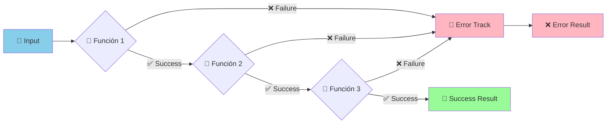

**Conceptos clave:**

- 🛤️ **Two-track system**: Un carril para éxito, otro para errores
- 🔄 **Switch functions**: Funciones que pueden cambiar de carril
- 🚂 **Composición**: Las funciones se encadenan automáticamente
- 🛡️ **Propagación automática de errores**: Si hay un error, se propaga automáticamente

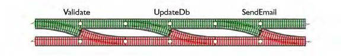

**Ejemplo conceptual:**

```java
// Función tradicional con manejo de errores
public String processUser(String input) {
    try {
        String validated = validateInput(input);
        User user = parseUser(validated);
        User enriched = enrichUser(user);
        return formatOutput(enriched);
    } catch (ValidationException e) {
        return "Error de validación: " + e.getMessage();
    } catch (ParseException e) {
        return "Error de parseo: " + e.getMessage();
    } catch (EnrichmentException e) {
        return "Error de enriquecimiento: " + e.getMessage();
    }
}

// Con Railway Oriented Programming usando Result<T>
public Result<String> processUserROP(String input) {
    return Result.success(input)
        .flatMap(this::validateInput)
        .flatMap(this::parseUser)
        .flatMap(this::enrichUser)  
        .map(this::formatOutput);
}
```

**Ventajas de ROP:**

- 🧹 **Código más limpio**: Sin bloques try-catch anidados
- 🔄 **Composición natural**: Fácil encadenar operaciones
- 🛡️ **Manejo consistente de errores**: Un solo patrón para todos los errores
- 📝 **Expresividad**: El código expresa claramente la intención

**Implementación típica con Either:**

```java
// Either puede ser Left (error) o Right (éxito)
public Either<String, User> validateUser(String input) {
    if (input == null || input.trim().isEmpty()) {
        return Either.left("Input no puede estar vacío");
    }
    return Either.right(new User(input.trim()));
}

public Either<String, User> enrichUser(User user) {
    if (user.getName().length() < 2) {
        return Either.left("Nombre demasiado corto");  
    }
    return Either.right(user.withEmail(user.getName() + "@example.com"));
}

// Composición
public Either<String, String> processUser(String input) {
    return validateUser(input)
        .flatMap(this::enrichUser)
        .map(user -> "Procesado: " + user.getName());
}
```

> [!IMPORTANT]
> Como ejemplo en Java, revisa el proyecto de NetBeans **"RailwayOrientedProgramming"**.

**Mónadas comunes para ROP:**

- 🎯 **Optional**: Para valores que pueden estar ausentes
- ⚖️ **Either**: Para operaciones que pueden fallar con información del error
- 🛡️ **Try**: Para operaciones que pueden lanzar excepciones
- 📊 **Result**: Variante específica de Either para success/failure

> [!NOTE]
> Este patrón se ha vuelto muy popular en lenguajes funcionales y se está adoptando cada vez más en lenguajes orientados a objetos como Java, C\# y Kotlin.

<p align="center">📚 <em>Fin del apartado UT9.5 - Functores, Monoides y Mónadas</em></p>